# Weight-Space Steering in Diffusion Models: A Public Lab Notebook

> **Status & Framing**: This is an **open, public lab notebook**. It records real experiments, working hypotheses, and the raw findings gathered so far on **Krea-2 DiT (28 blocks)**.  
> The next step is a formal cross-architecture replication on [`circlestone-labs/Anima`](https://huggingface.co/circlestone-labs/Anima) (which is built on Cosmos-Predict2 with a Qwen3 0.6B text encoder, offering a true cross-family test). Everything here is shared openly to be inspected, reproduced and challenged.

<p align="center">
  <a href="index.html"><strong> Read Full Lab Notebook</strong></a> •
  <a href="viewer/viewer.html"><strong> Launch Interactive A/B Viewer</strong></a> •
  <a href="docs/errors_log.md"><strong> 26 Pitfalls Checklist</strong></a> •
  <a href="data/"><strong> Raw Datasets</strong></a>
</p>

---

## ✦ Live Visual Demonstration: Synchronized 5-Seed Steering

While experimenting with [**Arthemy-Krea2-Tuner**](https://github.com/aledelpho/comfyui-arthemy-krea2-tuner), I wanted to see if manipulating internal weights directly could predictably guide how a model draws — without retraining, without LoRAs, and without touching the prompt.

Below, you can see the **exact same 5 random seeds** (`4242145`, `42`, `1337`, `777`, `9999`) rendered across different weight configurations, all matched to the exact same Frobenius displacement ($D = 0.0538$):

> **Every figure below carries the prompt that produced it.** The prompt text is never edited between conditions — `prompt_sha1`, the first ten hex characters of its SHA-1, is how that is enforced and checked, and it is also the folder name under [`assets/`](assets/01_steering/). The complete list of all 24 prompts with their hashes is in [`data/prompts.json`](data/prompts.json).

### Subject 1: Sea-touched Siren (Cyan & Teal Rim Light)
<p align="center">
  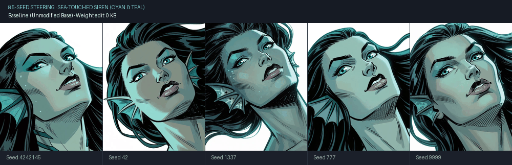
</p>

<details>
<summary><code>G1</code> · <code>seatouched_teal</code> · <code>prompt_sha1 30de058455</code> — <strong>show the exact prompt</strong></summary>

```text
Western comics style, bold ink outlines, hatched shadows, hard teal-tinted rim light glowing along the edges of her face, seductive simmering menace, seen from an extreme tilted low angle with her chin raised, extreme close-up on the head only, tight framing, sharp dutch angle. ageless female sea-touched woman, long dark hair fanning as if suspended in water, thin webbed fin-like ridges tracing along her temple, cyan skin, sharply arched eyebrows, a narrow straight nose, wide teal eyes with slitted pupils half-lidded in cold allure, full lips curled in a knowing smirk, small barnacle-like clusters studding one earlobe, faint iridescent sheen along her jawline. white background, simple background, teal overall hue, monochromatic teal.
```

</details>

<details>
<summary><strong> Subject 2: Goblin with Sly Grin (Yellow Rim Light)</strong> — Click to expand 5-seed animation</summary>
<p align="center">
  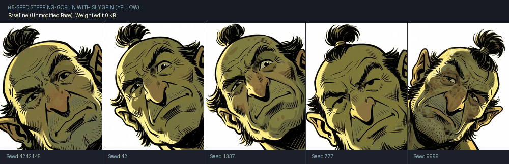
</p>

<details>
<summary><code>G2</code> · <code>goblin_yellow</code> · <code>prompt_sha1 c6a4015aae</code> — <strong>show the exact prompt</strong></summary>

```text
Western comics style, bold ink outlines, hatched shadows, hard yellow-tinted rim light glowing along the edges of his face, sly calculating grin, seen from an extreme low tilted angle looking sharply up his chin, extreme close-up on the head only, tight framing, steep dutch angle. middle-aged male goblin, mottled olive-green skin, greasy tufts of black hair slicked into a lopsided topknot, one eyebrow arched high in shrewd amusement, small beady yellow eyes darting sideways, a long hooked nose with a slight downward curve, wide crooked grin showing several missing teeth, a small brass loop pierced through one nostril, thin wispy chin-whiskers braided into a point. white background, simple background, yellow overall hue, monochromatic yellow.
```

</details>
</details>

<details>
<summary><strong> Subject 3: Barbarian / Half-Orc in Screaming Rage (Red Rim Light)</strong> — Click to expand 5-seed animation</summary>
<p align="center">
  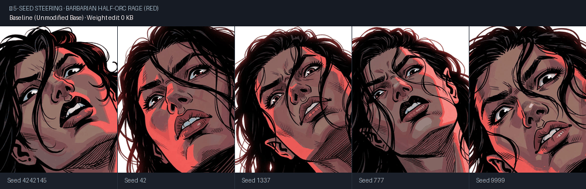
</p>

<details>
<summary><code>F1</code> · <code>halforc_red</code> · <code>prompt_sha1 7e8536f9bb</code> — <strong>show the exact prompt</strong></summary>

```text
Western comics style, bold ink outlines, hatched shadows, hard red-tinted rim light glowing along the edges of her face, ferocious screaming rage, seen from a steep low angle, extreme close-up on the head only, tight framing, dutch angle, sharp perspective. female half-orc, head thrown back with a wild tangle of black hair across her face, thick furrowed eyebrows pressed low in fury, wide crimson eyes wide with screaming rage, mouth stretched open in a full-throated roar baring a single sharp lower tusk, a thick iron ring pierced through the nose bridge, ferociously screaming expression. white background, simple background.
```

</details>
</details>

<details>
<summary><strong> Subject 4: Ancient Hag with Manic Determination (Chartreuse Rim Light)</strong> — Click to expand 5-seed animation</summary>
<p align="center">
  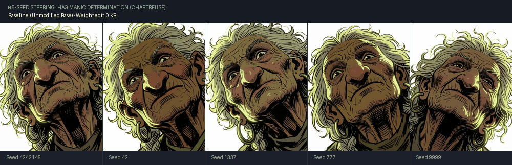
</p>

<details>
<summary><code>G4</code> · <code>hag_chartreuse</code> · <code>prompt_sha1 95acba3b41</code> — <strong>show the exact prompt</strong></summary>

```text
Western comics style, bold ink outlines, hatched shadows, hard chartreuse-tinted rim light glowing along the edges of her face, wild-eyed manic determination, seen from an extreme low angle shot through an imagined gap between her chin and chest, extreme close-up on the head only, tight framing, sharply canted dutch angle. very old female hag, deep umber-brown weathered skin, wild frizzed grey hair sticking straight up as if charged with static, an exaggeratedly long hooked nose nearly touching her upturned chin, small sunken eyes blazing wide with fevered focus, sagging jowls trembling around a muttering open mouth, three long grey chin-hairs twisted into tiny braids, a single large hoop stretching one earlobe low. white background, simple background, chartreuse overall hue, monochromatic chartreuse.
```

</details>
</details>

---

## 💡 The 53 KB Parameter Payload

> **Can 53 KB steer a 12.8 Billion parameter model?**  
> In diffusion models, we are used to thinking that changing style requires either fine-tuning the model or loading multi-megabyte (or gigabyte) LoRAs.  
> The presets tested here are tiny **53 KB** parameter deltas — just a lightweight configuration of calibrated block gains and Lie algebra rotations. Yet, as you can see across all seeds, they steer the visual rendering with remarkable consistency.

---

## Introduction — how I got here

Two years ago, as Arthemy, my workflow for training models looked like this. Download a model plus
a few fine-tunes with aesthetics close to what I wanted, then block-merge them at different
strengths per block until I landed on something near the look I had in mind. Alongside that, train
extremely narrow concept LoRAs and distil them as hard as I could: activate only specific sections,
train five of them, keep only what they had in common to squeeze the scope down further, then inject
the result back into the model.

At some point I started playing with values that are not supposed to be used. The question was
simple: instead of sliding between 0.0 and 1.0, what happens if I force a value below zero, or above
one? What came out was an amplification of one model's magnitude — but always *relative to a second
model*, because that is what a merge is.

That is when I started wondering whether the same block-merge operations could work with **one model
alone**. Amplify or attenuate some of its own sections mathematically, and see how the output
changes. My SDXL tool, [Arthemy Live-Tuner](https://github.com/aledelpho/Arthemy_Live-Tuner-SDXL-ComfyUI),
is the evidence of that first attempt — a prototype, and not much to look at, but the principle was
already there.

Those experiments convinced me that amplifying or attenuating distinct parts of a model changes its
style *coherently* rather than randomly: a direct, predictable manipulation of a probabilistic
system.

Only recently did two things sink in. The first is that the tooling for this does not exist.
Block-weighted merging is well covered — [supermerger](https://github.com/hako-mikan/sd-webui-supermerger),
Merge Block Weighted, [ComfyUI's native merge nodes](https://comfyanonymous.github.io/ComfyUI_examples/model_merging/)
— but every one of them needs at least two checkpoints: the knob mixes model A into model B, block
by block. [LoRA Block Weight](https://www.runcomfy.com/comfyui-nodes/ComfyUI-LoraBlockWeight) does the
same for an adapter's delta, and task arithmetic scales a task vector, which again presupposes a
fine-tune to difference against. What none of them does is operate on a **single** checkpoint with
nothing to mix it with, amplifying or attenuating a model's own sections against themselves. The
only public tools I could find that do that are ones I wrote myself.

The operation is arithmetically trivial — scale a block's weights by α. That is probably *why*
nobody wrote it up. What is not trivial, and what this notebook is about, is that the trivial
operation produces a coherent stylistic direction instead of degradation.

Which is the second thing that sank in: **none of what I was doing had ever been demonstrated
properly.** I had observed it on my own screen, repeatedly, and that is not the same as showing it.
So I decided to push the intuition until it breaks. At best it becomes a usable way to change a
model's style with no fine-tuning and no LoRA, from a configuration file under 100 KB.

This repository is the diary of that work, kept in the open: real experiments, working hypotheses,
and the raw data collected so far — including the failed attempts and the predictions that turned
out wrong, because those are as much a part of the story as the results that held.

---

## What is established, and what is not

**Two experiments, thirteen analyses.** That distinction matters more than it sounds, so it is stated
here rather than buried. Experiment 1 rests on **1272 renders** across 24 prompts; every table about
stroke morphology, colour, PCA and CLIP is a *different measurement of that same corpus*, not an
independent replication. Experiment 2 rests on a separate corpus of **390 renders**. Anyone counting
"five experiments" from the section headings would be counting measurements.

**Established with reasonable confidence:**

* A tiny weight perturbation — 53 KB, calibrated by hand — shifts the mark style of a 12.8-billion-parameter
  diffusion model (Krea-2 DiT) coherently and repeatably across different seeds.
* This is **not** "the further you move from the checkpoint, the more the style changes". Controls at
  exactly the same Frobenius displacement but without the calibrated structure — block derangement,
  random sign flips — do not produce the same result. The direction matters, not just the distance.
* The standard instrument in this field (CLIP at 224×224) is blind to this kind of change, because it
  downsamples the image before looking at it and the stroke detail does not survive. Measured directly
  on mark morphology instead, the effect is statistically solid and replicates over 24 prompts.
* The mark-style effect generalises beyond the prompt it was found on (24 prompts tested, with a
  generalisation criterion declared in advance and met).
* The colour effect does **not** generalise: it is present only where the prompt pins the palette in
  detail, and vanishes when the model is free to choose the palette itself.
* A norm-matched block permutation moves a neglected prompt attribute from 1/20 to 19/20 — but only
  where the prompt already binds it, and randsign at the identical displacement does nothing at all.

**Not established, and it is honest to say so here:**

* Whether any of this holds on an architecture family other than Krea-2. The cross-architecture test
  on Anima / Cosmos-Predict2 is planned, not run.
* Whether the attribute-emergence effect is a general property or something specific to the prompt
  template it was found on. The one positive case on a different subject uses an almost identical
  sentence structure, and the test that would settle it has not been run.
* Which *structural* property of the perturbation is the operative one. Two points — block derangement
  works, sign scramble does not — separate structure from magnitude, but they do not identify what
  about the structure does the work.

---
<p align="center">
  <a href="#introduction--how-i-got-here"><strong>Introduction</strong></a> •
  <a href="#what-is-established-and-what-is-not"><strong>What is established</strong></a> •
  <a href="#experiment-1--the-style-signature"><strong>Experiment 1 · Style signature</strong></a> •
  <a href="#experiment-2--attribute-emergence"><strong>Experiment 2 · Attribute emergence</strong></a> •
  <a href="#roadmap"><strong>Roadmap</strong></a>
</p>

## Experiment 1 — The style signature

<sub>**1272 renders · 24 prompts · stages 2, 4, 5, 6, 7**</sub>

> **The direction I'm chasing.** That a model's style is not one blob you can only move closer to or
> further from, but something with *directions* in it — and that if you push along different ones you
> get different looks, each consistent across seeds and subjects. If that is true, then a preset is a
> real instrument: you calibrate it once and it does the same thing on images it has never seen. That
> is the premise a tuner needs to make any sense at all.
>
> **What would kill it.** If a control that moves the weights exactly as far as my preset, but without
> the calibrated structure, produced the same signature — same axis, same separation — then there is no
> direction, only displacement, and the whole idea collapses. That test has been run and the controls
> do not match on mark geometry. The version still standing open is architectural: if the axis does not
> rebuild on a different model family, "direction" is a fact about Krea-2 and not about diffusion models.
>
> **Where we are.** The calibrated preset separates from both matched controls on mark geometry, and the
> two controls are indistinguishable from each other there. The signatures also differ *from one
> another* in a readable way — randsign spends its displacement on broad-band grain rather than on
> contours. What has not been shown is that several *different hand-calibrated presets* share a common
> coherence, for the simple reason that only one has ever been built and tested.

### 1.1 Same displacement, different directions

In traditional model merging and manual tuning, it is very easy to fool yourself: you tweak a few sliders, see a dramatic change, and assume you discovered a "style direction". But if your edit simply pushed the weights twice as far away from the baseline, you didn't discover a direction — you just added more displacement.

To test this fairly, **every single condition here is strictly matched in total Frobenius displacement ($D = 0.0538$)**:

* **Baseline (Unmodified Base Model)**:  
  The stock Krea-2 checkpoint. The one we all know and love.
* **Targeted Preset (+)**:  
  The configuration I calibrated by hand. It steers toward **solid western comics inking**: line continuity increases, contours become intentional silhouette borders, and gradients give way to bolder, readable shading blocks.
* **Targeted Preset (-)**:  
  Inverting the signs of that same edit does not break the image — it reveals an **equally valid, opposite aesthetic**: the heavy ink lines dissolve into fine, nervous, dense cross-hatching (reminiscent of vintage etching or rapid ballpoint linework).
* **Blockshuffle**:  
  Keeps the exact same values from the preset, but scrambles which block receives which profile. The continuity of the line work vanishes, producing softer, less decisive transitions.
* **Randsign**:  
  Takes the exact same tensors and gives each value a random sign. Here the model channels its displacement into high-frequency grain and broad-band texture. For certain analog or xerox aesthetics, someone might actually find this texture appealing — it has its own tactile consistency, but it acts on micro-surface noise rather than contour geometry.

**I was not hunting for the "best-looking" configuration — I was hunting for the one closest to the output I had in mind.** The preset is calibrated toward *my* target (solid western comics inking); it is not a claim that this target is objectively better than the cross-hatched etching of `preset(-)` or the woodcut grain of Blockshuffle. Someone chasing a different look would calibrate somewhere else and be equally right.

That is an aesthetic statement, and it is separate from the measurement. What the experiment shows is that **different weight perturbations have distinct, measurable internal geometric signatures**, and that those signatures fall into two groups:

* On **mark geometry** — stroke width, contour length, contour fragmentation — the hand-calibrated preset separates from *both* matched controls, and the two controls are indistinguishable from each other.
* On **texture frequency** — cross-hatch entropy, FFT radial slope — it is **Randsign** that stands apart, spending its displacement on broad-band grain rather than on contour geometry.

So the preset is not simply "further away" than the controls: it moves the drawing along a different kind of axis than they do, at identical displacement. Section 1.3 quantifies that separation, and Experiment 2 shows the same controls doing something none of these metrics would have caught. **"Statistically distinct" is not "artistically superior"** — the measurement says the hand-calibrated edit lands somewhere the controls do not; it says nothing about whether you should want to go there.

---

To see how these weight changes physically alter the drawing style without getting lost in mathematical formulas, look at the facial linework and wrinkles of the **Ancient Hag** (`seed 4242145`). Her wrinkled skin acts as a natural canvas for line morphology:

<p align="center">
  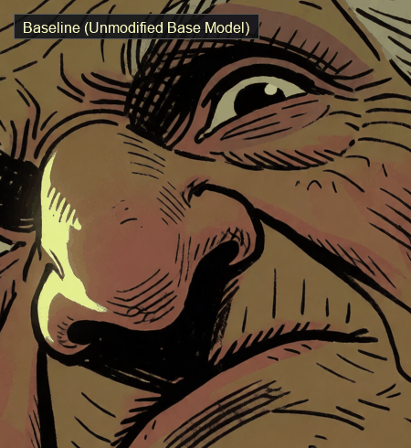
</p>

<details>
<summary><code>G4</code> · <code>hag_chartreuse</code> · <code>prompt_sha1 95acba3b41</code> · seed 4242145 — <strong>show the exact prompt</strong></summary>

```text
Western comics style, bold ink outlines, hatched shadows, hard chartreuse-tinted rim light glowing along the edges of her face, wild-eyed manic determination, seen from an extreme low angle shot through an imagined gap between her chin and chest, extreme close-up on the head only, tight framing, sharply canted dutch angle. very old female hag, deep umber-brown weathered skin, wild frizzed grey hair sticking straight up as if charged with static, an exaggeratedly long hooked nose nearly touching her upturned chin, small sunken eyes blazing wide with fevered focus, sagging jowls trembling around a muttering open mouth, three long grey chin-hairs twisted into tiny braids, a single large hoop stretching one earlobe low. white background, simple background, chartreuse overall hue, monochromatic chartreuse.
```

</details>

#### Side-by-Side Detail Comparison
Look closely at the nose bridge, cheek folds, and brow hatching across the exact same seed:

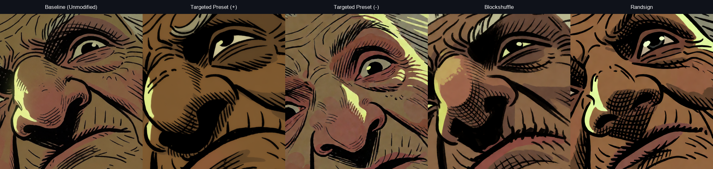

* **Baseline (Unmodified Base Model)**:  
  Standard balanced comic art, combining medium contour outlines with light, scattered cross-hatching.
* **Targeted Preset (+) — Solid Graphic Inking**:  
  Line continuity increases sharply. Shadows under the nose and jaw consolidate into solid black graphic ink masses, and the outer contours turn into decisive, bold silhouette lines.
* **Targeted Preset (-) — Vintage Etching & Fine Cross-Hatching**:  
  Inverting the preset sign causes the heavy ink masses to dissolve into hyper-dense, razor-thin hatching across every single wrinkle, giving it the feel of a 19th-century copperplate engraving.
* **Blockshuffle — Rustic Cross-Hatching**:  
  Shuffling block assignments produces heavy, multi-directional diagonal hatching with a rough, organic woodcut print texture.
* **Randsign — High-Frequency Stippling & Grain**:  
  Scrambling the signs channels the energy into fine surface stippling and micro-grain rather than structured contours.

<details>
<summary><strong>🔍 Click to view full-resolution portraits across all 5 conditions</strong></summary>

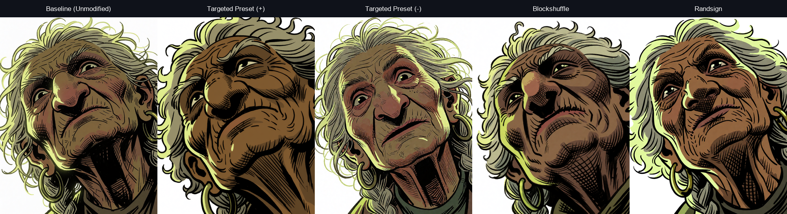
</details>

---

### 1.2 The ruler that couldn't see

When I first ran standard automated benchmarks on these images using standard **CLIP ViT-L-14 (224×224)** embeddings, the data seemed to show that "nothing was happening". 

It turned out the metric was blind:
* CLIP downsamples a 1024×1280 image down to 224×224 before computing anything. At that resolution, fine pen strokes and inking continuity simply disappear.
* When we built a second measurement space focused specifically on **luminance and stroke morphology** (contour continuity, edge transitions, ink distance transforms), the result flipped:
  - In stroke space, the contrast between the targeted preset and block derangement resolves clearly at **$P = 0.001$** (difference in directional coherence $+0.249$, 95% CI $[+0.104, +0.382]$).
  - On the principal stroke continuity axis (PC1), the preset separates cleanly from both controls. Across the full 24-prompt pool: $-2.532$, 95% CI $[-3.00, -2.07]$, $d_z = -2.30$, $p_{\text{Holm}} < 0.0001$ against Blockshuffle; $-2.117$, CI $[-2.69, -1.54]$, $d_z = -1.55$, $p_{\text{Holm}} < 0.0001$ against Randsign. The two controls do not separate from each other on that axis ($+0.415$, CI $[-0.37, +1.20]$, n.s.).

**No sign flips between the two spaces** — the point estimates keep their direction. What flips is *which contrast the instrument can statistically resolve*: in CLIP space it is `preset − randsign` ($P = 0.0011$) while `preset − blockshuffle` stays undecided ($P = 0.151$); in stroke space it is exactly the other way round ($P = 0.157$ and $P = 0.001$). Same pixels, same statistic, same ten prompts — only the feature space changes.

Evaluate line art with a 224px semantic model and you will resolve the wrong comparison, and conclude the wrong thing about which edit did something.

---

### 1.3 Does it hold on other subjects?

Milestone 1 was declared **in advance**, with an explicit falsification criterion:

> *If directional coherence does not replicate with a 95% CI excluding zero on the new family, the effect will be documented as prompt-family specific rather than general.*

The family has since been extended from 10 to **24 prompts**, split by **how much colour freedom the prompt leaves the model**:

* **18 colour-pinned prompts** — the palette is specified element by element (skin, hair, eyes, rim light), leaving the model almost no choice.
* **6 colour-free prompts** — every colour word is removed and only `colored` remains, so the model picks the palette itself.

The two sub-families were analysed separately and then pooled, with the PCA recomputed independently inside each pool.

#### The criterion is met — on the axis it named

On the 6 new full-colour prompts, both preset contrasts on the stroke-continuity axis exclude zero:

| Contrast on PC1 (colour-free family, $n = 6$) | $\Delta$ | 95% CI | $d_z$ |
| --- | --- | --- | --- |
| Preset $-$ Blockshuffle | $-1.958$ | $[-2.50, -1.42]$ | $-3.82$ |
| Preset $-$ Randsign | $-3.815$ | $[-5.67, -1.96]$ | $-2.16$ |
| Blockshuffle $-$ Randsign | $-1.857$ | $[-4.03, +0.31]$ | $-0.90$ |

Contour geometry replicates alongside it: contour length $+0.760\ [+0.37, +1.15]$ and contour fragment count $-0.560\ [-0.82, -0.30]$ against Blockshuffle. **The effect is not an artifact of tightly colour-pinned prompts.**

**Is it the same axis?** Necessary check, because "PC1" is only a label until you compare the loadings. Cosine between the PC1 loading vectors of the separate PCAs (sign of a component is arbitrary, so $|\cos|$):

| | pinned vs free | pinned vs pooled | free vs pooled |
| --- | --- | --- | --- |
| **PC1** | $0.837$ | $0.990$ | $0.906$ |
| PC2 | $0.670$ | $0.983$ | $0.775$ |
| PC3 | $0.379$ | $0.990$ | $0.361$ |

PC1 is substantially the same direction in all three pools. **PC3 is not** ($|\cos| = 0.36$ between sub-families), so PC3 results are not comparable across them and are not claimed here.

> **Honest caveat on power.** With $n = 6$ prompts, an exact sign-flip permutation test enumerates $2^6 = 64$ assignments, so its smallest possible two-sided $p$ is $2/64 = 0.031$ — and after Holm correction across three contrasts, **no effect of any size can reach $p < 0.05$ on this sub-family**. That structural ceiling is exactly why the criterion was pre-declared in terms of the confidence interval rather than a $p$-value. The CI is parametric and is doing the work here; the replication rests on interval estimation, not on significance.

#### What the pooled 24 prompts add

Stroke width now separates the preset from **both** controls for the first time ($+0.238$, $p_{\text{Holm}} = 0.016$ vs Blockshuffle; $+0.394$, $p_{\text{Holm}} = 0.020$ vs Randsign) — at 10 prompts this comparison was underpowered.

And a clean two-group structure emerges across the ten metrics:

* **Mark geometry and palette** — PC1, stroke width, contour length, effective colour count, top-4 palette share: the preset separates from **both** controls, and the two controls do **not** separate from each other.
* **Texture frequency** — crosshatch entropy, FFT radial slope, PC2: **Randsign** is the outlier, channelling its displacement into broad-band grain while preset and blockshuffle stay together.

In other words: *on every axis where the preset is distinguishable, the two matched controls are indistinguishable from each other* — and where the controls do differ, it is because one of them is adding noise rather than steering geometry.

---

### 1.4 Does colour follow the same pattern?

The palette effects are **specific to colour-pinned prompts**. Pooled over 24 prompts the preset reduces the effective colour count against both controls ($-0.376$ and $-0.237$, both $p_{\text{Holm}} \approx 0.001$) and concentrates the palette into its top four clusters ($+0.384$, $+0.234$). On the 6 colour-free prompts, none of that survives: every palette contrast contains zero.

The 6 colour-free prompts existed to answer a separate question: **given the freedom to pick a palette, do different weight edits pick different palettes?** No measurement built so far could see it — every colour metric in this repo re-aligns the global cast to the baseline first, a deliberate choice made after a block-level edit was caught winning a "universality" score purely by tinting every image the same way. That made *how many* colours measurable and *which* colours invisible.

Measured directly (mean LAB chroma of the subject, no cast normalisation, displacement from the same-seed baseline):

| Colour-free family, $n = 6$ | palette shift | vs. a seed change | direction shared across prompts | $p$ |
| --- | --- | --- | --- | --- |
| Preset $+$ | $1.41$ | $1.31\times$ | $-0.165$ | $0.81$ |
| Preset $-$ | $1.81$ | $1.69\times$ | $-0.013$ | $0.25$ |
| Blockshuffle $+$ | $1.30$ | $1.21\times$ | $-0.137$ | $0.75$ |
| **Blockshuffle $-$** | $1.82$ | $1.70\times$ | $\mathbf{+0.944}$ | $\mathbf{<0.0001}$ |
| Randsign $\pm$ | $1.53$–$1.57$ | $\approx 1.4\times$ | $+0.38$–$+0.40$ | $0.03$–$0.07$ |

**The preset does not steer colour.** It shifts each subject's palette by about a third more than a different random seed already does, and those shifts **do not point the same way** from one subject to the next — there is no palette it pulls toward.

The exception is instructive: **Blockshuffle $-$ does impose a coherent cast** ($+0.944$ against a null 95th percentile of $+0.334$), i.e. nearly every subject's colours move in the same LAB direction. The artifact this project was most afraid of — an edit that scores well by simply tinting everything — is produced here by a *control*, not by the hand-calibrated preset.

One systematic asymmetry worth recording: on both sub-families the **negative** direction of every condition moves the palette roughly $1.7\times$ more than its positive counterpart.

> **A note on how to count these.** Sections 1.1 to 1.4 are **four measurements of one corpus**, not
> four replications. The same 1272 renders are behind all of them, so agreement between them is a
> consistency check, not independent confirmation. None of the four was pre-registered — they emerged
> in sequence, in response to challenges. Where a result deserves the weight of a replication, it is
> because the *renders* are new, and that is said explicitly.

---

## Experiment 2 — Attribute emergence

<sub>**390 renders · 24 sets · a separate corpus from Experiment 1**</sub>

> **The direction I'm chasing.** Everything in Experiment 1 is about *how* the model draws something it
> was already going to draw. This one asks something else: can a different weight calibration make a
> detail that is written in the prompt but normally ignored actually show up — consistently, at the
> same prompt structure? If it can, then weight-space tuning is not only a style knob, it touches what
> the model decides to put in the picture.
>
> **What would kill it.** If a sign-scrambled control carrying the identical displacement made the
> detail appear just as often, the effect would be about how hard you push, not about how you push.
> That test has been run: randsign scores 1/20, which is the stock model's exact rate. The version
> still open is generality — if a prompt with a completely different structure, but carrying the same
> two anchor phrases, fails to reproduce it, then this is a fact about one template and the section
> gets rewritten to say so.
>
> **Where we are.** The jump is 1/20 to 19/20 on the original prompt and 7/20 to 20/20 on a second one,
> with no seed going the other way in either. But it is a gain on a binding the prompt has to establish
> first, not a repair: remove either of two specific phrases and the effect falls back to the stock
> model's rate. One attribute, one prompt family, and the perturbation tested is a control rather than
> my own preset.

### 2.1 The effect

| Condition | Attribute present | 95% CI | vs. paired control | $p$ |
| --- | --- | --- | --- | --- |
| Blockshuffle, full prompt | **19 / 20** | [76%, 99%] | 18 discordant to 0 | $7.6 \times 10^{-6}$ |
| Stock model, same prompt | 1 / 20 | [1%, 24%] | — | — |
| Blockshuffle, second prompt | **20 / 20** | [84%, 100%] | 13 discordant to 0 | $2.4 \times 10^{-4}$ |
| **Randsign**, full prompt, identical $D$ | 1 / 20 | [1%, 24%] | vs. blockshuffle, 18 to 0 | $7.6 \times 10^{-6}$ |
| Stock model, second prompt | 7 / 20 | [18%, 57%] | — | — |

<p align="center">
  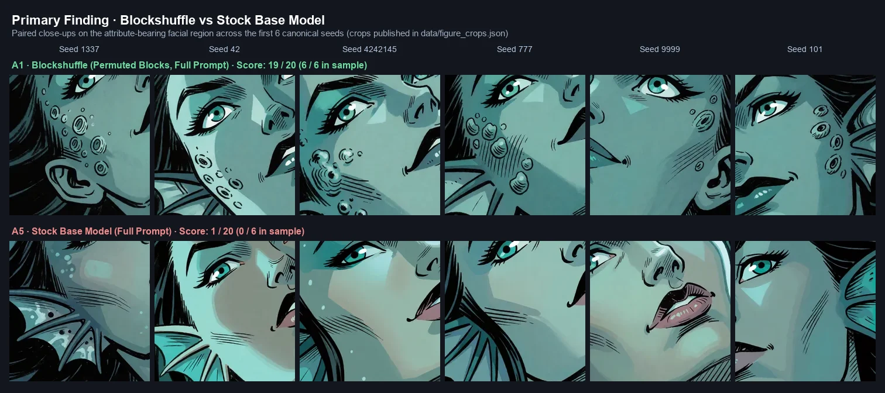
</p>

> *Detail figure: First 6 canonical seeds (1337, 42, 4242145, 777, 9999, 101) cropped tight on the attribute region (all bounding boxes published in [`data/figure_crops.json`](data/figure_crops.json)). For the complete 20-seed contact sheet proving no omission, see the [Full Census Sheet (A1 vs A5)](assets/02_attribute_emergence/_figures/census_A1_vs_A5.webp).*

Not one seed goes the other way in either comparison. Two controls run in the same batch are what make this mean something.

**The keyword control.** With the barnacle phrase deleted from the prompt, the same weight configuration produces the attribute in **2 / 20** renders — the perturbation is not decorating earlobes on its own.

**The norm-matched control.** Randsign — the sign scramble carrying the *identical* Frobenius displacement $D = 0.0538$, differing from blockshuffle only in the structure of the perturbation and not its size — produces **1 / 20**. That is not "weaker": it is **exactly the stock model's rate**, on the same prompt and the same seeds, and the two are paired at one discordant seed each way. A perturbation of the same magnitude with scrambled signs instead of permuted blocks does *nothing at all*.

This is the control that decides what the finding is. Without it, the result would be vulnerable to the obvious reading — *any push of that size out of the checkpoint shakes a secondary token loose*. With it, that reading is dead: the effect is a property of **which** permutation, not of **how far** it moves.

<p align="center">
  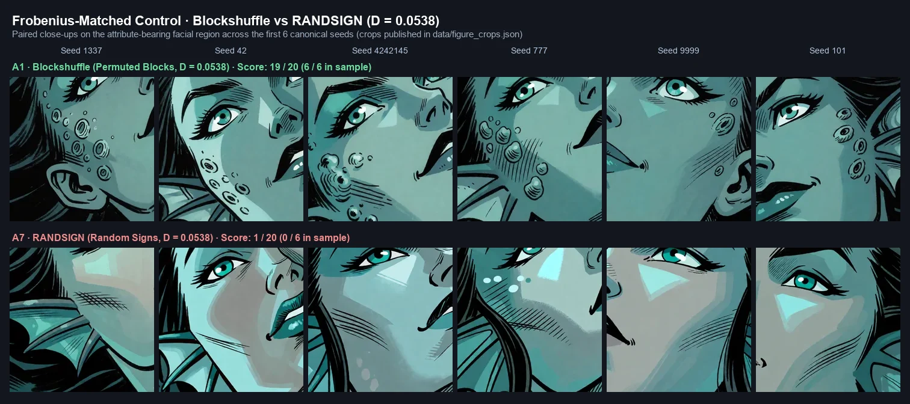
</p>

> *Detail figure: First 6 canonical seeds across identical Frobenius displacement $D = 0.0538$ (published boxes in [`data/figure_crops.json`](data/figure_crops.json)). See the [Full Census Sheet (A1 vs A7)](assets/02_attribute_emergence/_figures/census_A1_vs_A7.webp) for all 20 paired seeds.*

### 2.2 The finding is the conjunction, not the perturbation

The attribute does not appear whenever the weights are perturbed. It appears only when the prompt also supplies a **two-token local scaffold**: the ontological anchor `sea-touched` *and* the neighbouring morphological phrase `thin webbed fin-like ridges tracing along her temple`. Removing either one — a single-variable knockout, everything else byte-identical — collapses the effect:

| Prompt | `sea-touched` | `webbed fin-like ridges` | barnacle keyword | Result |
| --- | :---: | :---: | :---: | --- |
| G1 complete | ✓ | ✓ | ✓ | **19 / 20** |
| Siren/hag hybrid | ✓ | ✓ | ✓ | **20 / 20** |
| Only the ridges phrase removed | ✓ | ✗ | ✓ | **1 / 20** |
| Only `sea-touched` removed | ✗ | ✓ | ✓ | **0 / 10** |
| Keyword without any marine context | ✗ | ✗ | ✓ | 0 / 20 |
| Length- and syntax-matched neutral | ✗ | ✗ | ✓ | 0 / 20 |
| Teal sea hag, no ridges | ✓ | ✗ | ✓ | 0 / 20 |
| Ancient Hag + keyword, no marine context | ✗ | ✗ | ✓ | 0 / 20 |

The sharpest number in the whole experiment is the one that looks least impressive. With the ridges phrase removed, the perturbed model scores **1 / 20** — and the stock model on the complete prompt also scores **1 / 20**. Paired, they are **1 discordant seed each way, $p = 1.0$**: without the scaffold, the weight perturbation is statistically indistinguishable from not having applied it at all.

<p align="center">
  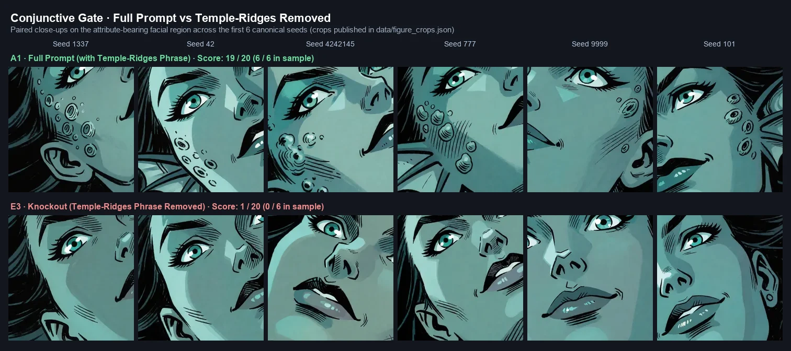
</p>

> *Detail figure: First 6 canonical seeds with vs. without the morphological temple-ridges phrase (published boxes in [`data/figure_crops.json`](data/figure_crops.json)). See the [Full Census Sheet (A1 vs E3)](assets/02_attribute_emergence/_figures/census_A1_vs_E3.webp) for all 20 paired seeds.*

So the 2×2 is:

| | Scaffold absent | Scaffold present |
| --- | --- | --- |
| **Stock model** | 0 / 20 | 1 / 20 |
| **Blockshuffle** | 0/20, 0/20, 0/20, 0/10, **1/20** (five independent cells) | **19 / 20**, **20 / 20** |

The effect lives in exactly one cell. **The perturbation does not add the attribute and does not repair the neglect — it acts as a gain on a binding the prompt must already have established, and that binding is fragile enough that one phrase carries it.**

### 2.3 Which half of the model carries it

The preset moves the DiT and the text encoder together. Run separately, on the same 20 seeds and the complete prompt:

| Where the perturbation is applied | Present | 95% CI | Comparison | $p$ |
| --- | --- | --- | --- | --- |
| DiT + text encoder | 19 / 20 | [76%, 99%] | — | — |
| **DiT only** (encoder left stock) | **12 / 20** | [39%, 78%] | vs. stock, 11 discordant to 0 | $9.8 \times 10^{-4}$ |
| **Text encoder only** (DiT left stock) | 3 / 20 | [5%, 36%] | vs. stock, 3 to 1 | $0.63$ — **not distinguishable** |
| Stock | 1 / 20 | [1%, 24%] | — | — |

The text encoder on its own does nothing measurable. The DiT carries most of the effect. Adding the encoder on top of the DiT still gains 6 discordant seeds to 0 ($p = 0.031$), so the two are not redundant — but at 19/20 the combination is against the ceiling and **the size of any synergy cannot be estimated from these data**. Measuring it would require repeating the 2×2 at a strength where nothing saturates.

### 2.4 Dose–response

Applying the same preset at scaled strength (10 seeds per point, complete prompt):

| Strength | 0.25 | 0.50 | 0.75 | 1.00 | 1.25 | 1.50 | 1.75 | 2.00 |
| --- | --- | --- | --- | --- | --- | --- | --- | --- |
| Present | 1/10 | 5/10 \* | **10/10** | **19/20** | 8/10 | 6/10 | 5/10 | 1/10 |

\* four renders at 0.50 were judged ambiguous against the scoring rule and are recorded as `ambiguous` in the data rather than forced to 0 or 1.

<p align="center">
  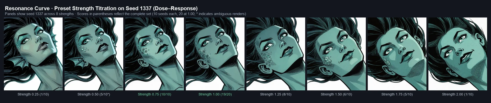
</p>

> *Resonance curve: Panels show seed 1337 across 8 preset strengths. Scores in parentheses reflect the complete set (10 seeds per point, 20 at 1.00; asterisks denote ambiguous renders).*

There is an optimum around $0.75$–$1.00$ and both ends fail. That argues against "any disturbance of the weights helps" — at $2.00$ the displacement is largest and the attribute is gone. But at $n = 10$ the Wilson interval on $6/10$ is [31%, 83%]: **the extremes are separated, the intermediate points are not ordered by these data.**

### 2.5 What emerges is not quite what was asked for

The prompt says `studding one earlobe`. Across every positive render, the clusters sit on the **cheekbone and temple region**, not on or in the ear. The attribute emerges; its spatial binding does not. This is worth stating plainly because it changes what the result is evidence *for*: the perturbation recovers the *presence* of a neglected concept, and leaves its *placement* wrong in the same way the stock model would have.

<p align="center">
  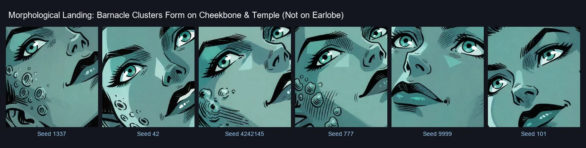
</p>

> *Morphological landing: Individual 240×240 crops across 6 positive renders (published boxes in [`data/figure_crops.json`](data/figure_crops.json)), demonstrating that clusters consistently land on the cheekbone and temple rather than on the prompt-specified earlobe.*

### 2.6 What this does **not** establish

* **Two perturbations were tested, not the whole space.** Blockshuffle does it; randsign at the identical $D$ does not. That separates *structure* from *magnitude*, which is the distinction that mattered. It does not tell us which structural property is the operative one — block coherence is the obvious candidate, but "permutation rather than sign flip" and "preserves each block's internal correlations" are not distinguished by two points.
* **The hand-calibrated preset was not tested either.** The claim here is about a matched control from the main experiment, not about the author's preset.
* **One attribute, one prompt template.** G1 and the hybrid share nearly every token. Whether this generalises to other neglected attributes on unrelated characters is untested.
* **The scoring is unblinded**, by the author, with the condition visible. With 18 discordant seeds to 0 the headline will not flip, but the intermediate cells (the DiT-only 12/20, the 0.50 strength point) are exactly where a borderline call moves the number.
* **The ridges knockout deletes rather than substitutes.** The matched-neutral design used elsewhere in this experiment was not applied to it, so a residual prompt-length or token-position explanation is not formally excluded — though note that removing the phrase *shortens* the distance between `sea-touched` and the barnacle keyword, which cuts against a positional account rather than for it.

### 2.7 Where this sits

The phenomenon has a name: **catastrophic neglect**, the failure of a text-to-image model to render a concept its prompt explicitly contains. The published remedies operate at inference time on cross-attention — [Attend-and-Excite](https://arxiv.org/abs/2301.13826) and [attention-guided feature enhancement](https://arxiv.org/html/2406.16272v2) both re-weight attention maps during sampling. What is reported here is different in kind: a **static, prompt-preserving change in weight space**, found incidentally while running a matched control, that moves a specific neglected attribute from 5% to 95% presence without touching the prompt or the sampler. Whether it generalises beyond this attribute is exactly what 2.6 says is untested.

---

## Roadmap

### Experiment 2 · Resolved — emergence is about structure, not magnitude
* **The question was**: §5 shows a norm-matched block derangement moving a neglected attribute from 1/20 to 19/20. Would randsign, the sign scramble at the identical $D = 0.0538$, do the same?
* **Answer**: no. Randsign scores **1 / 20** — the stock model's exact rate. The pre-declared criterion said that above 15/20 the word "coherent" would come out of the claim; at or below 2/20 the structure of the perturbation becomes the operative variable. It landed at 1/20.
* **What is still open on the same axis**: two points do not identify *which* structural property matters, and the hand-calibrated preset has still never been run on this attribute.

### Experiment 2 · Open — a general mechanism, or a fact about one template?
* **Goal**: The only positive case on a different subject (the siren/hag hybrid, 20/20) shares almost every token with the original prompt, and every negative case carrying both anchors is structurally close too. So "it generalises" has not been tested — only "it survives a small edit" has.
* **Pre-declared Criterion**: A prompt with a different camera, a different register and a non-marine character, carrying an analogous pair of anchors — one ontological, one an adjacent local morphology — for a **different** neglected attribute. If the attribute emerges there, the conjunctive gate is a general mechanism. If it does not, Experiment 2 is rewritten as a finding about this prompt family and the word "mechanism" comes out of it.
* **Second question on the same run**: the hand-calibrated preset on the same 20 seeds, which has never been tested on this attribute at all.

### Experiment 1 · Open — is the palette effect bound to colour-pinned prompts?
* **Goal**: The colour-count separation holds on the 18 colour-pinned prompts and vanishes on the 6 colour-free ones — but $n = 6$ cannot distinguish "absent" from "underpowered", and the direct chroma measurement above shows the preset shifting palettes only $1.3\times$ a seed change, incoherently.
* **Pre-declared Criterion**: Extend the colour-free family to at least 16 prompts. If the effective-colour contrast against both controls still contains zero **and** the cross-prompt chroma direction stays below its permutation null, the palette claim is documented as specific to colour-pinned prompts and dropped from the general statement.
* **Second question on the same run**: whether Blockshuffle $-$ keeps producing a coherent global cast ($+0.944$ here). If it does, "a matched control can win a universality score by tinting" becomes a reportable finding in its own right, not a footnote.

### Experiment 1 · Open — cross-architecture replication on `circlestone-labs/Anima`
* **Goal**: Apply the exact same $D$-matched protocol (sign scramble + block derangement) to [`circlestone-labs/Anima`](https://huggingface.co/circlestone-labs/Anima).
* **The True Cross-Family Test**: Anima is not just another DiT checkpoint — it is fine-tuned from `nvidia/Cosmos-Predict2-2B-Text2Image` (Cosmos architecture) and uses a compact `qwen_3_06b_base` (0.6B) text encoder. Testing across Cosmos 2B + Qwen3 0.6B vs. Krea-2 12B + Qwen3-VL 4B will determine whether weight-space steering is an architectural universality or specific to Krea-2.
* **Pre-declared Criterion**: PC1 rebuilt independently on the new architecture, with the preset separating from both controls at a 95% CI excluding zero. If it does not, the effect is documented as Krea-2 specific.

*(Additional technical tools — quadratic $\epsilon$-scaling, VLM judge calibration, and 30-prompt CLIP closure — are kept in the [`experiments/`](experiments/) directory and outlined in [§11 of the Lab Notebook](index.html#ripresa).)*


---

## How to Explore, and How to Replicate

* **Interactive A/B Viewer**: Open [`viewer/viewer.html`](viewer/viewer.html) in your browser to inspect image pairs side-by-side or toggle back-and-forth instantly with the spacebar.
* **Complete Lab Notebook**: Read [`index.html`](index.html) for all the mathematical formulations, KaTeX derivations, PCA loadings, and vector SVG forest plots.
* **The 26 Pitfalls Checklist**: Before trying this on another model, check [`docs/errors_log.md`](docs/errors_log.md) — it documents 26 real measurement mistakes made during this work that gave plausible-looking numbers but were totally wrong.
* **Re-run the Analysis**: `python experiments/global_aggregation_corrected.py` runs from a fresh clone — it resolves its inputs to `data/`, which holds the full feature matrix and the image manifests, and regenerates every aggregation table quoted above. It needs `numpy`, `pandas`, `scipy` and `scikit-learn`.
* **What you cannot re-run from a clone**: the scripts that read pixels — `analyze_texture.py`, `analyze_quantization.py`, `color_freedom.py`, `run_style_features.py` — need the complete render set (≈1 500 PNGs at 1024×1280), which is not committed here. `assets/` carries a representative subset for visual inspection only. Those scripts still point at local absolute paths and are published as the **record of how the numbers were produced**, not as a turnkey pipeline.
* **Repository size and original master PNGs**: a full clone is **~44 MB** (all images served as high-quality 480×600 WebP under `assets/01_steering/` and `assets/02_attribute_emergence/`). The uncompressed 1024×1280 master PNG originals are preserved in full and packaged as GitHub Release assets:
  - [`krea2_steering_png_originals.zip`](https://github.com/aledelpho/diffusion-models-weight-steering-report/releases/latest) (498 MB · 370 master PNGs for §2–§4)
  - [`krea2_attribute_emergence_png_originals.zip`](https://github.com/aledelpho/diffusion-models-weight-steering-report/releases/latest) (642 MB · 392 master PNGs for §5)
  Each PNG contains its embedded ComfyUI generation graph in a `tEXt` chunk. See [`docs/asset_pipeline.md`](docs/asset_pipeline.md) for layout specifications.
* **The generation graphs**: every committed PNG carries its ComfyUI graph in a `tEXt` chunk, so dragging one onto a ComfyUI canvas reloads exactly the pipeline that made it. The same graphs are also published as plain JSON — [`data/comfy_graphs.json`](data/comfy_graphs.json) for all 370 renders individually, and [`docs/workflow/`](docs/workflow/) for the three distinct topologies, pretty-printed and annotated.
* **Re-run the attribute-emergence experiment**: [`data/attribute_emergence_recipe.json`](data/attribute_emergence_recipe.json) carries, for each of the 23 sets in §5, the exact prompt text and its `prompt_sha1`, the preset file, the model and CLIP strengths, the seed list and the output folder and filename pattern. Two of the ten prompt variants hash to `30de058455` and `95acba3b41` — the untouched G1 and G4 already published in [`data/prompts.json`](data/prompts.json) — so the hashes verify themselves. [`data/attribute_emergence.csv`](data/attribute_emergence.csv) holds the per-seed score behind every number in §5, including the renders marked `ambiguous` rather than forced to a verdict.
* **A note on language**: every published table — column names, condition labels, feature names — is in English. The *comments* inside the scripts are in Italian, because that is how they were written while the work was happening and rewriting them afterwards would misrepresent the record. The code itself reads fine without them.

> **On the $p$-values.** Every $p$ in `data/global_aggregation_*.csv` comes from a sign-flip permutation test on the prompt-level means. With $n \le 16$ prompts all $2^n$ sign assignments are enumerated, so the $p$ is exact and its floor is $2/2^n$ — on the 6-prompt colour-free family that floor is $0.031$, which is why **no effect of any size can clear Holm correction there**. Above 16 prompts the test samples $100\,000$ assignments, so its floor is $\approx 10^{-5}$. The estimator reports $(k+1)/(N+1)$, so a $p$ can never print as an exact `0.0` — the smallest value in the 24-prompt tables is `1e-05`, which is the resolution floor and not a measured zero.

---

## Credits, Licence & Context

* **Authoring & Tuning Tool**: [aledelpho/comfyui-arthemy-krea2-tuner](https://github.com/aledelpho/comfyui-arthemy-krea2-tuner)
* **License**: [MIT](LICENSE). The code, the data tables and the text are all free to reuse, modify and build on, with attribution.
* **Lab Notebook**: `diffusion-models-weight-steering-report`
