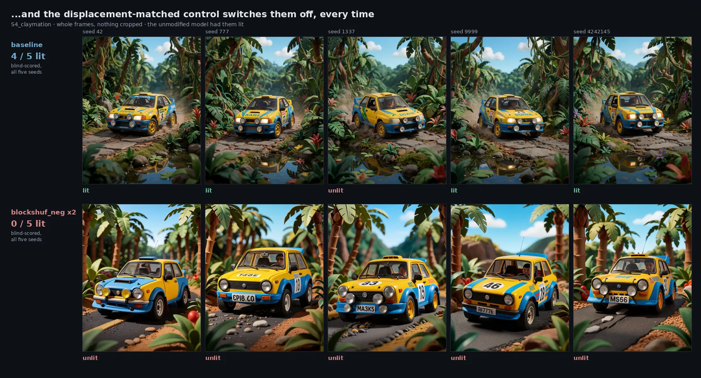
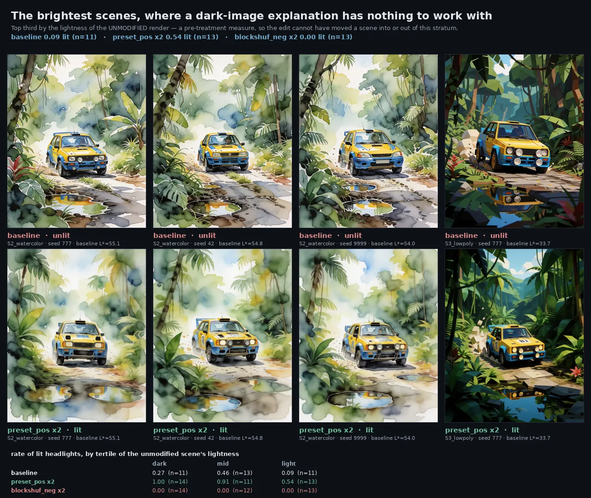
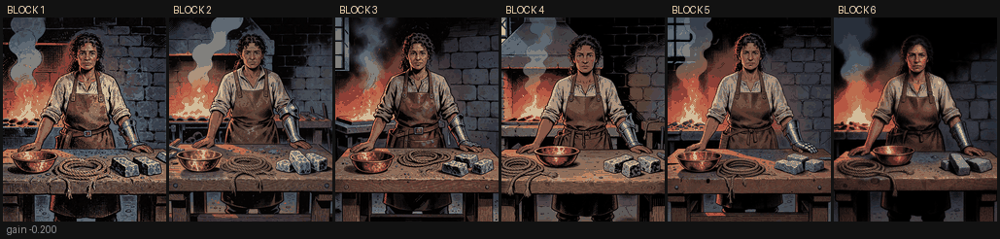
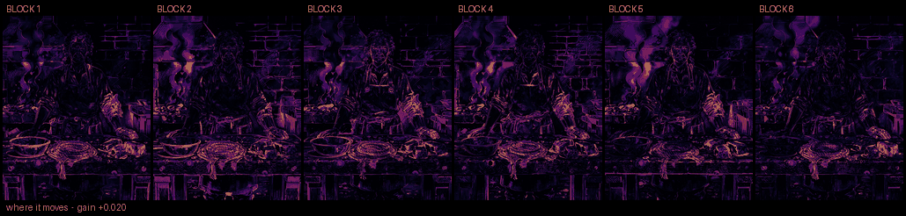
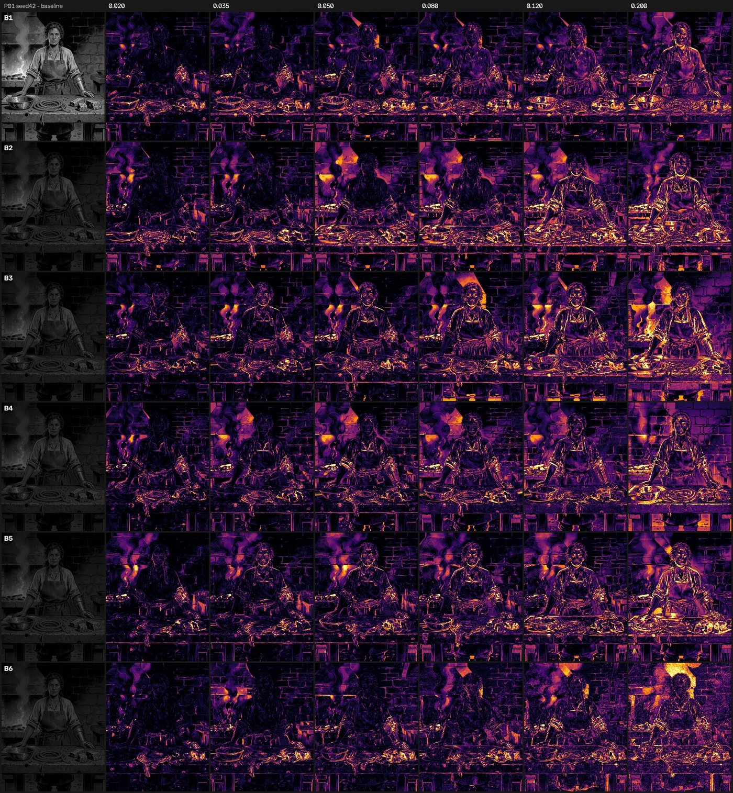
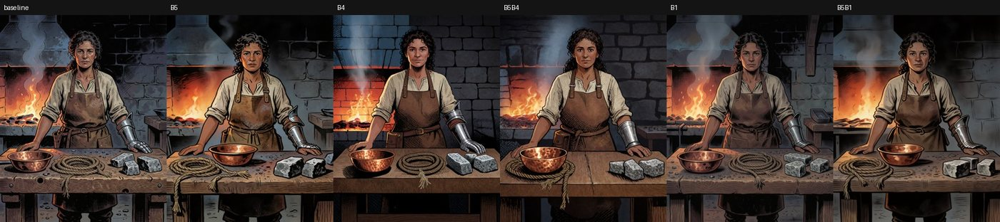

# Weight-Space Steering in Diffusion Models: A Public Lab Notebook

> **Status & Framing**: This is an **open, public lab notebook**. It records real experiments, working hypotheses, and the raw findings gathered so far on **Krea-2 DiT (28 blocks)**.  
> The next step is a formal cross-architecture replication on [`circlestone-labs/Anima`](https://huggingface.co/circlestone-labs/Anima) (which is built on Cosmos-Predict2 with a Qwen3 0.6B text encoder, offering a true cross-family test). Everything here is shared openly to be inspected, reproduced and challenged.

<p align="center">
  <a href="index.html"><strong> Read Full Lab Notebook</strong></a> •
  <a href="viewer/viewer.html"><strong> Launch Interactive A/B Viewer</strong></a> •
  <a href="docs/errors_log.md"><strong> 62 Pitfalls Checklist</strong></a> •
  <a href="data/"><strong> Raw Datasets</strong></a>
</p>

---

## ✦ Live Visual Demonstration: Synchronized 5-Seed Steering

While experimenting with [**Arthemy-Krea2-Tuner**](https://github.com/aledelpho/comfyui-arthemy-krea2-tuner), I wanted to see if manipulating internal weights directly could predictably guide how a model draws — without retraining, without LoRAs, and without touching the prompt.

Below, you can see the **exact same 5 random seeds** (`4242145`, `42`, `1337`, `777`, `9999`) rendered across different weight configurations, all matched to the exact same Frobenius displacement ($D = 0.0538$):

> **Every figure below carries the prompt that produced it.** The prompt text is never edited between conditions — `prompt_sha1`, the first ten hex characters of its SHA-1, is how that is enforced and checked, and it is also the folder name under [`assets/`](assets/01_steering/). The complete list of all 24 prompts with their hashes is in [`data/prompts.json`](data/prompts.json).

### Subject 1: Sea-touched Siren (Cyan & Teal Rim Light)
<p align="center">
  
</p>

<details>
<summary><code>G1</code> · <code>seatouched_teal</code> · <code>prompt_sha1 30de058455</code> — <strong>show the exact prompt</strong></summary>

```text
Western comics style, bold ink outlines, hatched shadows, hard teal-tinted rim light glowing along the edges of her face, seductive simmering menace, seen from an extreme tilted low angle with her chin raised, extreme close-up on the head only, tight framing, sharp dutch angle. ageless female sea-touched woman, long dark hair fanning as if suspended in water, thin webbed fin-like ridges tracing along her temple, cyan skin, sharply arched eyebrows, a narrow straight nose, wide teal eyes with slitted pupils half-lidded in cold allure, full lips curled in a knowing smirk, small barnacle-like clusters studding one earlobe, faint iridescent sheen along her jawline. white background, simple background, teal overall hue, monochromatic teal.
```

</details>

<details>
<summary><strong> Subject 2: Goblin with Sly Grin (Yellow Rim Light)</strong> — Click to expand 5-seed animation</summary>
<p align="center">
  
</p>

<details>
<summary><code>G2</code> · <code>goblin_yellow</code> · <code>prompt_sha1 c6a4015aae</code> — <strong>show the exact prompt</strong></summary>

```text
Western comics style, bold ink outlines, hatched shadows, hard yellow-tinted rim light glowing along the edges of his face, sly calculating grin, seen from an extreme low tilted angle looking sharply up his chin, extreme close-up on the head only, tight framing, steep dutch angle. middle-aged male goblin, mottled olive-green skin, greasy tufts of black hair slicked into a lopsided topknot, one eyebrow arched high in shrewd amusement, small beady yellow eyes darting sideways, a long hooked nose with a slight downward curve, wide crooked grin showing several missing teeth, a small brass loop pierced through one nostril, thin wispy chin-whiskers braided into a point. white background, simple background, yellow overall hue, monochromatic yellow.
```

</details>
</details>

<details>
<summary><strong> Subject 3: Barbarian / Half-Orc in Screaming Rage (Red Rim Light)</strong> — Click to expand 5-seed animation</summary>
<p align="center">
  
</p>

<details>
<summary><code>F1</code> · <code>halforc_red</code> · <code>prompt_sha1 7e8536f9bb</code> — <strong>show the exact prompt</strong></summary>

```text
Western comics style, bold ink outlines, hatched shadows, hard red-tinted rim light glowing along the edges of her face, ferocious screaming rage, seen from a steep low angle, extreme close-up on the head only, tight framing, dutch angle, sharp perspective. female half-orc, head thrown back with a wild tangle of black hair across her face, thick furrowed eyebrows pressed low in fury, wide crimson eyes wide with screaming rage, mouth stretched open in a full-throated roar baring a single sharp lower tusk, a thick iron ring pierced through the nose bridge, ferociously screaming expression. white background, simple background.
```

</details>
</details>

<details>
<summary><strong> Subject 4: Ancient Hag with Manic Determination (Chartreuse Rim Light)</strong> — Click to expand 5-seed animation</summary>
<p align="center">
  
</p>

<details>
<summary><code>G4</code> · <code>hag_chartreuse</code> · <code>prompt_sha1 95acba3b41</code> — <strong>show the exact prompt</strong></summary>

```text
Western comics style, bold ink outlines, hatched shadows, hard chartreuse-tinted rim light glowing along the edges of her face, wild-eyed manic determination, seen from an extreme low angle shot through an imagined gap between her chin and chest, extreme close-up on the head only, tight framing, sharply canted dutch angle. very old female hag, deep umber-brown weathered skin, wild frizzed grey hair sticking straight up as if charged with static, an exaggeratedly long hooked nose nearly touching her upturned chin, small sunken eyes blazing wide with fevered focus, sagging jowls trembling around a muttering open mouth, three long grey chin-hairs twisted into tiny braids, a single large hoop stretching one earlobe low. white background, simple background, chartreuse overall hue, monochromatic chartreuse.
```

</details>
</details>

---

## 💡 The 53 KB Parameter Payload

> **Can 53 KB steer a 12.8 Billion parameter model?**  
> In diffusion models, we are used to thinking that changing style requires either fine-tuning the model or loading multi-megabyte (or gigabyte) LoRAs.  
> The presets tested here are tiny **53 KB** parameter deltas — just a lightweight configuration of calibrated block gains and Lie algebra rotations. Yet, as you can see across all seeds, they steer the visual rendering with remarkable consistency.

---

## Introduction — how I got here

Two years ago, as Arthemy, my workflow for training models looked like this. Download a model plus
a few fine-tunes with aesthetics close to what I wanted, then block-merge them at different
strengths per block until I landed on something near the look I had in mind. Alongside that, train
extremely narrow concept LoRAs and distil them as hard as I could: activate only specific sections,
train five of them, keep only what they had in common to squeeze the scope down further, then inject
the result back into the model.

At some point I started playing with values that are not supposed to be used. The question was
simple: instead of sliding between 0.0 and 1.0, what happens if I force a value below zero, or above
one? What came out was an amplification of one model's magnitude — but always *relative to a second
model*, because that is what a merge is.

That is when I started wondering whether the same block-merge operations could work with **one model
alone**. Amplify or attenuate some of its own sections mathematically, and see how the output
changes. My SDXL tool, [Arthemy Live-Tuner](https://github.com/aledelpho/Arthemy_Live-Tuner-SDXL-ComfyUI),
is the evidence of that first attempt — a prototype, and not much to look at, but the principle was
already there.

Those experiments convinced me that amplifying or attenuating distinct parts of a model changes its
style *coherently* rather than randomly: a direct, predictable manipulation of a probabilistic
system.

Only recently did two things sink in. The first is that the tooling for this does not exist.
Block-weighted merging is well covered — [supermerger](https://github.com/hako-mikan/sd-webui-supermerger),
Merge Block Weighted, [ComfyUI's native merge nodes](https://comfyanonymous.github.io/ComfyUI_examples/model_merging/)
— but every one of them needs at least two checkpoints: the knob mixes model A into model B, block
by block. [LoRA Block Weight](https://www.runcomfy.com/comfyui-nodes/ComfyUI-LoraBlockWeight) does the
same for an adapter's delta, and task arithmetic scales a task vector, which again presupposes a
fine-tune to difference against. What none of them does is operate on a **single** checkpoint with
nothing to mix it with, amplifying or attenuating a model's own sections against themselves. The
only public tools I could find that do that are ones I wrote myself.

The operation is arithmetically trivial — scale a block's weights by α. That is probably *why*
nobody wrote it up. What is not trivial, and what this notebook is about, is that the trivial
operation produces a coherent stylistic direction instead of degradation.

Which is the second thing that sank in: **none of what I was doing had ever been demonstrated
properly.** I had observed it on my own screen, repeatedly, and that is not the same as showing it.
So I decided to push the intuition until it breaks. At best it becomes a usable way to change a
model's style with no fine-tuning and no LoRA, from a configuration file under 100 KB.

This repository is the diary of that work, kept in the open: real experiments, working hypotheses,
and the raw data collected so far — including the failed attempts and the predictions that turned
out wrong, because those are as much a part of the story as the results that held.

---

## What I think is actually going on

I wrote this a while back, on Reddit, before most of the measurements on this page existed:

> Think of a model as a mountain range and your prompt as the spot where you pour a bucket of water.
> Water follows gravity, AI follows probability — similar prompts usually make the water roll into the
> same valley every time. It's highly probable that the exact look you want already exists somewhere on
> that mountain. It just never shows up, because the terrain doesn't incentivize the water to reach it.
> Traditional fine-tuning expands upon the whole range to fix that, but you don't need that most of the
> time: dig one canal, shift one ridge, and the water finds a new home.

I've since said it a second way — that base models are *balanced*, and that we could *unbalance* them
toward the look we want. Those two sound like the same idea and **they are not**, which took a full day
of measurements to notice.

"Unbalance toward comics" says there is a fixed amount of ability being traded: gain on one thing, lose
on another, like a graphic equaliser. To claim that, you have to show the thing that got worse. **I
never measured that.**

The mountain says something different and weaker, and therefore easier to earn: the ability is all
still there, and the edit changes **where the water ends up**, not how big the mountain is. Diverting a
river doesn't lower the peaks.

**Everything measured so far fits the mountain, and nothing yet requires the equaliser:**

| | did the stock model already do it? | after the edit |
| --- | --- | --- |
| lit headlights (§2.8) | **yes — 10 renders of 35** | 31 of 38 |
| barnacles (§2.1) | **yes — 1 of 20** | 19 of 20 |
| subject's share of frame (§3.1) | **yes — 13% of canvas** | 28% |
| parallel vs crossed hatching (§1.6) | **yes, both** | which one wins flips with the sign |
| rally car turning into an SUV | **yes, it can draw both** | which one shows up changes |

Not one measured effect is a new ability appearing. They are all shifts in *how likely* something is
that the model was already doing, sometimes rarely. Headlights went from 29% to 82%. Barnacles went
from 5% to 95%. Neither was taught — both were made probable.

So the claim this notebook is actually testing, stated so it can be checked on any model:

> **A structured weight edit redistributes the probability of what comes out toward regions the model
> already reaches, without adding capability.**

That sentence is falsifiable in a way "it changes the style" is not: if an edit ever produced something
the stock model never produces in any seed, the mountain would be wrong. And it is portable — you can
test it on a model that shares nothing with this one, which is the whole point of §10.

**Three things in that sentence are doing less work than they look like they are, and it's worth
saying which.**

*"Small."* I removed the word, and here is why. In Frobenius terms the edit is 5.4% — small. But
"dig one canal, shift one ridge" says something else: that it is **local**. The presets touch
**1059 tensors**, 430 DiT blocks plus 629 text-encoder layers, all at once. That is not a canal, it
is regrading the whole range by a few percent everywhere. Until today nothing in this project had
ever *varied* where the edit lands, so the most picturesque part of the metaphor was the part with
zero measurements behind it. §4 below is the first measurement, and it is a beginning, not an answer.

*"Already reaches."* Every effect measured starts from a non-zero base rate — but that base rate is
pooled across styles. Inside charcoal the observed baseline for headlights is **0/5**, inside
watercolour **0/3**, and the preset takes both to 5/5. With five seeds per cell, a true rate of 1%
reads as zero. So "made probable" versus "created" is **not decidable at this sample size**; the
mountain survives only if the right reference class is "a car with lit headlights" and not "a charcoal
car with lit headlights". That choice is mine, not the data's — and the one test that would have settled
which reference class is right ([`docs/stage9_verdict.md`](docs/stage9_verdict.md)) came back **not
supported**.

*"Without adding capability."* The equaliser version of the story — you gain here and lose there —
requires showing the thing that got worse. **It was never measured.** The mountain didn't beat the
equaliser; the test that separates them was never run, and the mountain won by walkover. The one
measurement that bears on it, the amplitude-2× quality gate, was uninterpretable and I withdrew it.

There is also a third story that fits everything here and is weaker than both: **the edit may not have
changed the mountain at all — it may have changed where you pour.** Krea-2 has no cross-attention;
text enters as a per-block modulation signal, and editing those weights is arithmetically close to
rewriting the prompt inside the model. Nothing measured so far distinguishes "the terrain moved" from
"you poured somewhere else". It is testable — find the prompt edit that best reproduces the weight
edit and measure what's left over — and nobody has tested it.


---

## What is established, and what is not

**Two experiments, fifteen analyses, and one confirmation round.** That distinction matters more than it
sounds, so it is stated here rather than buried. Sections 1.1 to 1.4 rest on **1272 renders** across 24
prompts; every table there about stroke morphology, colour, PCA and CLIP is a *different measurement of that
same corpus*, not an independent replication. Experiment 2 rests on a separate corpus of **390 renders**.
Anyone counting "five experiments" from the section headings would be counting measurements.

Sections 1.5 and 1.6 are the exception, and they are the reason this page changed in September. Their
thresholds were **written down before the renders existed**, and they were tested on **560 new renders across
16 prompts sharing nothing with any earlier stage**. One of the two came back weaker than its exploratory
estimate and is reported as ambiguous; the other came back at full strength. Both outcomes are below.

**Established with reasonable confidence:**

* A tiny weight perturbation — 53 KB, calibrated by hand — shifts the mark style of a 12.8-billion-parameter
  diffusion model (Krea-2 DiT) coherently and repeatably across different seeds.
* This is **not** "the further you move from the checkpoint, the more the style changes". Controls at
  exactly the same Frobenius displacement but without the calibrated structure — block derangement,
  random sign flips — do not produce the same result. The direction matters, not just the distance.
* The standard instrument in this field (CLIP at 224×224) is blind to this kind of change, because it
  downsamples the image before looking at it and the stroke detail does not survive. Measured directly
  on mark morphology instead, the effect is statistically solid and replicates over 24 prompts.
* The mark-style effect generalises beyond the prompt it was found on (24 prompts tested, with a
  generalisation criterion declared in advance and met).
* The colour effect does **not** generalise: it is present only where the prompt pins the palette in
  detail, and vanishes when the model is free to choose the palette itself.
* A norm-matched block permutation moves a neglected prompt attribute from 1/20 to 19/20 — but only
  where the prompt already binds it, and randsign at the identical displacement does nothing at all.
* **Different weight edits move colour in directions that differ from one another.** Confirmed twice, on
  independent corpora, at the floor of the permutation test both times (§1.5). This is the surviving half of
  a two-part claim; the other half did not survive.
* **The edit puts things in the picture that the prompt never mentions, and takes them away again.**
  Headlights are never named in the rally-car prompt. `preset_pos` takes them from 5% to 82% presence,
  `blockshuf_neg` extinguishes them in 39 renders of 39, and neither is explained by the image getting
  darker — in the *brightest* third of the corpus the stock model never lights them and the preset
  lights them in 7 of 13 (§2.9). This is the finding that restricts §2.2.
* **Where the edit lands changes how much the picture moves, and it is not a matter of how far the
  weights moved.** Rotating the last four DiT blocks moves the model **28% less** in Frobenius terms
  than rotating blocks 5–9, and changes the image **3.7× more** — in all seven prompts, in two
  unrelated perturbation families, at about fifteen times the seed noise (§4). Among the four middle
  block groups, by contrast, displacement explains the ordering *completely* ($\rho = +1.000$). This
  is the first evidence in the project that position carries anything at all. Measured with signed
  features instead of an unsigned distance, the two best-measured block groups also push in
  **different directions** (cosine +0.146 against a reliability ceiling of +0.766, unanimous on seven
  prompts) — large, but on an undeclared family of comparisons that the design cannot carry, so §4.5
  files it as a hypothesis rather than a finding.
* **`blockshuf_neg` makes the subject occupy more of the frame.** Ratio 1.22 on 9 prompts of 10,
  confirmed on a corpus of ten new styles, a different vehicle colour and a different setting, against
  a prediction frozen before the renders existed (§3.1).
* **The hand-calibrated preset is a sharply defined operator, not a vague nudge.** Darker (7/8 prompts),
  greyer (7/8), grainier (8/8 prompts and 40/40 images), parallel-stroked (16/16 prompts, 80/80 pairs),
  headlights on. Five effects, one direction, measured on two unrelated corpora (§1.7, §1.6, §2.8).

* **There is a hatching axis, and the sign of a structured displacement moves you along it.** The preset
  runs strokes parallel where block-shuffle crosses them, predicted by sign in advance and confirmed on
  16 new prompts at 16/16 and 80/80 image pairs, with the norm-matched random control absent (§1.6). This is
  the Experiment 1 argument — structure rather than magnitude — reproduced on a second visual property, with
  a mechanical measurement and no human scoring.

**Not established, and it is honest to say so here:**

* **Anything outside Krea-2, and anything outside one narrow corner of image space.** This is the limit that
  bounds every result on this page, so it is first. All 40 prompts — the 24 of Experiment 1 and the 16 of the
  confirmation round — are **upper-body or close-up character portraits**, and **all 40 contain the phrases
  `bold ink outlines` and `hatched shadows`**, with 39 of 40 opening on `Western comics style`. One model, one
  sampler configuration, one aesthetic register, one framing.
  * The hatching axis of §1.6 is therefore measured **inside a style that explicitly asks the model to
    hatch**. That the sign of a structured displacement decides parallel versus crossed marks is solid within
    that regime; whether the same displacement does anything at all to a style that does not hatch is
    untested, and the honest reading is that it might do nothing.
  * The colour work of §1.5 hit the same wall from the other side: on close-up portraits the measured swatches
    are skin and paper whatever the scene describes, which is why the hue-coverage requirement could not be
    met. **Prompt text is not a usable lever for controlling measured hue in this corpus.**
  * The cross-architecture test on Anima / Cosmos-Predict2 is designed and pre-registered, not run. The
    genre test — the same axis on objects rather than characters — is
    [`docs/prereg_hatching_order_stage8.md`](docs/prereg_hatching_order_stage8.md), also not run.

  Until those two exist, the accurate one-line summary of this repository is: *in one 12.8 B diffusion model,
  on comic-style character portraits, small structured weight edits move stroke morphology and hatching
  orientation in reproducible, direction-specific ways.* Every word in that sentence is doing work.
* **How blind the scoring rounds in this notebook actually were — now measured, and the answer is
  "not very".** In a four-way forced choice against a 25% chance level, the author identified
  `preset_pos` ×2 in 17 trials of 20 and `blockshuf_neg` ×2 in 12 of 20, *with* the images mirrored,
  flipped, hue-rotated, re-saturated, re-brightened and noised (§3.2). Hidden filenames do not blind an
  expert to a condition with a visible signature. This applies backwards to every human-scored result
  here, including the barnacles. Two independent arguments say it does not explain the size result —
  the condition recognised best shows no effect, and the effect survives in the styles where
  recognition was at chance — but no scoring round in this project should be read as blind unless a
  discrimination test was run alongside it.
* **Whether the enlargement is about structure or about magnitude.** The confirmation round compared
  `blockshuf_neg` against `preset_pos` and the baseline, and left out the one control that matters for
  that question: a sign-scrambled perturbation at the same displacement. Until `rand_pos` is in the
  design, §3.1 separates two *structured* edits from each other and says nothing about structure versus
  magnitude.
* **That the direction of steering depends on the style the prompt declares.** Tested with the
  thresholds frozen in advance and **not supported**: nothing significant at the usable amplitude, an
  effect only at double amplitude where the pre-registration's own clause calls it over-steering, and a
  statistic whose sign flips in 11 cells of 18 depending on a standardisation convention the
  pre-registration never named. Recorded in [`docs/stage9_verdict.md`](docs/stage9_verdict.md).
* **That the position effect is about *function* rather than about *proximity to the output*.**
  `Block_6` is the last four blocks of twenty-eight. A perturbation there has fewer layers downstream
  to absorb it, and first and last block groups behave unlike the middle in nearly every transformer.
  `CLIP-Dist` measures *how much* the image moved, never *what* moved, so this sweep cannot tell a
  sensitivity from a specialisation. The measurement that would is cheap and the images still exist
  (§4).
* **That `Block_1` shares the phenomenon.** It looks like it does under rotation and it does **not**
  replicate under amplitude scaling. Its signature is a different one — normal at small dose, ×3.14
  at large dose, and the highest seed-to-seed variance of any block. Read as instability, not
  position, until something says otherwise.
* **That an exploratory effect size in this notebook means anything.** Three consecutive confirmation
  rounds have come back between a third and a half of the exploratory estimate — the colour coherence
  of §1.5, the headlights, the enlargement of §3.1. Treat any number here that has not survived a
  frozen prediction as an upper bound.
* Whether the attribute-emergence effect is a general property or something specific to the prompt
  template it was found on. The one positive case on a different subject uses an almost identical
  sentence structure, and the test that would settle it has not been run.
* Which *structural* property of the perturbation is the operative one. Two points — block derangement
  works, sign scramble does not — separate structure from magnitude, but they do not identify what
  about the structure does the work.
* **That every weight edit carries a chromatic signature of its own.** Tested with the threshold fixed in
  advance, it came back three of six against a bar of four. Three is ambiguous, it is written as ambiguous,
  and the difference matters: "every displacement has its own colour" is the claim that failed, "different
  displacements move colour differently" is the claim that held. Two biases pulled in opposite directions on
  that corpus and neither can be quantified after the fact: the prompts clustered into one hue arc, which
  makes cross-prompt coherence *easier* to detect, while **none of them named a colour**, which §1.4 had
  already found to be the condition under which the palette effect disappears. Whether the ambiguity is the
  effect's true size or an artefact of testing it on colour-free prompts is now a registered, unrun question.
* **That colour and texture are two readings of one signature.** On the same 560 renders they behave
  oppositely — colour effects halve and randsign leads them; texture holds its size and randsign disappears.
  Any single account of what these perturbations do still has to explain both, and none here does.

---
<p align="center">
  <a href="#introduction--how-i-got-here"><strong>Introduction</strong></a> •
  <a href="#what-i-think-is-actually-going-on"><strong>What I think is going on</strong></a> •
  <a href="#what-is-established-and-what-is-not"><strong>What is established</strong></a> •
  <a href="#experiment-1--the-style-signature"><strong>Experiment 1 · Style signature</strong></a> •
  <a href="#experiment-2--attribute-emergence"><strong>Experiment 2 · Attribute emergence</strong></a> •
  <a href="#experiment-3--how-much-room-the-subject-takes-and-how-blind-i-actually-was"><strong>Experiment 3 · Subject size, and blinding</strong></a> •
  <a href="#4--where-in-the-model--a-first-look-and-why-it-has-no-experiment-number"><strong>Where in the model</strong></a> •
  <a href="#what-happens-tomorrow"><strong>Tomorrow</strong></a> •
  <a href="#roadmap"><strong>Roadmap</strong></a>
</p>

## Experiment 1 — The style signature

<sub>**1272 renders · 24 prompts · stages 2, 4, 5, 6, 7**</sub>

> **The direction I'm chasing.** That a model's style is not one blob you can only move closer to or
> further from, but something with *directions* in it — and that if you push along different ones you
> get different looks, each consistent across seeds and subjects. If that is true, then a preset is a
> real instrument: you calibrate it once and it does the same thing on images it has never seen. That
> is the premise a tuner needs to make any sense at all.
>
> **What would kill it.** If a control that moves the weights exactly as far as my preset, but without
> the calibrated structure, produced the same signature — same axis, same separation — then there is no
> direction, only displacement, and the whole idea collapses. That test has been run and the controls
> do not match on mark geometry. The version still standing open is architectural: if the axis does not
> rebuild on a different model family, "direction" is a fact about Krea-2 and not about diffusion models.
>
> **Where we are.** The calibrated preset separates from both matched controls on mark geometry, and the
> two controls are indistinguishable from each other there. The signatures also differ *from one
> another* in a readable way — randsign spends its displacement on broad-band grain rather than on
> contours. What has not been shown is that several *different hand-calibrated presets* share a common
> coherence, for the simple reason that only one has ever been built and tested.

### 1.1 Same displacement, different directions

In traditional model merging and manual tuning, it is very easy to fool yourself: you tweak a few sliders, see a dramatic change, and assume you discovered a "style direction". But if your edit simply pushed the weights twice as far away from the baseline, you didn't discover a direction — you just added more displacement.

To test this fairly, **every single condition here is strictly matched in total Frobenius displacement ($D = 0.0538$)**:

* **Baseline (Unmodified Base Model)**:  
  The stock Krea-2 checkpoint. The one we all know and love.
* **Targeted Preset (+)**:  
  The configuration I calibrated by hand. It steers toward **solid western comics inking**: line continuity increases, contours become intentional silhouette borders, and gradients give way to bolder, readable shading blocks.
* **Targeted Preset (-)**:  
  Inverting the signs of that same edit does not break the image — it reveals an **equally valid, opposite aesthetic**: the heavy ink lines dissolve into fine, nervous, dense cross-hatching (reminiscent of vintage etching or rapid ballpoint linework).
* **Blockshuffle**:  
  Keeps the exact same values from the preset, but scrambles which block receives which profile. The continuity of the line work vanishes, producing softer, less decisive transitions.
* **Randsign**:  
  Takes the exact same tensors and gives each value a random sign. Here the model channels its displacement into high-frequency grain and broad-band texture. For certain analog or xerox aesthetics, someone might actually find this texture appealing — it has its own tactile consistency, but it acts on micro-surface noise rather than contour geometry.

**I was not hunting for the "best-looking" configuration — I was hunting for the one closest to the output I had in mind.** The preset is calibrated toward *my* target (solid western comics inking); it is not a claim that this target is objectively better than the cross-hatched etching of `preset(-)` or the woodcut grain of Blockshuffle. Someone chasing a different look would calibrate somewhere else and be equally right.

That is an aesthetic statement, and it is separate from the measurement. What the experiment shows is that **different weight perturbations have distinct, measurable internal geometric signatures**, and that those signatures fall into two groups:

* On **mark geometry** — stroke width, contour length, contour fragmentation — the hand-calibrated preset separates from *both* matched controls, and the two controls are indistinguishable from each other.
* On **texture frequency** — cross-hatch entropy, FFT radial slope — it is **Randsign** that stands apart, spending its displacement on broad-band grain rather than on contour geometry.

So the preset is not simply "further away" than the controls: it moves the drawing along a different kind of axis than they do, at identical displacement. Section 1.3 quantifies that separation, and Experiment 2 shows the same controls doing something none of these metrics would have caught. **"Statistically distinct" is not "artistically superior"** — the measurement says the hand-calibrated edit lands somewhere the controls do not; it says nothing about whether you should want to go there.

---

To see how these weight changes physically alter the drawing style without getting lost in mathematical formulas, look at the facial linework and wrinkles of the **Ancient Hag** (`seed 4242145`). Her wrinkled skin acts as a natural canvas for line morphology:

<p align="center">
  
</p>

<details>
<summary><code>G4</code> · <code>hag_chartreuse</code> · <code>prompt_sha1 95acba3b41</code> · seed 4242145 — <strong>show the exact prompt</strong></summary>

```text
Western comics style, bold ink outlines, hatched shadows, hard chartreuse-tinted rim light glowing along the edges of her face, wild-eyed manic determination, seen from an extreme low angle shot through an imagined gap between her chin and chest, extreme close-up on the head only, tight framing, sharply canted dutch angle. very old female hag, deep umber-brown weathered skin, wild frizzed grey hair sticking straight up as if charged with static, an exaggeratedly long hooked nose nearly touching her upturned chin, small sunken eyes blazing wide with fevered focus, sagging jowls trembling around a muttering open mouth, three long grey chin-hairs twisted into tiny braids, a single large hoop stretching one earlobe low. white background, simple background, chartreuse overall hue, monochromatic chartreuse.
```

</details>

#### Side-by-Side Detail Comparison
Look closely at the nose bridge, cheek folds, and brow hatching across the exact same seed:


* **Baseline (Unmodified Base Model)**:  
  Standard balanced comic art, combining medium contour outlines with light, scattered cross-hatching.
* **Targeted Preset (+) — Solid Graphic Inking**:  
  Line continuity increases sharply. Shadows under the nose and jaw consolidate into solid black graphic ink masses, and the outer contours turn into decisive, bold silhouette lines.
* **Targeted Preset (-) — Vintage Etching & Fine Cross-Hatching**:  
  Inverting the preset sign causes the heavy ink masses to dissolve into hyper-dense, razor-thin hatching across every single wrinkle, giving it the feel of a 19th-century copperplate engraving.
* **Blockshuffle — Rustic Cross-Hatching**:  
  Shuffling block assignments produces heavy, multi-directional diagonal hatching with a rough, organic woodcut print texture.
* **Randsign — High-Frequency Stippling & Grain**:  
  Scrambling the signs channels the energy into fine surface stippling and micro-grain rather than structured contours.

<details>
<summary><strong>🔍 Click to view full-resolution portraits across all 5 conditions</strong></summary>


</details>

---

### 1.2 The ruler that couldn't see

When I first ran standard automated benchmarks on these images using standard **CLIP ViT-L-14 (224×224)** embeddings, the data seemed to show that "nothing was happening". 

It turned out the metric was blind:
* CLIP downsamples a 1024×1280 image down to 224×224 before computing anything. At that resolution, fine pen strokes and inking continuity simply disappear.
* When we built a second measurement space focused specifically on **luminance and stroke morphology** (contour continuity, edge transitions, ink distance transforms), the result flipped:
  - In stroke space, the contrast between the targeted preset and block derangement resolves clearly at **$P = 0.001$** (difference in directional coherence $+0.249$, 95% CI $[+0.104, +0.382]$).
  - On the principal stroke continuity axis (PC1), the preset separates cleanly from both controls. Across the full 24-prompt pool: $-2.532$, 95% CI $[-3.00, -2.07]$, $d_z = -2.30$, $p_{\text{Holm}} < 0.0001$ against Blockshuffle; $-2.117$, CI $[-2.69, -1.54]$, $d_z = -1.55$, $p_{\text{Holm}} < 0.0001$ against Randsign. The two controls do not separate from each other on that axis ($+0.415$, CI $[-0.37, +1.20]$, n.s.).

**No sign flips between the two spaces** — the point estimates keep their direction. What flips is *which contrast the instrument can statistically resolve*: in CLIP space it is `preset − randsign` ($P = 0.0011$) while `preset − blockshuffle` stays undecided ($P = 0.151$); in stroke space it is exactly the other way round ($P = 0.157$ and $P = 0.001$). Same pixels, same statistic, same ten prompts — only the feature space changes.

Evaluate line art with a 224px semantic model and you will resolve the wrong comparison, and conclude the wrong thing about which edit did something.

---

### 1.3 Does it hold on other subjects?

Milestone 1 was declared **in advance**, with an explicit falsification criterion:

> *If directional coherence does not replicate with a 95% CI excluding zero on the new family, the effect will be documented as prompt-family specific rather than general.*

The family has since been extended from 10 to **24 prompts**, split by **how much colour freedom the prompt leaves the model**:

* **18 colour-pinned prompts** — the palette is specified element by element (skin, hair, eyes, rim light), leaving the model almost no choice.
* **6 colour-free prompts** — every colour word is removed and only `colored` remains, so the model picks the palette itself.

The two sub-families were analysed separately and then pooled, with the PCA recomputed independently inside each pool.

#### The criterion is met — on the axis it named

On the 6 new full-colour prompts, both preset contrasts on the stroke-continuity axis exclude zero:

| Contrast on PC1 (colour-free family, $n = 6$) | $\Delta$ | 95% CI | $d_z$ |
| --- | --- | --- | --- |
| Preset $-$ Blockshuffle | $-1.958$ | $[-2.50, -1.42]$ | $-3.82$ |
| Preset $-$ Randsign | $-3.815$ | $[-5.67, -1.96]$ | $-2.16$ |
| Blockshuffle $-$ Randsign | $-1.857$ | $[-4.03, +0.31]$ | $-0.90$ |

Contour geometry replicates alongside it: contour length $+0.760\ [+0.37, +1.15]$ and contour fragment count $-0.560\ [-0.82, -0.30]$ against Blockshuffle. **The effect is not an artifact of tightly colour-pinned prompts.**

**Is it the same axis?** Necessary check, because "PC1" is only a label until you compare the loadings. Cosine between the PC1 loading vectors of the separate PCAs (sign of a component is arbitrary, so $|\cos|$):

| | pinned vs free | pinned vs pooled | free vs pooled |
| --- | --- | --- | --- |
| **PC1** | $0.837$ | $0.990$ | $0.906$ |
| PC2 | $0.670$ | $0.983$ | $0.775$ |
| PC3 | $0.379$ | $0.990$ | $0.361$ |

PC1 is substantially the same direction in all three pools. **PC3 is not** ($|\cos| = 0.36$ between sub-families), so PC3 results are not comparable across them and are not claimed here.

> **Honest caveat on power.** With $n = 6$ prompts, an exact sign-flip permutation test enumerates $2^6 = 64$ assignments, so its smallest possible two-sided $p$ is $2/64 = 0.031$ — and after Holm correction across three contrasts, **no effect of any size can reach $p < 0.05$ on this sub-family**. That structural ceiling is exactly why the criterion was pre-declared in terms of the confidence interval rather than a $p$-value. The CI is parametric and is doing the work here; the replication rests on interval estimation, not on significance.

#### What the pooled 24 prompts add

Stroke width now separates the preset from **both** controls for the first time ($+0.238$, $p_{\text{Holm}} = 0.016$ vs Blockshuffle; $+0.394$, $p_{\text{Holm}} = 0.020$ vs Randsign) — at 10 prompts this comparison was underpowered.

And a clean two-group structure emerges across the ten metrics:

* **Mark geometry and palette** — PC1, stroke width, contour length, effective colour count, top-4 palette share: the preset separates from **both** controls, and the two controls do **not** separate from each other.
* **Texture frequency** — crosshatch entropy, FFT radial slope, PC2: **Randsign** is the outlier, channelling its displacement into broad-band grain while preset and blockshuffle stay together.

In other words: *on every axis where the preset is distinguishable, the two matched controls are indistinguishable from each other* — and where the controls do differ, it is because one of them is adding noise rather than steering geometry.

---

### 1.4 Does colour follow the same pattern?

The palette effects are **specific to colour-pinned prompts**. Pooled over 24 prompts the preset reduces the effective colour count against both controls ($-0.376$ and $-0.237$, both $p_{\text{Holm}} \approx 0.001$) and concentrates the palette into its top four clusters ($+0.384$, $+0.234$). On the 6 colour-free prompts, none of that survives: every palette contrast contains zero.

The 6 colour-free prompts existed to answer a separate question: **given the freedom to pick a palette, do different weight edits pick different palettes?** No measurement built so far could see it — every colour metric in this repo re-aligns the global cast to the baseline first, a deliberate choice made after a block-level edit was caught winning a "universality" score purely by tinting every image the same way. That made *how many* colours measurable and *which* colours invisible.

Measured directly (mean LAB chroma of the subject, no cast normalisation, displacement from the same-seed baseline):

| Colour-free family, $n = 6$ | palette shift | vs. a seed change | direction shared across prompts | $p$ |
| --- | --- | --- | --- | --- |
| Preset $+$ | $1.41$ | $1.31\times$ | $-0.165$ | $0.81$ |
| Preset $-$ | $1.81$ | $1.69\times$ | $-0.013$ | $0.25$ |
| Blockshuffle $+$ | $1.30$ | $1.21\times$ | $-0.137$ | $0.75$ |
| **Blockshuffle $-$** | $1.82$ | $1.70\times$ | $\mathbf{+0.944}$ | $\mathbf{<0.0001}$ |
| Randsign $\pm$ | $1.53$–$1.57$ | $\approx 1.4\times$ | $+0.38$–$+0.40$ | $0.03$–$0.07$ |

**The preset does not steer colour.** It shifts each subject's palette by about a third more than a different random seed already does, and those shifts **do not point the same way** from one subject to the next — there is no palette it pulls toward.

The exception is instructive: **Blockshuffle $-$ does impose a coherent cast** ($+0.944$ against a null 95th percentile of $+0.334$), i.e. nearly every subject's colours move in the same LAB direction. The artifact this project was most afraid of — an edit that scores well by simply tinting everything — is produced here by a *control*, not by the hand-calibrated preset.

One systematic asymmetry worth recording: on both sub-families the **negative** direction of every condition moves the palette roughly $1.7\times$ more than its positive counterpart.

### 1.5 Does every weight edit have its own colour signature?

Here is the thing I actually wanted to know. I never set out to build a preset that changes colours — I was
working on line and stroke, and colour was just something I noticed moving on the side. So the question was
never "is mine better". It was: if I nudge the weights one way and you nudge them another way, do we each get
a colour of our own? Does every edit end up with its own palette, the way every illustrator ends up with one?

I wrote down two separate claims, because they are not the same claim and I wanted to be able to lose one and
keep the other.

**One — each condition pushes colour in a direction of its own.** For each condition and each prompt, the
palette is reduced to eight slots (six swatches, plus the paper and the ink), each as $(L^*, a^*, b^*)$, and
measured as the **difference from the same prompt and the same seed under baseline** — otherwise the numbers
just tell you which character is in the picture. Then: is the direction the same across *different* prompts?

**Two — the conditions differ from one another.** Because if all six pushed colour the same way, each would be
"coherent" and none would have a signature.

Both were registered in [`docs/prereg_chromatic_signatures.md`](docs/prereg_chromatic_signatures.md), with the
thresholds fixed in advance, and then tested on **16 new prompts, 560 new renders** that share no prompt with
anything measured before.

| condition | 18 prompts, exploratory | 16 new prompts, confirmation | Holm |
| --- | --- | --- | --- |
| Blockshuffle $-$ | $+0.087$ | $+0.109$ | $0.0022$ ✓ |
| Randsign $-$ | $+0.276$ | $+0.093$ | $0.011$ ✓ |
| Preset $+$ | $+0.119$ | $+0.059$ | $0.021$ ✓ |
| Randsign $+$ | $+0.196$ | $+0.048$ | $0.0510$ ✗ |
| Preset $-$ | $+0.025$ | $+0.017$ | $0.35$ ✗ |
| Blockshuffle $+$ | $+0.018$ | $+0.017$ | $0.35$ ✗ |

**Claim one: ambiguous, and recorded as ambiguous.** The rule written in advance said four or more of six
confirms it, two or fewer refutes it, and three is ambiguous and must not be rounded up. Three survived.
Randsign $+$ lands at Holm $= 0.0510$. It is not counted — that is the whole reason the threshold existed
before the data did.

**Claim two: confirmed, twice, on independent corpora.** Within-condition coherence $+0.057$ against
$+0.023$ between conditions, difference $+0.035$, against a label-permutation null whose 95th percentile is
$+0.007$. $p = 10^{-4}$, the floor of the test. The exploratory run gave $+0.080$ with the same $p$.

**The effects roughly halved on independent renders** — mean within-condition coherence fell from $+0.120$ to
$+0.057$, and the ranking reshuffled. A power curve built on the exploratory numbers promised ~100% at sixteen
prompts; the true effect was about half that, and sixteen turned out to be a floor rather than a margin.

**Part of that gap is an artefact of how the two runs were scaled, and it is ours.** Each run standardises its
24 dimensions by the spread of its *own* difference vectors, which is correct inside a run and wrong between
two. Rescaled on a single common basis, the two sit at $+0.087$ and $+0.054$ — a factor of 1.6, not 2.1. The
within-run figures in the table above stand; the *comparison* between them was inflated, and the corrected one
is what the next design should be sized against.

**And there is a second explanation for that halving, which this design cannot separate from the first.**
Every one of the 18 exploratory prompts pins the palette in its text — `monochromatic teal`, `yellow overall
hue`, a colour-tinted rim light. **Not one of the 16 confirmation prompts does.** §1.4, on a completely
different colour instrument, had already found the palette effect present where the prompt names a colour and
absent where it does not — and the confirmation was then run entirely on the side where §1.4 predicts little
to find. The corpus changed on that variable at the same moment it changed from exploratory to confirmatory.

That is our design error, and it is worth being precise about what kind. The pre-registration froze the
statistics, the thresholds and the scripts; it did not control the one prompt property this repository had
already implicated. A stratification rule *was* written — but it targeted the **measured** hue of the render,
not the **stated** colour in the prompt, which is the variable that mattered.

So §1.5 should not be read as "colour signatures are weak". It should be read as: *tested on prompts that do
not name a colour, three conditions of six carry a coherent chromatic direction, and whether naming a colour
changes that is now an open, registered question.* The test is cheap and is described in
[`docs/prereg_chromatic_signatures.md`](docs/prereg_chromatic_signatures.md): the same subject written twice,
with and without the colour clause, in one run.

**One thing that went wrong in the corpus, and it is worth more than the result.** The registered design
required four prompts in each of four 90° hue arcs. The selection returned **fourteen of sixteen in
0–90°, and none at all between 180° and 270°**. The rule ran correctly; the candidate pool did not contain
what it asked for. The reason is specific and useful: these are close-up character portraits, so the six
swatches are dominated by skin and paper no matter what the scene describes. **Prompt text is the wrong lever
for controlling measured hue.** That bias runs *towards* the result — a corpus of more similar prompts makes
cross-prompt coherence easier to detect, not harder — while the colour-pinning problem above runs against it.
They are not commensurable and neither is a defence; both are reasons the next run has to be designed
differently.

**Where the coherence actually lives.** Splitting the 24 dimensions into lightness and chromaticity separates
the conditions by kind. Randsign's coherence is largely **tonal**: $+0.502$ on the six $L^*$ steps alone,
where the preset does not survive correction at all. The preset's is **chromatic**: it survives on
$a^*, b^*$ and not on $L^*$. They are not two strengths of one effect. Randsign is mostly moving the greyscale.

Worth looking at before reading the numbers again, because it is the honest picture: four subjects with very
different baseline palettes, all seven conditions, one seed. **The colour does move** — nobody has to squint to
see it. What the statistics say is that it does not move the *same way* from one subject to the next often
enough for each condition to own a direction of its own.

<p align="center">
  
</p>

<details>
<summary><code>I20</code> · <code>a_drow_man_with_swept_back_silver_hair</code> · <code>prompt_sha1 952efcc3c6</code> — <strong>show the exact prompt</strong></summary>

```text
Western comics style, bold ink outlines, hatched shadows, upper body portrait. A drow man with swept-back silver hair. armor made of dark adamantine, He wears a spider-web cowl and sharp chitinous shoulder guards. He's holding dual twin daggers drawn, predatory pose, mocking, sinister. subterranean purple cavern, simple background. magenta reflection on the adamantine.
```

</details>

And the same thing measured rather than eyeballed — the eight slots of each palette, condition under baseline,
on a neutral grey ground because a colour is judged against whatever surrounds it:

<p align="center">
  
</p>

> Consistency worth noting rather than claiming: §1.4, using a completely different colour instrument, singled
> out Blockshuffle $-$ as the one condition imposing a coherent cast. This analysis, built the other way round
> and on other renders, puts Blockshuffle $-$ at the top too.

---

### 1.6 The hatching axis — a prediction made before the renders existed

This one started the way the barnacles did: I was just looking at pictures. In nearly every image I could
remember, `blockshuffle_neg` shaded with **parallel** strokes and `blockshuffle_pos` shaded with
**cross-hatching**. I said 95% by eye. The difference from every other thing in this notebook is that I said
it *before* the next batch was rendered, and that this one needs nobody to score anything — parallel versus
crossed is a spread of stroke orientations, and `crosshatch_entropy_mean` was already in the feature set from
the first day.

Measured on the old 18 prompts, my eye came out at **87/90 image pairs, or 96.7%**. But it also showed the
observation was too narrow, in a way I liked better than being right: **the preset does the same thing, with
the sign the other way round.** Where `blockshuffle_pos` crosses the strokes, `preset_pos` runs them parallel.
So it is not a fact about block-shuffling. There is an axis, the sign of the displacement moves you along it,
and which sign gives which texture depends on the direction you moved in.

That was written up as a directional prediction — the sign, per family, not just "there is an effect" — in
[`docs/prereg_hatching_axis_stage7.md`](docs/prereg_hatching_axis_stage7.md), before stage 7 rendered, with a
clause saying that a family reaching significance with the **wrong** sign counts as a failure and not as a
partial success.

Here is the axis, on one seed, cycling through the four conditions in the order the measurement puts them —
most parallel to most crossed. Watch the shading on the neck and the shoulder:

<p align="center">
  
</p>

<details>
<summary><code>I07</code> · <code>a_half_orc_man_with_a_shaved_head_and_facial_scars</code> · <code>prompt_sha1 402376662d</code> · seed 1337 — <strong>show the exact prompt</strong></summary>

```text
Western comics style, bold ink outlines, hatched shadows, upper body portrait. A half-orc man with a shaved head and facial scars. armor made of granite, He wears an iron jaw visor and layered stone shoulder pads. He's holding a heavy greataxe pointed down, relaxed pose, solemn, tired. cracked dry earth, simple background. blue reflection on the stone.
```

</details>

And held still, on the gloves and sleeve — a broad, densely shaded surface that stays put across all four
conditions, so what changes between the panels is the marking and not the drawing. Same prompt, same seed,
same crop box, in the order the measurement puts them:

<p align="center">
  
</p>

<details>
<summary><code>I09</code> · <code>a_dwarf_woman_with_twin_braided_ginger_pigtails</code> · <code>prompt_sha1 0a1c94584d</code> · seed 777 — <strong>show the exact prompt</strong></summary>

```text
Western comics style, bold ink outlines, hatched shadows, upper body portrait. A dwarf woman with twin braided ginger pigtails. armor made of copper, She wears an iron miner cap and thick square shoulder pads. She's holding a heavy pickaxe leaning forward, cheerful pose, grinning, confident. underground crystal mine, simple background. yellow reflection on the copper.
```

</details>

*The crop box is published in [`data/figure_crops_stage7.json`](data/figure_crops_stage7.json): choosing where
to look is a decision, and on a texture claim it is the decision that matters most. The same comparison on
chainmail and cloth ([`hatching_detail_I06.webp`](assets/01_steering_stage7/_figures/hatching_detail_I06.webp))
and on skin and background shading ([`hatching_detail_I07.webp`](assets/01_steering_stage7/_figures/hatching_detail_I07.webp)),
because a texture claim that only holds on one material is a claim about that material.*


**Result on the 16 new prompts:**

| family | predicted sign | $\Delta$ observed | $p$ | Holm | prompts | image pairs |
| --- | --- | --- | --- | --- | --- | --- |
| **Preset** | negative | $\mathbf{-0.370}$ | $3.05\times10^{-5}$ | $9.2\times10^{-5}$ | $\mathbf{16/16}$ | $\mathbf{80/80}$ |
| **Blockshuffle** | positive | $\mathbf{+0.288}$ | $3.05\times10^{-5}$ | $9.2\times10^{-5}$ | $\mathbf{16/16}$ | $\mathbf{79/80}$ |
| Randsign | negative | $+0.020$ | $0.67$ | $0.67$ | $11/16$ | $50/80$ |

$p = 3.05\times10^{-5}$ is the exact permutation floor at $n = 16$: below the resolution of the test, not a
measured value.

The primary was written as a conjunction across all three families, so strictly **it is not met** — two of
three. Preset and blockshuffle are confirmed at the floor, with sixteen prompts of sixteen and eighty image
pairs of eighty, not one exception. Randsign is simply absent: $11/16$ is a coin.

And this is what "80 image pairs out of 80" looks like. Two conditions, five seeds each, one prompt — the
texture is not a lucky render, it is what that direction does every time:

<p align="center">
  
</p>

<details>
<summary><code>I09</code> · <code>a_dwarf_woman_with_twin_braided_ginger_pigtails</code> · <code>prompt_sha1 0a1c94584d</code> — <strong>show the exact prompt</strong></summary>

```text
Western comics style, bold ink outlines, hatched shadows, upper body portrait. A dwarf woman with twin braided ginger pigtails. armor made of copper, She wears an iron miner cap and thick square shoulder pads. She's holding a heavy pickaxe leaning forward, cheerful pose, grinning, confident. underground crystal mine, simple background. yellow reflection on the copper.
```

</details>

*All 16 prompts side by side are in [`hatching_census_stage7.webp`](assets/01_steering_stage7/_figures/hatching_census_stage7.webp),
and the crop boxes used are published in [`data/figure_crops_stage7.json`](data/figure_crops_stage7.json) — a
hand-chosen crop is a decision, so it is recorded rather than described.*

**Failing on randsign is what makes this result mean something.** Had all three held, the hatching axis would
have been a property of reversing *any* displacement. It is not. It belongs to the two structured directions,
and the control matched to the identical Frobenius displacement does not produce it — the Experiment 1
argument, structure rather than magnitude, reproduced on a second visual property, with a mechanical
measurement and nobody scoring anything by hand.

And the effect sizes **held** across an independent corpus of new subjects: preset $-0.484 \rightarrow -0.370$,
blockshuffle $+0.274 \rightarrow +0.288$, the latter within 5%.

> **The two results read against each other.** Same 560 renders, same day. Colour saw every effect halve and
> its strongest condition was randsign. Hatching saw the structured conditions hold their size and randsign
> vanish. Same displacements, same images, opposite patterns — so these are not two views of one signature.
> Texture responds to the sign of a *structured* displacement, close to deterministically. Colour responds to
> displacement more diffusely, and does not tell structure from noise the same way. Whatever these
> perturbations turn out to be doing, it has to account for both.

> **A note on how to count these.** Sections 1.1 to 1.4 are **four measurements of one corpus**, not
> four replications. The same 1272 renders are behind all of them, so agreement between them is a
> consistency check, not independent confirmation. None of the four was pre-registered — they emerged
> in sequence, in response to challenges.
>
> Sections 1.5 and 1.6 are different in kind, and that is the point of them. Both were **registered with
> their thresholds before the renders existed**, and both were tested on **560 renders across 16 prompts
> that share no prompt with any earlier stage**. Where they agree with the exploratory numbers, that is
> independent confirmation. Where they disagree — and 1.5 disagrees by a factor of two — the confirmation
> is what is reported.


### 1.7 What the edit does to light, colour and grain

I had been staring at line work for months, so it took an experiment on a completely different
subject — a rally car in a jungle, of all things — before I noticed the obvious. The preset doesn't
only change *how the lines are drawn*. It changes the light.

Measured on 8 styles × 5 seeds, paired against the same prompt and the same seed:

| | `preset_pos` ×2 | concordance |
| --- | --- | --- |
| darkens (mean $L^*$) | $-3.30$ | 7/8 prompts · 32/40 images |
| desaturates (`colorfulness_hs`) | $-3.54$ | 7/8 · 32/40 |
| adds grain (`lbp_entropy`) | $+0.07$ | **8/8 · 40/40** |

Three effects, all in the same direction, and the grain one does not have a single exception in forty
images. Put next to §1.6, where the same preset runs strokes parallel at 16/16 prompts, the picture
is of a **very** well-defined operator: darker, greyer, grainier, parallel-stroked. That is an
etching. It is not a vague nudge.

And `blockshuf_neg` does the opposite on all three — lighter, smoother, far more saturated — which is
the cleanest demonstration so far that two edits built from the *same multiset of values* at the
*same* displacement land in genuinely opposite places.

> **A correction I have to make in the same breath, because I got it wrong first.** I originally
> wrote the saturation half of this up as a *chromatic signature* of the two conditions. It mostly
> is not. In these jungle scenes, how much car is in the frame and how colourful the image is are
> mechanically coupled: in the **baseline alone**, where nothing is perturbed, the two correlate at
> $r = +0.776$, with `colorfulness = 13.4 + 238.1 × area_fraction`. Apply that slope to the size
> changes measured in §3.1 and the size change accounts for **95–145%** of the colour change. So
> `blockshuf_neg` doesn't saturate: it makes the car bigger, and a bigger car in a green scene is a
> more colourful image.
>
> Darkening and grain do not go through size, and stand. And I checked whether this contaminates the
> colour work in §1.4 and §1.5 rather than assuming: on the portrait corpus, subject size moves at
> chance under perturbation and couples to chroma at only $r = +0.263$. **§1.4 and §1.5 are not
> affected.** The mediator is specific to whole-scene corpora, and any future corpus of that kind has
> to declare it.


---

## Experiment 2 — Attribute emergence

<sub>**390 renders · 24 sets · plus a 280-render rally-car corpus for §2.8–§2.11 · separate from Experiment 1**</sub>

> **The direction I'm chasing.** Everything in Experiment 1 is about *how* the model draws something it
> was already going to draw. This one asks something else: can a different weight calibration make a
> detail that is written in the prompt but normally ignored actually show up — consistently, at the
> same prompt structure? If it can, then weight-space tuning is not only a style knob, it touches what
> the model decides to put in the picture.
>
> **What would kill it.** If a sign-scrambled control carrying the identical displacement made the
> detail appear just as often, the effect would be about how hard you push, not about how you push.
> That test has been run: randsign scores 1/20, which is the stock model's exact rate. The version
> still open is generality — if a prompt with a completely different structure, but carrying the same
> two anchor phrases, fails to reproduce it, then this is a fact about one template and the section
> gets rewritten to say so.
>
> **Where we are.** The jump is 1/20 to 19/20 on the original prompt and 7/20 to 20/20 on a second one,
> with no seed going the other way in either. But it is a gain on a binding the prompt has to establish
> first, not a repair: remove either of two specific phrases and the effect falls back to the stock
> model's rate. One attribute, one prompt family, and the perturbation tested is a control rather than
> my own preset.

### 2.1 The effect

| Condition | Attribute present | 95% CI | vs. paired control | $p$ |
| --- | --- | --- | --- | --- |
| Blockshuffle, full prompt | **19 / 20** | [76%, 99%] | 18 discordant to 0 | $7.6 \times 10^{-6}$ |
| Stock model, same prompt | 1 / 20 | [1%, 24%] | — | — |
| Blockshuffle, second prompt | **20 / 20** | [84%, 100%] | 13 discordant to 0 | $2.4 \times 10^{-4}$ |
| **Randsign**, full prompt, identical $D$ | 1 / 20 | [1%, 24%] | vs. blockshuffle, 18 to 0 | $7.6 \times 10^{-6}$ |
| Stock model, second prompt | 7 / 20 | [18%, 57%] | — | — |

<p align="center">
  
</p>

> *Detail figure: First 6 canonical seeds (1337, 42, 4242145, 777, 9999, 101) cropped tight on the attribute region (all bounding boxes published in [`data/figure_crops.json`](data/figure_crops.json)). For the complete 20-seed contact sheet proving no omission, see the [Full Census Sheet (A1 vs A5)](assets/02_attribute_emergence/_figures/census_A1_vs_A5.webp).*

Not one seed goes the other way in either comparison. Two controls run in the same batch are what make this mean something.

**The keyword control.** With the barnacle phrase deleted from the prompt, the same weight configuration produces the attribute in **2 / 20** renders — the perturbation is not decorating earlobes on its own.

**The norm-matched control.** Randsign — the sign scramble carrying the *identical* Frobenius displacement $D = 0.0538$, differing from blockshuffle only in the structure of the perturbation and not its size — produces **1 / 20**. That is not "weaker": it is **exactly the stock model's rate**, on the same prompt and the same seeds, and the two are paired at one discordant seed each way. A perturbation of the same magnitude with scrambled signs instead of permuted blocks does *nothing at all*.

This is the control that decides what the finding is. Without it, the result would be vulnerable to the obvious reading — *any push of that size out of the checkpoint shakes a secondary token loose*. With it, that reading is dead: the effect is a property of **which** permutation, not of **how far** it moves.

<p align="center">
  
</p>

> *Detail figure: First 6 canonical seeds across identical Frobenius displacement $D = 0.0538$ (published boxes in [`data/figure_crops.json`](data/figure_crops.json)). See the [Full Census Sheet (A1 vs A7)](assets/02_attribute_emergence/_figures/census_A1_vs_A7.webp) for all 20 paired seeds.*

### 2.2 The finding is the conjunction, not the perturbation

The attribute does not appear whenever the weights are perturbed. It appears only when the prompt also supplies a **two-token local scaffold**: the ontological anchor `sea-touched` *and* the neighbouring morphological phrase `thin webbed fin-like ridges tracing along her temple`. Removing either one — a single-variable knockout, everything else byte-identical — collapses the effect:

| Prompt | `sea-touched` | `webbed fin-like ridges` | barnacle keyword | Result |
| --- | :---: | :---: | :---: | --- |
| G1 complete | ✓ | ✓ | ✓ | **19 / 20** |
| Siren/hag hybrid | ✓ | ✓ | ✓ | **20 / 20** |
| Only the ridges phrase removed | ✓ | ✗ | ✓ | **1 / 20** |
| Only `sea-touched` removed | ✗ | ✓ | ✓ | **0 / 10** |
| Keyword without any marine context | ✗ | ✗ | ✓ | 0 / 20 |
| Length- and syntax-matched neutral | ✗ | ✗ | ✓ | 0 / 20 |
| Teal sea hag, no ridges | ✓ | ✗ | ✓ | 0 / 20 |
| Ancient Hag + keyword, no marine context | ✗ | ✗ | ✓ | 0 / 20 |

The sharpest number in the whole experiment is the one that looks least impressive. With the ridges phrase removed, the perturbed model scores **1 / 20** — and the stock model on the complete prompt also scores **1 / 20**. Paired, they are **1 discordant seed each way, $p = 1.0$**: without the scaffold, the weight perturbation is statistically indistinguishable from not having applied it at all.

<p align="center">
  
</p>

> *Detail figure: First 6 canonical seeds with vs. without the morphological temple-ridges phrase (published boxes in [`data/figure_crops.json`](data/figure_crops.json)). See the [Full Census Sheet (A1 vs E3)](assets/02_attribute_emergence/_figures/census_A1_vs_E3.webp) for all 20 paired seeds.*

So the 2×2 is:

| | Scaffold absent | Scaffold present |
| --- | --- | --- |
| **Stock model** | 0 / 20 | 1 / 20 |
| **Blockshuffle** | 0/20, 0/20, 0/20, 0/10, **1/20** (five independent cells) | **19 / 20**, **20 / 20** |

The effect lives in exactly one cell. **Within this prompt family, the perturbation does not add the attribute and does not repair the neglect — it acts as a gain on a binding the prompt must already have established, and that binding is fragile enough that one phrase carries it.**

> **Restricted on 2026-09-18.** That sentence was written without the qualifier, and it was too strong. [§2.8](#28-headlights--the-same-effect-on-something-nobody-asked-for) shows the same family of perturbations adding a trait the prompt **never mentions** — headlights, from 0/3 to 5/5 on one style — and removing one the stock model was already drawing, in 39 renders of 39. Neither is a gain on a prompt-established binding. The claim above holds for the barnacle case, where the trait was in the text and was being ignored; it does not extend to traits that come from the model's idea of the object.

### 2.3 Which half of the model carries it

The preset moves the DiT and the text encoder together. Run separately, on the same 20 seeds and the complete prompt:

| Where the perturbation is applied | Present | 95% CI | Comparison | $p$ |
| --- | --- | --- | --- | --- |
| DiT + text encoder | 19 / 20 | [76%, 99%] | — | — |
| **DiT only** (encoder left stock) | **12 / 20** | [39%, 78%] | vs. stock, 11 discordant to 0 | $9.8 \times 10^{-4}$ |
| **Text encoder only** (DiT left stock) | 3 / 20 | [5%, 36%] | vs. stock, 3 to 1 | $0.63$ — **not distinguishable** |
| Stock | 1 / 20 | [1%, 24%] | — | — |

The text encoder on its own does nothing measurable. The DiT carries most of the effect. Adding the encoder on top of the DiT still gains 6 discordant seeds to 0 ($p = 0.031$), so the two are not redundant — but at 19/20 the combination is against the ceiling and **the size of any synergy cannot be estimated from these data**. Measuring it would require repeating the 2×2 at a strength where nothing saturates.

### 2.4 Dose–response

Applying the same preset at scaled strength (10 seeds per point, complete prompt):

| Strength | 0.25 | 0.50 | 0.75 | 1.00 | 1.25 | 1.50 | 1.75 | 2.00 |
| --- | --- | --- | --- | --- | --- | --- | --- | --- |
| Present | 1/10 | 5/10 \* | **10/10** | **19/20** | 8/10 | 6/10 | 5/10 | 1/10 |

\* four renders at 0.50 were judged ambiguous against the scoring rule and are recorded as `ambiguous` in the data rather than forced to 0 or 1.

<p align="center">
  
</p>

> *Resonance curve: Panels show seed 1337 across 8 preset strengths. Scores in parentheses reflect the complete set (10 seeds per point, 20 at 1.00; asterisks denote ambiguous renders).*

There is an optimum around $0.75$–$1.00$ and both ends fail. That argues against "any disturbance of the weights helps" — at $2.00$ the displacement is largest and the attribute is gone. But at $n = 10$ the Wilson interval on $6/10$ is [31%, 83%]: **the extremes are separated, the intermediate points are not ordered by these data.**

### 2.5 What emerges is not quite what was asked for

The prompt says `studding one earlobe`. Across every positive render, the clusters sit on the **cheekbone and temple region**, not on or in the ear. The attribute emerges; its spatial binding does not. This is worth stating plainly because it changes what the result is evidence *for*: the perturbation recovers the *presence* of a neglected concept, and leaves its *placement* wrong in the same way the stock model would have.

<p align="center">
  
</p>

> *Morphological landing: Individual 240×240 crops across 6 positive renders (published boxes in [`data/figure_crops.json`](data/figure_crops.json)), demonstrating that clusters consistently land on the cheekbone and temple rather than on the prompt-specified earlobe.*

### 2.6 What this does **not** establish

* **Two perturbations were tested, not the whole space.** Blockshuffle does it; randsign at the identical $D$ does not. That separates *structure* from *magnitude*, which is the distinction that mattered. It does not tell us which structural property is the operative one — block coherence is the obvious candidate, but "permutation rather than sign flip" and "preserves each block's internal correlations" are not distinguished by two points.
* **The hand-calibrated preset was not tested either.** The claim here is about a matched control from the main experiment, not about the author's preset.
* **One attribute, one prompt template.** G1 and the hybrid share nearly every token. Whether this generalises to other neglected attributes on unrelated characters is untested.
* **The scoring is unblinded**, by the author, with the condition visible. With 18 discordant seeds to 0 the headline will not flip, but the intermediate cells (the DiT-only 12/20, the 0.50 strength point) are exactly where a borderline call moves the number.
* **The ridges knockout deletes rather than substitutes.** The matched-neutral design used elsewhere in this experiment was not applied to it, so a residual prompt-length or token-position explanation is not formally excluded — though note that removing the phrase *shortens* the distance between `sea-touched` and the barnacle keyword, which cuts against a positional account rather than for it.

### 2.7 Where this sits

The phenomenon has a name: **catastrophic neglect**, the failure of a text-to-image model to render a concept its prompt explicitly contains. The published remedies operate at inference time on cross-attention — [Attend-and-Excite](https://arxiv.org/abs/2301.13826) and [attention-guided feature enhancement](https://arxiv.org/html/2406.16272v2) both re-weight attention maps during sampling. What is reported here is different in kind: a **static, prompt-preserving change in weight space**, found incidentally while running a matched control, that moves a specific neglected attribute from 5% to 95% presence without touching the prompt or the sampler.

There is a second difference, and it is architectural rather than methodological. **Krea-2 has no cross-attention in its blocks at all.** Text enters once upstream through `txtmlp` → `txtfusion` and reaches each of the 28 blocks as an adaptive modulation signal (`mod.lin`, a `[36864] = 6 × 6144` vector per block). The published remedies all re-weight cross-attention maps during sampling — maps this architecture does not have. So the token-competition behaviour reported here was found in a model where the standard fix has nothing to grab hold of. Structure for both checkpoints is published in [`docs/model_structures/`](docs/model_structures/). Whether it generalises beyond this attribute is exactly what 2.6 says is untested.

---

### 2.8 Headlights — the same effect on something nobody asked for

<sub>**A separate corpus: 280 renders, 8 styles, one blind scoring round. Prompt: `a yellow and blue rally car cruising in a deep jungle`.**</sub>

Everything above is about a detail I *did* ask for and didn't get. This is the same phenomenon with the
request removed. The prompt says nothing about lights. Headlights are just something a car has.

I noticed while flipping through renders that `preset_pos` seemed to switch them on. So I scored all 280
images blind — files renamed to hashes, order shuffled, the key sealed in a file I didn't open until the
last score was in — on a three-way scale: off, on, can't tell. "Can't tell" leaves the numerator *and*
the denominator, which is why the denominators below aren't all the same.

| | lit / scorable | rate |
| --- | --- | --- |
| baseline | 10 / 35 | 0.286 |
| **`preset_pos` ×2** | **31 / 38** | **0.816** |
| **`blockshuf_neg` ×2** | **0 / 39** | **0.000** |

I had only noticed half of it. `preset_pos` switches the lights on — but **`blockshuf_neg` switches them
off, in thirty-nine images out of thirty-nine**, including the ones where the unmodified model had them
lit four times in five.

<p align="center">
  
</p>

> *Whole frames, nothing cropped, and every caption under every panel is the blind score for that image —
> both are deliberate, and §2.11 says why.*

<p align="center">
  
</p>

> *Worth saying out loud, because the figure shows it: `blockshuf_neg` ×2 does not only put the lights
> out — it changes the whole scene. Brighter sky, closer subject, different composition. That is §3.1's
> enlargement visible by eye, and it means the headlight comparison in this row is not "the same picture
> with the lights off". The `preset_pos` figure above is the cleaner of the two on that count, and the
> 39-of-39 number does not depend on either.*

Per style, `preset_pos` ×2 reaches 5/5 in six styles of eight, and two of those started from zero:

| | baseline | `preset_pos` ×2 |
| --- | --- | --- |
| watercolour | 0 / 3 | **5 / 5** |
| charcoal | 0 / 5 | **5 / 5** |
| photography | 3 / 5 | 5 / 5 |
| claymation | 4 / 5 | 5 / 5 |
| ukiyo-e | 0 / 5 | 0 / 5 |
| pixel art | 0 / 5 | 1 / 3 |

A monochrome charcoal sketch lighting its headlights in all five seeds. The two that don't move aren't
counterexamples — stained glass was already at the ceiling, and ukiyo-e sits at zero in *all seven*
conditions, which is a style that never depicts lit headlights rather than a failure to respond.

**Why this belongs in Experiment 2 and not in a section of its own.** Barnacles are an attribute the
prompt asks for and the model drops; headlights are an attribute the prompt never mentions and the model
supplies anyway. Same instrument — is the trait in the picture, scored blind — and the same direction of
result, in one case from 5% to 95% and in the other from 29% to 82%. The interesting part is that the
*matched control* has a sign of its own: `blockshuf_neg` doesn't merely fail to light them, it puts them
out everywhere. An edit that only added noise would scatter, not suppress.

> **On the statistics, because the number looks weak and isn't.** The test gives $p = 0.0312$, which after
> correcting for six conditions doesn't clear the bar. That $p$ is the **exact floor**: six of the eight
> prompts carry information (one is at the ceiling, one never lights up at all), all six move the same
> way, and $2/2^6 = 0.0312$ is the smallest value the test can return. No effect of any size could have
> done better here. It is the same structural ceiling documented in §1.3 — neither confirmed nor weak,
> just floored.

### 2.9 The obvious objection: is it just that the picture got darker?

§1.7 says `preset_pos` darkens the image, and lit headlights are more plausible in a dark scene. This is
the right objection and the data already had what it takes to check it — but the first version of the
check was wrong, in a way worth writing down.

**What I did first, and why it doesn't hold.** I split all 280 images into thirds by the lightness *of
each image as rendered*, and compared conditions within each third. The problem is that lightness is
itself an effect of the edit: `preset_pos` ×2 moves mean $L^*$ by $-3.3$. Conditioning on a quantity the
treatment moves doesn't hold the confounder still, it re-creates it — the treated images get reshuffled
into different thirds than their own baselines. It showed up in the sample, too: the brightest third under
that split contained two styles, and all five of its lit preset renders were watercolour.

**The fix is to stratify on something the edit cannot have moved:** the lightness of the *unmodified*
render of the same scene, same prompt, same seed. That number is fixed before any weight is touched, so a
scene stays in its stratum whatever the edit does to it.

| rate of lit headlights | darkest third | middle | **lightest third** |
| --- | --- | --- | --- |
| baseline | 0.27 (n=11) | 0.46 (n=13) | **0.09 (n=11)** |
| `preset_pos` ×2 | 1.00 (n=14) | 0.91 (n=11) | **0.54 (n=13)** |
| `blockshuf_neg` ×2 | 0.00 (n=14) | 0.00 (n=12) | **0.00 (n=13)** |

<p align="center">
  
</p>

In the brightest scenes — the ones where "it got dark so the lights make sense" has nothing to work with —
the unmodified model lights one car in eleven and the preset lights seven in thirteen, while the
displacement-matched control stays at zero. Brightness genuinely predicts headlights overall, the effect
is smaller where the scene is bright, and it does not go away. The corrected version is on **five styles
instead of two**, which is the part that makes it worth having.

*(Table regenerated by `experiments/build_figures_headlights.py`, written to
`data/stage9_headlights_pretreatment_strata.csv`. The superseded post-treatment split is kept in
`data/stage9_headlights_results.csv` and the reason it was replaced is pitfall 39 in
[`docs/errors_log.md`](docs/errors_log.md).)*

### 2.10 What the headlights restrict in this same experiment

§2.2 concludes that the perturbation *"does not add the attribute and does not repair the neglect —
it acts as a gain on a binding the prompt must already have established."*

Headlights are never in the prompt. Yet `preset_pos` takes them from 0/3 to 5/5 on watercolour, and
`blockshuf_neg` removes them from a baseline that had them 4 times in 5. **Neither of those is a gain
on a binding the prompt established.**

So that sentence is too strong as written. It is true of the barnacle case, where the trait was in the
text and was being ignored, and it does not extend to traits that come from the model's idea of the
object. The claim now reads: *within the barnacle prompt family, the perturbation acts as a gain on a
prompt-established binding; separately, it can also add and remove traits the prompt never mentions.*

### 2.11 What the headlights do **not** establish

* **This is quantification, not confirmation.** The observation was born by looking at these renders and
  is measured on the same renders. A confirmation needs the prediction written down first and a corpus
  that doesn't exist yet — that is Priority 3.
* **One object, one prompt.** A car has headlights the way a face has eyes. Whether the effect is
  "the edit completes objects" or "the edit likes bright spots on cars" is not decided by cars alone.
* **The scorer was me, and §3.2 measures how blind I actually was.** Short version: not very. The
  argument that this doesn't sink the result is in §3.2 and it rests on an asymmetry, not on a denial.
* **The figures used to say something the data denied.** The first version of the lightness figure
  carried a panel labelled *ukiyo-e · preset_pos ×2 · headlight lit* for a cell that is scored **off** in
  all five seeds of all seven conditions, with $L^*$ values that match no measurement in the repository.
  The figures on this page are now composed by a script that reads the blind scores, derives every caption
  from them, and raises an exception rather than draw a panel whose measured role contradicts its label —
  and shows whole frames, because a crop is a claim about where to look and five of twenty crops had that
  claim wrong. Rule 10 in [`docs/errors_log.md`](docs/errors_log.md).

---

## Experiment 3 — How much room the subject takes, and how blind I actually was

<sub>**490 renders · 10 new styles · one frozen prediction and one discrimination test · a corpus that did not exist when the prediction was written**</sub>

> **The direction I'm chasing.** Experiment 2 ends with a trait appearing and disappearing in the
> picture. This section is about a different kind of change — not *what* is in the frame but *how much
> of it the subject occupies* — and about the thing that decides whether any of it can be believed:
> **I am the measuring instrument, and nobody had ever measured the instrument.**
>
> **What would kill it.** If the size effect only exists on the images that produced the observation,
> it's a story I told myself. If it survives a fresh corpus but only because I could tell which
> condition I was looking at, it's my hand and not the model.
>
> **Where we are.** The size effect was predicted in writing, then measured on a corpus that didn't
> exist when the prediction was written, and it survived — at **a fifth of the size the first round
> claimed**. And I measured my own blinding, which **failed**: I can pick the conditions out of a
> line-up well above chance. That measurement is in §3.2, it applies backwards to every scoring round
> on this page including the barnacles, and it is the most useful thing in this notebook.

### 3.1 How much room the subject takes

Second thing I noticed by eye: under `blockshuf_neg` the car seems to get *bigger* in the frame.

This one I got to test properly, because I ran it twice. The first round measured it on the same
images that produced the observation, with a hand-drawn box around the vehicle, and gave a ratio of
**2.14** — the car going from 13% to 28% of the canvas. That round had a defect I only found
afterwards: the key had already been opened for the headlights scoring eight minutes earlier, so the
annotation was much less blind than it looked.

So I wrote a prediction down, froze it before rendering, and built a new corpus: **ten new styles**, a
vehicle of a different colour, a different setting, first time I'd ever seen the images being inside
the annotation tool. Every image was also randomly mirrored, flipped, hue-rotated, re-saturated,
re-brightened and noised — with the parameters recorded, so they could be used as evidence later.

| | prediction | measured | prompts |
| --- | --- | --- | --- |
| `blockshuf_neg` ×1 | grows | $\rho = 1.058$ | 8/10 |
| **`blockshuf_neg` ×2** | **grows more** | $\boldsymbol{\rho = 1.22}$ | **9/10** |
| `preset_pos` ×2 | shrinks | $\rho = 0.989$ | 4/10 |

**All three signs correct, the ordering correct, and the effect about a fifth of what the first round
claimed.** That shrinkage is the story of this whole notebook in miniature, and §3.2 explains why.

The negative control is the weak part: `preset_pos` was supposed to visibly shrink the subject and
instead does essentially nothing. The sign is right, the magnitude isn't there.

### 3.2 How blind was I, actually — and why this is the best thing in the section

Everything above rests on me looking at pictures and writing down numbers, while knowing what the
experiment was about. That's the weakest joint in the whole notebook, and until today I'd only ever
argued about it. So I measured it.

Twenty trials, four images side by side — baseline, `blockshuf_neg` ×1, `blockshuf_neg` ×2,
`preset_pos` ×2, in a random order I couldn't see — and I had to point at which was which. Guessing
gets you 25%.

| | I got it right | chance | $p$ |
| --- | --- | --- | --- |
| `preset_pos` ×2 | **17 / 20** (85%) | 25% | $3\times10^{-8}$ |
| `blockshuf_neg` ×2 | **12 / 20** (60%) | 25% | $9\times10^{-4}$ |

**The blinding failed.** Hashed filenames, shuffled order, mirroring, flipping, hue rotation,
saturation and brightness jitter and added noise — and I can still pick the conditions out of a
line-up most of the time.

That is not a comfortable thing to publish and it is the most useful measurement here, because it
applies backwards to every scoring round in this notebook, including the barnacles.

**But it does not explain the results, for two reasons that are worth following.**

The first is an asymmetry. The condition I identify almost perfectly — `preset_pos` ×2, at 85% — is
the one where I drew **no size effect at all**, despite a registered prediction that it shrinks. The
condition I only get 60% of the time is where the effect is. If recognising the condition were driving
my hand, that would be the wrong way round.

The second is per style. In the three styles where I was at chance at identifying `blockshuf_neg` ×2,
the car still grows by 11% ($\rho = 1.110$, against 1.320 where I did recognise it). There **is** a
gradient, and it says some of the effect may be inflated where I could tell. But the effect doesn't
vanish where the blinding held.

Two more things came out of the same round and both are firsts for this project:

* **The saturation worry is dead, by measurement.** The saturation factor *we* applied at random does
  not predict how big I drew the box ($r = -0.096$, $p = 0.51$).
* **My hand is precise.** Twenty images were secretly shown twice, mirrored differently the second
  time. Mean disagreement between my two annotations of the same image: **1.0%**, test–retest
  $r = +0.995$. The effect being measured is about twenty times that noise.


---

## 4 · Where in the model — a first look, and why it has no experiment number

<sub>**216 rotations + 216 amplitude cells · 6 block groups · 7 prompts · found on disk, not designed**</sub>

> **Why this is not Experiment 4.** Everything below predates the first pre-registration in this
> project. One seed per cell, six sampling steps instead of nine, no displacement-matched random
> control, and the only metric is the CLIP distance that §1.2 showed inverts conclusions about the
> properties I actually care about. It sits here because the question is the most important open one
> — *does it matter **where** you edit?* — and because the data were already on disk, unlooked at,
> while I wrote a metaphor about digging one canal.

### 4.1 What was on disk

Nine benchmark reports from before the project had rules, each sweeping six block groups of the
28-block DiT: `Block_1` = blocks 0–4, through `Block_6` = blocks 24–27. Each group was rotated by
±15° and ±30° (216 cells) and separately scaled by ±1 and ±2 (216 more). The nine reports are
**seven** prompts — `tiefling` appears three times at different seeds — so the unit of analysis is
seven, and the exact sign-flip permutation floor is $2/2^7 = 0.0156$.

### 4.2 The null hypothesis, and how badly it lost

The obvious explanation for a block responding more is that rotating it moves the model more. So the
displacement was measured offline from the checkpoint, tensor by tensor, for every block and angle.

| block | mean `CLIP-Dist` | $D_{\text{model}}$ at 30° | relative Frobenius rank |
| --- | --- | --- | --- |
| `Block_1` (0–4) | 0.3179 | 0.05674 | 2nd largest |
| `Block_2` (5–9) | 0.1234 | **0.05844** | **largest** |
| `Block_3` (10–14) | 0.1171 | 0.05331 | 3rd |
| `Block_4` (15–19) | 0.1163 | 0.05080 | 4th |
| `Block_5` (20–23) | 0.1038 | 0.04337 | 5th |
| **`Block_6` (24–27)** | **0.4623** | **0.04199** | **smallest** |

**`Block_6` moves the model less than any other group and changes the picture more than any other
group** — 28% less displacement, 3.7× the image change, against `Block_2`. The amplitude hypothesis
isn't merely rejected, it's rejected backwards.

And the part I find more interesting than the headline: among the four **middle** groups, displacement
explains the ordering *completely*. Spearman between mean `CLIP-Dist` and $D_{\text{model}}$ across
blocks 2–5 is $\rho = +1.000$. In the middle of the model, how much you move the weights is the whole
story. It's the two ends that leave the line.

### 4.3 The two ends are not the same thing, and the amplitude sweep is what says so

The pre-registered contrast was *extremes (1 and 6) versus middle (2–5)*. It passes: $+0.2750$, all
seven prompts, $p = 0.0156$. That is reported as frozen, and then immediately taken apart, because
the contrast was written when the only thing known was a column of averages.

The second sweep — amplitude scaling, a completely different operation from rotation — was sitting in
the same files and settles it:

| family | dose | `Block_1` vs middle | `Block_6` vs middle |
| --- | --- | --- | --- |
| rotation | 15° | $+0.0606$ · 7/7 | $+0.2424$ · 7/7 |
| rotation | 30° | $+0.3450$ · 7/7 | $+0.4520$ · 7/7 |
| amplitude | ×1 | $+0.0033$ · *n.s.* | $+0.0132$ · *n.s.* |
| amplitude | ×2 | $+0.0291$ · *n.s.* | $\mathbf{+0.1011}$ · **7/7** |

**`Block_6` replicates in both families. `Block_1` does not.** Under amplitude scaling `Block_1` is
indistinguishable from the middle at both doses. Its rotation signature is a different animal —
nearly normal at 15° and ×3.14 by 30°, against ×1.36–1.45 for the middle groups — and in the one
prompt with three seeds it has the highest seed-to-seed variance of any block. That reads as
**breakage at large angle**, not as position.

So the honest headline is not a U-shaped profile. It is **a `Block_6` effect**, with `Block_1` as a
separate anomaly of a different kind.

### 4.4 What it does and doesn't mean

It means the "dig one canal" half of the metaphor has, for the first time, something under it: where
you push is not interchangeable, and the difference is not how far you pushed. At roughly **fifteen
times the seed noise** measured in the one prompt that has more than one seed, the size of it isn't in
question either.

It does not, on its own, mean position carries *meaning*. `CLIP-Dist` is an unsigned distance from
the baseline: it can say the image moved, never in which direction. And the most boring explanation is
still standing — `Block_6` is the last four blocks of twenty-eight, so a perturbation there has almost
nothing downstream left to absorb it, and first and last block groups behave unlike the middle in
nearly every transformer. The profile is at least not a simple depth ramp: blocks 2→5 *decrease* with
depth, and that decrease is exactly the displacement ordering. But "the two ends are special" is a
known regularity, not a discovery about this model.

Every $p$ above is exactly $2/2^7 = 0.0156$, which is the smallest number these seven prompts can
produce. With all seven agreeing, the test has one bit of resolution and cannot tell an enormous
effect from a barely consistent one. The seed-noise ratio is doing the work that the $p$ cannot.

### 4.5 So I measured the direction, and it is the most interesting thing here

The 216 rotations were re-measured with the project's own stroke and palette features
(`style_features.py`, `analyze_palette.py`). Those have a **sign**, which `CLIP-Dist` does not, so for
the first time the Experiment 1 decomposition applies to this sweep:

$$S = \frac{\Delta(+\theta) + \Delta(-\theta)}{2} \quad \text{(how much)}, \qquad
A = \frac{\Delta(+\theta) - \Delta(-\theta)}{2} \quad \text{(which way)}$$

**Half of what `Block_6` does is antisymmetric** — $\|A\| = 6.12$ against $\|S\| = 5.65$ — so the two
rotation directions push it in genuinely opposite ways. For the middle blocks the antisymmetric share
is 0.23–0.33: mostly, they just move. There is also a methodological gift in this: $A$ is **invariant
to the centering convention**, because subtracting any constant from every delta cancels in
$(\Delta^+ - \Delta^-)/2$. That is the convention that sank the stage 9 test, where the sign flipped in
11 cells of 18. The one statistic here that is convention-proof is also the one carrying the result.

**The trap, and I nearly fell in it.** Within-block coherence — do different prompts move the same way
under the same block — reads `Block_6` +0.90, `Block_1` +0.65, `Block_5` +0.44, and the middle blocks
**zero**. That looks like the answer. It is half an artefact: coherence and amplitude are ranked almost
identically ($\rho = +0.94$ on $A$, $+1.00$ on $S$). A block that moves ten times as far is measured ten
times as well, so of course its direction looks more consistent. Same shape as §1.5's reliability
problem.

**The test that gets around it** compares only the blocks measured well enough to be compared — and
finds they point in *different* directions:

| | own coherence | cosine with the other | reliability ceiling |
| --- | --- | --- | --- |
| `Block_6` vs `Block_1` | 0.90 / 0.65 | **+0.146** | +0.766 |
| `Block_6` vs `Block_5` | 0.90 / 0.44 | +0.466 | +0.628 |
| `Block_1` vs `Block_5` | 0.65 / 0.44 | +0.329 | +0.534 |

Paired per prompt, the same-block advantage is **+0.689 for `Block_1` vs `Block_6`, unanimous across
all seven prompts**. Two places in the model, both measured well, pushing almost at right angles to
each other. Amplitude cannot explain that.

**And it still isn't a result.** With seven prompts the permutation floor is $2/2^7 = 0.0156$, and that
arithmetic has a consequence worth stating once: **Holm can carry at most three tests in a family**,
because $0.0156 \times 3 = 0.0469$ passes and $\times 4 = 0.0625$ does not. There are three comparisons
in the texture space and one in palette. Treat texture and palette as separate families — which is how
the stage 9 pre-registration defines them — and the three pass at exactly 0.0469, on the wire. Treat
them as one and nothing passes. **The family was never declared**, so the finding sits precisely on the
boundary that the declaration would have decided.

So: a well-specified hypothesis, not a citable result. What makes it worth the page is that the next
experiment is now fully written — one primary test, `Block_1` versus `Block_6` on the antisymmetric
component in texture space, with ten prompts (floor $0.00195$, room for 25 tests), three seeds a cell,
displacement matched by construction, nine sampling steps, and a sign-scrambled control at the same
$D$. If it passes, "where you push decides *what* you get" has data under it and the canal stops being
a figure of speech. If it fails, `Block_6` is where the model is most fragile and nothing more — which
is still worth knowing.

Full numbers, the pre-registered brief, the original verdict and the two dated amendments that correct
its reading: [`docs/pilot_rotations_verdict.md`](docs/pilot_rotations_verdict.md),
[`experiments/analyze_pilot_rotation_directions.py`](experiments/analyze_pilot_rotation_directions.py),
[`experiments/analyze_pilot_rotations_followup.py`](experiments/analyze_pilot_rotations_followup.py),
[`data/pilot_rotations.csv`](data/pilot_rotations.csv).

---

## 5 · One long night — what each of these tests was actually asking

Everything above is about *whether* the thing works. This part is about *where* and *how*, and it
was all done in a single night, so it is rawer than the rest. I am writing it in plain language
on purpose: the measurements underneath are documented to death in [`docs/`](docs/), and nobody
should have to read those to understand what I was after.

### First: is my own tool lying to me?

A boring test I should have run months ago.

My tuner reads all 1059 tensors in the model, multiplies each one by a number, and writes it
back. Set every number to zero and it should do nothing at all. But "should" is not "does": the
weights are stored in bf16, my code converts to fp32 to do the maths, then converts back. If
anything is lost in that round trip, every measurement in this notebook sits on a small invisible
error — and the nasty part is that the error would be *identical* in the treatment and in the
controls, so it would never show up in any comparison. It would just quietly inflate every effect
size I have ever reported.

So: one image with the tuner absent, one with the tuner present and every knob at zero, same seed.

**Identical. Not similar — identical.** Maximum difference across 1280 × 1024 × 3 values: zero.

Least exciting result on this page. Probably the most important one.

### Where does each part of the model actually act?

I split the 28 blocks into six groups and pushed one group at a time, at six increasing strengths,
in both directions, on two scenes packed with as many different materials as I could fit — skin,
polished steel, hammered copper, oak, rope, granite, fire, smoke. 519 images.

<p align="center">
  
</p>

Same scene, same seed, the six groups side by side. The only thing changing is which part of the
model I am pushing and how hard.

Here is the thing I did not expect, and which I only saw because I stopped looking at the
*content* and started looking at the *movement*: **each group moves the image in its own way.**
Not "more" or "less" — differently. Block 5 works on the smoke. Block 1 works on the objects on
the bench. Block 6 does almost nothing until you push it hard, and then it goes straight for the
fire.

Strip the content away entirely and it gets obvious. Below, the same ramp, but showing only
*where* pixels are changing — bright means moving, dark means still:

<p align="center">
  
</p>

And the full grid, six groups down, six strengths across:

<p align="center">
  
</p>

I almost threw this whole experiment away. My first pass concluded the maps were empty noise,
because I had compared each block's effect against *how much two different seeds differ from each
other* — and a different seed is not noise, it is a completely different starting point. Of course
nothing cleared that bar. Once I compared the maps against each other instead of against that, the
signatures were sitting right there, and they reproduce: the same block at different strengths
gives the same map (r = 0.44), two different blocks do not (r = 0.28).

### The watermark that does not move

This one came out of just *looking* at the images. With `euler_ancestral` I kept seeing the exact
same pattern of grain in every image made with the same seed, no matter what I did to the weights.

There is a clean reason. Ancestral samplers add fresh noise at every step, and that noise is drawn
from a generator seeded by your seed — so the *sequence* of noise is fixed. Change the weights and
the image goes somewhere else, but the grain sprinkled on top is literally the same grain. Same
seed, same watermark.

Measured: in flat areas, the fine grain of two different edits at the same seed correlates between
0.07 and 0.39. Between two seeds it correlates **0.004**. It is the same watermark, and it is only
the same within a seed.

This turned out to matter more than a curiosity, because it gives me a number I did not have
before: **how much of the original image survives an edit.** That is exactly what I care about
when I use this tool to fix a render I already like, without touching seed or steps or CFG. And on
that number the blocks are not equal at all — push Block 6 hard and 16% of the original trajectory
is still there; push Block 1 the same amount and you are down to 5%.

Funny consequence: this only works *because* I was using an ancestral sampler. I had been about to
recommend switching to a deterministic one.

### Does the direction even matter?

Until this night I had only ever measured *positive* gains. Generating the negative side too let me
split every effect into two parts:

- the part that **flips** when you flip the sign — that is a knob;
- the part that happens **either way** — that is just a cost.

The result was humbling. At the pixel level, **less than half** of what a block does reverses with
the sign. And I had written, a few hours earlier that same night, that "Block 3 and Block 4
saturate the image strongly." They do not. With a *negative* gain Block 4 saturates by +12.89,
against +12.11 positive — basically the same. Block 4 does not saturate the image; *any* edit to
Block 4 saturates it, whichever way you turn it.

A knob goes into a preset. A cost gets budgeted against. Measuring one direction only cannot tell
them apart, and I had been doing exactly that.

The one block that genuinely steers saturation is Block 1, downward, and it is the only one.

### Two knobs at once — and the first prediction I wrote down *before* looking

Everything so far is exploration: I look, I notice, I write it down. That is fine, but it proves
nothing, because I picked what to look at *after* seeing where something interesting was.

So for the first time in this project I did it the other way round. I had noticed that Block 5 and
Block 1 look like opposite ends of the same dial, while Block 5 and Block 4 seem to push the same
way. If the effects simply add up, I can predict what happens when I turn two at once — so I wrote
the numbers down, committed them to this repository with a timestamp, and only then generated the
images.

<p align="center">
  
</p>

**Block 5 + Block 1: confirmed, 4 measurements out of 4.** The number I had picked in advance as
the decisive one — contrast — was predicted at −3.23 and came out at **−3.02**, negative in all six
image pairs. That felt good.

**Block 5 + Block 4: refuted, 0 out of 4.** And refuted in a way I had not even listed as a
possibility. Block 5 alone raises the highlights. Block 4 alone raises the highlights. Both
together: **nothing.** Straight back to baseline. Two knobs pushing the same way, turned together,
push not at all.

I spent the rest of the night trying to prove that was a bug. It is not the metric hitting a
ceiling (plenty of headroom). It is not the node halving the gains when you set two (the other pair
would have halved too, and it did not). It is not the image falling apart into a different scene —
the opposite, actually: the combined image stays *closer* to the original than either single edit,
and you can see in the strip above that it is plainly the same picture.

The explanation turned up when I stopped using four numbers and started treating each edit as a
direction in a 23-dimensional space of style measurements. **Two edits pointing in different
directions add up almost perfectly. Two edits pointing the same way saturate and you lose about
40%.** Block 1 and Block 5 point apart (cosine −0.34, sum accurate to 99%). Block 4 and Block 5
point nearly the same way (cosine +0.77, sum accurate to 60%).

So I wrote a second prediction from that rule, again before generating, on two pairs I had never
combined — and **it failed.** One band held perfectly, the other missed by more than noise. The
direction of the rule survived on both new pairs; the steepness I had fitted from two points was
just wrong. Four pairs is still not enough to say anything: the exact test gives p = 0.125 against
a floor of 0.083, which means even a perfect result would not have counted at that sample size.

I am leaving both of them in, the hit and the miss, with the predictions still visible exactly as I
wrote them. A prediction you can only pass is not a prediction, and I would rather this notebook
show the ones that broke than quietly keep the ones that held.

Next: eight pairs instead of four, covering the middle of the range where I currently have no data
at all — which is precisely where it would be decided whether this is a straight line, a threshold,
or a curve. I will let you know if it ends up being actual trash or not.

---

## What happens tomorrow

The roadmap below is the long list. This is the short one — four things, all of them already specified,
none of them requiring a new idea.

**1 · Re-run the figures from the data, not from memory.** `experiments/build_figures_headlights.py`
reads the blind scores, picks which style to show by rule, derives every caption from the score of the
image underneath it, and raises an exception rather than compose a panel whose measured role
contradicts its label. It needs the original stage-9 PNGs, so it runs on the machine that has them.
Every figure on this page that was assembled by hand gets the same treatment afterwards.

**2 · Pre-register the one rotation test that is left.** Both rotation questions were answered the same
day: there is a position effect, it is `Block_6` (§4.3), and the direction does appear to differ
between the blocks that can be measured at all (§4.5) — but on seven prompts, post-hoc, with an
undeclared family, which the permutation floor cannot carry. Nothing more should be squeezed out of
this corpus. The next step is a single frozen primary — `Block_1` versus `Block_6`, antisymmetric
component, texture space — on **ten prompts and three seeds a cell**, with displacement matched by
construction, nine sampling steps, and a sign-scrambled control at the same $D$. Ten prompts put the
floor at $0.00195$, which buys room for twenty-five tests instead of three.

**3 · The control Experiment 3 never had.** Every size measurement so far compares two *structured*
edits with each other. Until a sign-scrambled perturbation at the same displacement is in the design,
§3.1 says nothing about structure versus magnitude — which is the one thing Experiment 2 established
and Experiment 3 quietly assumed.

**4 · A headlight detector that isn't me.** §3.2 measured the blinding and it failed. The cheapest
honest fix is not a better disguise, it is a measurement that has no eyes: a fixed lamp-region
brightness statistic, calibrated on the baseline renders only, then applied blind to everything. If it
reproduces the 0.29 → 0.82 → 0.00 pattern, the headlights stop depending on me. If it doesn't, that is
worth knowing before anything else in §2.8 is built on.

Everything else stays where it is on the roadmap.

---

## Roadmap

Reordered on 2026-09-18, after a day that closed one question, opened two, and — more usefully than
either — measured how much to trust the person doing the scoring.

### Priority 1 · Get the human out of the measuring loop

* **Why it moved to the top.** §3.2 measured the blinding and it failed: hashed filenames do not hide
  a condition with a visible signature from someone who knows the project. Every workaround — randomised
  mirroring, hue rotation, saturation and brightness jitter, added noise — was tried in the same round
  and was not enough.
* **What makes this newly cheap.** The two annotation rounds produced **480 hand-drawn bounding boxes
  with known conditions**. That is a validation set that did not exist before. An automatic detector can
  be qualified against it — and qualified **on the baseline images alone**, where no hypothesis is at
  stake — and then run on everything with nobody in the loop.
* **Acceptance criterion.** Agreement with the human boxes on baselines, reported per style, before the
  detector is used for any claim. The styles where it fails are declared, not dropped. The precedent is
  the hue mask that correlated with the ground truth at $\rho = -0.002$ and was caught only because a
  ground truth existed.

### Priority 2 · The control that Experiment 3 is missing

* **The gap.** §3.1 compares `blockshuf_neg` against `preset_pos` and the baseline. Both are structured
  edits. The sign-scrambled control at the identical displacement — the one that carries the whole
  "structure, not magnitude" argument everywhere else in this notebook — **was not in the design**.
* **Criterion.** `rand_pos` at both amplitudes, same corpus, same protocol. If it enlarges too, the
  finding is about displacement and not about structure, and §3.1 gets rewritten.
* Cheap: the corpus and the tooling already exist.

### Priority 3 · Confirm the headlights on something that isn't a car

* **Goal.** §2.8 is a quantification, not a confirmation: the observation was made on the renders that
  measured it. The claim it restricts — §2.2 — deserves a proper test.
* **Criterion.** New objects, each with a trait that is *implied by the object but never named in the
  prompt*, scored blind with a discrimination test attached. If the traits appear under `preset_pos`
  and vanish under `blockshuf_neg` there too, "the edit acts on the model's idea of the object" is a
  finding rather than a phrase.
* Roughly 250 renders, and the design is already written.

### Priority 4 · The sampling regime, which has never been varied

* **The hole.** Every render in this notebook is 9 steps, CFG 1.0, `euler_ancestral`. That is a heavily
  distilled few-step regime. Whether any of this survives ordinary multi-step sampling with CFG above 1
  is **completely untested**, and it is a plausible alternative explanation for all of it.
* **Criterion.** The barnacle assay is the cheapest probe, because it is binary and its baseline and
  ceiling are known. Sweep step count and CFG separately, with the baseline re-rendered at every point.
* **One trap, worth stating.** `euler_ancestral` injects fresh noise at every step, so the same seed at
  9 and at 20 steps is a *different image*, not a matched pair. The step sweep needs a deterministic
  sampler or it loses the pairing.

### Priority 5 · Does `rand_pos` change what the object *is*?

* **The observation.** At double amplitude, `rand_pos` turned the rally car into a rounded city SUV in
  most renders. Recorded in [`docs/observations_stage9.md`](docs/observations_stage9.md), never tested.
* **The duller explanation, which has to be excluded first.** Sign-scrambling may simply weaken the
  text conditioning, letting the model fall back on its prior — and the prior for "vehicle in rough
  terrain" is plausibly an SUV. Stage 8's empty-prompt arm already points that way: with no text at
  all, `rand_pos` moves the palette furthest of the three conditions.
* **Criterion.** Blind categorical scoring of the vehicle type *and* of two other named attributes.
  Diffuse drift across all of them is loss of conditioning; drift in the vehicle alone is something
  more interesting.

### Priority 6 · The map of the thirteen presets

* **What exists.** Thirteen presets at the *identical* displacement $D = 0.05381584$, six of them
  structurally localised by construction: blocks 0 and 27, blocks 12–14, attention only, feed-forward
  only, a graded ramp, a second sign seed.
* **What was missing until today.** Readouts that actually separate conditions. The 24-dimensional
  palette direction gave an ambiguous 3-of-6; five one-dimensional scalars — lightness, chroma,
  colourfulness, LBP entropy, edge density — separate them at 8/8 prompts and 40/40 images. *The colour
  analysis was over-engineered.*
* **Shape.** A preset × readout matrix on a small fixed prompt set, at nominal amplitude only. It is
  **descriptive**, so it does not carry a pre-registration burden — it produces a map, and the
  interesting cells get confirmed afterwards, one at a time.

### Priority 7 · A second hand-calibrated preset

Every claim about calibration rests on **one** preset. `blockshuf_neg` is that same preset with the
block assignments shuffled, and it keeps winning on the readouts that were never the calibration
target — barnacles, style adherence, chromatic coherence, and now subject size. §1.6 shows the
assignment does something *specific*; nothing shows it was chosen *well*. A second preset aimed at a
different visual target is the only way to tell those apart.

### Priority 8 · Replication across a different conditioning mechanism

Unchanged in substance and moved down deliberately: with the sampling regime untested, the structure
control missing and the preset count at one, a negative result on a second architecture today would be
uninterpretable — three confounds would explain it equally well.

* **Goal.** The same $D$-matched protocol on [`circlestone-labs/Anima`](https://huggingface.co/circlestone-labs/Anima).
* **Why it is more than "another DiT".** Krea-2 fuses text once upstream and injects it per block as
  modulation, with no cross-attention anywhere in the backbone. Anima gives every one of its 28 blocks
  its own cross-attention. A result that survives that crossing is not a fact about an implementation.

| | Krea-2 Turbo | Anima Base v1.0 |
| --- | --- | --- |
| Backbone | 28 blocks × **13 tensors** | 28 blocks × **20 tensors** |
| Parameters per block | 434.16 M | 69.21 M |
| Hidden dimension | 6144 | 2048 |
| Feed-forward | 16384, SwiGLU (×2.67) | 8192 (×4.0) |
| Attention | GQA, 48 query / 12 kv heads | MHA, 16 / 16 |
| **How text enters a block** | **adaptive modulation** (`mod.lin`, 6 × 6144) | **cross-attention** (k/v from a 1024-dim adapter) |
| Text adapter | 4 `txtfusion` blocks | 6 `llm_adapter` blocks |

* **Pre-declared criterion.** PC1 rebuilt independently on the new architecture, with the preset
  separating from both controls at a 95% CI excluding zero. If it does not, the effect is documented as
  Krea-2 specific.

### Closed

* **Experiment 2 · structure, not magnitude** — resolved. `randsign` at the identical displacement
  scores 1/20, the stock model's exact rate.
* **Experiment 1 · does the declared style govern the steering direction?** — **not supported**, and
  the statistic that measured it is not robust to a standardisation convention the pre-registration
  never specified. Full record in [`docs/stage9_verdict.md`](docs/stage9_verdict.md).

*(Additional technical tools — quadratic $\epsilon$-scaling, VLM judge calibration, and 30-prompt CLIP
closure — are kept in the [`experiments/`](experiments/) directory.)*


## How to Explore, and How to Replicate

* **Reproducing the confirmation round**: [`docs/reproduce_stage7.md`](docs/reproduce_stage7.md) has the full recipe for §1.5 and §1.6 — the seven presets, the manifests with every prompt verbatim, the exact commands, and the hash of every published input. All 600 renders are browsable as webp under [`assets/01_steering_stage7/`](assets/01_steering_stage7/); the full-resolution PNGs are a release asset, because colour measurements have to be re-extracted from PNG and not from webp.
* **Interactive A/B Viewer**: Open [`viewer/viewer.html`](viewer/viewer.html) in your browser to inspect image pairs side-by-side or toggle back-and-forth instantly with the spacebar.
* **Complete Lab Notebook**: Read [`index.html`](index.html) for all the mathematical formulations, KaTeX derivations, PCA loadings, and vector SVG forest plots.
* **The 62 Pitfalls Checklist**: Before trying this on another model, check [`docs/errors_log.md`](docs/errors_log.md) — it documents 62 real measurement mistakes made during this work that gave plausible-looking numbers but were totally wrong.
* **Re-run the Analysis**: `python experiments/global_aggregation_corrected.py` runs from a fresh clone — it resolves its inputs to `data/`, which holds the full feature matrix and the image manifests, and regenerates every aggregation table quoted above. It needs `numpy`, `pandas`, `scipy` and `scikit-learn`.
* **What you cannot re-run from a clone**: the scripts that read pixels — `analyze_texture.py`, `analyze_quantization.py`, `color_freedom.py`, `run_style_features.py` — need the complete render set (≈1 500 PNGs at 1024×1280), which is not committed here. `assets/` carries a representative subset for visual inspection only. Those scripts still point at local absolute paths and are published as the **record of how the numbers were produced**, not as a turnkey pipeline.
* **Repository size and original master PNGs**: a full clone is **~44 MB** (all images served as high-quality 480×600 WebP under `assets/01_steering/`, `assets/01_steering_stage7/` and `assets/02_attribute_emergence/`). The uncompressed 1024×1280 master PNG originals are preserved in full and packaged as GitHub Release assets:
  - [`stage7_renders_png.tar.gz`](https://github.com/aledelpho/diffusion-models-weight-steering-report/releases) (1.07 GB · 600 PNGs for Stage 7 confirmation round)
  - [`krea2_steering_png_originals.zip`](https://github.com/aledelpho/diffusion-models-weight-steering-report/releases) (498 MB · 370 master PNGs for Experiment 1)
  - [`krea2_attribute_emergence_png_originals.zip`](https://github.com/aledelpho/diffusion-models-weight-steering-report/releases) (642 MB · 392 master PNGs for Experiment 2)
  *Upload in progress — GitHub's asset endpoint is currently returning 5xx on multi-hundred-megabyte
  transfers, so the three archives are going up by hand. Their SHA-256 sums are already published in
  [`docs/reproduce_stage7.md`](docs/reproduce_stage7.md) and were computed before upload, so they verify
  whatever eventually lands.*

  Each PNG contains its embedded ComfyUI generation graph in a `tEXt` chunk. See [`docs/asset_pipeline.md`](docs/asset_pipeline.md) for layout specifications.
* **The generation graphs**: every committed PNG carries its ComfyUI graph in a `tEXt` chunk, so dragging one onto a ComfyUI canvas reloads exactly the pipeline that made it. The same graphs are also published as plain JSON — [`data/comfy_graphs.json`](data/comfy_graphs.json) for all 370 renders individually, and [`docs/workflow/`](docs/workflow/) for the three distinct topologies, pretty-printed and annotated.
* **Re-run the attribute-emergence experiment**: [`data/attribute_emergence_recipe.json`](data/attribute_emergence_recipe.json) carries, for each of the 24 sets of Experiment 2, the exact prompt text and its `prompt_sha1`, the preset file, the model and CLIP strengths, the seed list and the output folder and filename pattern. Two of the ten prompt variants hash to `30de058455` and `95acba3b41` — the untouched G1 and G4 already published in [`data/prompts.json`](data/prompts.json) — so the hashes verify themselves. [`data/attribute_emergence.csv`](data/attribute_emergence.csv) holds the per-seed score behind every number in Experiment 2, including the renders marked `ambiguous` rather than forced to a verdict.
* **The architecture itself**: [`docs/model_structures/`](docs/model_structures/) carries the full tensor map of every base checkpoint used here — name, dtype, shape, element count — for Krea-2, Anima Base v1.0 and both text encoders, plus two architectural write-ups with block anatomy. They are derived from the safetensors headers alone and contain **no weight values**. Every displacement figure quoted in this notebook is a *relative* Frobenius norm, and recomputing one needs those shapes; without them, "verify it yourself" is a promise a reader cannot keep.
* **A note on language**: every published table — column names, condition labels, feature names — is in English. The *comments* inside the scripts are in Italian, because that is how they were written while the work was happening and rewriting them afterwards would misrepresent the record. The code itself reads fine without them.

> **On the $p$-values.** Every $p$ in `data/global_aggregation_*.csv` comes from a sign-flip permutation test on the prompt-level means. With $n \le 16$ prompts all $2^n$ sign assignments are enumerated, so the $p$ is exact and its floor is $2/2^n$ — on the 6-prompt colour-free family that floor is $0.031$, which is why **no effect of any size can clear Holm correction there**. Above 16 prompts the test samples $100\,000$ assignments, so its floor is $\approx 10^{-5}$. The estimator reports $(k+1)/(N+1)$, so a $p$ can never print as an exact `0.0` — the smallest value in the 24-prompt tables is `1e-05`, which is the resolution floor and not a measured zero.

---

## Credits, Licence & Context

* **Authoring & Tuning Tool**: [aledelpho/comfyui-arthemy-krea2-tuner](https://github.com/aledelpho/comfyui-arthemy-krea2-tuner)
* **License**: [MIT](LICENSE). The code, the data tables and the text are all free to reuse, modify and build on, with attribution.
* **Lab Notebook**: `diffusion-models-weight-steering-report`
