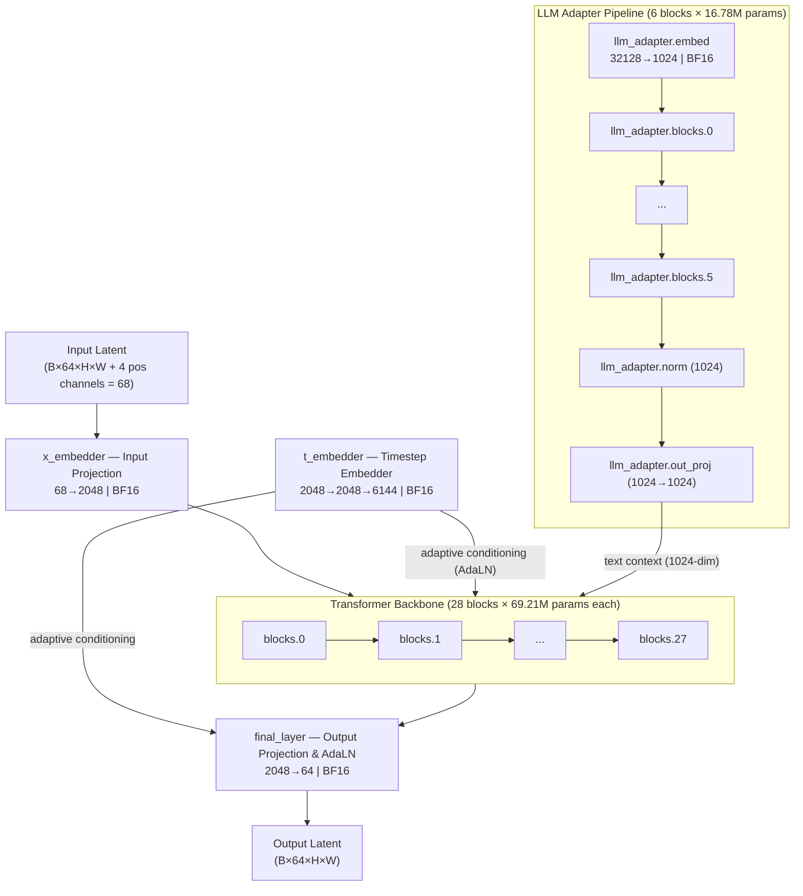
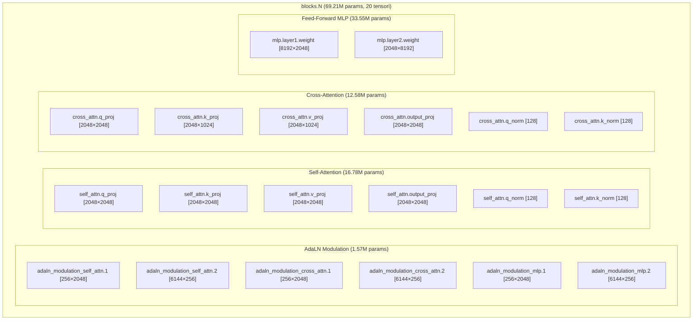

# Anima DiT (Cosmos-Predict2 / Anima Pencil v10) — Full Architectural Decomposition

## Checkpoints di Riferimento

| Checkpoint | Path / Nome File | Precisione | Tensori | Parametri Totali | Prefisso Chiavi | Buffer `sigmas` |
|---|---|:---:|:---:|:---:|:---:|:---:|
| **Anima Base** | `anima_baseV10.safetensors` | **100% BF16** | **685** | **2,091,068,928** | `net.` | Assente (Clean) |
| **Anima v2.0** | `arthemyComicsAnima_v20.safetensors` | **100% F32** | **686** | **2,091,069,928** | `model.diffusion_model.` | Presente (`[1000]`) |

> [!NOTE]
> La topologia interna dei due checkpoint è **perfettamente identica al 100%** su tutte le 685 matrici dei pesi. `arthemyComicsAnima_v20.safetensors` possiede esattamente 1 tensore in più (per un totale di 1.000 parametri in più) dovuto all'inclusione del buffer di runtime `model_sampling.sigmas` generato e serializzato durante un salvataggio da ComfyUI. Inoltre, la versione Base è in precisione nativa **bfloat16** (3.89 GB), mentre la v2.0 è salvata in **float32** (7.79 GB).

---

## Level 0 — Macro Architecture Overview

### Parameter Distribution (Anima Base — Exact & Unapproximated)

| Componente | Parametri Esatti | % del Totale | Conteggio Tensori |
|---|---|---|---|
| **Transformer Backbone** (`blocks.0`–`27`) | 1,937,782,784 | 92.67% | 560 |
| **LLM Adapter Blocks** (`llm_adapter.blocks.0`–`5`) | 100,713,984 | 4.82% | 114 |
| **LLM Adapter Head & Embed** (`embed`, `norm`, `out_proj`) | 33,949,696 | 1.62% | 4 |
| **Time Embedder** (`t_embedder`, `t_embedding_norm`) | 16,779,264 | 0.80% | 3 |
| **Final Layer** (`final_layer.linear`, `adaln_modulation`) | 1,703,936 | 0.08% | 3 |
| **Input Embedder** (`x_embedder.proj.1`) | 139,264 | 0.01% | 1 |
| **TOTALE ANIMA BASE** | **2,091,068,928** | **100.00%** | **685** |

---

## Level 1 — Main Transformer Block Anatomy (×28 identical)

Ogni blocco `blocks.N` contiene esattamente **20 tensori** per complessivi **69,206,528 parametri**:

### Confronto Iperparametri: Anima vs Krea2

| Iperparametro | Anima Base (`anima_baseV10`) | Krea-2 Turbo (`krea2_turbo_bf16`) |
|---|---|---|
| **Architettura Base** | DiT (Cosmos-Predict2) | DiT |
| **Dimensione Nascosta ($d_{model}$)** | 2048 | 6144 |
| **Dimensione Intermedia MLP ($d_{ff}$)** | 8192 (x4.0) | 16384 (SwiGLU, x2.67) |
| **Dimensione Testa Attenzione** | 128 | 128 |
| **Teste Query** | 16 teste | 48 teste |
| **Teste Key/Value** | 16 teste (MHA) | 12 teste (GQA 4:1) |
| **Condizionamento Contesto** | Cross-Attention (dimensione 1024 da LLM Adapter) | txtfusion & txtmlp (modulazione adattiva a 12 scale) |
| **Adattatore Testuale** | 6 blocchi dedicati (`llm_adapter`) | 4 blocchi (`txtfusion`) |
| **Canali Input Latente** | 68 (64 latenti + 4 posizionali) | 64 |
| **Canali Output Latente** | 64 | 64 |
