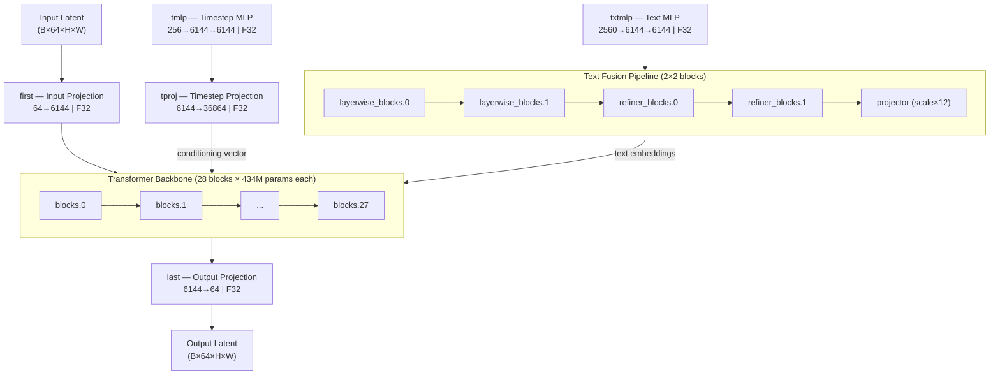
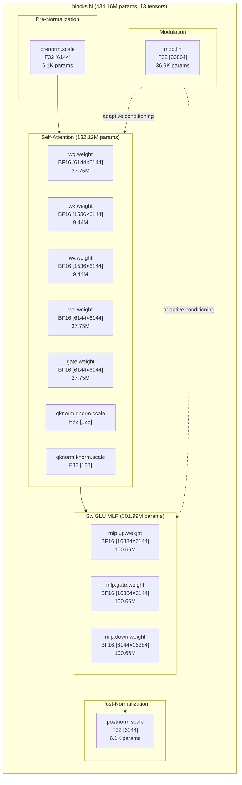

# Krea2 Turbo BF16 — Full Architectural Decomposition

**Model:** [krea2_turbo_bf16.safetensors](file:///C:/StabilityMatrix-win-x64/Data/Models/DiffusionModels/krea2_turbo_bf16.safetensors)  
**Size:** 24.48 GB (26,283,332,608 bytes) | **Tensors:** 430 | **Parameters:** 12.820B  
**Dtype:** 256 × BF16 + 174 × F32 | **Architecture:** DiT (Diffusion Transformer)

---

## Level 0 — Macro Architecture Overview



### Parameter Distribution

| Component | Parameters | % of Total | Tensors | Size (GB) |
|---|---|---|---|---|
| **Transformer Backbone** (blocks.0–27) | 12,156.5M | 94.82% | 364 | 22.60 |
| **tproj** (Timestep Projection) | 226.5M | 1.77% | 2 | 0.84 |
| **txtfusion** (Text Fusion) | 343.4M | 2.68% | 49 | 0.64 |
| **txtmlp** (Text MLP) | 53.5M | 0.42% | 5 | 0.20 |
| **tmlp** (Timestep MLP) | 39.3M | 0.31% | 4 | 0.15 |
| **first** (Input Projection) | 0.4M | <0.01% | 2 | <0.01 |
| **last** (Output Projection) | 0.4M | <0.01% | 4 | <0.01 |
| **TOTAL** | **12,820.1M** | **100%** | **430** | **24.48** |

---

## Level 1 — Transformer Block Anatomy (×28 identical)

Every `blocks.N` contains **13 tensors** totaling **434.16M parameters** (~828 MB):



### Per-Tensor Breakdown (single block)

| Tensor Key | Shape | Dtype | Parameters | Size (MB) | Role |
|---|---|---|---|---|---|
| `attn.wq.weight` | [6144, 6144] | BF16 | 37,748,736 | 72.0 | Q projection (48 heads × 128d) |
| `attn.wk.weight` | [1536, 6144] | BF16 | 9,437,184 | 18.0 | K projection (12 KV heads × 128d) |
| `attn.wv.weight` | [1536, 6144] | BF16 | 9,437,184 | 18.0 | V projection (12 KV heads × 128d) |
| `attn.wo.weight` | [6144, 6144] | BF16 | 37,748,736 | 72.0 | Output projection |
| `attn.gate.weight` | [6144, 6144] | BF16 | 37,748,736 | 72.0 | Gated attention mixing |
| `attn.qknorm.qnorm.scale` | [128] | F32 | 128 | <0.01 | QK-norm (per-head) |
| `attn.qknorm.knorm.scale` | [128] | F32 | 128 | <0.01 | QK-norm (per-head) |
| `mlp.gate.weight` | [16384, 6144] | BF16 | 100,663,296 | 192.0 | SwiGLU gate |
| `mlp.up.weight` | [16384, 6144] | BF16 | 100,663,296 | 192.0 | SwiGLU up-projection |
| `mlp.down.weight` | [6144, 16384] | BF16 | 100,663,296 | 192.0 | Down-projection |
| `mod.lin` | [36864] | F32 | 36,864 | 0.14 | Adaptive modulation (6×6144) |
| `prenorm.scale` | [6144] | F32 | 6,144 | 0.02 | Pre-attention RMSNorm |
| `postnorm.scale` | [6144] | F32 | 6,144 | 0.02 | Pre-MLP RMSNorm |

> [!IMPORTANT]
> **GQA Ratio 4:1** — 48 Query heads share 12 Key/Value heads (groups of 4). This means `wq` and `wo` are 4× larger than `wk`/`wv`. When subdividing attention, KV heads could be treated as a coarser unit than Q heads.

---

## Level 2 — Sub-Block Functional Decomposition

Each block has **4 functionally distinct sub-components** that can be independently tuned:

### 2a. Attention Sub-Component

| Sub-unit | Tensors | Parameters | Weight % of Block |
|---|---|---|---|
| **Q Projection** (`wq`) | 1 | 37.75M | 8.70% |
| **K Projection** (`wk`) | 1 | 9.44M | 2.17% |
| **V Projection** (`wv`) | 1 | 9.44M | 2.17% |
| **Output Projection** (`wo`) | 1 | 37.75M | 8.70% |
| **Gate Projection** (`gate`) | 1 | 37.75M | 8.70% |
| **QK Normalization** (`qknorm`) | 2 | 256 | <0.01% |
| **Attention Total** | **7** | **132.12M** | **30.43%** |

#### Head-Level Subdivision (finest attention granularity)

The Q projection `[6144, 6144]` can be viewed as 48 independent heads of `[128, 6144]` each (3.15M params/head).  
The K/V projections `[1536, 6144]` contain 12 KV-heads of `[128, 6144]` each (0.79M params/head), each shared by 4 Q-heads.

```
wq.weight[6144, 6144] = 48 heads × [128, 6144]  →  head groups 0-3, 4-7, ..., 44-47
wk.weight[1536, 6144] = 12 heads × [128, 6144]  →  KV head 0 serves Q heads 0-3, etc.
wv.weight[1536, 6144] = 12 heads × [128, 6144]  →  same grouping
wo.weight[6144, 6144] = 48 heads × [6144, 128]  →  output per Q-head
gate.weight[6144, 6144] = 48 heads × [6144, 128] →  gate per Q-head
```

### 2b. MLP Sub-Component

| Sub-unit | Tensors | Parameters | Weight % of Block |
|---|---|---|---|
| **Gate Projection** (`mlp.gate`) | 1 | 100.66M | 23.18% |
| **Up Projection** (`mlp.up`) | 1 | 100.66M | 23.18% |
| **Down Projection** (`mlp.down`) | 1 | 100.66M | 23.18% |
| **MLP Total** | **3** | **301.99M** | **69.55%** |

> [!NOTE]
> The MLP dominates each block with ~70% of parameters. The SwiGLU architecture uses gate × up as the input (element-wise multiply after activation), then down-projects. Gate and up are functionally coupled — tuning one without the other may produce misaligned activations.

### 2c. Modulation Sub-Component

| Sub-unit | Tensors | Parameters | Weight % of Block |
|---|---|---|---|
| **mod.lin** | 1 | 36,864 | 0.008% |

The `mod.lin` vector of shape `[36864]` = `6 × 6144` encodes 6 adaptive modulation signals (shift/scale pairs for attention and MLP branches). Despite its tiny parameter count, this is the **timestep conditioning entry-point** for the entire block.

### 2d. Normalization Sub-Component

| Sub-unit | Tensors | Parameters | Weight % of Block |
|---|---|---|---|
| **prenorm.scale** | 1 | 6,144 | 0.001% |
| **postnorm.scale** | 1 | 6,144 | 0.001% |
| **Norm Total** | **2** | **12,288** | **0.003%** |

---

## Level 3 — Text Adapter Pipeline (txtmlp + txtfusion)

### 3a. Text MLP (`txtmlp`) — Text Embedding Projection

Projects Qwen3-VL text embeddings (2560d) into the model's 6144d space:

```
txtmlp.0.scale       F32 [2560]           →  Input RMSNorm
txtmlp.1.weight      F32 [6144, 2560]     →  Linear: 2560 → 6144 (15.73M)
txtmlp.1.bias        F32 [6144]           →  Bias
txtmlp.3.weight      F32 [6144, 6144]     →  Linear: 6144 → 6144 (37.75M)
txtmlp.3.bias        F32 [6144]           →  Bias
```

| Component | Parameters | Size (MB) |
|---|---|---|
| txtmlp.0 (norm) | 2,560 | 0.01 |
| txtmlp.1 (proj up) | 15,734,784 | 60.0 |
| txtmlp.3 (proj refine) | 37,754,880 | 144.0 |
| **Total txtmlp** | **53,492,224** | **204.0** |

### 3b. Text Fusion Blocks (`txtfusion`)

Two parallel stacks of 2 transformer blocks each, operating at 2560d with 6912d MLP:

#### txtfusion.layerwise_blocks (2 blocks × 12 tensors each = 24 tensors)

These blocks process text embeddings **per-layer** (layer-specific text conditioning):

| Block | Tensor | Shape | Dtype | Parameters |
|---|---|---|---|---|
| `layerwise_blocks.0` | `.attn.wq.weight` | [2560, 2560] | BF16 | 6.55M |
| | `.attn.wk.weight` | [2560, 2560] | BF16 | 6.55M |
| | `.attn.wv.weight` | [2560, 2560] | BF16 | 6.55M |
| | `.attn.wo.weight` | [2560, 2560] | BF16 | 6.55M |
| | `.attn.gate.weight` | [2560, 2560] | BF16 | 6.55M |
| | `.attn.qknorm.qnorm.scale` | [128] | F32 | 128 |
| | `.attn.qknorm.knorm.scale` | [128] | F32 | 128 |
| | `.mlp.gate.weight` | [6912, 2560] | BF16 | 17.69M |
| | `.mlp.up.weight` | [6912, 2560] | BF16 | 17.69M |
| | `.mlp.down.weight` | [2560, 6912] | BF16 | 17.69M |
| | `.prenorm.scale` | [2560] | F32 | 2,560 |
| | `.postnorm.scale` | [2560] | F32 | 2,560 |
| **Per-block total** | | | | **85.86M** |
| `layerwise_blocks.1` | *(identical structure)* | | | **85.86M** |

#### txtfusion.refiner_blocks (2 blocks × 12 tensors each = 24 tensors)

Structurally identical to layerwise_blocks. These **refine** the fused text representation:

| Block | Parameters |
|---|---|
| `refiner_blocks.0` | 85.86M |
| `refiner_blocks.1` | 85.86M |

#### txtfusion.projector

| Tensor | Shape | Dtype | Parameters |
|---|---|---|---|
| `txtfusion.projector.scale` | [12] | F32 | 12 |

A tiny learnable scale vector (12 values), likely one per GQA KV-head position, applied to the final fused text output.

> [!NOTE]
> The txtfusion blocks have the **same internal structure** as the main backbone blocks (attn + SwiGLU MLP + norms) but operate at a smaller dimension (2560 vs 6144) and use **full attention** (no GQA — all projections are [2560×2560]).

---

## Level 4 — Peripheral Modules

### 4a. Timestep MLP (`tmlp`)

Converts the scalar timestep embedding (256d) into a 6144d conditioning vector:

| Tensor | Shape | Dtype | Parameters | Function |
|---|---|---|---|---|
| `tmlp.0.weight` | [6144, 256] | F32 | 1,572,864 | Linear 256→6144 |
| `tmlp.0.bias` | [6144] | F32 | 6,144 | Bias |
| `tmlp.2.weight` | [6144, 6144] | F32 | 37,748,736 | Linear 6144→6144 |
| `tmlp.2.bias` | [6144] | F32 | 6,144 | Bias |
| **Total** | | | **39,333,888** | |

### 4b. Timestep Projection (`tproj`)

Projects the 6144d timestep vector into the full conditioning vector for all blocks:

| Tensor | Shape | Dtype | Parameters | Function |
|---|---|---|---|---|
| `tproj.1.weight` | [36864, 6144] | F32 | 226,492,416 | Linear 6144→36864 |
| `tproj.1.bias` | [36864] | F32 | 36,864 | Bias |
| **Total** | | | **226,529,280** | |

> [!IMPORTANT]
> **tproj output [36864]** = 6 × 6144 = exactly the `mod.lin` dimension of each block. This is the **global timestep conditioning vector** that gets broadcast to every block's modulation unit. This is a critical control surface for timestep-dependent behavior.

### 4c. Input Projection (`first`)

| Tensor | Shape | Dtype | Parameters |
|---|---|---|---|
| `first.weight` | [6144, 64] | F32 | 393,216 |
| `first.bias` | [6144] | F32 | 6,144 |

Patchifies and projects the latent input (64 channels) into the model's hidden dimension (6144).

### 4d. Output Projection (`last`)

| Tensor | Shape | Dtype | Parameters |
|---|---|---|---|
| `last.linear.weight` | [64, 6144] | F32 | 393,216 |
| `last.linear.bias` | [64] | F32 | 64 |
| `last.modulation.lin` | [2, 6144] | F32 | 12,288 |
| `last.norm.scale` | [6144] | F32 | 6,144 |

The final layer has its own modulation (2 values × 6144 = shift+scale for the final norm), plus a final norm and linear projection back to 64 channels.

---

## Level 5 — Proposed Subdivision Strategies

### Strategy A: Current Tuner Granularity (9 groups)

This is what the current `ArthemyKrea2ModelTuner` uses:

| Group | Blocks | Params | % |
|---|---|---|---|
| Layout_Geometry | 0–4 | 2,170.8M | 16.93% |
| Global_Composition | 5–9 | 2,170.8M | 16.93% |
| Subject_Identity | 10–14 | 2,170.8M | 16.93% |
| Material_Substance | 15–19 | 2,170.8M | 16.93% |
| Art_Style_Medium | 20–23 | 1,736.6M | 13.55% |
| Lighting_Sharpness | 24–27 | 1,736.6M | 13.55% |
| TEXT_FUSION | txtfusion + txtmlp | 396.9M | 3.10% |
| TIME_EMBED | tmlp + tproj | 265.9M | 2.07% |
| PROJ_BLOCKS | first + last | 0.8M | <0.01% |

### Strategy B: Sub-Block Level (attn/mlp/mod per block = 84 controls)

For each of the 28 blocks, separate sliders for:
- `blocks.N.attn` (132.12M) — attention
- `blocks.N.mlp` (301.99M) — MLP feed-forward
- `blocks.N.mod` (36.9K) — adaptive conditioning

This triples control resolution with 28×3 = **84 controls** + peripherals.

### Strategy C: Per-Block (28 + peripherals = 37 controls)

One slider per block, with separate controls for:
- 28 × `blocks.N` (full block)
- `txtfusion.layerwise_blocks.0`, `.1`
- `txtfusion.refiner_blocks.0`, `.1`
- `txtfusion.projector`
- `txtmlp`
- `tmlp`
- `tproj`
- `first` + `last`

= **37 total controls**

### Strategy D: Functional Role (attention/MLP/mod × block zones)

Group by function across all blocks:

| Zone × Function | Blocks | Controls |
|---|---|---|
| Early Attention | 0–6 | 1 |
| Early MLP | 0–6 | 1 |
| Mid Attention | 7–13 | 1 |
| Mid MLP | 7–13 | 1 |
| Mid-Late Attention | 14–20 | 1 |
| Mid-Late MLP | 14–20 | 1 |
| Late Attention | 21–27 | 1 |
| Late MLP | 21–27 | 1 |
| All Modulation | 0–27 | 1 |
| All Norms | 0–27 | 1 |
| txtfusion (all) | — | 1 |
| txtmlp | — | 1 |
| tmlp+tproj | — | 1 |
| first+last | — | 1 |

= **14 controls** (high-level semantic grouping)

### Strategy E: Hybrid (recommended for maximum flexibility)

Combine per-block sliders with sub-component overrides via `granular_json`:

```json
{
  "blocks.0.attn": 0.9,
  "blocks.0.mlp": 1.1,
  "blocks.14.attn": 0.85,
  "blocks.14.mlp": 1.05,
  "txtfusion.layerwise_blocks.0": 0.95,
  "txtfusion.refiner_blocks.1.mlp": 1.1
}
```

This keeps the UI manageable (9–28 sliders) while allowing surgical per-sub-block targeting when needed.

---

## Appendix — Complete Tensor Key Map

### Block Template (N = 0..27)
```
blocks.N.prenorm.scale               F32 [6144]         Normalization
blocks.N.attn.wq.weight              BF16 [6144, 6144]  Q Projection
blocks.N.attn.wk.weight              BF16 [1536, 6144]  K Projection  
blocks.N.attn.wv.weight              BF16 [1536, 6144]  V Projection
blocks.N.attn.wo.weight              BF16 [6144, 6144]  Output Projection
blocks.N.attn.gate.weight            BF16 [6144, 6144]  Gate Projection
blocks.N.attn.qknorm.qnorm.scale    F32 [128]          QK-Norm Q
blocks.N.attn.qknorm.knorm.scale    F32 [128]          QK-Norm K
blocks.N.mlp.gate.weight             BF16 [16384, 6144] SwiGLU Gate
blocks.N.mlp.up.weight               BF16 [16384, 6144] SwiGLU Up
blocks.N.mlp.down.weight             BF16 [6144, 16384] Down Projection
blocks.N.mod.lin                     F32 [36864]        Modulation (6×6144)
blocks.N.postnorm.scale              F32 [6144]         Normalization
```

### Text Fusion Template (M = 0..1)
```
txtfusion.layerwise_blocks.M.attn.{wq,wk,wv,wo,gate}.weight   BF16 [2560, 2560]
txtfusion.layerwise_blocks.M.attn.qknorm.{q,k}norm.scale      F32 [128]
txtfusion.layerwise_blocks.M.mlp.{gate,up}.weight              BF16 [6912, 2560]
txtfusion.layerwise_blocks.M.mlp.down.weight                   BF16 [2560, 6912]
txtfusion.layerwise_blocks.M.{pre,post}norm.scale              F32 [2560]

txtfusion.refiner_blocks.M.attn.{wq,wk,wv,wo,gate}.weight     BF16 [2560, 2560]
txtfusion.refiner_blocks.M.attn.qknorm.{q,k}norm.scale        F32 [128]
txtfusion.refiner_blocks.M.mlp.{gate,up}.weight                BF16 [6912, 2560]
txtfusion.refiner_blocks.M.mlp.down.weight                     BF16 [2560, 6912]
txtfusion.refiner_blocks.M.{pre,post}norm.scale                F32 [2560]

txtfusion.projector.scale                                       F32 [12]
```

### Peripherals
```
first.weight         F32 [6144, 64]      Input projection
first.bias           F32 [6144]          Input bias
last.linear.weight   F32 [64, 6144]      Output projection
last.linear.bias     F32 [64]            Output bias  
last.modulation.lin  F32 [2, 6144]       Final modulation
last.norm.scale      F32 [6144]          Final normalization
tmlp.0.weight        F32 [6144, 256]     Timestep in
tmlp.0.bias          F32 [6144]          Timestep bias
tmlp.2.weight        F32 [6144, 6144]    Timestep refine
tmlp.2.bias          F32 [6144]          Timestep bias
tproj.1.weight       F32 [36864, 6144]   Timestep→modulation
tproj.1.bias         F32 [36864]         Timestep→modulation bias
txtmlp.0.scale       F32 [2560]          Text input norm
txtmlp.1.weight      F32 [6144, 2560]    Text projection
txtmlp.1.bias        F32 [6144]          Text bias
txtmlp.3.weight      F32 [6144, 6144]    Text refinement
txtmlp.3.bias        F32 [6144]          Text bias
```
