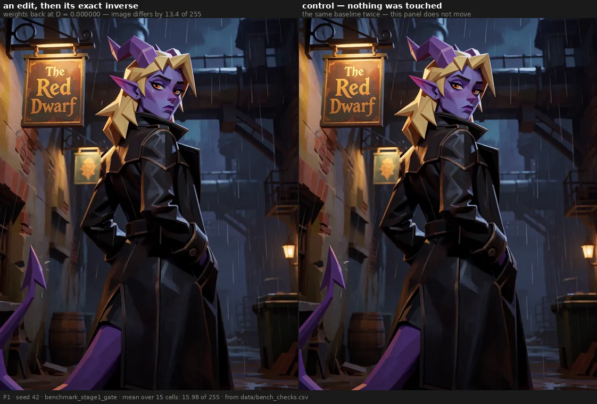
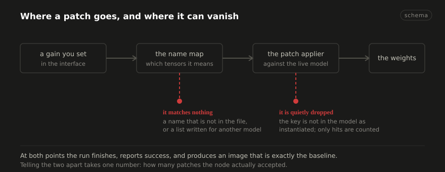
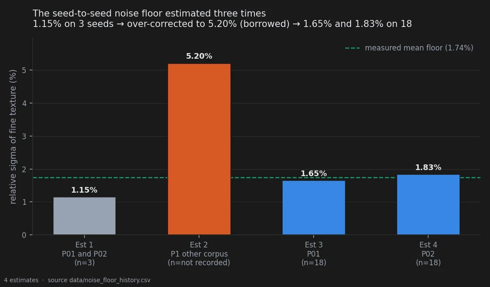

# Is the instrument lying to me?

> **Holds** · 427 renders · 5 prompts · verification, not an experiment
> [← all experiments](../README.md#what-holds-and-what-does-not)

> **The direction I'm chasing.** Nothing on any other page is worth reading if this one is
> wrong. Every result in this notebook is a difference between two pictures, which means every
> result inherits whatever the machine does while I am touching nothing at all. I want that
> number before I quote any other.
>
> **What would kill it.** A tuner that is not a no-op at zero, or a pipeline that renders
> differently after a restart. Either one contaminates the treatment and the control by the
> same invisible amount, so no comparison I could run would ever reveal it.
>
> **Where we are.** The instrument holds, and it holds bit-for-bit. What I had not expected is
> that two of the floors it establishes are stricter than the ones I had been using, and one of
> them killed a result I had already written up.

## In two minutes

Everything else in this notebook is a difference between two pictures. I change some weights,
I render again, I measure how far the image moved. That only means something if the *rest* of
the machine holds still — if the same settings give the same picture today and next month, if
my own tool does nothing when I ask it to do nothing, and if I know how much two identical
runs differ when I have not touched anything at all.

None of that is interesting. All of it is load-bearing. So this page is the boring one, and it
is the one to read first if you are inclined to disbelieve the rest.

Four things are checked here, and one is admitted as still unknown.

**The tool does nothing when set to nothing.** My tuner reads all 1059 tensors, multiplies each
by a number, and writes them back. Set every number to zero and it should be a no-op — but
"should" is not "does": the weights are stored in one precision and the maths happens in
another, and a round trip can quietly lose something. If it did, every effect size I have ever
reported would be inflated by the same invisible amount, in the treatment *and* in the
controls, so no comparison would ever reveal it. Checked: identical. Not similar — identical,
every channel of every pixel, on fifteen cells.

**The same render, twice, weeks apart.** One benchmark was generated in the evening and
compared against baselines from a different day, with a restart in between. If the pipeline
drifts across sessions, that comparison silently contains the drift. Re-rendered and compared:
zero difference.

**An edit, then its exact inverse.** The weights come back to exactly where they started. The
image does not. That is not a bug — it is rounding, and it sets a floor: any effect smaller
than "do and undo" is indistinguishable from having done nothing. It is a stricter floor than
the one I had been using, and it kills one result outright.

**Four knobs that turn out not to be connected.** One of them I can prove is inert, because a
sibling knob in the same run moves the image at every dose. Two of the others I cannot yet
explain, and the honest status for those is *unknown*, not *negligible*.



And one thing worth knowing about how this page came to exist: the number that calibrates
nearly every threshold in this notebook — how much fine texture varies between two renders
that differ only by their random seed — was wrong twice in one day before it was measured
properly. That story is below, because a reader deserves to see how the sausage is made.

## The verdict

The instrument holds. The tuner is bit-exact identity at gain zero, on 15 cells across three
prompts. The pipeline reproduces a render exactly across a restart. The seed-to-seed floor of
fine texture is 1.65% on P01 and 1.83% on P02, measured on 18 baseline seeds each and
reproduced from the renders by `experiments/measure_noise_floor.py`.

Two findings here are stricter than expected and constrain the rest of the notebook. The
round-trip sentinel sets a floor above the seed floor: weights returned to D = 0 do not return
the image, by a mean of 16 of 255. And a change of seed leaves two baselines correlated at only
0.50 — which is a *ceiling* on how far any edit can usefully be pushed, not a noise floor, and
the difference between those two readings has already cost this project one retracted analysis.

One arm is proven inert with a live sibling beside it. Two more are inert for reasons nobody
has established.

## Why I might be wrong

**These checks are not pre-registered, and they do not need to be — but that is a claim in
itself.** Each one has a criterion fixed before its value was looked at, and a pass or fail.
That makes them verification rather than hypothesis tests. If you think a criterion was chosen
after seeing the number, the criteria are in the `criterion` column of the measurement file and
the script that wrote them is in the provenance.

**Bit-exact identity was checked on this checkpoint, at this precision.** It is a property of
the dtype round trip, so it has to be re-checked on any other architecture. On Anima it has not
been.

**The noise floor is two prompts.** P01 and P02 have 18 baseline seeds each; three other prompts
measured on a different bench came out two to three times noisier. Any threshold derived from
1.65% applies to the corpus it was measured on, and not automatically anywhere else.

**Two of the four dead arms are unverified here.** The claim that they produce no change comes
from an earlier session's inspection of the latents, not from this page's measurement file. They
are listed as open for that reason.

## The data

### How it was measured

Every row is a comparison between two renders with everything held fixed except the one thing
being tested, and every row carries the criterion it was judged against. The measurements are in
[`data/bench_checks.csv`](../data/bench_checks.csv); nothing on this page is typed by hand.

Fine texture is `std(gray − GaussianBlur(gray, σ=1.5))`. Differences between renders are
reported either as the maximum channel difference, where the question is *identical or not*, or
as an RMS or mean over all channels, where the question is *how much*.

### The numbers

| check | criterion, fixed first | measured | |
|---|---|--:|---|
| tuner present, all gains at zero | max difference == 0 | **0** | pass |
| re-render across a restart | max difference == 0 | **0** | pass |
| edit followed by its exact inverse | > 0 — the image does *not* return | **15.98** | pass |
| `clipLULT` at five doses | == 0 at every dose | **0.0** | pass |
| `clipL1` at five doses *(positive control)* | > 0 at every dose | **23.5 → 34.0** | pass |
| `clipL1` rising with dose | each dose ≥ the one below | **23.5 → 27.5 → 26.1 → 33.1 → 34.0** | **fail** |
| noise floor, P01 | measured on ≥ 18 seeds | **1.65%** | pass |
| noise floor, P02 | measured on ≥ 18 seeds | **1.83%** | pass |
| two baselines, different seeds | reported, never used as a floor | **r = 0.50** | measured |

#### The node adds nothing of its own

Fifteen cells — three prompts by five seeds — with the tuner in the graph and every gain at
zero, against the same render with the node absent. Maximum channel difference: **zero**. Not a
mean of zero, a maximum: no pixel differs anywhere.

This is the least interesting result on the page and probably the most important one. Without
it, every displacement reported anywhere in this notebook could carry a constant offset that
cancels in every contrast and inflates every effect size, and nothing would ever show it.

#### The same render twice, weeks apart

`benchmark_profondita` was generated on one evening using baselines rendered on another, with at
least one restart in between. If anything drifts between sessions, that comparison contains the
drift and no test would notice. Re-rendered today: **maximum channel difference 0**.

A note on the check itself, because the first attempt failed for the wrong reason. The
specification asked for the SHA-256 of the file. A PNG carries its generation graph in a text
chunk, and the new script writes a different graph, so the file hashes differ while every pixel
matches. The correct comparison is on the decoded pixels or the compressed image stream. That
was an error in how the task was written, not in the data.

#### The edit that undoes itself, and does not

The round-trip sentinel applies an edit and then its exact inverse. The weights return to
exactly where they started — measured Frobenius displacement **D = 0.0000**. The image does
not: mean channel difference **15.98 of 255**, across fifteen cells.

Nothing is broken. It is rounding on the way there and back. But it sets a floor, and the floor
has teeth: scaling one block group at ±0.50 sits at 0.0259 in perceptual distance against a
round-trip floor of 0.0232, which is **not distinguishable from having done nothing and then
undone it**. That result is withdrawn on this page rather than defended.



#### Four arms that do nothing, and one that proves the test works

One text-encoder arm, `clipLULT`, is **exactly** inert: RMS difference from the baseline of
**0.0** at all five doses, from 0.005 to 0.200. Not small. Zero.

A claim of exact inertness is worthless on its own, because a broken comparison also returns
zero. So the sibling arm in the same run, at the same doses, against the same baseline, sits in
the row beneath it: `clipL1` moves the image by 23.5 to 34.0 RMS. The comparison can fail, and
on that arm it does. That is the difference between a control and a decoration.

One correction falls out of putting all five doses in a file. Earlier write-ups describe
`clipL1` as rising monotonically with dose and quote the two ends, 23.5 and 34.0. With the
middle three present it is **23.5 → 27.5 → 26.1 → 33.1 → 34.0**, which rises overall and is not
monotone. It does not affect the arm's role as a positive control; it does mean the word
*monotone* has to go.

#### The floor that moved twice before it was measured

Nearly every threshold in this notebook is expressed as a multiple of how much fine texture
varies between two renders that differ only by their seed. That number has a history:

| | estimate | on what |
|---|--:|---|
| first | 1.15% | 3 seeds |
| second | 5.2% | borrowed from three different prompts, which are genuinely noisier |
| measured | **1.65%** (P01), **1.83%** (P02) | 18 seeds each, 153 pairs each |



The first was unreliable: a standard deviation on three samples has two degrees of freedom and
can be wrong by a factor of two or three. The correction then over-shot in the other direction
by importing a figure from prompts that behave differently. In between, conclusions sitting at
eleven to fourteen times the noise were briefly written up as fragile.

The rule that came out of it is worth more than the number, because it is what kept the
conclusions standing while the floor moved twice:

> **A test of sign coherence is the primary instrument; an amplitude threshold is the trim.**
> A sign test does not depend on σ at all, so it survives a floor that turns out to be wrong.

#### What is still unknown

Two further arms — the modulation weights and the block norms — produce latents reported as
bit-identical to the baseline at every dose, including one far beyond the usable range. Unlike
`clipLULT`, there is no architectural reason for it: the tensors exist in every block and are in
the active path. Scaling them *must* change the output, and it does not, which means the patch
is not arriving.

Worse, the tuner's own source carries a comment asserting that this checkpoint has no such
tensor, and the entry was deleted from the map on that basis. The symptom was observed correctly
and the diagnosis was inverted: *the patch is not arriving* became *the target does not exist*.

This page does not measure those two arms — the claim above comes from an earlier inspection of
the latents, not from `bench_checks.csv` — so they are recorded as **open**. The diagnosis is
cheap: one run that prints how many patches the node actually accepted. Zero means the selector
matches nothing; four means it matches and the patch is dropped further down.

### The controls

The positive control for the dead-arm claim is `clipL1`, described above, in the same run at the
same doses.

The control for every fixed-seed comparison on this page is that at a fixed seed the null is
**exactly zero** — established by the first check on the page, not assumed. A baseline at a
*different* seed is not that control: two baselines at different seeds correlate at only 0.50,
which makes a seed change a maximal perturbation rather than a noise floor. Using one as the
other is what cost this project a retracted spatial analysis, and it is the reason the
decorrelation figure appears here as a ceiling and nowhere as a floor.

### Reproducing this

```yaml
model:
  checkpoint: krea2_turbo_bf16.safetensors
  weight_dtype: default
  sha256: not recorded — the file is outside the repository; see the note below
sampling:
  sampler: euler_ancestral
  steps: 9
  cfg: 1.0
  denoise: 1.0
  scheduler: simple
  resolution: 1024x1280
  vae: qwen_image_vae.safetensors
tuner:
  node: ArthemyKrea2ModelTuner
  version: not recorded — the tuner is a separate repository
  mode: varies by condition; every render carries its own graph in a tEXt chunk
prompts:
  file: data/prompts.json
  ids: [P01, P02, P1, P2, P3]
seeds: [42, 777, 1337, 9999, 4242145]
conditions:
  - name: sentinel_zero
    dose: 0.000
    measured_D: 0.000000
  - name: sentinel_roundtrip
    dose: "edit then its exact inverse"
    measured_D: 0.000000
  - name: clipLULT_pos
    dose: 0.005 / 0.020 / 0.050 / 0.120 / 0.200
    measured_D: not applicable — a text-encoder gain, not a backbone displacement
  - name: clipL1_pos
    dose: 0.005 / 0.020 / 0.050 / 0.120 / 0.200
    measured_D: not applicable — a text-encoder gain, not a backbone displacement
outputs:
  folder: benchmark_stage1_gate, benchmark_determinismo, benchmark_testo_pilota,
    benchmark_pavimento_rumore, benchmark_latenti_b6
  manifest: none -- data/bench_checks.csv is a ledger of checks (11 rows, one per check),
    not a per-render manifest. No file in the repository lists these 423 renders.
analysis:
  script: experiments/measure_bench.py
  sha256: bd53f6a7f85784bafd4a8741d2d166cdc5dbc604951cc324571a4d9fd145be11
  produces: data/bench_checks.csv
  note: >
    UNTIL 2026-09-21 this field claimed that every value above had been read back out of the
    renders by experiments/extract_repro.py, and that the script asserted one sampler
    configuration across the four benches. That script did not exist, so neither did the
    verification. The block was typed by hand. experiments/extract_repro.py exists as of
    2026-09-21 and reads data/, not the renders; for this page it can prove nothing, because
    no file here records these benches image by image. Every field above is unverified.

    AS OF 2026-09-23 there are two exceptions and one new problem. The exceptions are the
    two noise_floor rows: experiments/measure_noise_floor.py reads the 38 baseline renders
    of benchmark_latenti_b6 and benchmark_pavimento_rumore, records them image by image in
    data/noise_floor_hf_by_render.csv with their resolution and sha256, and reproduces the
    published floor from the pixels -- 1.6468% on P01 and 1.8313% on P02. That file is now
    what extract_repro.py reads for this page, so the resolution field above is proven for
    38 of the 427 renders. The problem is the script field itself: experiments/measure_bench.py
    is not in the repository, so the sha256 beside it is the hash of a file nobody can
    produce, and the other nine rows of data/bench_checks.csv are still hand-typed with no
    code behind them.
```

## Provenance

* Measurement files: [`data/bench_checks.csv`](../data/bench_checks.csv) — one row per check, each with the criterion it was judged against; [`data/noise_floor_measured.csv`](../data/noise_floor_measured.csv) and [`data/noise_floor_hf_by_render.csv`](../data/noise_floor_hf_by_render.csv) — the floor, and the 38 renders it was measured on
* Scripts: `experiments/measure_noise_floor.py` (the two noise-floor rows); `experiments/measure_bench.py` is named for the other nine and is not in the repository
* Renders: `benchmark_stage1_gate` (360, sentinels and the norm-matched bench), `benchmark_determinismo` (1), `benchmark_testo_pilota` (30), `benchmark_pavimento_rumore` (32, sixteen of the eighteen floor seeds), `benchmark_latenti_b6` (4, the last two floor seeds on both prompts)
* Pitfalls that apply: 4 and 5 (a sentinel below the precision of the format, and an acceptance criterion mismatched to it), 10 (round-trip composition), 13 (a tolerance that returns its best candidate instead of failing), 15 (a gate that tallies misses and proceeds), 54 (assuming the node is a no-op instead of measuring it), 55 (a seed change used as a noise floor), 62 (a threshold calibrated on three seeds)
