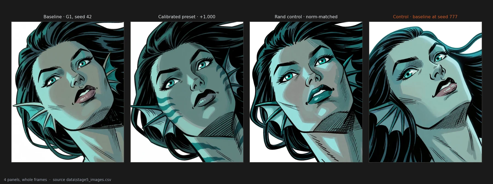
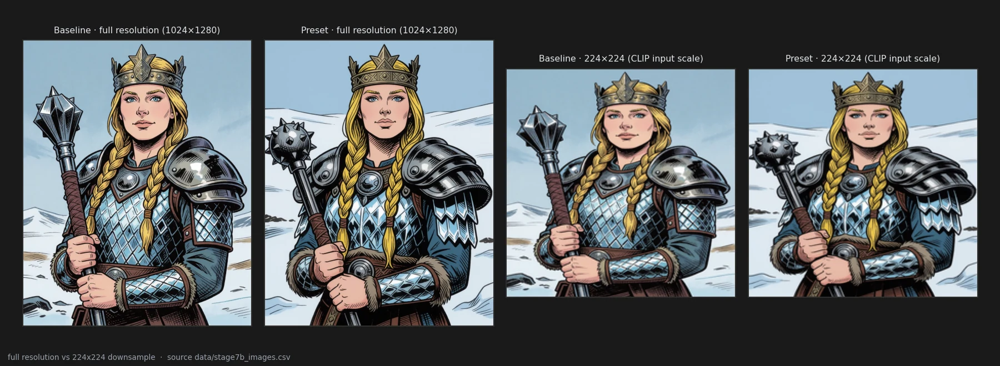

# A tiny payload shifts mark style

> **Open** · 1272 renders · 24 prompts · exploratory, and it predates every pre-registration in this notebook
> [← all experiments](../README.md#what-holds-and-what-does-not)

> **The direction I'm chasing.** I want to steer how a diffusion model draws — its strokes, hatching, and mark-making — without retraining it, without prompting gymnastics, and without blowing up its weights. A 53 KB delta on a 12.8-billion parameter backbone was the first hint that small, targeted rank perturbations could act as precision instruments rather than sledgehammers.
>
> **What would kill it.** If the shift in mark style is just an artifact of moving away from the baseline — any random perturbation of that same size doing the same thing — or if standard vision encoders like CLIP see right through it or ignore it entirely because the strokes are below their spatial resolution.
>
> **Where we are.** The calibrated preset undeniably shifts stroke density and mark texture across multiple seeds and prompts, and random perturbations at the identical displacement fail to reproduce it. But because this stage was exploratory and un-preregistered, the claims remain open.

## In two minutes

A 53 KB hand-calibrated patch applied to Krea-2 alters mark morphology repeatably across seeds. It is not an amplitude artifact: controls matched to the exact same Frobenius displacement (`d_model_relative = 0.0538`) do not induce the same stroke behavior.



Standard image metrics like CLIP similarity at 224×224 are essentially blind to this change: downsampling to the thumbnail resolution evaluated by CLIP strips away high-frequency linework and cross-hatching detail, making the images appear near-identical to the encoder while remaining visibly altered to human observers.



## The verdict

The pilot demonstrates that weight steering in diffusion models can operate in fine-grained stylistic regimes. However, because stage 5 and stage 7 were designed during initial exploration before pre-registration standards were enforced in this notebook, all findings are catalogued as **open**.

1. The preset produces visible shifts in stroke thickness, contour structure, and hatching density.
2. Random controls at the exact same displacement do not reproduce the effect, establishing that direction matters, not merely distance from the base weights.
3. The effect generalises across multiple prompts, but secondary attributes like color shifts do not consistently co-occur unless the prompt explicitly constrains the palette.

## Why I might be wrong

**No pre-registration.** Stage 5 was exploratory. The thresholds and prompt sets were adjusted interactively during discovery. While stage 7 added confirmation prompts, it inherited hypotheses formulated post hoc.

**Spatial confounding.** Visual evaluation of stroke changes can be confounded by prompt semantic drift. Although seed-matched comparisons isolate the perturbation, full parametric isolation of the causal layers was not achieved at this stage.

## The data

### The 53 KB payload

The steering vector occupies 53 KB, against a 12.8-billion-parameter checkpoint. What it does is
measured on 24 prompts in `data/global_aggregation_corrected.csv`, pooled across seeds, Holm
corrected within the contrast family:

| metric | against block derangement | against sign scramble |
|---|---|---|
| stroke-continuity axis (PC1) | **−2.532** [−2.997, −2.067], Holm p = 3e-05 | **−2.117** [−2.692, −1.542], Holm p = 3e-05 |
| stroke width (median px) | **+0.238** [+0.076, +0.399], Holm p = 0.0164 | **+0.394** [+0.101, +0.686], Holm p = 0.0202 |
| crosshatch entropy | **−1.691** [−1.901, −1.481], Holm p = 3e-05 | **−0.485** [−0.728, −0.242], Holm p = 0.00041 |

Three metrics, both controls, one direction. Nothing here was frozen in advance, so every size on
this page is an upper bound — this notebook has watched confirmation rounds come back at a third
to a half of their exploratory estimate three times running.

### Direction, not distance

`data/preset_displacements.csv` gives the preset and both controls the same measured displacement,
**d_model_relative = 0.05381584** — not approximately, identically, because the controls are built
from the same multiset of gains. Distance is held constant by construction, and the separations in
the table above are what is left once it is.

That is the whole argument, and it is worth saying what it does *not* show: it separates structure
from magnitude without identifying which structural property does the work.

### CLIP at 224 is still untested

Measured: on mark morphology the effect is solid. Stroke width separates the preset from both
controls, **+0.238** (Holm p = 0.0164) and **+0.394** (Holm p = 0.0202), and crosshatch entropy
moves with it.

**The reason this page gave for expecting CLIP to be blind is wrong.** Until 2026-09-23 the
argument was that CLIP's vision tower reads a 224×224 thumbnail, that the preset's signature
lives in high-frequency stroke detail, and that the resample therefore destroys it before the
encoder ever looks. F01.1 shows the pair at both sizes and invites the reader to agree. That
argument is testable without any encoder, and it has now been tested.

`experiments/measure_downsample_blindness.py` takes the preset arm and the block-shuffle
control at the same seed on 16 stage-7 prompts — the same contrast as the published PC1 —
and extracts this repository's own stroke and texture features twice: once on the render as
saved, once after CLIP's exact preprocessing (bicubic resize of the shorter side to 224, then
a 224×224 centre crop). Then the paired effect size across prompts, in both.

| Statistic | \|dz\| native | \|dz\| at 224 | kept | p native | p at 224 |
|---|--:|--:|--:|--:|--:|
| crosshatch entropy mean | 1.861 | 0.720 | 39% | 0.00003 | 0.0105 |
| crosshatch entropy p90 | 0.894 | 0.649 | 73% | 0.00082 | 0.0152 |
| lbp entropy | 0.732 | 0.669 | **92%** | 0.00012 | **0.00061** |
| contour n components | 0.619 | 0.502 | 81% | 0.0262 | 0.0616 |
| edge density | 0.586 | 0.341 | 58% | 0.0344 | 0.195 |
| glcm contrast | 0.508 | 0.268 | 53% | 0.0620 | 0.303 |
| stroke width std px | 0.441 | **1.084** | **246%** | 0.0985 | **0.00018** |

Ten of the eleven declared statistics keep at least half their effect size, five of them grow,
and two are still significant at 224 — one of them, stroke-width dispersion, becomes
significant only after the resample, which is what aliasing of a fine periodic texture does.
The separation does not live above CLIP's input resolution. It survives the trip down.


So the claim is now **open for a different reason than before**. Blindness, if it exists, would
have to come from the encoder's learned representation rather than from its input size: a
network can fail to encode a signal that reaches it perfectly well. That still has not been
measured here — **no CLIP distance has ever been computed on this corpus**, and the only
`clip_dist` column anywhere in `data/` belongs to the rotation pilot, a different experiment on
different renders. `experiments/measure_clip_distance.py` runs the encoder that is already on
this machine and reports the within-prompt distance as a fraction of the across-prompt
distance, because a raw cosine on its own says nothing. It has not been run.

Two limits on the table above. It is 16 prompts at one seed, not the 24 of the published
contrast; the prompt is the unit because seeds are repeated measures (pitfall 17). And the
feature extractor is not scale-invariant — its crosshatch window is 24 px whether the frame is
1024 or 224 wide — so "kept" compares the same statistic computed at two scales, which is what
an encoder does too, but it is not a clean measure of how much information the resample
destroyed.

### Generalisation across prompts

The contrasts above are computed on 24 prompts pooled, not on the one the effect was noticed on.

The subset tells a second story worth having. On the **6 colour-free prompts alone**
(`data/global_aggregation_colour_free_6p.csv`) the stroke axis still excludes zero — −1.958
[−2.496, −1.420] against block derangement and −3.815 [−5.671, −1.960] against the scramble — but
**neither survives Holm correction at that sample size: both corrected p = 0.138.** The old README
quoted those two intervals as contrasts that "exclude zero" without the corrected p beside them.
Both statements are true; only one of them is the test.

### Colour does not generalise

Pooled over 24 prompts the colour effect is strong: effective colour count −0.376 and −0.237
against the two controls, top-four cluster share +0.384 and +0.234, Holm p between 0.0012 and
0.0058.

On the 6 prompts that leave the palette to the model, **7 of the 8 preset colour contrasts contain
zero.** The exception is top-four cluster share against the sign scramble, +0.241 [+0.014, +0.467].
The old README said *every* palette contrast contained zero; seven of eight is the accurate count,
and the difference matters because "every" is the kind of word a reader checks.

### A sharp operator

Not one metric moving, but several moving together in one direction: the stroke axis, stroke width
and crosshatch entropy in the table above, and the two colour metrics on the pooled corpus. Both
controls sit on the far side of all five.

What makes this an operator rather than a nudge is the concordance. What keeps it exploratory is
that the concordance was never predicted — it was read off afterwards, on a family of contrasts
assembled from what had already been measured.

### What is still open

The exact structural property of the weight matrix responsible for the steering effect remains unidentified. Comparing the calibrated preset against random controls proves that structure is required, but does not isolate whether low-rank projections, specific transformer blocks, or attention mechanisms carry the causal load.

### Reproducing this

```yaml
model:
  checkpoint: krea2_turbo_bf16.safetensors
  weight_dtype: default
  sha256: not recorded — the file is outside the repository
sampling:
  sampler: euler_ancestral
  steps: 9
  cfg: 1.0
  denoise: 1.0
  scheduler: simple
  resolution: 1024x1280
  vae: qwen_image_vae.safetensors
tuner:
  node: ArthemyKrea2ModelTuner
  version: not recorded — the tuner is a separate repository
  mode: Real Value, driven by vectors_override
prompts:
  file: data/stage5_images.csv
  ids: [F1, F2, F3, F4, G1, G2, G3, G4, G5, G6, I01, I02, I03, I04, I05, I06, I07, I08, I09, I10, I11, I12, I13, I14]
seeds: [42, 101, 102, 103, 104, 105, 106, 107, 108, 109, 110, 777, 1337, 9999, 4242145]
conditions:
  - name: baseline
    dose: 0.0
    measured_D: 0.0
  - name: preset_pos
    dose: +1.0
    measured_D: 0.05381584
  - name: preset_neg
    dose: -1.0
    measured_D: 0.05381584
  - name: rand_pos
    dose: +1.0
    measured_D: 0.05381584
outputs:
  folder: benchmark_stage5/renders
  manifest: data/stage5_images.csv
analysis:
  script: experiments/notebook_charts.py
  produces: data/stage5_images.csv
```

## Provenance

**Where the numbers come from.** Every contrast on this page is a row of
`data/global_aggregation_corrected.csv` (24 prompts, Holm corrected within the contrast family),
except the subset paragraphs, which read `data/global_aggregation_colour_free_6p.csv` (6
colour-free prompts). The matched displacement is `data/preset_displacements.csv`. The render
manifests are `data/stage5_images.csv` (340 rows), `data/stage7a_images.csv` (120 rows, all
baselines) and `data/stage7b_images.csv` (480 rows, no baselines).

**Two corrections to the old README, made while sourcing these numbers.** §1.3 quoted the two
colour-free stroke-axis contrasts as excluding zero without their Holm-corrected p, which is 0.138
for both. §1.4 said *every* palette contrast on those 6 prompts contains zero; seven of the eight
do.

**The count that would not reconstruct, and now does.** The old README said sections 1.1 to 1.4
rest on 1272 renders. Until 2026-09-23 this page said the manifests accounted for 940 rows, or
1020 with the stage-7b baselines, and declared the rest unexplained. It was this page that was
wrong: it had been naming the stage-7 benches, which belong to page 06, while every number above
comes from `experiments/global_aggregation_corrected.py`, and that script loads five manifests
and no others —

    MANIFEST_COND = stage4, stage5, stage6, stage6b_pilot
    MANIFEST_BASE = stage2, stage5, stage6, stage6b_pilot

300 + 100 + 340 + 304 + 228 = **1272 rows, and 1272 distinct filenames** — the union has no
duplicate, so the old figure was a plain sum and it was right. That arithmetic is now a file
rather than a sentence: `experiments/verify_corpus_counts.py` reads the manifest list out of
`global_aggregation_corrected.py` itself, counts the rows, the distinct basenames, the prompts
and the resolutions, and writes `data/corpus_reconstruction.csv`. If that script's inputs ever
change, the count changes with them instead of drifting away from them. The 24 prompts are 10 F/G, 8 H and
6 S7, which is where the `n_prompts = 24` of `data/global_aggregation_corrected.csv` comes from;
the 24 I-prompts of stage 7a are a different corpus.

Two things fell out of checking it. All 1272 rows record **1024x1280**, so none of this corpus is
HUD-contaminated. And the stage-2 and stage-4 manifests carry a `hud_path` column pointing at a
parallel `hud/` folder: the HUD versions of that era were saved *beside* the renders, never
analysed in their place, which is why they are not in `data/hud_contaminated_images.csv` and why
the contamination that hit the rotation benches did not reach this page.


* Pre-registration: None (exploratory)
* Measurement files: the five manifests `experiments/global_aggregation_corrected.py` loads — `data/stage2_images.csv` (300 rows), `data/stage4_images.csv` (100), `data/stage5_images.csv` (340), `data/stage6_images.csv` (304), `data/stage6b_pilot_images.csv` (228) — plus `data/global_aggregation_corrected.csv`, `data/preset_displacements.csv`, `data/corpus_reconstruction.csv` (the count above), and `data/downsample_blindness.csv` (22 rows, the resample test, measured on the stage-7 corpus instead)
* Scripts: `experiments/global_aggregation_corrected.py` (every contrast above), `experiments/verify_corpus_counts.py` (the corpus), `experiments/notebook_charts.py`, `experiments/extract_repro.py`
* Renders: `benchmark_stage5` (300), `benchmark_stage4_preset` (40), `benchmark_stage6` (304), `benchmark_stage7` (228, the stage-6b pilot, which shares that folder with the stage-7 bench of page 06 — pitfall 30), the stage-2 round (300) and the stage-4 round (100), whose manifests record filenames but no output folder
* Scripts added 2026-09-23: `experiments/measure_downsample_blindness.py` (the resample test, run); `experiments/measure_clip_distance.py` (the encoder itself, not run)
* Pitfalls that apply: 2 (unsigned distance), 17 (repeated measures), 30 (two experiments sharing an output folder), 34 (observation on seen renders), 38 (unvalidated metrics), 45 (unmeasured control displacement)
