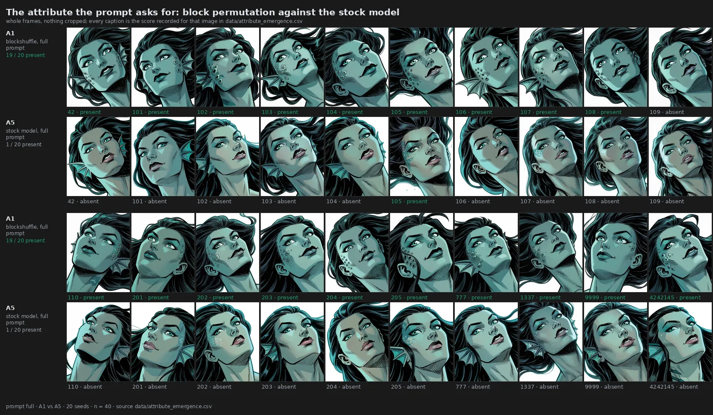
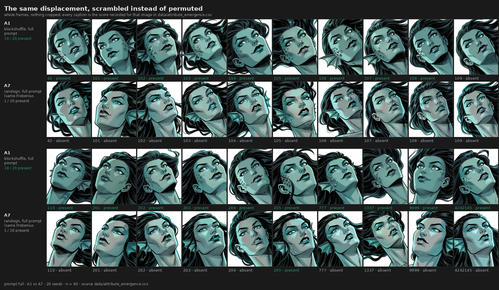
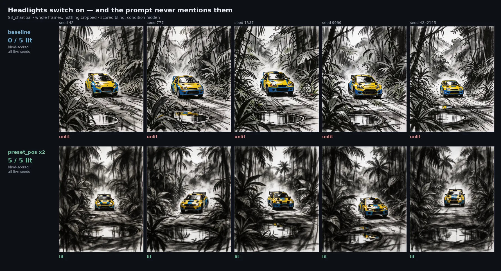
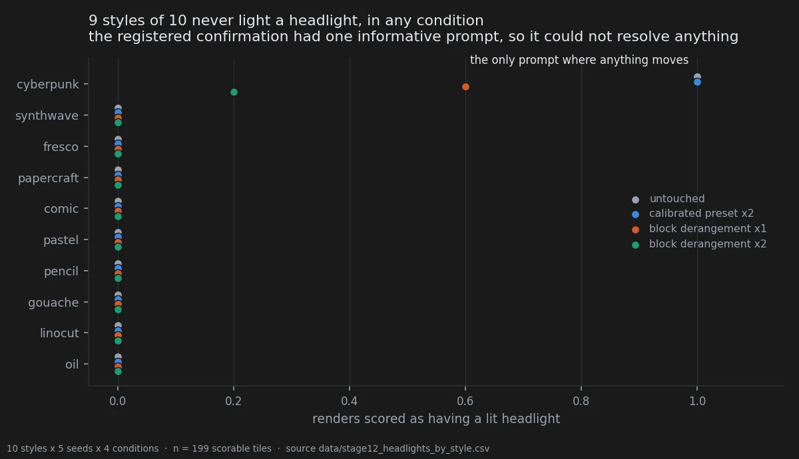

# What the edit puts in the picture, and what it takes out

> **Ambiguous** · 670 renders · 2 independent corpora · exploratory, no frozen threshold
> [← all experiments](../README.md#what-holds-and-what-does-not)

> **The direction I'm chasing.** I want to know whether a weight edit changes *what* the model
> draws or only *how* it draws it. Those are two different machines. Something that renders the
> same scene with a different finish is a filter; something that puts an object in the frame
> that was never there is reaching into the content, and that is the thing worth understanding.
>
> **What would kill it.** A control that moves the weights exactly as far, by a different rule,
> and produces the same attribute. If displacement alone recovers it, then the *structure* of
> the edit is irrelevant and I am measuring distance with extra steps.
>
> **Where we are.** The control does nothing — twice, on two attributes, one the prompt asked
> for and one nobody asked for. But I predicted neither in advance, I scored the first round
> with the condition visible, and the design written to test whether any of this generalises was
> never run. Large, repeatable, and filed ambiguous, which is where it belongs.

## In two minutes

A prompt asked for `small barnacle-like clusters studding one earlobe`. The stock model drew
them once in twenty renders. A weight edit that permutes blocks inside the checkpoint drew
them in nineteen of twenty — and a second edit, built to move the weights exactly as far but
by scrambling signs instead of permuting blocks, drew them once, which is the stock model's
own rate. So the thing that matters is not how far the weights moved. It is how they moved.



Then the same family of edits did it to something nobody asked for. On a separate corpus — a
rally car in a jungle, eight drawing styles, no mention of lights anywhere in the prompt — one
edit switched the headlights **on** in thirty-one renders of thirty-eight, and another switched
them **off** in thirty-nine of thirty-nine, including scenes where the untouched model had lit
them four times in five.

Both results are large and both have a matched control that does nothing. Neither was
predicted in advance, and the design written to test whether any of this generalises was never
run. That is why the page is filed as ambiguous rather than as a finding.

## The verdict

A structured weight edit changes **which** things the model puts in a picture, not only how it
draws them. Two arms of evidence: an attribute the prompt names and the model drops, recovered
from 1/20 to 19/20; and an attribute the prompt never names, driven from 10/35 to 31/38 by one
edit and to 0/39 by another. In both arms a displacement-matched control with scrambled signs
sits at the untouched model's rate.

What the page does **not** support is the general statement. One attribute, one prompt family
in the first arm; one object, one prompt in the second. No threshold was frozen before either
measurement, the barnacle round was scored with the condition visible, and the pre-registered
design that would have settled generality was never executed.

## Why I might be wrong

**No threshold was fixed before the data existed.** Neither arm is confirmatory. The
attribute-emergence pre-registration exists and names the right design — attributes named
before rendering, blind scoring, `(prompt, attribute)` as the unit of analysis — and its own
closing note records that the attribute table was never filled and the primary test never run.
An unrun design is not a weaker result; it is no result.

**The barnacle round was scored with the condition visible.** The scorer was the author and he
knew which image came from which arm. Hashing the filenames would not have fixed it either: on a
separate corpus the same observer picked these conditions out of a four-way line-up at 17 of 20
and 12 of 20 against a 25% chance level, which is pitfall 34 and is measured on
[what ends up in the picture](03-what-ends-up-in-the-picture.md#the-annotator-is-the-instrument). With 18 discordant seeds to 0 the headline will not
flip, but the intermediate cells are exactly where a borderline call moves a number: the
DiT-only arm at 12/19 and the 0.50 dose point at 5/6 scorable are the two that a biased eye
could have made.

**The headlight round was blind, and still is not a confirmation.** The observation was born by
looking at those renders and is measured on the same renders. This is quantification of
something already seen, and a number produced that way is an upper bound on what a fresh
corpus would give. Three consecutive confirmation rounds elsewhere in this
notebook have come back between a third and a half of their exploratory estimate.

**The statistic is at its floor and looks weaker than the effect.** With six informative
prompts all moving the same way, the smallest value the exact test can return is
2/2⁶ = 0.0312, and Holm across six conditions needs 0.0083. No effect of any size could have
cleared that bar on this design. The right reading is neither "significant" nor "weak" but
"floored" — the same structural ceiling that rule 8 of the error log describes.

**Four images were scored twice during the blind round.** Two of them received a different
score the second time, because the viewer appended a row instead of replacing one — pitfall 35,
whose registry entry is this very round. Counting both rows reads the preset at 32/39 instead
of 31/38. The published rates reproduce exactly under "the later score wins", the remedy the
registry names, so that is the rule this page applies; between keeping the later score and
keeping the earlier one the only condition that moves is the scrambled control at double
strength, 2/36 rather than 3/37, and no headline number.


**The obvious confound was checked, and the first check was wrong.** The edit darkens the image
by 3.3 of L\*, and lit headlights are more plausible in a dark scene. The first version
stratified on the lightness of each image *as rendered* — conditioning on a quantity the
treatment moves, which does not hold a confounder still, it re-creates it. The correct
stratifier is the lightness of the **unmodified** render of the same scene, fixed before any
weight is touched. That is pitfall 39, and the corrected table is the one above.

## The data

### How it was measured

Two corpora, built five months of project time apart, sharing nothing but the tuner.

The **barnacle corpus** is 390 renders across 24 arms: the complete prompt, six single-variable
prompt knockouts, a length- and syntax-matched neutral control, a second subject sharing the
scaffold, an eight-point dose ladder, and a split of the edit into its DiT half and its
text-encoder half. Twenty seeds in every cell that carries a headline. Each render is scored
present / absent / ambiguous against a rule written before scoring and stored in
`data/attribute_emergence_recipe.json`: a growth on the face at least partially circumscribed
by a black contour line counts; a lighter circle without thickness, or a single isolated
circle, does not.

The **headlight corpus** is 280 renders: one prompt, eight drawing styles, seven conditions,
five seeds. Scoring was blind to condition — files copied under hashed names, order shuffled,
the key sealed in a file that was not opened until the last score was recorded. The scale is
three-way: lit, unlit, cannot tell. A cannot-tell leaves the numerator **and** the denominator,
which is why the denominators below are not all 40.

### The attribute the prompt asks for

| arm | condition | present | rate |
|---|---|---|---|
| A1 | block permutation, complete prompt | **19 / 20** | 0.95 |
| A5 | stock model, complete prompt | 1 / 20 | 0.05 |
| A7 | sign scramble, complete prompt, identical D | 1 / 20 | 0.05 |
| B6 | block permutation, second subject, scaffold intact | **20 / 20** | 1.00 |
| B7 | stock model, second subject | 7 / 20 | 0.35 |

Not one seed goes the other way in either paired comparison. The effect is conjunctive: it
needs the prompt to supply a two-token local scaffold, and removing either token collapses it.



| prompt variant | arm | present |
|---|---|---|
| complete | A1 | **19 / 20** |
| second subject, scaffold intact | B6 | **20 / 20** |
| the morphological phrase removed | E3 | 1 / 20 |
| the ontological anchor removed | C1 | 0 / 10 |
| the keyword kept, marine context removed | A3 | 0 / 20 |
| length- and syntax-matched neutral | A4 | 0 / 20 |
| second subject, no keyword | B1 | 0 / 20 |
| second subject with keyword, no marine context | B2 | 0 / 20 |
| third subject, no morphological phrase | B5 | 0 / 20 |

The sharpest number is the one that looks least impressive. With the morphological phrase
removed, the edited model scores 1/20 — and the stock model on the complete prompt also scores
1/20. Paired, that is one discordant seed each way: without the scaffold, the weight edit is
indistinguishable from not having applied it.

Splitting the edit and walking its dose both behave the way a real mechanism should rather than
the way noise would.

| split | present | | dose | present |
|---|---|---|---|---|
| DiT and text encoder | 19 / 20 | | 0.25 | 1 / 10 |
| DiT only | **12 / 19** | | 0.50 | 5 / 6 scorable |
| text encoder only | 3 / 20 | | 0.75 | **10 / 10** |
| stock | 1 / 20 | | 1.00 | **19 / 20** |
| | | | 1.25 | 8 / 10 |
| | | | 1.50 | 6 / 10 |
| | | | 1.75 | 5 / 10 |
| | | | 2.00 | 1 / 10 |

The text encoder alone does nothing measurable; the DiT carries most of the effect. The dose
curve has an optimum near 0.75–1.00 and fails at both ends — at 2.00 the displacement is
largest and the attribute is gone, which is the opposite of what "any disturbance helps" would
predict. At ten seeds a point the extremes are separated and the intermediate points are not
ordered by these data.

One more thing the figure shows and the table cannot: the attribute emerges in the wrong place.
The prompt says `studding one earlobe`, and across every positive render the clusters sit on
the cheekbone and temple. The edit recovers the **presence** of a neglected concept and leaves
its **placement** exactly as wrong as the stock model would have left it.

### The attribute nobody asked for

The rally-car prompt says nothing about lights. Headlights are simply a thing a car has.

| condition | lit / scorable | rate | cannot tell |
|---|---|---|---|
| baseline | 10 / 35 | 0.286 | 5 |
| preset ×1 | 16 / 36 | 0.444 | 4 |
| **preset ×2** | **31 / 38** | **0.816** | 2 |
| permutation, negative sign, ×1 | 6 / 38 | 0.158 | 2 |
| **permutation, negative sign, ×2** | **0 / 39** | **0.000** | 1 |
| sign scramble ×1 | 7 / 39 | 0.179 | 1 |
| sign scramble ×2 | 2 / 36 | 0.056 | 4 |



Only the positive direction had been noticed by eye. The measurement added the other one:
the negative permutation puts the lights out in thirty-nine renders of thirty-nine, including
the style where the untouched model had them lit four times in five.


Per style, from `data/stage9_headlights_by_style.csv`:

| style | baseline | preset ×2 | permutation neg ×2 |
|---|---|---|---|
| photography | 3 / 5 | **5 / 5** | 0 / 5 |
| watercolour | 0 / 3 | **5 / 5** | 0 / 5 |
| low poly | 1 / 5 | **5 / 5** | 0 / 5 |
| claymation | 4 / 5 | **5 / 5** | 0 / 5 |
| ukiyo-e | 0 / 5 | 0 / 5 | 0 / 5 |
| pixel art | 0 / 5 | 1 / 3 | 0 / 4 |
| stained glass | 2 / 2 | **5 / 5** | 0 / 5 |
| charcoal | 0 / 5 | **5 / 5** | 0 / 5 |

Six styles of eight reach 5/5, and two of those started from zero. A monochrome charcoal
drawing lighting its headlights in all five seeds is the single most surprising cell in the
table. The two styles that do not move are not counterexamples: stained glass was already at
the ceiling, and ukiyo-e sits at zero in **all seven** conditions, which is a style that never
depicts lit headlights rather than a failure to respond.

### The confirmation that was run, and could not answer

The pre-registration of the next experiment registered a second hypothesis on its own corpus:
the same headlight prediction, with its own frozen directional clause, on 250 renders of a
vintage sports car on a coastal road. Those renders exist and the round was scored blind on
2026-09-21 against a criterion frozen first, in `docs/stage12_headlights_criterion.md`. Every
score re-joins to the sealed key of that round without a single disagreement.

It returned nothing, and the reason is visible before any effect size.



| condition | lit / scorable | rate |
|---|---|---|
| untouched | 5 / 49 | 0.102 |
| calibrated preset ×2 | 5 / 50 | 0.100 |
| block derangement ×1 | 3 / 50 | 0.060 |
| block derangement ×2 | 1 / 50 | 0.020 |

**Nine styles of ten never light a headlight in any condition, the untouched model included.**
All sixteen lit renders in the round belong to one style. With one informative prompt the exact
sign-flip test's floor is 2/2¹ = 1.0: no effect of any magnitude could have reached
significance, which is rule 11 of the fifteen, and it was decidable before a single image was
rendered. The subject sentence pins `golden hour, clear sky` — a bright daylight scene, where
headlights off is what the object looks like.

Inside the one informative style the two arms behave as predicted and cannot be tested. The
untouched model lights 5 of 5, so the positive prediction has no room to move; the derangement
takes it to 3 of 5 at single dose and 1 of 5 at double, which is the extinguishing direction of
the first corpus with a dose gradient, on five renders.

So the claim does not gain a confirmation and does not lose one. What it gains is a boundary:
on a bright daylight corpus the trait has no variance to steer, and the round that would settle
the question needs a corpus where headlights are **marginal** — dusk, night, or styles that
depict them — chosen on that criterion before rendering. The pre-registration offered this
second outcome as something that travelled with the corpus for free. It did not: a hypothesis
about a trait needs a corpus in which the trait can move, and that is a design requirement, not
a bonus.

Two things the round did establish about itself. The scorer was not the pre-registered one and
knew the hypothesis, which is declared in the criterion document along with three other
deviations. And the criterion was tightened after 27 tiles, before the key was opened; repeating
the whole table on the 175 tiles scored afterwards moves the rates to 0.114, 0.087, 0.073 and
0.023 and changes nothing. Of the twenty tiles shown twice, nineteen scored identically and the
disagreement was uncertain against unlit, never lit against unlit.

### The controls

The control that decides what this finding is, in both arms, is the norm-matched scramble. It
carries the identical Frobenius displacement — 0.0538 relative on the DiT, 0.0256 on the text
encoder, measured and recorded in `data/preset_displacements.csv`, not nominal — and differs
from the permutation only in the structure of the perturbation. In the barnacle corpus it
scores 1/20, exactly the untouched model's rate. In the headlight corpus it scores 2/36 at
double strength, below baseline rather than above it.

Without that control the obvious reading survives: any push of that size shakes a secondary
token loose. With it, that reading is dead. Two points separate **structure** from
**magnitude**; they do not identify which structural property does the work. Block coherence is
the obvious candidate, and "permutation rather than sign flip" and "preserves each block's
internal correlations" are not distinguished by two points.

Every crop in this experiment has been withdrawn. The first version of these figures cropped
to the attribute region using rectangles typed into the source, and five rectangles of twenty
did not contain the thing their caption named; one panel was captioned as showing a lit
headlight for a cell that is scored unlit in all five seeds of all seven conditions. The
figures on this page are whole frames, composed by scripts that read the recorded score and
derive every caption from it. That is pitfall 40, and until a locator exists that has been
qualified against the corpus, whole frames are the only honest option.

### One attribute, one prompt family

The two positive prompts in the barnacle arm share nearly every token. Whether this reaches
other neglected attributes on unrelated subjects is untested, and the design that would have
tested it — attributes named before rendering, blind scoring, `(prompt, attribute)` as the unit
— was written, deposited, and never executed. Its own status note records the reason: the
attribute table was never filled, and by the rule written into the document it can no longer be
filled now.

In the headlight arm it is one object and one prompt. A car has headlights the way a face has
eyes. Whether the effect is "the edit completes objects" or "the edit likes bright spots on
cars" is not decided by cars alone.

There is one thing worth recording about where this sits. The phenomenon has a name —
catastrophic neglect, a text-to-image model failing to render a concept its prompt contains —
and the published remedies operate at inference time by re-weighting cross-attention maps.
This checkpoint has no cross-attention in its blocks at all: text enters once upstream and
reaches each of the 28 blocks as an adaptive modulation vector. The standard fix has nothing to
grab hold of here, which is part of why a static, prompt-preserving change in weight space is
worth reporting even at this evidential strength.

### Reproducing this

```yaml
model:
  checkpoint: krea2_turbo_bf16.safetensors
  weight_dtype: default
  sha256: not recorded -- the file is outside the repository
  text_encoder: qwen3vl_4b_bf16.safetensors
  vae: qwen_image_vae.safetensors
sampling:
  sampler: euler_ancestral
  steps: 9
  cfg: 1.0
  denoise: 1.0
  scheduler: simple
  resolution: 1024x1280
tuner:
  node: ArthemyKrea2PresetLoader
  version: not recorded
  mode: preset_json
  strength_model: 1.0
  strength_clip: 1.0
  graphs:
    - assets/02_attribute_emergence/workflow_baseline.json
    - assets/02_attribute_emergence/workflow_blockshuffle.json
    - assets/02_attribute_emergence/workflow_randsign.json
prompts:
  file: data/attribute_emergence_recipe.json
  ids: [full, hybrid, no_ridges, no_sea_touched, no_keyword, isolated,
        matched_neutral, hag_base, hag_keyword, teal_sea_hag]
seeds: [42, 101, 102, 103, 104, 105, 106, 107, 108, 109, 110,
        201, 202, 203, 204, 205, 777, 1337, 9999, 4242145]
conditions:
  - name: blockshuffle
    preset: Arthemy_Bench_BLOCKSHUFFLE.json
    measured_D: 0.05381584        # relative, DiT; 0.02562789 on the text encoder
  - name: randsign
    preset: Arthemy_Bench_RANDSIGN.json
    measured_D: 0.05381584        # identical by construction -- that is the point
  - name: baseline
    preset: null
    measured_D: 0.0
outputs:
  folder: assets/02_attribute_emergence
  manifest: data/attribute_emergence.csv
analysis:
  script: experiments/notebook_figures.py
  produces: assets/02-attribute-emergence/F02.4_barnacle_census_A1_A5.webp
  second_corpus:
    renders: outside the repository -- benchmark_stage9/renders
    manifest: data/stage9_headlights_key.csv
    scores: data/stage9_headlights_raw.csv
    script: experiments/headlights_by_style.py
    produces: data/stage9_headlights_by_style.csv
```

The second corpus is the one gap a stranger would hit: its 280 renders live outside the
repository, so `experiments/build_figures_headlights.py` needs the render folder passed to it
before it can rebuild F02.1 to F02.3. The scores, the sealed key and the derived tables are all
here; the pixels are not.

## Provenance

**Pre-registration.** None for the results on this page. `docs/prereg_attribute_emergence_stage7.md`
designs the confirmation and records, in its own closing note, that it was never run.

**Measurement files.** `data/attribute_emergence.csv` (390 scored renders),
`data/attribute_emergence_recipe.json` (the scoring rule and generation settings),
`data/preset_displacements.csv` (measured displacements),
`data/stage9_headlights_raw.csv` and `data/stage9_headlights_key.csv` (the sealed blind round),
`data/stage9_headlights_results.csv` and `data/stage9_headlights_pretreatment_strata.csv`
(condition rates and the corrected stratification),
`data/stage9_headlights_by_style.csv` (derived here, 2026-09-21).
The second corpus: `data/stage12_headlights_raw.csv` (the blind round),
`data/stage12_images.csv` (its manifest), `data/stage12_bbox_key.csv` (the sealed key the
scores were joined to), `data/stage12_headlights_results.csv` (the round's own summary) and
`data/stage12_headlights_by_style.csv` (derived here).

**Scripts.** `experiments/notebook_figures.py` (F02.4, F02.5),
`experiments/notebook_charts.py` (F02.6), `experiments/stage12_headlights.py`,
`experiments/build_figures_headlights.py` (F02.1 to F02.3),
`experiments/headlights_by_style.py`, `experiments/score_headlights.py`,
`experiments/analyze_headlights.py`.

**Written up in.** `docs/stage10_headlights_results.md`, `docs/figure_brief.md`,
`docs/stage12_headlights_criterion.md` (the second corpus's frozen criterion and its four
declared deviations).

**Pitfalls that apply.** 26 (Fisher's exact on paired binary outcomes, where McNemar on the
discordant pairs is the right test and is what the tables above use), 34 (an expert observer is
not blinded by hashed filenames), 35 (a scoring viewer that appends a row when the scorer goes
back to correct — the four re-scores in this round are the registry's own example),
39 (stratifying on a covariate the treatment itself moves), 40 (a figure whose caption and crop
were typed by hand), 50 (reporting a treatment-versus-control difference as a property of the
treatment).

Rules 8 and 9 of the fifteen also bear on this page: the resolution floor of an exact test, and
blinding as a measurement rather than a procedure. Those are rules, and an earlier draft of this
page cited them in the front matter by the pitfall registry's numbering, where 8 and 10 are two
unrelated entries.
