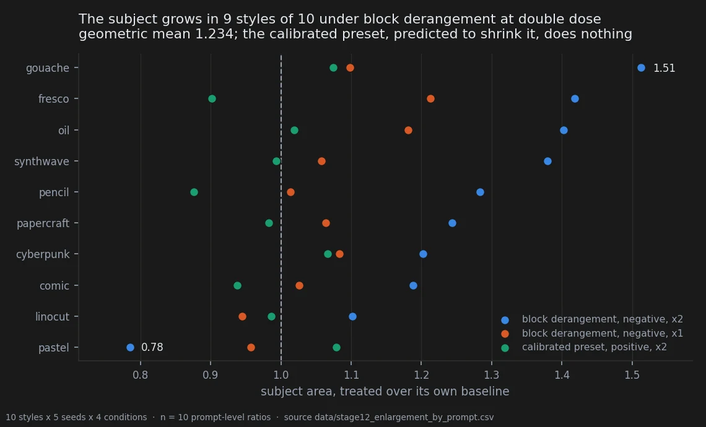

# How much room the subject takes, and how blind I actually was

> **Holds** · 250 renders · 10 new styles · pre-registered 2026-09-18, before a single render
> [← all experiments](../README.md#what-holds-and-what-does-not)

> **The direction I'm chasing.** I kept seeing the car take up more of the frame under one of
> the edits. If composition is one of the things these edits move, they reach further into the
> picture than texture and colour, and that changes what the whole project is about.
>
> **What would kill it.** The effect existing only on the images that produced the observation.
> That is the honest failure mode here, and I had already walked into it once: boxes drawn on
> the same renders that suggested the idea, by me, knowing the hypothesis, with the scoring key
> already open.
>
> **Where we are.** It survived on a corpus that did not exist when the prediction was frozen,
> at about a fifth of the size the first round claimed. And the same round measured something I
> care about more than the result: **I am the measuring instrument, and nobody had ever measured
> the instrument.**

## In two minutes

Two things were noticed by eye: under one of the edits the car seems to take up more of the
frame. The first attempt to measure that was worthless, and it took a while to see why — the
boxes were drawn on the same images that produced the observation, by someone who knew the
hypothesis, after the scoring key had already been opened eight minutes earlier for a different
task. It returned a ratio of 2.14, the car growing from 13% to 28% of the canvas.

So the prediction was written down, frozen, and a new corpus built: ten styles never used
before, a different vehicle in a different setting, every image randomly mirrored, flipped,
hue-rotated, re-saturated, re-brightened and noised, with the disturbances recorded. The
annotator saw each render for the first time inside the annotation tool.



The effect survived, at about a fifth of the size the first round claimed. All three predicted
signs came out right.

Then the more useful half. The same round measured the annotator. Twenty trials, four images
side by side, and the task was to point at which was which — chance is 25%. He identified one
condition 17 times in 20 and the other 12 times in 20, through all of that mirroring and hue
rotation. **The blinding failed, and now it is a number rather than an argument.** It applies
backwards to every human-scored round in this notebook.

It does not, however, explain the size result — and the reason is an asymmetry worth following:
the condition recognised almost perfectly is the one where no effect was drawn at all.

## The verdict

The subject enlargement is real and much smaller than it first looked. On ten styles that did
not exist when the prediction was frozen, the block-derangement edit at double dose gives a
geometric mean area ratio of 1.234 with 9 of 10 styles above 1; at single dose 1.061 with 8 of
10; and the calibrated preset, predicted to move the other way, gives 0.989 — right sign, no
magnitude. The pre-registered test passes after Holm correction under all four readings of the
statistic the pre-registration failed to name.

Separately, and on the same round, the blinding of the annotation was measured against a
threshold fixed in advance and **failed**: an expert observer picks these conditions out of a
four-way line-up well above chance. That is pitfall 34, this page is where it was measured, and
rule 9 of the fifteen — blinding is a measurement, not a procedure — was written from it.

## Why I might be wrong

**The statistic was not named in advance, and this page is where that shows.** The
pre-registration fixed "exact sign-flip permutation on the ten prompts" and stopped there. Four
readings are defensible, and a family of four chosen after seeing the answers is a degree of
freedom even when the four agree. They do agree here — Holm-corrected p from 0.018 to 0.035,
all four below 0.05 — which is the only reason this is a footnote rather than the verdict.

**An earlier verification of this round reported that the most defensible statistic failed, and
that does not reproduce.** `docs/stage12_verifica.md` §5 gives 0.0176 raw and 0.0527 after Holm
for the mean of the per-prompt log ratios, and concludes "confirmed with reservation". Two
independent recomputations here give 0.0117 raw and 0.0352 after Holm — 12 of the 1024 sign
patterns, not 18 — and that is also exactly what `data/stage12_bbox_results.csv` has recorded
since the round was run, alongside its own verdict of confirmed. The table is now persisted to
`data/stage12_enlargement_tests.csv` so the disagreement can be settled by running one script.
Until someone reproduces the 0.0527, this page treats the primary as passed.

**The negative control is the weak part.** The calibrated preset was predicted to visibly shrink
the subject and instead does essentially nothing: ratio 0.989, 4 prompts of 10 above 1, p = 0.64.
The sign is right and the magnitude is absent. A bidirectional prediction was the main defence
against a one-directional unconscious bias, and it is satisfied only in half.

**One of the ten styles goes the other way.** Pastel comes in at 0.785, the only style below 1,
and it sits in the group where the annotator could not identify the condition at all. Nine of
ten is not ten of ten, and the one that dissents dissents by more than most of the others agree.

**The resolution floor is close.** With ten prompts the exact sign-flip test cannot return less
than 2/2¹⁰ = 0.00195, and Holm across three conditions moves the usable threshold in steps of
that size. The verdict is stable across the four statistics but the p-values live within a
factor of three of the floor; that is the granularity of the test, not the strength of the
effect, and it is rule 11 of the fifteen.

**Fifty renders of this corpus were never looked at.** The batch was 250 — five conditions —
and the annotation round covered four. See [what this cannot separate](#what-this-cannot-separate).

## The data

### How it was measured

Ten styles, one subject sentence shared by all ten, five seeds, five conditions: 250 renders,
manifest in `data/stage12_images.csv`, prompts hashed and frozen in the pre-registration before
rendering. The measure is a four-point bounding box drawn by hand around the subject, and the
statistic is a **ratio** — the treated area over the area of its own paired baseline — because
percentage points of canvas are not comparable across corpora with different framing.

The unit of analysis is the prompt, not the cell. Five seeds inside one style are repeated
measures on one subject, and treating them as thirty or fifty independent observations is
pitfall 17. Each style contributes one ratio; the test runs on ten numbers.

Blinding had three levels, all fixed in the pre-registration: the annotator never saw a render
before annotating it, not even as a contact sheet or a quality check; the key was written before
and opened after; and every image carried randomised mirroring, flipping, hue rotation,
saturation between 0.6 and 1.6, brightness between 0.85 and 1.15 and Gaussian noise up to σ = 4,
with the parameters stored per image. Twenty images were shown a second time with a different
mirror state, hidden among the rest. Total presented: 220.

### The subject grows, and by how much

| condition | geometric mean ratio | arithmetic mean | styles above 1 | predicted |
|---|---|---|---|---|
| block derangement, negative, ×1 | 1.061 | 1.064 | 8 / 10 | grows |
| **block derangement, negative, ×2** | **1.234** | **1.252** | **9 / 10** | grows more |
| calibrated preset, positive, ×2 | 0.989 | 0.992 | 4 / 10 | shrinks |

All three signs are as predicted and the double dose exceeds the single dose, which is the
directional clause of the pre-registration and it is binding: a condition reaching significance
with the wrong sign would have counted as a failure of the whole document.

The primary test, under each of the four readings of "exact sign-flip permutation on ρ", from
`data/stage12_enlargement_tests.csv`:

| statistic | value at ×2 | p | p after Holm across 3 conditions |
|---|---|---|---|
| mean of the per-prompt log ratios | 0.2103 | 0.0117 | **0.0352** |
| log of the mean ratio | 0.2245 | 0.0078 | **0.0234** |
| mean of ρ − 1 | 0.2517 | 0.0098 | **0.0293** |
| mean difference in percentage points | 5.092 | 0.0059 | **0.0176** |

Against the first round's 2.14, the confirmed effect is roughly a fifth of the size in
log-ratio terms. That shrinkage is the third time this notebook has watched an exploratory
estimate come back between a third and a half of itself, and it is the first time there is a
mechanism rather than a shrug: the first round was annotated after the key had been opened, on
images already examined.

### The annotator is the instrument

Everything above rests on a person looking at pictures and writing down numbers while knowing
what the experiment is about. Until this round that weakness had only ever been argued about.

Twenty trials. Four images from one style at four distinct seeds — the target at double dose,
the second target, a near-foil at half the dose of the first target, and an untouched baseline —
in an order the annotator could not see, under the same disturbances as the main task. The task
was to name two of the four. The threshold was fixed before the round at 5 joint hits in 20.


| target | identified | chance | p |
|---|---|---|---|
| calibrated preset ×2 | **17 / 20** | 25% | 3.0 × 10⁻⁸ |
| block derangement ×2 | **12 / 20** | 25% | 9.4 × 10⁻⁴ |
| both, in one trial | **12 / 20** | 8.3% | 7.5 × 10⁻⁹ |

Observed 12 joint hits against a threshold of 5. Mirroring, flipping, hue rotation, saturation,
brightness and noise did not hide the conditions from the person who characterised them.

This is uncomfortable to publish and it is the most useful measurement on this page, because it
applies backwards: every scoring round in this notebook before this one had assumed a blinding
it never tested, including the barnacles on
[the previous page](02-attribute-emergence.md#why-i-might-be-wrong).

### Where the blinding held

Two independent arguments say the failed blinding does not produce the size result, and the
first is the stronger.

**The asymmetry.** The condition identified almost perfectly — the calibrated preset at 85% — is
the one where no size effect was drawn at all, against a registered prediction that said it
shrinks. The condition identified only 60% of the time is the one carrying the effect. If
recognising the condition were steering the hand, this would be the wrong way round: the
predicted shrinkage would have appeared exactly where the hand knew what it was looking at.


**The gradient, which is real and is reported as such.** Crossing per-style discriminability
with per-style effect: in the five styles the annotator identified both times, the mean ratio is
1.329; in the three he identified neither time, 1.122. There is a gradient, and part of the
effect may be inflated where he could tell. But the effect does not disappear where the blinding
held — two of those three styles still grow, by 20% and 38%, and the third is the pastel outlier
at 0.785 that pulls that group's mean down on its own.

### The controls

**The instrument's own noise, from the twenty hidden duplicates.** Mean absolute difference
between two annotations of the same image: **0.27 percentage points of canvas** (sd 0.24),
median relative error 0.95%, test-retest correlation **r = +0.995**. The measured effect is
about twenty times that. This quantity had never been measured in this project before.

**The disturbances did not move the hand.** Regressing annotated area on the disturbances we
applied ourselves, over the fifty original baseline annotations:

| disturbance applied | slope, points of canvas per unit | r | p |
|---|---|---|---|
| saturation | −1.53 | −0.096 | 0.50 |
| brightness | +11.69 | +0.229 | 0.10 |
| noise σ | +0.30 | +0.076 | 0.60 |

The saturation we imposed does not predict how large the rectangle is drawn. The bias the first
round feared is excluded by a measurement rather than by an argument, which was the point of the
design. Brightness is the largest of the three and does not reach significance; it is the one to
watch.

**Two figures from this round are not published here**, and the reason is the rule they break.
`assets/03_what_ends_up_in_the_picture/_figures` holds a paired frame with the annotated boxes
drawn on and a reproduction of two line-up trials. Both are composed by
`experiments/build_figures_stage12.py` with the box coordinates, the mirror correction and every
caption typed into the source rather than read from `data/stage12_bbox_raw.csv` and the sealed
key. That is pitfall 40 exactly, and the renders needed to rebuild them from the annotation file
live outside the repository. The charts above carry the same claims from the measurement files.

### What this cannot separate

The batch was 250 renders across five conditions. The bounding-box round annotated four of them:
baseline, the derangement at both doses, and the preset at double dose. **The fifty renders of
the preset at single dose have still never been scored.**

The second confirmatory hypothesis this corpus was built to carry — the pre-registration's
§"Un secondo esito", a headlight confirmation on these same images with its own frozen
directional prediction — was scored blind on 2026-09-21, on the four annotated conditions. It
returned nothing usable, and not because the effect was absent: **nine of the ten styles never
light a headlight in any condition, the untouched model included**, so the test had one
informative prompt and a floor of 2/2¹ = 1.0. The subject sentence pins `golden hour, clear
sky`, and a bright daylight scene is one where the trait cannot move. That was decidable from
the prompt before rendering, and the pre-registration treated the second hypothesis as
travelling with the corpus for free. The round is written up on
[what the edit puts in the picture](02-attribute-emergence.md#the-confirmation-that-was-run-and-could-not-answer).

An arm that was rendered and not examined is not a spare, and a hypothesis attached to a corpus
that cannot express it is not a test.

More importantly for the claim itself: no sign-scrambled edit at the identical displacement was
rendered. The round therefore separates **two structured edits from each other and from doing
nothing**, and says nothing about structure against magnitude. That control exists elsewhere in
the notebook — it is what makes the attribute-emergence result mean what it means — and it is
missing here. Until it is in the design, the enlargement is a fact about this edit and not yet a
fact about structured edits.

Two further limits carry over unchanged: one subject, ten styles, one model; and the scorer is
the author, whose discriminability is now measured but not removed.

### Reproducing this

```yaml
model:
  checkpoint: krea2_turbo_bf16.safetensors
  weight_dtype: default
  sha256: not recorded -- the file is outside the repository
  text_encoder: qwen3vl_4b_bf16.safetensors
  vae: qwen_image_vae.safetensors
sampling:
  sampler: euler_ancestral
  steps: 9
  cfg: 1.0
  denoise: 1.0
  scheduler: simple
  resolution: 1024x1280
tuner:
  node: ArthemyKrea2PresetLoader
  version: not recorded -- suite_git_sha ba28b12532175220
  mode: preset_json
prompts:
  file: data/stage12_images.csv
  ids: [S01_oil, S02_linocut, S03_cyberpunk, S04_gouache, S05_pencil,
        S06_pastel, S07_comic, S08_papercraft, S09_fresco, S10_synthwave]
  hashes_frozen_in: docs/prereg_stage12_ingrandimento.md
seeds: [42, 777, 1337, 9999, 4242145]
conditions:
  - name: baseline
    preset: null
    strength: 1.0
    measured_D: 0.0
  - name: blockshuf_neg_1x
    preset: Arthemy_Bench_BLOCKSHUFFLE_NEG.json
    strength: 1.0
    measured_D: 0.05381584      # relative, DiT; data/preset_displacements.csv, status PASS
  - name: blockshuf_neg_2x
    preset: Arthemy_Bench_BLOCKSHUFFLE_NEG.json
    strength: 2.0
    measured_D: 0.05381584      # measured at strength 1.0; NOT re-measured at 2.0 -- see note
  - name: preset_pos_1x
    preset: Arthemy_Bench_Base.json
    strength: 1.0
    measured_D: 0.05381584
  - name: preset_pos_2x
    preset: Arthemy_Bench_Base.json
    strength: 2.0
    measured_D: 0.05381584      # measured at strength 1.0; NOT re-measured at 2.0 -- see note
outputs:
  folder: benchmark_stage12/renders
  manifest: data/stage12_images.csv
annotation:
  key: data/stage12_bbox_key.csv
  boxes: data/stage12_bbox_raw.csv
  discrimination_key: data/stage12_pattern_key.csv
  discrimination_answers: data/stage12_pattern_raw.csv
analysis:
  script: experiments/stage12_enlargement_by_prompt.py
  produces:
    - data/stage12_enlargement_by_prompt.csv
    - data/stage12_enlargement_tests.csv
    - data/stage12_annotator_noise.csv
  figures: experiments/notebook_charts.py
```

One honest gap in that block. `data/preset_displacements.csv` records each preset's displacement
at strength 1.0 and nothing was measured at strength 2.0, so the double-dose rows above carry
the single-dose measurement rather than their own. Doubling it would be a nominal number, which
is what pitfall 13 exists to prevent, so the measured value is given with the gap named. The
conditions are still distinguished by `strength` in the manifest, which is what was actually
varied.

## Provenance

**Pre-registration.** `docs/prereg_stage12_ingrandimento.md`, deposited 2026-09-18 before a
single render, with the corpus, the hashes, the three predicted signs, the decision rule and the
diagnostics to publish whatever the outcome. The four-way discrimination test is registered in
the same document as experiment 12-B, with its threshold of 5 joint hits in 20 fixed before the
round.

**Verification.** `docs/stage12_verifica.md` (independent recomputation, 2026-09-18) and
`docs/stage10_bbox_verification.md` (the first round, and the correction that followed from it).

**Measurement files.** `data/stage12_images.csv` (250-render manifest with the sampler settings
and the prompt text), `data/stage12_bbox_key.csv` and `data/stage12_bbox_raw.csv` (the sealed key
and the 220 annotations), `data/stage12_bbox_results.csv` (condition-level result as the round
produced it), `data/stage12_pattern_key.csv`, `data/stage12_pattern_raw.csv` and
`data/stage12_pattern_results.json` (the line-up round), and three tables derived here on
2026-09-21: `data/stage12_enlargement_by_prompt.csv`, `data/stage12_enlargement_tests.csv`,
`data/stage12_annotator_noise.csv`.

**Scripts.** `experiments/stage12_enlargement_by_prompt.py`, `experiments/notebook_charts.py`,
`experiments/analyze_stage12_ingrandimento.py`, `experiments/analyze_stage12_pattern.py`,
`experiments/prepare_stage12_blind.py`, `experiments/prepare_stage12_pattern.py`.

**Pitfalls that apply.** 17 (treating cells as independent observations when the unit is the
prompt), 34 (an expert observer is not blinded by hashed filenames — this page is the entry's
own source), 40 (a figure whose caption and crop were typed by hand, which is why two figures
from this round stay unpublished).

Rules 9 and 11 of the fifteen were both written out of this round: blinding is a measurement,
and the resolution floor decides how many tests a family can hold before anything is rendered.
