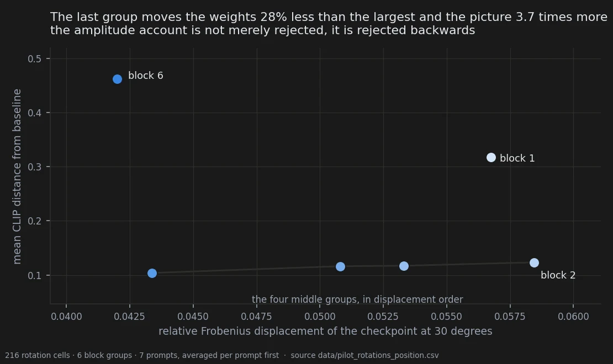
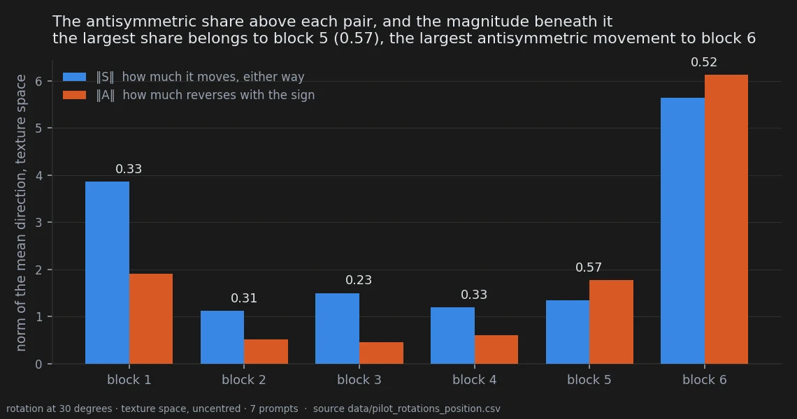

# Does it matter where you edit?

> **Ambiguous** · 432 cells found on disk, not designed · 6 block groups · 7 prompts
> · exploratory, and it predates every pre-registration in this notebook
> [← all experiments](../README.md#what-holds-and-what-does-not)

> **The direction I'm chasing.** The question I actually want answered is whether it matters
> *where* in the model you push. If different parts of the backbone do different jobs, steering
> has an anatomy and there is a map to draw. If they do not, there is one dial with a scale on
> it and everything else is decoration.
>
> **What would kill it.** Displacement. If a block group moves the picture more simply because
> pushing it moves the weights more, then there is no anatomy here — only arithmetic I had
> failed to do.
>
> **Where we are.** Rejected, and rejected backwards: the group that moves the weights least
> moves the picture most. But every number on this page predates the project's first
> pre-registration — one seed per cell, no displacement-matched control, and a metric that says
> the image moved without ever saying what moved. The page poses the question well and settles
> nothing.

## In two minutes

The most important open question in the project is whether it matters *where* in the model you
push. The data that speak to it were already sitting on disk, unlooked at, from before the
project had rules: nine old benchmark reports sweeping six groups of the 28-block backbone,
each rotated by ±15° and ±30°, and separately scaled by ±1 and ±2.

The obvious explanation for a group responding more is that pushing it moves the model more. So
the displacement was measured offline from the checkpoint, tensor by tensor, and set against
how far the image travelled.



The amplitude account is not merely rejected, it is rejected backwards: the group that moves the
weights *least* moves the picture *most*. And the part that is more interesting than the
headline — among the four middle groups displacement explains the ordering **completely**,
Spearman +1.000. In the middle of the model, how far you push is the whole story. It is the two
ends that leave the line.

Then the two ends turn out not to be the same thing, and the second sweep sitting in the same
files is what says so. Under amplitude scaling the last group repeats and the first does not.

So the honest headline is not a U-shaped profile. It is **a last-group effect**, with the first
group as a separate anomaly of a different kind — and even that has an ordinary explanation
still standing, which the last section is about.

## The verdict

Where you push is not interchangeable, and the difference is not how far you pushed. At roughly
fifteen times the seed noise, on seven prompts of seven, the size of it is not in question
either.

What it is *not* is a result about the model. Everything here predates the first
pre-registration in the project: one seed per cell, six sampling steps instead of nine, no
displacement-matched random control, and the only metric is the CLIP distance that this
notebook has already shown inverts conclusions about the properties it actually cares about. An
unsigned distance says the image moved, never what moved. And the most ordinary explanation is
untouched: the last group is the last four blocks of twenty-eight, so a perturbation there has
almost nothing downstream left to absorb it, and first and last groups behave unlike the middle
in nearly every transformer.

The page earns its place by what it set up rather than by what it settled. The follow-up is
fully specified because of it, and it has since been run:
[the first group against the last](08-block1-vs-block6.md) is the pre-registered version of the
question this page could only pose.

## Why I might be wrong

**This is not a confirmatory page, and one contrast on it was frozen anyway.** The
extremes-against-middle contrast was fixed before the per-block numbers were looked at, and it
passes. But the brief that froze it **is not in the repository**, so a reader cannot check what
was frozen against what was reported. That is the second document in this notebook to be cited
as frozen and be missing; the first was found and restored on 2026-09-21. Until this one turns
up, the page is filed exploratory whatever the contrast's provenance.

**The frozen contrast fuses two things that are not alike.** It treats the first and last
groups as one category, "extremes". The amplitude sweep in the same files shows they behave
differently, so the contrast passed by averaging a real effect with an anomaly. That is
pitfall 42, and this is the registry's own example.

**One seed per cell, except one prompt.** The seed-noise figure that makes the effect size
meaningful comes from the single prompt that was rendered at three seeds. Everything else is one
render per cell.

**The measurement file mixes two experiments.** `data/pilot_rotations.csv` holds 270 rows, not
216: fifty-four of them belong to a different perturbation family, and every one of those sits
on the third block group. A plain average per block silently folds another experiment into that
one group and moves it from 0.117 to 0.106. The derivation script for this page filters on the
family and raises if the count is not 216; the near-miss is recorded here because nothing else
would have caught it.

**The p-values carry one bit.** Every p above is exactly 2/2⁷ = 0.0156, the smallest number
seven prompts can produce. With all seven agreeing the test cannot tell an enormous effect from
a barely consistent one. The seed-noise ratio is doing the work the p cannot.

**Coherence follows amplitude.** A group that moves ten times as far is measured ten times as
well, so its direction looks more consistent for reasons that have nothing to do with direction.
That is pitfall 36, it nearly swallowed the direction result below, and the test that gets
around it is the only one reported.

## The data

### How it was measured

Nine benchmark reports from before the project had rules, sweeping six groups of the 28-block
backbone: `Block_1` = blocks 0–4 through `Block_6` = blocks 24–27. Each group rotated by ±15°
and ±30° — 216 cells — and separately scaled by ±1 and ±2, another 216. The nine reports are
**seven** prompts, because one appears three times at different seeds, so the unit of analysis
is the prompt and the exact sign-flip floor is 2/2⁷ = 0.0156.

Displacement was not assumed. It was measured offline from the checkpoint, tensor by tensor, for
every group and angle, and is in `data/pilot_rotation_displacement.csv`.

### The null hypothesis, and how badly it lost

| block group | mean CLIP distance | displacement at 30° | displacement rank |
|---|---|---|---|
| `Block_1` (0–4) | 0.3179 | 0.05674 | 2nd largest |
| `Block_2` (5–9) | 0.1234 | **0.05844** | **largest** |
| `Block_3` (10–14) | 0.1171 | 0.05331 | 3rd |
| `Block_4` (15–19) | 0.1163 | 0.05080 | 4th |
| `Block_5` (20–23) | 0.1038 | 0.04337 | 5th |
| **`Block_6` (24–27)** | **0.4623** | **0.04199** | **smallest** |

Against `Block_2`, the last group displaces **28% less** and moves the image **3.7× more**.
Across all six groups the Spearman between image movement and displacement is +0.086 — nothing.
Across the four middle groups alone it is **+1.000**.

Regressed over all 168 paired points, whole-checkpoint displacement explains **6.2%** of the
variance in image movement; the block's own local displacement explains **36.7%**. The
remaining two thirds is where the block sits.

The frozen contrast, extremes against middle, per prompt: **+0.2750**, seven of seven, p at the
floor. Residualising on whole-model displacement moves it to +0.2800 and on block displacement
to +0.2118 — the effect does not live in the displacement it is being corrected for.

### The two ends are not the same thing

The amplitude sweep is a different operation from rotation and it was sitting in the same files.

| family | dose | `Block_1` vs middle | `Block_6` vs middle |
|---|---|---|---|
| rotation | 15° | +0.0606 · 7/7 · p 0.0156 | +0.2424 · 7/7 · p 0.0156 |
| rotation | 30° | +0.3450 · 7/7 · p 0.0156 | +0.4520 · 7/7 · p 0.0156 |
| amplitude | ×1 | +0.0033 · p 0.219 | +0.0132 · p 0.250 |
| amplitude | ×2 | +0.0291 · p 0.094 | **+0.1011 · 7/7 · p 0.0156** |

**The last group replicates in both families. The first does not.** Under amplitude scaling the
first group is indistinguishable from the middle at both doses. Its rotation signature is a
different animal — nearly normal at 15° and ×3.14 by 30° against ×1.36–1.45 for the middle
groups — and in the one prompt with three seeds it has the highest seed-to-seed variance of any
group. That reads as breakage at a large angle, not as position.

### The direction, and why it is not a result

The 216 rotations were re-measured with the project's own stroke and palette features. Those
have a **sign**, which a distance does not, so the response splits: `S = (Δ⁺ + Δ⁻)/2`, how much
it moves either way, and `A = (Δ⁺ − Δ⁻)/2`, how much reverses when the rotation reverses.



| block group | ‖S‖ | ‖A‖ | antisymmetric share | direction coherence across prompts |
|---|---|---|---|---|
| `Block_1` | 3.86 | 1.91 | 0.33 | +0.65 |
| `Block_2` | 1.12 | 0.51 | 0.31 | −0.02 |
| `Block_3` | 1.50 | 0.45 | 0.23 | −0.01 |
| `Block_4` | 1.20 | 0.60 | 0.33 | +0.16 |
| `Block_5` | 1.35 | 1.77 | **0.57** | +0.44 |
| `Block_6` | 5.65 | **6.12** | 0.52 | **+0.90** |

There is a methodological gift here: **`A` is invariant to the centering convention**, because
subtracting any constant from every delta cancels in (Δ⁺ − Δ⁻)/2. That is the convention that
sank the stage 9 test, where the sign flipped in eleven cells of eighteen. The one statistic
that is convention-proof is the one carrying the result — verified: recomputing `A` with the
joint mean subtracted returns 6.1243 for the last group, to the digit, while `S` moves from 5.65
to 4.57.

**An earlier write-up put the middle groups' antisymmetric share at 0.23–0.33, and that is
wrong.** It holds for groups 2, 3 and 4. The fifth group's share is **0.57** — higher than the
sixth's 0.52. What separates the last group is not the *share* of its response that reverses but
the *size* of it: ‖A‖ = 6.12 against 1.77 for the next largest, three and a half times further.
The sentence "half of what the last group does is antisymmetric, the middles mostly just move"
is true of three middle groups of four.

**The trap, and it nearly swallowed this.** Within-block coherence — do different prompts move
the same way under the same block — reads +0.90 for the last group, +0.65 for the first, +0.44
for the fifth, and about zero for the rest. That looks like the answer. It is half an artefact:
coherence and amplitude are ranked almost identically, Spearman +0.943 on `A` and +1.000 on `S`.
A block measured ten times as well looks ten times as consistent.

The test that gets around it compares only the groups measured well enough to be compared, and
asks whether a prompt's direction agrees more with the *same* block's other prompts than with
the *other* block's:

| comparison | same-block advantage | p | prompts agreeing |
|---|---|---|---|
| first against last | **+0.689** | 0.0156 | **7 / 7** |
| first against fifth | +0.545 | 0.0156 | 7 / 7 |
| fifth against last | +0.232 | 0.0469 | 6 / 7 |

Two places in the model, both measured well, pushing at large angles to each other. Amplitude
cannot explain that.

**And it still is not a result.** With seven prompts the floor is 0.0156, and that arithmetic has
a consequence: **Holm can carry at most three tests in a family**, because 0.0156 × 3 = 0.0469
passes and × 4 = 0.0625 does not. There are three comparisons in texture space and one in
palette. Treat them as two families — which is how a later pre-registration in this notebook
defines them — and the three texture tests pass at exactly 0.0469, on the wire. Treat them as
one and nothing passes. **The family was never declared**, so the finding sits precisely on the
boundary that the declaration would have decided.

### What it does not mean

It does not mean position carries *meaning*. The headline metric is an unsigned distance from
baseline: it can say the image moved, never in which direction, so this design cannot tell a
sensitivity from a specialisation.

And the ordinary explanation is untouched. `Block_6` is the last four blocks of twenty-eight. A
perturbation there has almost nothing downstream left to absorb it, and the first and last
groups behaving unlike the middle is a known regularity of transformers rather than a discovery
about this model. The profile is at least not a simple depth ramp — groups 2 to 5 *decrease*
with depth, and that decrease is exactly the displacement ordering — but "the two ends are
special" needs no explanation from this project.

Separating function from proximity needs a measurement of *what* moved rather than how far, on
a design with a matched control. That design was written out of this page and has since been
run.

### Reproducing this

```yaml
model:
  checkpoint: krea2_turbo_bf16.safetensors
  weight_dtype: default
  sha256: not recorded -- the file is outside the repository, and these renders predate the
    manifest convention
sampling:
  sampler: euler_ancestral
  steps: 6            # six, not the nine every later bench uses
  cfg: 1.0
  scheduler: simple
  resolution: 1024x1760      # recorded after all: 225 rows of
    # pilot_rotations_style_features.csv and of ..._palette_features.csv.
    # This field said 'not recorded in the source reports' until 2026-09-21.
tuner:
  node: rotation and amplitude sweep over block groups, pre-dating the preset loader
  version: not recorded
  mode: block-group rotation (rotX) and amplitude scaling
prompts:
  file: data/pilot_rotations.csv
  ids: [african_scientist, combat_robot, elf_brawler, flag, preraphaelite_altar,
        tiefling, troll_shaman]
  note: nine reports, seven prompts -- tiefling appears three times at different seeds
seeds: [42, 777, 4242145]
conditions:
  # There is no single D per angle, and that is the point of the page: the same rotation
  # moves each group by a different amount. The two numbers published here until 2026-09-21
  # (0.02862 and 0.05674) were Block_1's rows, printed as if they were the bench's.
  - name: rotX_15
    family: rotation
    measured_D: 0.02118 to 0.02947 across the six groups   # data/pilot_rotation_displacement.csv, 12 rows
  - name: rotX_30
    family: rotation
    measured_D: 0.04199 to 0.05844 across the six groups   # same file, 12 rows
  - name: rotX_20
    family: rotation
    measured_D: 0.03079 to 0.03577 across the six groups   # same file, 6 rows
  - name: amplitude_1x
    family: amplitude
    measured_D: not measured -- the offline sweep covers rotation only
  - name: amplitude_2x
    family: amplitude
    measured_D: not measured -- the offline sweep covers rotation only
outputs:
  folder: the nine benchmark_*_report.html trees, outside the repository
  manifest: data/pilot_rotations.csv and data/pilot_macro.csv
analysis:
  scripts:
    - experiments/analyze_pilot_rotations.py
    - experiments/analyze_pilot_rotations_followup.py
    - experiments/analyze_pilot_rotation_directions.py
  persisted_by: experiments/pilot_rotations_position.py
  produces: data/pilot_rotations_position.csv
  figures: experiments/notebook_charts.py
```

Two of those `measured_D` entries say "not measured", and that is the honest state: the offline
displacement sweep covers the rotation family and not the amplitude family, so the amplitude
rows of the table above have no displacement attached to them. Writing a nominal number there
would be pitfall 13. The rotation displacements are measured, per group and per angle, in
`data/pilot_rotation_displacement.csv`.

`experiments/pilot_rotations_position.py` does not re-derive the decomposition. It imports the
analysis module's own functions and refuses to write unless all twelve recomputed norms agree
with `data/pilot_rotation_direction_tests.csv`, the table the original run wrote.

## Provenance

**Pre-registration.** None in the repository. The extremes-against-middle contrast was frozen in
a brief that is not committed; see *Why I might be wrong*.

**Verdict and amendments.** `docs/pilot_rotations_verdict.md` — 4,900 words carrying the original
verdict, the six declared limitations, and two dated amendments that correct its reading: that
it is a last-group effect rather than a U-shaped profile, and that the proximity-to-output
alternative was never excluded.

**Measurement files.** `data/pilot_rotations.csv` (270 rows, of which 216 are the rotation
sweep), `data/pilot_macro.csv` (the amplitude sweep),
`data/pilot_rotation_displacement.csv` (displacement measured offline per group and angle),
`data/pilot_rotations_followup.csv` (the contrast and replication tests),
`data/pilot_rotations_style_features.csv` and `data/pilot_rotations_palette_features.csv`
(the signed feature spaces), `data/pilot_rotation_direction_tests.csv` (the direction tests),
`data/pilot_rotations_directions.csv`, and `data/pilot_rotations_position.csv`, derived here on
2026-09-21.

**What came out of it.** [The first group against the last](08-block1-vs-block6.md) is the
pre-registered follow-up this page specified: one primary test on the antisymmetric component in
texture space, ten prompts for a floor of 0.00195 with room for twenty-five tests, three seeds a
cell, displacement matched by construction, nine sampling steps, and a sign-scrambled control at
the same displacement.

**Pitfalls that apply.** 17 (nine reports are seven prompts, so the unit is the prompt),
30 (two experiments in one measurement file, and the fifty-four rows that belong to another one
all sit on a single block group), 36 (coherence follows amplitude, so a ranking of direction is
partly a ranking of precision — this sweep is the registry's second example), 42 (a
pre-registered contrast that fuses two conditions assumed to be alike — this contrast is the
registry's own example).

Rules 8 and 11 of the fifteen govern the floor: seven prompts give 2/2⁷ = 0.0156, which is one
bit of resolution and room for exactly three tests under Holm.
