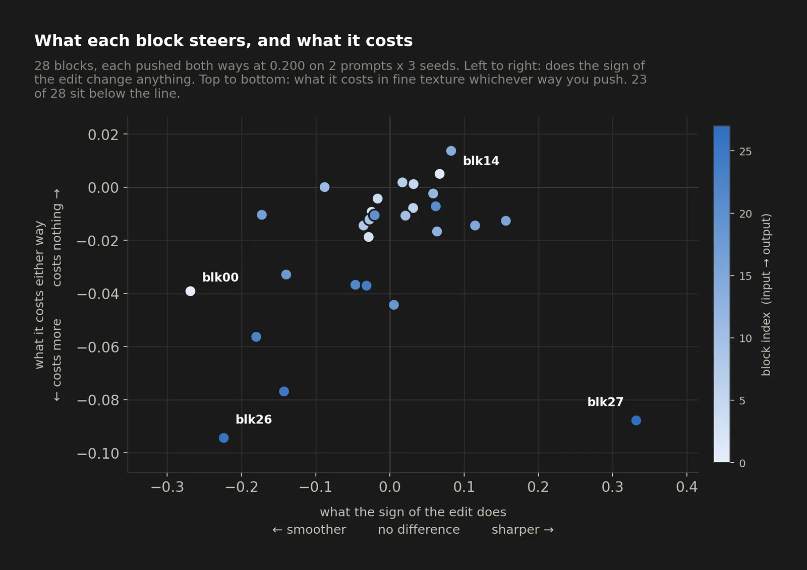
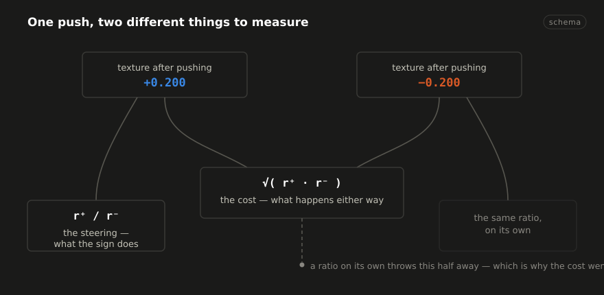
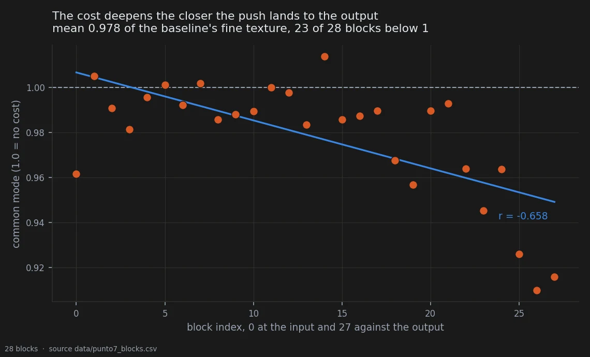
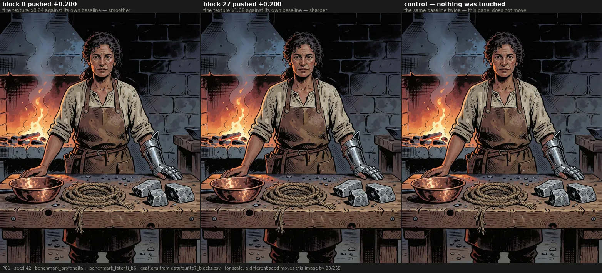
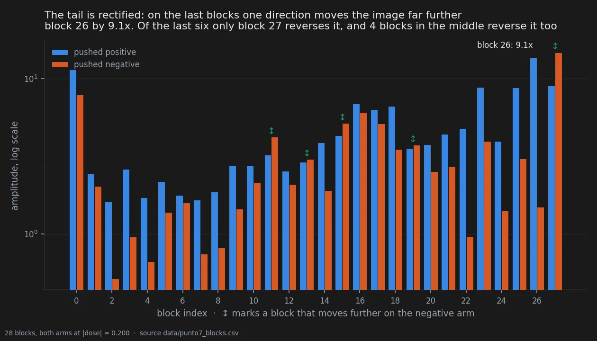

# What an edit steers, and what it costs

> **Holds** · 368 renders · 28 blocks · 2 prompts × 3 seeds · pre-registered 2026-09-20
> [← all experiments](../README.md#what-holds-and-what-does-not)

> **The direction I'm chasing.** Every knob on a machine does two things: the thing you turned
> it for, and the thing you pay for having turned it. I had only ever measured the first. I want
> them separated — what reverses when I push the other way is a **knob** I can aim, and what
> happens either way is a **cost** I can only budget for.
>
> **What would kill it.** Finding that it is all knob. If every effect flips sign with the push,
> there is no hidden tax, and my suspicion — that the quantity I kept computing was throwing
> away the interesting half — is just me being dramatic.
>
> **Where we are.** It is mostly cost, it grows the closer you push to the output, and it had
> been invisible to me for months, because the difference between the two directions is exactly
> the quantity that cancels it.

## In two minutes

Every knob on a machine does two things. It does the thing you turned it for, and it does
something else you did not ask for and have to live with. A volume dial adds hiss. A
sharpening slider adds grain.

For most of this project I had only been measuring the first thing. I would push a block in
one direction, see the picture change, and write down how much. What that cannot tell you is
whether the change *reverses* when you push the other way — and that difference decides
everything. If it reverses, you have a **knob**: something you can aim. If it happens either
way, you have a **cost**: something you pay for touching that part of the model at all.

So this time I pushed all 28 blocks in both directions, at the same strength, and separated
the two.



The answer came out in two halves.

**Almost everything is cost.** Whichever way you push, whichever block you pick, the image
loses fine texture — about 2% of it on average, in 23 blocks out of 28. And the loss is not
spread evenly: it gets worse the closer you get to the output. That is not a knob, it is
friction, and it had been invisible to me because I had only ever looked at the difference
between the two directions, which is exactly the quantity that throws it away.

**A few things really are knobs**, and two of them point opposite ways. The last blocks
sharpen when pushed one way and soften when pushed the other. The *first* block does the same
thing backwards. Two ends of the same network, two knobs, opposite signs.

And one practical thing fell out that I did not expect. On the last blocks the two directions
are wildly unequal: pushing block 26 positive wrecks the picture, pushing it negative barely
moves it — a factor of nine. If you are tuning, the negative side of the tail is the safe
side.

## The verdict

The common mode — what an edit does regardless of its sign — is a cost, and it scales with
depth. Mean 0.978 of the baseline's fine texture, 23 of 28 blocks losing rather than gaining,
correlation with block index r = -0.659, measured at 11 to 14 times the noise floor.

Two knobs exist at the two ends of the backbone and they run in opposite directions: the
first block smooths on a positive push and etches on a negative one; the tail does the
reverse. The tail is also strongly rectified — up to 9.1× more movement in the positive
direction than in the negative — which makes the negative side the safe one for tuning.

Two of the eight frozen predictions were falsified, and both were falsified toward "the model
is more regular than I expected", not less.

## Why I might be wrong

**Two prompts.** Everything here rests on P01 and P02. The noise floor was measured properly
for exactly those two — 18 seeds each, 153 pairs — but two prompts is two prompts, and the
bench recalibration showed that other prompts have two to three times the
seed-to-seed variability. Whether the depth profile looks the same on a prompt with a
different amount of texture to lose is untested.

**The measure is one band.** Everything on this page is fine texture in pixel space. The
latent swing of the tail group reaches 2.00; nothing here reaches it, and prediction P6
confirmed that on purpose — the maximum in pixels is 1.393. These are different bands of the
same phenomenon and the page does not bridge them. Doing so needs both arms in the latent at
single-block resolution, which is 336 renders that do not exist.

**One prediction landed in the grey zone.** P5 allowed up to eight blocks with a strong swing
and would have been falsified at twelve. It found nine. That prediction does not decide
anything, and its threshold was chosen by hand rather than derived from the measured noise —
which is the thing to fix before it is used again.

**The threshold history on this page is not clean, and it is worth knowing.** The noise floor
used to calibrate these predictions was estimated on three seeds at 1.15%, then corrected
upward to 5.2% by borrowing a figure from different prompts, then finally measured on 18 seeds
at 1.65% and 1.83%. In between, conclusions that sit at 11-14σ were briefly declared fragile.
The pre-registration was amended once, before the data existed — verified: the destination
folder held zero files — and that amendment turned out to be worse than what it replaced.
Recorded as pitfall 62.

**The rectification ratios were first published on two different scales, and they shrank when
that was fixed.** The `+0.200` amplitudes came from the dose-response script, which divides by
a σ estimated on three seeds and pooled across both prompts; the `-0.200` amplitudes came from
the verification script, which divides by a σ measured on 18 seeds, per prompt. Dividing one by
the other compares two statistics each standardised on its own data, which is pitfall 33 — and
because three seeds underestimate σ, the positive arm came out inflated. Recomputed with both
arms on the 18-seed scale, block 26 falls from 12.4× to **9.1×** and every other ratio falls
with it. The direction, the ordering and the block-27 reversal all survive; the sizes did not.
Caught by persisting the per-block table to `data/punto7_blocks.csv`, which had previously
existed only in a terminal buffer.

**A correction that was right for the wrong reason.** The amendment predicted that mirror
symmetry would hold in at least 12 blocks, and 17 were found. It was correct, but it was
motivated by a noise floor that was wrong, so it does not count as a successful prediction and
is not cited as one.

## The data

### How it was measured

Each block was pushed on its own, at ±0.200, on two prompts and three seeds: 28 × 2 × 3 × 2 =
336 renders, of which the 168 negative ones are new and the 168 positive ones already existed
in `benchmark_profondita/renders` at the same prompts, seeds and dose.

Fine texture is `std(gray - GaussianBlur(gray, σ=1.5))`, written HF. For each block, with
r⁺ = HF₊/HF_base and r⁻ = HF₋/HF_base, the response splits into two orthogonal components in
log space:

- **common mode** `c = √(r⁺ r⁻)` — what the edit does regardless of direction;
- **swing** `s = r⁺/r⁻` — what the *sign* of the edit does;
- **specularity** `m = r⁺ r⁻` — 1 exactly when `r⁻ = 1/r⁺`, that is when the two directions
  are mirror images of each other.



The ratio used in earlier work is `s` alone. It discards `c` by construction, which is why the
cost had never been seen. The decomposition is also better conditioned: averaging two
measurements cancels noise where differencing them adds it, so `c` carries half the noise of
`s`.



### The numbers

Eight predictions were frozen in `docs/prereg_punto7_simmetria_segno.md` at 14:50, with the
destination folder verified empty. The verification script was written after the renders
completed, implementing the frozen §1 literally.

| | prediction | outcome |
|---|---|---|
| P1 | mean `c` < 1 in [0.94, 0.99]; ≥ 18 blocks below 1 | **confirmed** — 0.978, 23/28 |
| P2 | mean \|log `m`\| > 0.03; fewer than 10 blocks within [0.97, 1.03] | **falsified** — mean 0.048 as predicted, but 17/28 inside |
| P3 | block 0: r⁻ > 1.00, swing < 0.85 | **confirmed** — 1.100, 0.764 |
| P4 | blocks 23/25/26 all with `c` < 0.96 | **confirmed** — 0.945, 0.926, 0.910 |
| P5 | ≤ 8 blocks with \|log `s`\| > 0.10 | **grey zone** — 9 (falsification at ≥ 12) |
| P6 | no swing in pixel space above 1.5 | **confirmed** — maximum 1.393 |
| P7 | block 0 and ≥ 3 of blocks 23-27 with negative amplitude ≥ 3× the median of 1-15 | **falsified** — block 0 yes, but 1 of 5 |
| P8 | corr(index, log `c`) < -0.30 | **confirmed** — **r = -0.659** |

The prediction declared riskiest in advance, P8, passed most clearly. The one declared safest,
P3, also passed. Both failures are informative rather than noise, and both are treated below.

#### The common mode is friction, not a knob

P1 and P8 together are the finding. Mean common mode 0.978: any perturbation, in any
direction, costs on average 2.2% of the image's fine texture, and 23 blocks of 28 go that way.
It holds at 11-14σ against a null built from 612 pairs of baseline renders.

**The cost is not a slope, it is a step.** The correlation against block index is r = -0.659,
but across the first twenty blocks there is no descent at all (r = -0.221), only 13 of 27
consecutive steps go down where chance gives 13.5, and a step model fits 1.7× better than a
line. The break falls at **block 23** — the same block the trajectory-coherence measure found
independently on the positive arm alone. Before it the cost is 1.2%, after it 6.8%.

**And the cost is not damage to the weights.** Repeating the measurement *before* the decoder,
on the six macro groups where latents exist, the common mode is **1.021** — above 1. The
perturbation *adds* high-frequency energy to the latent; the decoder does not deliver it. The
depth gradient vanishes there too (r = -0.05 against -0.74 in pixels), so the depth dependence
is the decoder's, not the model's. This is [pitfall 62](../docs/errors_log.md) at a new scale:
the VAE passes a loss of detail and absorbs a gain.

So the accurate sentence is: **pushing a block injects noise the decoder refuses to render as
detail.** For this notebook's purpose the practical consequence is unchanged — detail lost in
the image is lost — but the mechanism sits downstream of the weights, and so does any remedy.

One dose only. On the norm-matched bench at D = 0.050, across three prompts, the common mode is
1.004 for scaling and 0.997 for rotation: **at that displacement there is no cost at all**. The
toll is not a flat tax, it has a threshold, and where the threshold falls is not yet measured.

#### The first block runs backwards

r⁺ = 0.841 (smooths), r⁻ = 1.100 (etches), swing 0.764 — exactly the reverse of the tail, and
exactly as extrapolated from the macro-group measurement (0.785 in pixels, 0.739 in latent).



The control panel is the same baseline twice, so it does not move at all: at a fixed seed the
null is exactly zero, and every flicker in the other two panels is the edit. For scale, a
different seed moves this same image by 30 of 255 — more than block 0 does. That is the
decorrelation ceiling, not a noise floor, and it is the reason the control here is not two
seeds.

Together with the pre-registered Block_1 / Block_6 separability result of 2026-09-19, this is
the second hypothesis frozen before the data that holds on the asymmetry between the two ends
of the backbone — and the first on a statistic rather than on a distance.

#### The tail is rectified

| block | amplitude at +0.200 | at -0.200 | ratio |
|---|--:|--:|--:|
| 26 | 13.62 | **1.50** | **9.1×** |
| 22 | 4.80 | 0.97 | 5.0× |
| 25 | 8.78 | 3.06 | 2.9× |
| 24 | 3.97 | 1.41 | 2.8× |
| 23 | 8.81 | 3.95 | 2.2× |
| 18 | 6.66 | 3.51 | 1.9× |
| 0 | 11.44 | 7.88 | 1.5× |
| 27 | 8.98 | **14.75** | **0.6×** |

Median across all 28 blocks: 1.60×. Both columns are on one scale — see the correction note
in *Why I might be wrong*.

The tail is strongly rectified: pushed positive it transforms the image, pushed negative it
barely moves. The single exception is block 27, the last one, which is more violent negative
and is also the only tail block with a strong positive swing (1.393, the highest of the 28).
Block 27 is an outlier on every axis here and deserves an experiment of its own.



#### What I got wrong

**P2 falsified, and the model is more regular than predicted.** 17 blocks of 28 sit within 3σ
of a perfectly bidirectional response. Mirror symmetry is the rule, not the exception. The 11
that break it are not scattered — they are blocks 0, 3, 13, 18, 19 and then **every one** of
22 through 27. Symmetry holds where nothing much happens and breaks where something does.

**P7 falsified.** I predicted the extremes would be violent in both directions. They are not —
they are rectified, which is a different and more useful fact. Only one of the five predicted
tail blocks met the criterion.

### The controls

**The floor bench.** 32 renders and 32 latents. The two control renders (P01 and P02 at seed
42) are pixel-identical to the baselines of the earlier benches and the latents are bit-identical,
so the 15 new seeds are comparable. σ(HF) measured across 18 seeds per prompt, 153 pairs each:
**1.65%** on P01 and **1.83%** on P02.

*A note on the gate itself*: the first check failed because the specification asked for the
SHA-256 of the file. A PNG carries its ComfyUI graph in `tEXt` chunks, and the new script
writes a different graph, so file hashes differ at identical pixels. The correct test is on
pixels or on the IDAT stream. That was an error in the task specification, not in the data.

**Composition from single blocks to groups.** The product of single-block swings against the
measured group swing holds within 3% on four groups of six and breaks on the two that contain
the strongest individual effects — the same limit found in the dose-response work, where the
response is sub-linear (median ratio 3.16 against a dose ratio of 4.00). Multiplicative
composition is a good approximation while the regime stays linear.

**What this page deliberately does not use.** Direction measurements in pixel space for
conditions that push several blocks at once. Those sit at the decorrelation ceiling — a pair of
macro-blocks at +0.200 moves the image as far from its baseline as a different seed does — and
carry no information about blocks. The control that settles it: replacing a block with a seed
change does not lower the cosine (0.430 against 0.427). Recorded as pitfall 60.

Single blocks at ±0.200 sit above that ceiling, which is why this page stands: mean correlation
with their own baseline **0.664**, against a ceiling of **0.496** measured on the same corpus
([the bench](00-the-bench.md#the-data)). But the margin is not uniform, and the honest version
of that sentence has a second half: across the 56 individual renders the range runs
**0.493 to 0.789**, so the weakest single render sits *at* the ceiling rather than above it.
The result here rests on cell means, which is where the margin lives; a claim about any single
render would not survive.

An earlier write-up put the ceiling at 0.514 and the single-block figure at 0.660. Both come
out fractionally different when measured on this corpus with every pair counted, and the
notebook now quotes one number for one quantity, from `data/bench_checks.csv`.

The P2 row of the table above used to name the swing `s` where the pre-registration names the
specularity `m`. The verdict was always the specularity one — 17 of 28 blocks mirror-symmetric
within 3σ — and under `s` the same window holds only 8 blocks, which would not have falsified
anything. The pre-registration file was missing from the repository until 2026-09-21, so for a
day this table could not be checked against the document it reports on. All eight rows have now
been recomputed from `data/punto7_blocks.csv` against the restored §3, and P2 was the only one
that needed correcting.

### Reproducing this

```yaml
model:
  checkpoint: krea2_turbo_bf16.safetensors
  weight_dtype: default
  sha256: not recorded — the file is outside the repository; see the note below
sampling:
  sampler: euler_ancestral
  steps: 9
  cfg: 1.0
  denoise: 1.0
  scheduler: simple
  resolution: 1024x1280
  vae: qwen_image_vae.safetensors
tuner:
  node: ArthemyKrea2ModelTuner
  version: not recorded — the tuner is a separate repository
  mode: Real Value, driven by vectors_override
prompts:
  file: data/prompts.json
  ids: [P01, P02]
seeds: [42, 777, 1337]
conditions:
  - name: blkNNneg
    dose: -0.200
    measured_D: not recorded per block; the dose is a gain, not a calibrated displacement
  - name: blkNNpos
    dose: +0.200
    measured_D: not recorded per block; the dose is a gain, not a calibrated displacement
outputs:
  folder: benchmark_profondita_neg/renders
  manifest: no per-render manifest exists for this bench -- data/punto7_blocks.csv holds
    the 28 per-block results, and data/direzioni_blocchi_singoli.jsonl the features of the
    positive arm (168 treatments, 6 baselines) with their dimensions. This field named
    data/punto7_manifest.csv until 2026-09-21; that file has never been in the repository.
analysis:
  script: experiments/verifica_punto7.py
  sha256: d9c9c818c3f50fe67feacdb1efbf14f6f21ae049dcda8887293cdd0717cc2cd1
  produces: data/punto7_blocks.csv
  related: data/bench_checks.csv — the ceiling and the usable-regime margin
  note: >
    UNTIL 2026-09-21 this field claimed that every value above had been read back out of the
    renders by experiments/extract_repro.py, and that the script asserted one sampler
    configuration across all 336 renders. That script did not exist, so neither did the
    verification. The block was typed by hand. What is now provable from the repository is
    printed by experiments/extract_repro.py, which exists as of 2026-09-21 and reads data/
    rather than the renders: resolution 1024x1280 from 174 rows of
    data/direzioni_blocchi_singoli.jsonl. The sampler, the steps and the cfg of this bench
    are recorded nowhere in the repository and remain unverified.
```

## Provenance

* Pre-registration: [`docs/prereg_punto7_simmetria_segno.md`](../docs/prereg_punto7_simmetria_segno.md), deposited 14:50 with the destination folder verified empty
* Measurement files: `data/punto7_blocks.csv` (28 rows: r+, r-, common mode, swing, specularity, both amplitudes)
* Scripts: `experiments/verifica_punto7.py`, `experiments/run_pavimento_rumore.py`, `experiments/analisi_modo_comune.py`
* Renders: `benchmark_profondita_neg/` (168, new), `benchmark_profondita/` (168, pre-existing), `benchmark_pavimento_rumore/` (32)
* Pitfalls that apply: [2](../docs/errors_log.md) (unsigned distance), 43 (averaging over signs), 57 (one-sided sweep), 60 (decorrelation ceiling), 61 (ratio with noise in the denominator), 62 (threshold calibrated on three seeds)
