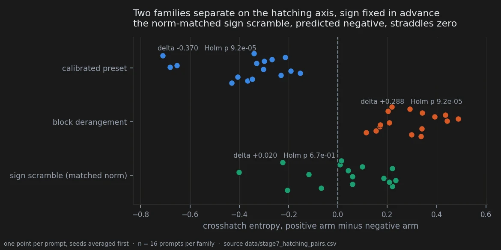
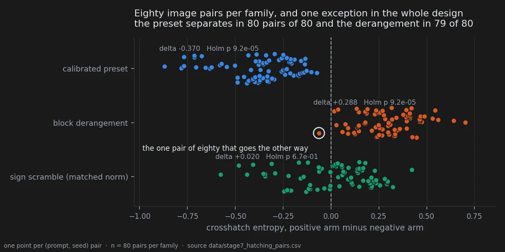

# The hatching axis, and the sign that decides it

> **Holds** · 560 renders · 16 prompts sharing nothing with the corpus that produced the idea
> · pre-registered 2026-09-17
> [← all experiments](../README.md#what-holds-and-what-does-not)

## In two minutes

It started the way most things here start: by looking. Across renders already seen, one edit
seemed to shade with **parallel** strokes when pushed one way and with **cross-hatching** when
pushed the other. The estimate by eye was 95%.

What makes this one different is that nothing had to be scored. Parallel against crossed is a
spread of stroke orientations, and a measure of exactly that — the entropy of local
cross-hatching — had been in the feature set since the first day, computed by an unmodified
script with no human in the loop. So the prediction could be written as a **sign**, per family,
frozen before the next batch existed, with a clause saying that a family reaching significance
with the wrong sign counts as a failure rather than a partial success.

Then it came back, on sixteen prompts sharing no text with the corpus the idea came from.



Two of the three families landed on their predicted side of zero in every single prompt, at the
smallest value the test can return. The third — the sign scramble carrying the same
displacement, which had shown the effect in the exploratory round — was simply not there.

That third failure is the part worth having. Had all three held, the hatching axis would have
been a property of reversing any displacement at all. It is not: it belongs to the two
structured directions, and the control matched to the identical Frobenius norm does not produce
it.

## The verdict

**The primary prediction, as written, was not met.** It was a conjunction over three families,
and one of the three did not fire. Reporting the other two as a success requires saying that
first, because a conjunction that fails is a prediction that failed.

What survives is narrower and, for the argument the notebook is making, stronger. There is an
axis in stroke orientation; the sign of a **structured** displacement decides where you sit on
it; and which sign gives which texture depends on which structured direction you moved in —
where the derangement crosses the strokes, the preset runs them parallel. Both at the exact
permutation floor, both with every prompt and almost every image pair on the predicted side.
The norm-matched scramble does nothing, and its exploratory effect did not replicate.

One reservation is not statistical and is carried in the claims above: the measure was
validated against the eye on the derangement family and never on the preset family, by the
pre-registration's own account, and the check it scheduled to close that gap has no recorded
outcome.

## Why I might be wrong

**The primary was a conjunction and it failed.** Two of three is not three of three. The
document said so at the time and this page says it again, because the temptation to report the
two that worked and call the third a control is exactly the move the clause about wrong signs
was written to block.

**The measure is a proxy, and a better one was deliberately not used.** Crosshatch entropy is a
spread of local orientations, not a count of stroke crossings. The instrument that measures the
phenomenon directly — the histogram of edge-gradient orientations, unimodal for parallel and
bimodal for crossed — exists and was left for a later round on purpose, because swapping the
instrument between the observation and its confirmation would confirm a different claim. That
reasoning is right and it leaves the result resting on a proxy.

**The exploratory numbers on this page cannot be recomputed from the repository.** The
comparison table below quotes the 18-prompt exploratory round from the pre-registration's own
frozen text. `data/style_features.csv` holds 24 prompts across these families and no record of
which 18 the earlier table used; recomputed over all 24 it gives -0.470, +0.257 and -0.152
against the -0.484, +0.274 and -0.187 on record. Close, same signs, not the same numbers, and
the subset that would reconcile them is not in `data/`.

**One prompt family, one model, one aesthetic register.** All sixteen prompts open on
`Western comics style` and contain `hatched shadows`. The axis is measured inside a style that
explicitly asks the model to hatch. Whether a structured displacement does anything at all to a
style that does not hatch is untested, and the honest reading is that it might do nothing. The
pre-registration for that test exists and has not been run.

**The origin was discovery by eye, and the eye is not blind.** The 95% estimate and the 87/90
that quantified it both came from renders already seen, by someone who knew the hypothesis.
That is pitfall 34 and it is why this round exists. It does not touch the confirmation, where
nobody scores anything.

## The data

### How it was measured

Sixteen prompts selected by a rule fixed before the renders, five seeds, seven conditions:
560 images, manifest in `data/stage7b_images.csv`, features in
`data/style_features_stage7.csv`. The quantity is `crosshatch_entropy_mean`, produced by
`style_features.extract_all_features` unchanged — the same function that produced the
exploratory numbers, so the confirmation measures the same thing the observation did.

The statistic is the difference between the positive and the negative arm of a family. Seeds
are averaged inside a prompt first, because the unit of analysis is the prompt and seeds
sharing a prompt are repeated measures on one subject; treating the eighty pairs as eighty
independent observations is pitfall 17. Exact two-tailed sign-flip permutation over the
sixteen prompts, Holm-corrected across the three families.

### The two structured families

| family | predicted sign | Δ observed | Holm p | prompts on the predicted side | image pairs |
|---|---|---|---|---|---|
| **calibrated preset** | negative | **−0.370** | 9.2 × 10⁻⁵ | **16 / 16** | **80 / 80** |
| **block derangement** | positive | **+0.288** | 9.2 × 10⁻⁵ | **16 / 16** | **79 / 80** |
| sign scramble, matched norm | negative | +0.020 | 0.67 | 5 / 16 | 30 / 80 |

9.2 × 10⁻⁵ is the Holm-corrected exact permutation floor at sixteen prompts, 2/2¹⁶ before
correction. It is the smallest value this test can return and it should be read as "below the
resolution of the design", not as a measured quantity.



Eighty pairs of eighty, and seventy-nine of eighty. One image pair in the entire design goes the
other way, and it sits just past zero rather than out among the opposite family. That is what
"the texture is not a lucky render" looks like when it is drawn rather than asserted.

**A number in the published table is counted on a different rule from the two above it, and it
is corrected here.** The earlier write-up gives the sign scramble as 11/16 prompts and 50/80
pairs, in the same column where the preset reads 16/16 and 80/80. Those two count agreement
with the **predicted** sign; the scramble's figures count agreement with its **observed** one.
Under the rule the other two rows use, the scramble is **5/16 and 30/80** — it goes the
predicted way in fewer than half of its pairs. Both readings say the same thing about the
verdict, and only one of them is comparable with the rows beside it. Both are written out in
`data/stage7_hatching_summary.csv`.

### The control that vanished

The sign scramble was not an afterthought. In the exploratory round it was the third family of
a real effect, and it was predicted to repeat.

| | exploratory, 18 prompts | confirmation, 16 new prompts |
|---|---|---|
| calibrated preset | −0.484, 90 pairs of 90 | −0.370, 80 of 80 |
| block derangement | +0.274, 87 of 90 | +0.288, 79 of 80 |
| sign scramble | −0.187, 81 of 90 | **+0.020, 30 of 80** |

The two structured directions held their effect size across an independent corpus of new
subjects — the derangement to within five per cent, which is the closest any exploratory
estimate in this notebook has come to surviving intact. The random one collapsed: the sign
reversed and the concordance fell to a coin.

This is the Experiment 1 argument reproduced on a second visual property: structure rather than
magnitude, with a mechanical measurement and nobody scoring anything. Two points still do not
identify **which** structural property does the work.

The exploratory column is quoted from the pre-registration's frozen text, not recomputed here;
see *Why I might be wrong*.

### The check that was registered, and not recorded

The pre-registration is explicit about why the measure is allowed to stand in for what the eye
saw: `crosshatch_entropy_mean` reproduces, at 87 pairs of 90, a distinction made visually **on
the block-derangement family**. That is the licence, and it covers one family.

It then says, in its own words, that the measure fires on the other two families with different
signs and that this **has not been checked against the eye**; that before stage 7 is analysed
one `preset_pos` / `preset_neg` pair is to be inspected and the outcome recorded; and that if
the predicted direction is not what is seen, *the preset row of the prediction is withdrawn in
writing rather than reinterpreted afterwards*.

**No outcome for that check exists.** The document says "that check is recorded here, with its
date, before the analysis" and the record is not in it, nor anywhere else in `docs/`. The
statistics for the preset row are not in doubt — 16 of 16 and 80 of 80 at the floor, on the same
measurement as the family where the licence was established. What is undetermined is whether
that measurement means *hatching orientation* in this family or something else that moves with
it, which is the question the check was written to settle and the reason the preset claim above
is filed as ambiguous rather than as holding.

Closing it costs one look at one pair of images. Until then, this page reports the preset row
and declines to lean on it.

### Reproducing this

```yaml
model:
  checkpoint: krea2_turbo_bf16.safetensors
  weight_dtype: default
  sha256: not recorded -- the file is outside the repository
  text_encoder: qwen3vl_4b_bf16.safetensors
  vae: qwen_image_vae.safetensors
sampling:
  sampler: euler_ancestral
  steps: 9
  cfg: 1.0
  denoise: 1.0
  scheduler: simple
  resolution: 1024x1280
tuner:
  node: ArthemyKrea2PresetLoader
  version: not recorded -- suite_git_sha ba28b12532175220
  mode: preset_json
  strength_model: 1.0
  strength_clip: 1.0
prompts:
  file: data/stage7b_images.csv
  selection: data/confirmation_prompts.csv
  selected_by: experiments/select_confirmation_prompts.py
  ids: 16 prompt_sha1 values, frozen before rendering
seeds: [42, 777, 1337, 9999, 4242145]
conditions:
  - name: preset_pos
    preset: Arthemy_Bench_Base.json
    measured_D: 0.05381584      # relative, DiT; data/preset_displacements.csv, status PASS
  - name: preset_neg
    preset: Arthemy_Bench_NEG.json
    measured_D: 0.05381584
  - name: blockshuf_pos
    preset: Arthemy_Bench_BLOCKSHUFFLE.json
    measured_D: 0.05381584
  - name: blockshuf_neg
    preset: Arthemy_Bench_BLOCKSHUFFLE_NEG.json
    measured_D: 0.05381584
  - name: rand_pos
    preset: Arthemy_Bench_RANDSIGN.json
    measured_D: 0.05381584
  - name: rand_neg
    preset: Arthemy_Bench_RANDSIGN_NEG.json
    measured_D: 0.05381584
  - name: baseline
    preset: null
    measured_D: 0.0
outputs:
  folder: benchmark_stage7/renders
  manifest: data/stage7b_images.csv
analysis:
  features: data/style_features_stage7.csv
  script: experiments/stage7_hatching_axis.py
  produces:
    - data/stage7_hatching_pairs.csv
    - data/stage7_hatching_summary.csv
  figures: experiments/notebook_charts.py
```

Two gaps a stranger would hit. The renders live outside the repository, so the features file is
the reproducible starting point rather than the images. And `data/preset_displacements.csv`
gives every one of these presets the same relative displacement, 0.05381584 — that is the
design, the controls are matched by construction, and pitfall 45 is the reminder that a
permuted control does **not** inherit the target displacement automatically and has to be
measured, which here it was.

## Provenance

**Pre-registration.** `docs/prereg_hatching_axis_stage7.md`, written 2026-09-17 before any
stage 7 render, carrying the per-family signs, the wrong-sign failure clause, the 14-of-16
secondary concordance threshold, the metric-validity argument and the unrecorded check.

**Measurement files.** `data/style_features_stage7.csv` (600 rows, 560 after the selection),
`data/confirmation_prompts.csv` (the 16 frozen prompt hashes),
`data/stage7b_images.csv` (the manifest with sampler settings and prompt text),
`data/preset_displacements.csv` (measured displacements), and two tables derived here on
2026-09-21: `data/stage7_hatching_pairs.csv` (240 seed-level pairs) and
`data/stage7_hatching_summary.csv` (the family table, with both counting rules named).

**Scripts.** `experiments/stage7_hatching_axis.py`, `experiments/notebook_charts.py`,
`experiments/style_features.py`, `experiments/style_from_manifest.py`,
`experiments/select_confirmation_prompts.py`, `experiments/run_stage7b.py`.

**Written up in.** `docs/reproduce_stage7.md`.

**Read against.** The chromatic confirmation ran on these same 560 renders the same day and
came out the other way round: every colour effect roughly halved and its strongest condition
was the sign scramble, where here the structured conditions hold their size and the scramble
vanishes. Same displacements, same images, opposite patterns, so colour and texture are not two
readings of one signature.

**Pitfalls that apply.** 17 (seeds inside a prompt are repeated measures, so the unit is the
prompt), 34 (the observation that started this came from an expert eye on renders already seen,
which is why a confirmation was needed), 38 (a metric validated against nothing — the
pre-registration argues the licence for one family and declares it missing for another).

Rules 8 and 11 of the fifteen apply to the floor: at sixteen prompts the exact test cannot
return less than 2/2¹⁶, and both structured families sit on it.
