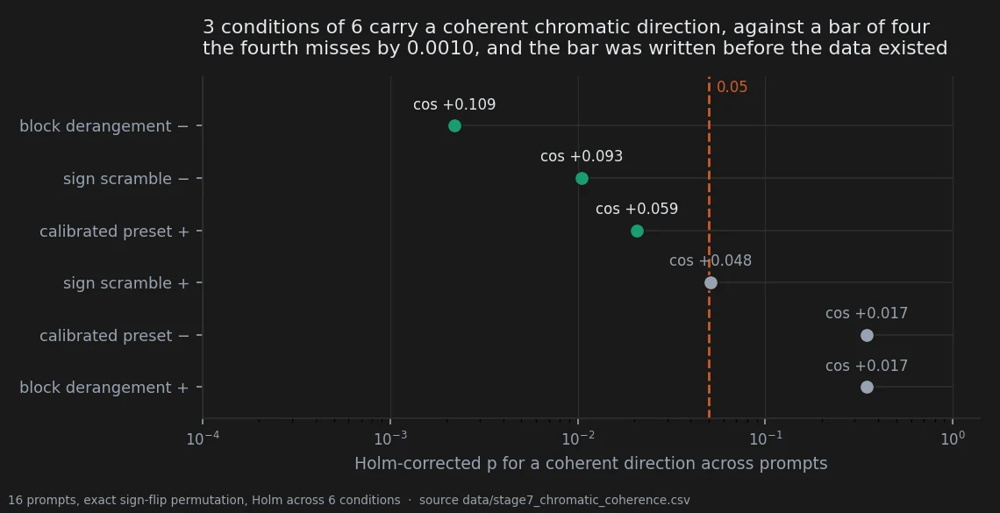
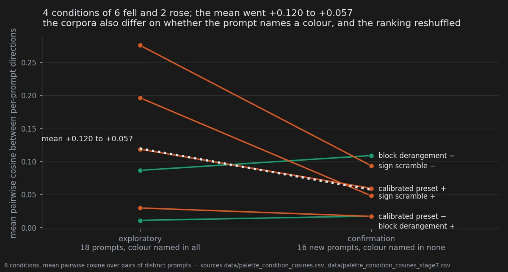

# What the edit does to colour, and what it does not

> **Ambiguous** · 560 renders · 16 prompts, none of them used before · pre-registered
> 2026-09-16, amended before the renders existed
> [← all experiments](../README.md#what-holds-and-what-does-not)

> **The direction I'm chasing.** The interesting claim is not "the preset changes colour" — that
> one is easy and dull. It is that **every** displacement leaves a chromatic fingerprint of its
> own, the scramble included, each pushing the palette somewhere different. If that holds,
> colour reads out *which* edit was applied, rather than merely reporting that one was.
>
> **What would kill it.** Conditions that all drag the palette the same way. Each would look
> perfectly coherent on its own and there would be no signature anywhere — which is why one test
> was never going to be enough, and why the pre-registration wrote two.
>
> **Where we are.** Split down the middle. The conditions do move colour in directions that
> differ from each other, twice now, at the floor of the test. The signature-per-edit claim came
> back three of six against a bar of four, and I am not rounding it up.

## In two minutes

The idea was that every weight edit leaves its own fingerprint on colour — not just the
calibrated preset, but the sign scramble too, each pushing the palette in a direction of its
own. That is a stronger claim than "the preset changes colour", and it was written down as two
separate tests with their thresholds fixed before a single confirmation render existed.

One came back yes. The other came back three of six, against a bar of four.



Three is not four, and the pre-registration had already said what to do about three: report it
as ambiguous, do not round it up. The condition that would have made it four misses the
corrected threshold by one part in a thousand. That single dot, sitting a hair on the wrong
side of a line drawn before the data existed, is the entire reason the line was drawn first.

What did hold is the second test, and it is the one worth having: the conditions move colour in
directions that **differ from one another**. That has now landed on the floor of its
permutation test twice, on two corpora with no prompt in common.

So: *different displacements move colour differently* is the claim the notebook carries.
*Every displacement has its own chromatic signature* is the claim that failed.

## The verdict

The page is filed ambiguous, and it is filed that way on purpose even though one of its two
registered primaries was confirmed. The thing the page is named for — a chromatic signature per
edit — is the test that returned three of six, and the contract says an ambiguous result is
written as ambiguous and never rounded up. The distinction it turns on is not cosmetic.

Beneath that, two solid things and one open one. Solid: the conditions are distinguishable from
each other in colour space, twice, at the floor. Also solid, in the uncomfortable direction:
the effects on this corpus are about half the exploratory estimate, which is the third time
this notebook has watched that happen.

The open one is why they halved. There are two explanations, the design cannot separate them,
and the second was hiding in this repository's own earlier work the whole time.

## Why I might be wrong

**The corpus did not meet its own coverage requirement.** The amendment asked for four prompts
in each of four 90° hue arcs. The selection returned fourteen in the first arc, one in the
second, one in the fourth and **none in the third**. The rule executed as written and filled
the shortfall from the largest arc; the candidate pool simply did not contain what was asked
for. The lesson is specific and is now pitfall 31: hue is a property of the render, not of the
prompt text, so a criterion stated on measured hue can only be enforced by looking at images
and then choosing. Note the direction of that bias — a corpus of more similar prompts should
make cross-prompt coherence **easier** to detect, not harder, so it does not excuse the result.

**The shrinkage has a second explanation, and the design cannot separate it from the first.**
The account offered at the time was regression from an inflated exploratory estimate. Here is
the other one:

| | colour-pinned prompts | mean within-condition coherence |
|---|---|---|
| exploratory, 18 prompts | **18 of 18** | +0.120 |
| confirmation, 16 prompts | **0 of 16** | +0.057 |

Every prompt in the exploratory set names a colour — `monochromatic <colour>`, or a
colour-tinted rim light. Not one prompt in the confirmation set does. The mark-style work had
already established, on a different colour instrument, that the palette effect is present where
the prompt pins the palette and vanishes where it does not, and the confirmation was then run
entirely on the side where that predicts little to find. The corpus changed on that variable at
the same time as it changed from exploratory to confirmatory, and the two cannot be untangled
afterwards. That is a design error and it belongs to this pre-registration, which fixed the
statistics, the thresholds and the script hashes and did not fix the one prompt property
already known to govern the effect being measured.

**The ranking of conditions is partly a ranking of what was measured best.** Cross-prompt
coherence is attenuated by measurement error and the conditions do not share an error level.
The ordering here correlates with each condition's own split-half reliability at r = +0.877,
p = 0.022. The order survives disattenuation and the verdict stands, but a reader comparing
`block derangement −` against `calibrated preset +` is partly comparing precision. That is
pitfall 36.

**A frozen script was not at its frozen hash.** Recorded in full below; it is inert here and it
is still a broken freeze.

**One instrument, one framing.** Six swatches plus paper and ink, on close-up character
portraits where the swatches are dominated by skin and paper whatever the scene describes.

## The data

### How it was measured

Sixteen prompts sharing no `prompt_sha1` with any earlier stage, five seeds, seven cells —
baseline plus six conditions: 560 renders, verified before analysis as sixteen prompts by seven
by five with no cell short of a seed and no duplicates.

The feature space is colour and nothing else: six palette swatches plus paper and ink, each as
(L\*, a\*, b\*), giving 24 dimensions. Hue in degrees is circular and cannot be averaged or
subtracted — 359 and 1 are two degrees apart, not 358 — so a\* and b\* are reconstructed from
chroma and hue. Mass shares stay out; they are composition, not colour.

Every vector is a **difference** from the same prompt at the same seed in baseline. On absolute
features the between-subject variance dominates and the analysis measures which character is
depicted, which is pitfall 19. Seeds inside a prompt are averaged first, because the unit of
analysis is the prompt (pitfall 17). Each dimension is then divided by its standard deviation
over the set of differences, and each prompt's vector is normalised.

Two tests, both fixed in advance:

- **coherence** — for one condition, the mean pairwise cosine between its per-prompt direction
  vectors. Null: exact sign-flip permutation across the sixteen prompts, Holm across the six
  conditions. Confirmed at four of six surviving; refuted at two or fewer; **three ambiguous
  and reported as such**.
- **distinctness** — mean within-condition coherence minus the mean absolute cosine between
  different conditions, both over pairs of *distinct* prompts so that prompt structure cannot
  enter on one side only. Null: permutation of the condition labels inside each prompt,
  10 000 draws. Confirmed at p < 0.05.

The absolute value on the between-condition term matters: a pos/neg pair sitting at −1 would be
maximally aligned, not independent, and has to count as such.

### Three of six, and the bar was four

| condition | cosine | p | Holm | survives |
|---|---|---|---|---|
| block derangement − | +0.109 | 3.7 × 10⁻⁴ | 2.2 × 10⁻³ | **yes** |
| sign scramble − | +0.093 | 2.1 × 10⁻³ | 1.1 × 10⁻² | **yes** |
| calibrated preset + | +0.059 | 5.2 × 10⁻³ | 2.1 × 10⁻² | **yes** |
| sign scramble + | +0.048 | 1.7 × 10⁻² | **5.10 × 10⁻²** | no |
| calibrated preset − | +0.017 | 1.7 × 10⁻¹ | 3.5 × 10⁻¹ | no |
| block derangement + | +0.017 | 2.0 × 10⁻¹ | 3.5 × 10⁻¹ | no |

Three. The registered rule read: four or more confirmed, two or fewer refuted, three ambiguous
and reported as ambiguous rather than rounded up. So: ambiguous.

There was also a **directional** secondary, and it failed on its own terms. The prediction named
*which* four would survive — sign scramble in both directions, preset positive, derangement
negative — and the observed three are derangement negative, sign scramble negative and preset
positive. Three of the four named, with the sign scramble's positive arm dropping out. The
prediction was about which, not how many, and the set does not match.

### The directions differ, and that is the claim that holds

Within-condition coherence **+0.057**. Mean absolute cosine between different conditions
**+0.023**. Difference **+0.035**, against a label-permutation null whose mean is −0.003 and
whose 95th percentile is +0.007. **p = 1 × 10⁻⁴**, which is the Monte Carlo floor at 10 000
draws rather than a measured value.

This is the second independent corpus on which that statistic has hit its floor. It is also the
test that does not depend on any single condition clearing a threshold, which is why it
survives a corpus where four of six individually do not.

Read the two together and the shape of the result is: the six conditions are **distinguishable
from one another** in colour space, while **only some of them** are individually consistent
enough across subjects to be called a signature.

### What shrank, and the confound that explains it just as well



| condition | exploratory, 18 prompts | confirmation, 16 new |
|---|---|---|
| sign scramble − | +0.276 | +0.093 |
| sign scramble + | +0.196 | +0.048 |
| calibrated preset + | +0.119 | +0.059 |
| block derangement − | +0.087 | **+0.109** |
| block derangement + | +0.030 | +0.017 |
| calibrated preset − | +0.011 | +0.017 |
| **mean** | **+0.120** | **+0.057** |

The mean halved. The two conditions that were strongest collapsed to roughly a third, and the
condition that was fourth is now first. The power curve in the amendment assumed the true effect
equalled the exploratory one and predicted about 100% power at sixteen prompts; the true effect
is about half that, and the sentence "sixteen is a floor, not a margin" turned out to be the
operative one.

Whether that is regression to the mean or the colour-pinning confound is exactly what this
design cannot say. **The test that separates them is cheap**: matched pairs, the same subject
written twice — once with the colour-pinning clause and once without — rendered in one run under
the same six conditions and the same five seeds, with the coherence compared between the two
arms. If the pinned arm returns to about +0.12 while the free arm stays near +0.06, prompt-stated
colour is the governing variable and the confirmation was run on the wrong side of it. If both
sit near +0.06, the exploratory estimate was simply inflated and the ambiguous verdict stands on
its own feet. That test has not been run.

Until it does, this page must not be read as *colour signatures are weak*. It reads as: **tested
on prompts that do not name a colour, three conditions of six carry a coherent chromatic
direction, and whether naming a colour changes that is an open and registered question.**

### Colour and texture are not one signature

The hatching confirmation ran on these same 560 renders, the same day, and came out the other
way round.

| | colour, here | texture, on [the hatching axis](06-the-hatching-axis.md) |
|---|---|---|
| effect sizes against the exploratory round | roughly halved | held, one within 5% |
| the norm-matched sign scramble | among the strongest conditions | absent, and its exploratory effect did not replicate |

Same displacements, same images, opposite patterns. So these are not two readings of one
signature. Texture responds to the sign of a *structured* displacement, close to
deterministically. Colour responds to displacement more diffusely and does not tell structure
from noise in the same way. Whatever these perturbations turn out to be doing has to account
for both, and nothing here does.

### The deviations, recorded

**The frozen script was not at its frozen hash.** `analyze_palette_coherence.py` read
`1888908f95cf` against the registered `1d07551eadcd`. The cause: a reporting bug was fixed in
that script — it printed the exact permutation floor while running Monte Carlo above sixteen
prompts — hours after the document naming its hash was written. That is pitfall 32. The frozen
version was reconstructed by inverting the patch, hashes to `1d07551eadcd` exactly, and the
analysis on record is that script's output; the current version then produced identical numbers
to every printed digit, because at sixteen prompts both take the exact enumeration path and the
edit touched only the Monte Carlo branch and a print statement. The deviation is inert here. It
is recorded because a freeze honoured only when convenient is not a freeze.

**The coverage requirement was not met**, as described above, and its failure mode is pitfall 31.

**A centering convention differs between two scripts in this family.**
`analyze_palette_coherence.py` divides by σ without centering; the stage 9 script subtracts the
joint mean. Subtracting a common vector that is not a group's own mean leaves a shared −μ
component in every one of its vectors, which inflates apparent agreement. That is pitfall 37,
and it is why coherence numbers from the two scripts are not comparable with each other. Every
number on this page comes from the first.

### Reproducing this

```yaml
model:
  checkpoint: krea2_turbo_bf16.safetensors
  weight_dtype: default
  sha256: not recorded -- the file is outside the repository
  text_encoder: qwen3vl_4b_bf16.safetensors
  vae: qwen_image_vae.safetensors
sampling:
  sampler: euler_ancestral
  steps: 9
  cfg: 1.0
  denoise: 1.0
  scheduler: simple
  resolution: 1024x1280
tuner:
  node: ArthemyKrea2PresetLoader
  version: not recorded -- suite_git_sha ba28b12532175220
  mode: preset_json
  strength_model: 1.0
  strength_clip: 1.0
prompts:
  file: data/stage7b_images.csv
  selection: data/confirmation_prompts.csv
  selected_by: experiments/select_confirmation_prompts.py
  ids: 16 prompt_sha1 values, hashed and frozen before rendering
  note: no prompt_sha1 shared with stage 4, 5 or 6, verified before analysis
seeds: [42, 777, 1337, 9999, 4242145]
conditions:
  - name: preset_pos
    preset: Arthemy_Bench_Base.json
    measured_D: 0.05381584      # relative, DiT; data/preset_displacements.csv, status PASS
  - name: preset_neg
    preset: Arthemy_Bench_NEG.json
    measured_D: 0.05381584
  - name: blockshuf_pos
    preset: Arthemy_Bench_BLOCKSHUFFLE.json
    measured_D: 0.05381584
  - name: blockshuf_neg
    preset: Arthemy_Bench_BLOCKSHUFFLE_NEG.json
    measured_D: 0.05381584
  - name: rand_pos
    preset: Arthemy_Bench_RANDSIGN.json
    measured_D: 0.05381584
  - name: rand_neg
    preset: Arthemy_Bench_RANDSIGN_NEG.json
    measured_D: 0.05381584
  - name: baseline
    preset: null
    measured_D: 0.0
outputs:
  folder: benchmark_stage7/renders
  manifest: data/stage7b_images.csv
analysis:
  features: data/palette_features_stage7_all.csv
  frozen_script: experiments/analyze_palette_coherence.py
  frozen_hash: 1d07551eadcd
  produces: data/palette_condition_cosines_stage7.csv
  persisted_by: experiments/stage7_chromatic_coherence.py
  produces_table: data/stage7_chromatic_coherence.csv
  figures: experiments/notebook_charts.py
```

`experiments/stage7_chromatic_coherence.py` does not re-implement the analysis. It imports the
frozen module's own functions, repeats its orchestration, and refuses to write anything unless
every recomputed coherence agrees with `data/palette_condition_cosines_stage7.csv` — the matrix
the frozen run wrote — to four decimals. It adds the Holm column, the pass/fail against the
registered bar and the exploratory comparison, none of which existed in a file.

## Provenance

**Pre-registration.** `docs/prereg_chromatic_signatures.md`, written 2026-09-16 with the two
tests, the four-of-six bar, the explicit instruction not to round three up, the directional
secondary, the corpus rule and the frozen script hashes; amended 2026-09-17 before any
confirmation render; result and two deviations recorded in the same document; addendum the same
evening recording the colour-pinning confound after the result was written.

**Measurement files.** `data/palette_features_stage7_all.csv` (the 560-row feature table),
`data/palette_condition_cosines_stage7.csv` (the frozen run's matrix),
`data/palette_condition_cosines.csv` (the exploratory matrix, 18 prompts),
`data/confirmation_prompts.csv`, `data/stage7b_images.csv`, `data/preset_displacements.csv`,
and `data/stage7_chromatic_coherence.csv`, derived here on 2026-09-21.

**Scripts.** `experiments/analyze_palette_coherence.py` (frozen),
`experiments/stage7_chromatic_coherence.py`, `experiments/notebook_charts.py`,
`experiments/palette_from_manifest.py`, `experiments/analyze_palette.py`,
`experiments/palette_stage4_baseline.py`.

**Written up in.** `docs/reproduce_stage7.md`.

**Pitfalls that apply.** 17 (seeds inside a prompt are repeated measures), 19 (paired
differences rather than absolute features, or the analysis measures which character is
depicted), 31 (a stratification criterion that can only be checked after rendering — this
corpus is the registry's own example), 32 (a script edited after its hash was frozen — likewise),
36 (a ranking that is partly a ranking of what was measured best), 37 (two coherence statistics
computed under different centering conventions).
