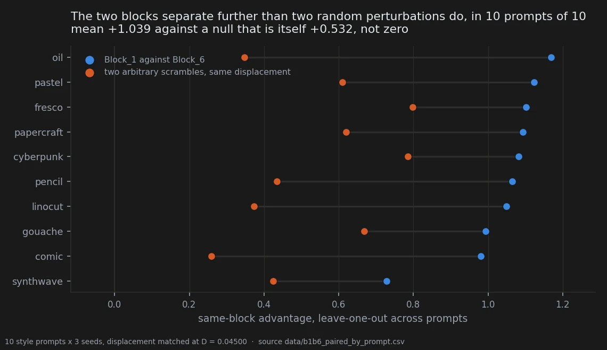
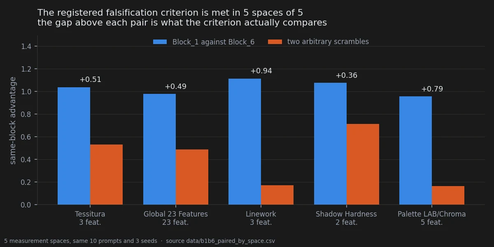

# Two places in the model, pushed the same distance

> **Holds** · 210 renders · 10 style prompts, 3 seeds · pre-registered 2026-09-18 at 23:10,
> two hours and nineteen minutes before the first render landed
> [← all experiments](../README.md#what-holds-and-what-does-not)

## In two minutes

[The pilot sweep](04-where-in-the-model.md) could pose the question and not answer it: does it
matter *where* you push, or only how far? Its metric was an unsigned distance, its cells had one
seed, and nothing was matched. This is the version written to settle it — one hypothesis, no
alternatives, thresholds and formula frozen before a single image existed.

The design does the matching by construction. Displacement does not scale linearly with a
rotation angle, so the angles were solved numerically against the checkpoint until the two
groups moved the weights by the same amount: 23.69° for the first group and 32.21° for the last,
both landing at D = 0.045 with a residual difference of 0.0000006. Whatever separates them, it
is not how far they went.



The two groups' directions are tellable apart in all ten prompts, at the smallest value the test
can return. And the control that makes it mean something: two *arbitrary* perturbations of the
same size also separate from each other — the null is +0.532, not zero — and the real pair still
beats it in every prompt.

What the page does not show is that the difference is about *function*. The last group sits
against the output. That alternative is untouched here, and the experiment built to settle it
did not.

## The verdict

Two block groups, displaced by identical amounts, imprint directions on image texture that a
leave-one-out test tells apart in ten prompts of ten, at the exact permutation floor. The
registered falsification criterion — that the pair must separate further than two random
perturbations of the same size — is met in the primary space and in all four secondary ones.

In the primary space the two directions are close to orthogonal: cross-block cosine −0.062 raw,
−0.065 after disattenuation. They are not opposite ends of one axis; they are different axes.

This is the strongest confirmatory result in the notebook by margin and by concordance. It is
also the narrowest in what it licenses: **separability is not specialisation.** The next section
says why, and the question it leaves open is still open.

## Why I might be wrong

**Separability at the two ends is compatible with a plain depth effect.** The last group is
blocks 24–27, immediately upstream of the final projection to the decoder; the first is blocks
0–4. A perturbation at the end acts on representations that have already converged and lands
directly on high-frequency detail. The directional divergence is consistent with a genuine
division of labour *and* with the ordinary fact that the two ends of a transformer behave unlike
its middle. Nothing here separates the two readings.

**The experiment built to separate them did not.** The triangle added a middle group, and its
Block_3-against-Block_6 side has no null anchored on Block_6, so it was never measured; its
Block_1-against-Block_3 side does not separate from the null under the aggregation rule now
declared. The question stays open and is recorded as open in
`docs/rotations_block1_vs_block6_results.md` §2.

**The null is large, and that is the interesting part.** Two arbitrary scrambles at the same
displacement separate from each other at +0.532, itself at the floor. Most of what the
leave-one-out statistic measures is therefore not anatomy — it is that any two distinct
perturbations leave distinguishable traces. The finding is the *excess* over that, +0.506, and a
reader who takes +1.039 as the effect size is double-counting.

**No middle group, and no third arm.** Two groups at one displacement, one rotation family. The
pilot's amplitude family is not represented here, which matters for the first block (below).

**The coherence numbers set a ceiling the cross-cosine is read against.** Cross-block cosine is
attenuated by measurement error and the two groups are not measured with equal precision; the
disattenuated figure is reported alongside the raw one for that reason, and it is pitfall 36.
Here the two coherences are both high and nearly equal, 0.949 and 0.958, so the correction barely
moves anything — which is the one case where the raw number can be trusted.

**Three seeds per cell.** Enough to average the antisymmetric component, not enough to measure
per-cell noise.

## The data

### How it was measured

Ten style prompts, three seeds, seven conditions — baseline, the two groups at ±θ, and two
independent scrambles: 210 renders, manifest in
`data/rotations_block1_vs_block6_manifest.csv`. The prompts are the ten of the enlargement
corpus, sharing no text with the pilot sweep.

The quantity is the **antisymmetric** component of the response, averaged over seeds:

$$A_b(p) = \tfrac{1}{3}\sum_{s} \tfrac{\Delta_{b,s}(+\theta_b) - \Delta_{b,s}(-\theta_b)}{2}$$

where each Δ is the treated feature vector minus its own baseline at the same prompt and seed.
The antisymmetric half is chosen because it is what reverses with the sign of the edit, and
because it is invariant to the centering convention — subtracting any constant from every delta
cancels in (Δ⁺ − Δ⁻)/2. That is the convention that sank an earlier test elsewhere in this
notebook.

The statistic is a leave-one-out same-block advantage, frozen in §1 of the pre-registration: for
each prompt, how much more its direction agrees with the *other nine prompts of its own group*
than with the other nine of the other group, symmetrised over the two groups. Seeds are averaged
first; the unit of analysis is the prompt (pitfall 17). Exact two-tailed sign-flip permutation
over the ten prompts, floor 2/2¹⁰ = 0.00195.

The primary space is three texture features — GLCM contrast, GLCM homogeneity, LBP entropy —
declared in advance, with four secondary families corrected separately.

### The advantage, and the null it had to beat

| | mean | p | positive prompts |
|---|---|---|---|
| **same-block advantage** | **+1.0386** | **0.00195** | **10 / 10** |
| the same statistic on two arbitrary scrambles | +0.5323 | 0.00195 | — |
| **paired advantage, prompt by prompt** | **+0.5063** | **0.00195** | **10 / 10** |

Both p-values are the exact floor: at ten prompts the test cannot return less, and every prompt
agreeing is the only way to reach it. The paired difference ranges from +0.297 to +0.821 — no
prompt comes close to reversing.

The pre-registration states the falsification criterion as a bare inequality, V̄ > V̄_scramble,
without a test on the difference. The paired version above is stricter than what was registered
and it passes, so the criterion is met under either reading. It is derived here, not registered.



| space | features | advantage | scramble null | gap |
|---|---|---|---|---|
| **Texture (primary)** | 3 | +1.0386 | +0.5323 | **+0.5063** |
| Global | 23 | +0.9777 | +0.4881 | +0.4896 |
| Linework | 3 | +1.1138 | +0.1715 | **+0.9423** |
| Shadow hardness | 2 | +1.0754 | +0.7134 | +0.3620 |
| Palette | 5 | +0.9561 | +0.1633 | +0.7928 |

The advantage barely moves across spaces — 0.96 to 1.11 — while the null swings from 0.16 to
0.71. What changes between spaces is how distinguishable two *random* perturbations are, not how
distinguishable these two blocks are.

### The geometry

| | first group | last group |
|---|---|---|
| within-block coherence across prompts | **+0.9491** | **+0.9578** |
| antisymmetric share of the response | 0.54 | 0.42 |

Cross-block cosine in the primary space: **−0.0615** raw, **−0.0645** disattenuated. The two
directions are as close to orthogonal as a measurement of this kind gets. They are not one axis
with two signs.

### What this says about the first block

The pilot read the first group as **unstable rather than positional**: its rotation signature
was nearly normal at 15° and ×3.14 by 30°, it did not replicate under amplitude scaling, and it
had the highest seed-to-seed variance of any group. Here, at a displacement matched by
construction and a moderate 23.69°, its within-block coherence is **0.949** — as high as the last
group's, and far above the 0.65 the pilot estimated across 23 features.

Both readings can be true: a block that behaves coherently at a matched, moderate push and breaks
down at a large unmatched one. But the pilot's angles were **not** displacement-matched, which is
precisely the confound this design was built to remove, and the amplitude family is not
represented here at all. So the claim above is filed as ambiguous rather than overturned: two
families disagree, and only one of them was run under matched conditions.

### Reproducing this

```yaml
model:
  checkpoint: krea2_turbo_bf16.safetensors
  weight_dtype: default
  sha256: not recorded -- the file is outside the repository
  text_encoder: qwen3vl_4b_bf16.safetensors
  vae: qwen_image_vae.safetensors
sampling:
  sampler: euler_ancestral
  steps: 9
  cfg: 1.0
  denoise: 1.0
  scheduler: simple
  resolution: 1024x1280
tuner:
  node: per-block rotation of the DiT weights, angles solved offline
  version: not recorded
  mode: block-group rotation at matched displacement
prompts:
  file: data/rotations_block1_vs_block6_manifest.csv
  ids: [S01_oil, S02_linocut, S03_cyberpunk, S04_gouache, S05_pencil,
        S06_pastel, S07_comic, S08_papercraft, S09_fresco, S10_synthwave]
seeds: [42, 1337, 4242145]
conditions:
  - name: Block_1_pos
    angle_deg: 23.69
    measured_D: 0.045002      # solved numerically against the checkpoint, not nominal
  - name: Block_1_neg
    angle_deg: -23.69
    measured_D: 0.045002
  - name: Block_6_pos
    angle_deg: 32.21
    measured_D: 0.045001      # |D_1 - D_6| = 0.0000006, against a gate of 0.0002
  - name: Block_6_neg
    angle_deg: -32.21
    measured_D: 0.045001
  - name: scramble_A
    angle_deg: 23.69
    measured_D: 0.045001      # Rademacher signs per tensor, generator seed 20260919
  - name: scramble_B
    angle_deg: 23.69
    measured_D: 0.045002      # second independent realisation, generator seed 20260920
  - name: baseline
    angle_deg: 0
    measured_D: 0.0
outputs:
  folder: benchmark_rotations_b1b6/renders
  manifest: data/rotations_block1_vs_block6_manifest.csv
analysis:
  features: data/rotations_block1_vs_block6_style_features.csv,
    data/rotations_block1_vs_block6_palette_features.csv
  scripts:
    - experiments/run_rotations_block1_vs_block6.py
    - experiments/extract_block1_vs_block6_features.py
    - experiments/analyze_block1_vs_block6.py
  persisted_by: experiments/b1b6_paired_advantage.py
  produces:
    - data/b1b6_paired_by_prompt.csv
    - data/b1b6_paired_by_space.csv
  figures: experiments/notebook_charts.py
```

Every displacement above is **solved and measured** against the checkpoint rather than set
nominally, including the two scrambles. That is the whole point of the design: a permuted or
sign-flipped control does not inherit the target displacement automatically and has to be
measured (pitfall 45), and a relative Frobenius displacement over the whole checkpoint is not a
portable dose unit between two groups of different size (pitfall 44). Here both were handled by
solving the angles rather than assuming them.

## Provenance

**Pre-registration.** `docs/prereg_rotations_block1_vs_block6.md`, committed 2026-09-18 at
23:10:13 with the single hypothesis, the leave-one-out formula written out, the primary space
named, the matched-displacement calibration and the falsification criterion. The renders and
their features arrived in the next commit two hours and nineteen minutes later, and the results
document publishes that git audit itself — which is the cheapest way to show a freeze was a
freeze, and the first time this notebook does it.

**Results and reservations.** `docs/rotations_block1_vs_block6_results.md`, whose §2 records the
three structural limits, including the specialisation-against-proximity confound that is still
open.

**Measurement files.** `data/rotations_block1_vs_block6_manifest.csv` (210 rows),
`..._style_features.csv` and `..._palette_features.csv`, `..._prompt_scores.csv` (the 10
per-prompt values of both statistics), `..._results.csv` (the five spaces), and two tables
derived here on 2026-09-21: `data/b1b6_paired_by_prompt.csv` and `data/b1b6_paired_by_space.csv`.

**What it did not settle.** The triangle experiment, `Block_1`/`Block_3`/`Block_6`, was built to
add the middle and decide between specialisation and proximity. Its verdict is **not
determined**: see `docs/rotations_triangolo_block1_block3_block6_results.md` §1-bis, which
records why — a missing null anchored on `Block_6`, and a floor chosen among exchangeable nulls
after the data were seen.

**Pitfalls that apply.** 17 (seeds inside a prompt are repeated measures, so the unit is the
prompt), 36 (coherence attenuates a cross-block cosine, so the disattenuated value is published
beside the raw one), 44 (a whole-checkpoint relative displacement is not a portable dose unit
between groups), 45 (a scrambled control does not inherit the target displacement — here both
scrambles were measured).
