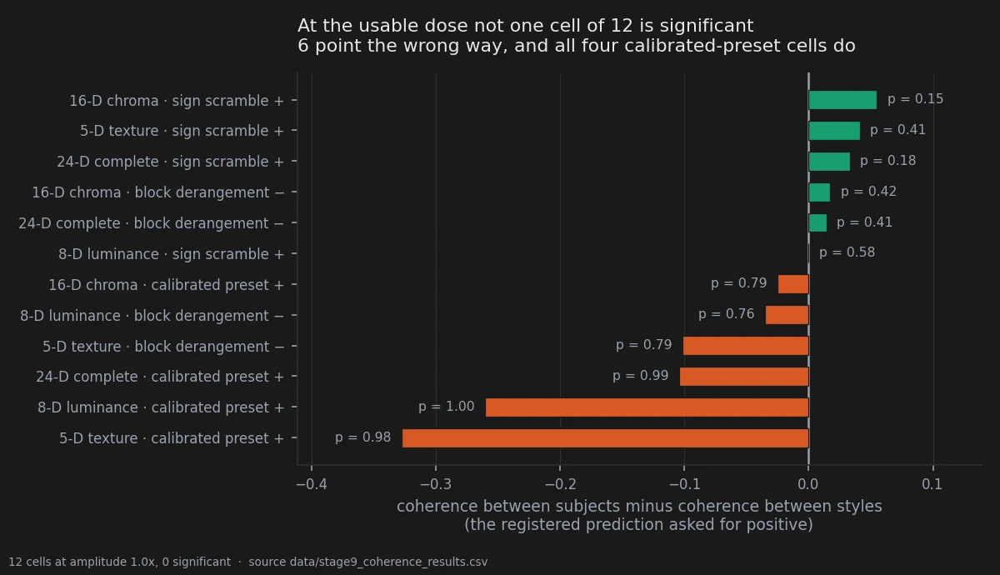
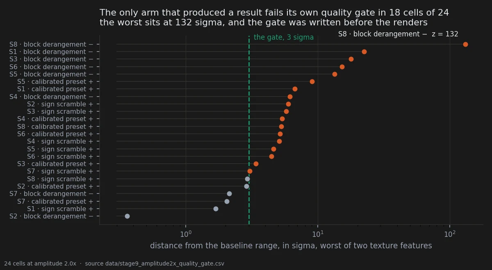
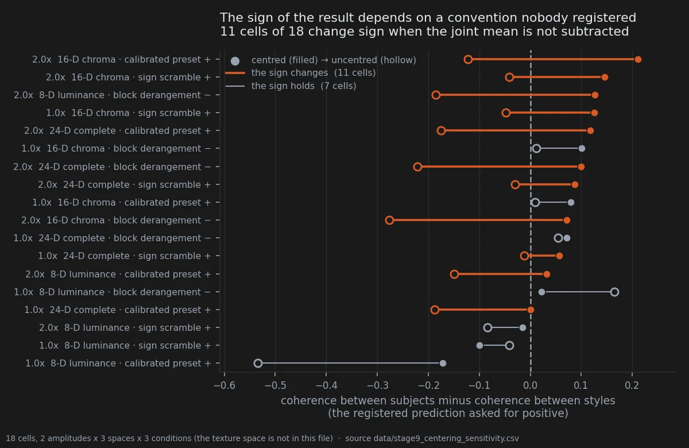

# Eight styles, one direction, and a design that cannot say why

> **Overturned** · 280 renders · 8 style prompts against 18 subject prompts, 5 seeds each ·
> pre-registered 2026-09-18 at 08:55, amended at 11:25 with the queue at 220 renders of 300
> and nothing yet extracted
> [← all experiments](../README.md#what-holds-and-what-does-not)

> **The direction I'm chasing.** If a push on the weights is a real thing, it should do the
> same real thing everywhere — one edit, one direction, no matter what I ask the model to
> draw. But the same preset kept *looking* like a different edit on a watercolour than on a
> photograph, and that is a fork in the road. Either the displacement carries a direction of
> its own and the prompt only decorates it, or the style I name is what decides where the push
> lands. I wrote down the version I believed — that the declared style matters more than the
> subject — and froze the test around it before I could talk myself out of it.
>
> **What would kill it.** Styles that disagree with each other *less* than subjects do. If
> eight prompts as far apart as photography, watercolour, low-poly, claymation, ukiyo-e, pixel
> art, stained glass and charcoal all get pushed the same way, while eighteen different
> characters get pushed eighteen ways, then my hypothesis is not merely unsupported. It is
> backwards.
>
> **Where we are.** It came back backwards. And the part I have to say out loud is that I
> cannot claim the reverse either: the eight styles share one scene and the eighteen subjects
> do not, so what I may have measured is the scene.

## In two minutes

The quantity is a cosine. Take one perturbation, hold it fixed, and ask how much the eight
style prompts agree with each other about the direction it moves the picture in. Do the same
for the eighteen subject prompts of [the chromatic corpus](07-chromatic-signatures.md). The
registered prediction was that styles would agree **less** — that is what "the direction
depends on the declared style" means when you write it down as a number. So the statistic is
subject coherence minus style coherence, and the prediction asked for it to come out positive.



At the dose this project actually uses, nothing reaches significance and half the cells point
the wrong way. The calibrated preset — the edit the rest of the notebook is about — is on the
wrong side in all four measurement spaces, by as much as −0.33 in texture. The eight styles do
not scatter. They agree.

Five cells did come back significant, and all five live at double amplitude. That arm fails the
quality gate written for it before the renders finished, its displacement was never measured,
it has no matching subject corpus at the same dose, and every one of its cells changes sign if
you standardise the vectors without subtracting the joint mean. Four independent reasons, any
one of them sufficient.

## The verdict

### What the frozen criteria returned

Three acceptance criteria were deposited at 08:55 on 2026-09-18, before a render existed. They
came back like this.

| criterion | outcome |
| --- | --- |
| 1 · full confirmation: significant in the complete 24-D space **and** in the texture space | **not met** — texture is never significant, at either amplitude |
| 2 · chromatic-constraint artefact: significant in the pure chromatic space, not in texture | **fires** at 2.0x for the calibrated preset (p = 0.0167) and the sign scramble (p = 0.0004) |
| 3 · dose artefact: an effect present only at the over-saturated amplitude | **fires** — at 1.0x not one cell of 12 is significant |

Criteria 2 and 3 are both artefact clauses. Both of them fire, and the only criterion that
could have confirmed the hypothesis does not. The hypothesis is not confirmed, and at the
usable amplitude the comparison runs in the opposite direction:

| space, condition | C style | C subject | Δ | p |
| --- | --- | --- | --- | --- |
| 24-D complete, calibrated preset | 0.1284 | 0.0244 | **−0.1040** | 0.9914 |
| 8-D luminance, calibrated preset | 0.3538 | 0.0936 | **−0.2602** | 0.9978 |
| 5-D texture, calibrated preset | 0.4770 | 0.1497 | **−0.3273** | 0.9848 |
| 5-D texture, block derangement | 0.3857 | 0.2844 | **−0.1013** | 0.7887 |

### Why the five confirmed cells do not survive

The `decision` column of `data/stage9_coherence_results.csv` marks five cells `CONFIRMED`, all
of them at 2.0x. That column implements a flat per-cell rule added by an amendment, with no
multiplicity control over 24 cells and no over-steering clause; it is superseded by the three
criteria above and should be read against them, not instead of them.



**The arm is out of range.** The gate — a condition mean more than three baseline sigma from
the baseline mean on edge density or texture entropy — was written into the pre-registration
while the queue was still rendering, and applied afterwards. Eighteen of twenty-four cells fail
it. The worst, one style under the negative block derangement, sits at z = 131.7. Amendment 5
says in advance that this census is itself a measurement of geometric stability past
saturation, so it is reported as a result and not as a reason to discard cells.

**The dose was never measured.** Every displacement in this project is measured, because a
bisection once returned its best candidate instead of failing (pitfall 13). The single dose is
measured: D = 0.05381584, status PASS. The double dose is the tuner's strength set to 2.0 on
the same preset, and the D ≈ 0.1076 quoted for it is twice the measured value, on the
assumption that strength scales the delta linearly. No second measurement was taken. For a
comparison of amplitudes that is a thin foundation.

**The comparison is confounded with the dose.** There is no subject corpus at 2.0x. Those five
cells compare styles at D ≈ 0.108 against subjects at D ≈ 0.0538 — a dose contrast wearing the
label of a corpus contrast.



**The sign depends on a convention nobody registered.** The analysis standardises each vector
as (v − μ) / σ against the joint mean of both corpora; the script that produced the earlier
chromatic numbers divides by σ and does not centre. Neither choice was pre-registered, and they
are not the same quantity (pitfall 37, a variant of pitfall 33). Recomputed without centring,
eleven of eighteen cells change sign — and all five `CONFIRMED` cells are among them. There is a
mechanism behind this and it is specific to comparing two groups: subtracting a common vector
that is *not* a group's own mean injects a shared component into every member of the group
whose mean sits furthest from it, and inflates that group's coherence. With groups of unequal
size, 8 against 18, the asymmetry is structural.

**The disattenuation manufactures them.** The correction divides each coherence by its corpus
reliability, and it was written expecting the style corpus to be the noisier one. It is not:
the style corpus measures *better* in 22 cells of 24 (r₅ 0.47–0.69 against 0.27–0.50 in the
complete space). Dividing the comparison corpus by the smaller reliability inflates it. On the
calibrated preset in the complete space, p goes from 0.4290 raw to 0.0279 disattenuated. The
raw data hold nothing there.

## Why I might be wrong

### The reading this design licenses

The reversal is not evidence that the declared style is irrelevant to steering direction, and
taking it that way would be the mirror image of the error the experiment was built to avoid.

The eight style prompts are eight variants of **one scene** — the same rally car in the same
jungle, with only the opening style clause swapped. The eighteen subject prompts are eighteen
different scenes. Sharing a scene is exactly what raises measured coherence, so the corpora
differ on a second axis besides the one being tested. The reliabilities confirm it from the
other side: r₅ is higher for the style corpus in 22 cells of 24, because a shared scene makes
its seeds resemble each other. Amendment 4 declared this limit a priori and it applies here at
full strength.

What is left is an observation, not a registered result: **holding the scene fixed, the
direction a displacement imprints is remarkably stable across declared styles as different as
photography and charcoal.** A crossed design — several styles and several subjects, fully
factorial — would separate the two, and it has not been run.

### Everything else that could be wrong here

**The decision rule was changed after the results were known.** Amendment 6 was written on
2026-09-18 at 14:10, with the numbers in hand, and it restores the original criteria that an
earlier amendment had deleted by accident. A rule changed at that point is in a different
epistemic position from one frozen in advance, and the only thing that makes it admissible is
its direction: it makes the verdict *more* negative, never less. A reader who distrusts it can
apply the flat per-cell rule instead and will get five confirmations, every one of which the
sign-flip check above dissolves on its own.

**Eight prompts is a small corpus.** The permutation is over corpus labels across 26 prompts,
so the resolution is fine — 1,562,275 distinct partitions, sampled 20 000 times — but the
resolution of the test is not the precision of the estimate. Eight points determine a mean
coherence loosely.

**Texture was the deciding space and it says nothing anywhere.** Criterion 1 required the
texture space precisely because chromatic constraints in the prompts (*monochromatic* in
charcoal, *limited color palette* in pixel art) can manufacture a chromatic result. Texture is
not significant at either amplitude in any condition. That is the reading given here — no
effect — but a space that never separates anything is also a space that could simply be
insensitive, and nothing here distinguishes the two.

**The `chaos_edges_v2` rows are not part of this.** `data/stage9_images.csv` has 300 rows; 20 of
them are a fourth condition rendered on four prompts from another corpus entirely. They are
excluded, and this page is the 280 that remain.

## The data

Coherence, reliability and the gate census come from one run of the frozen analysis script; the
centring check comes from a second script written against the same features.

| file | rows | what it holds |
| --- | --- | --- |
| `data/stage9_images.csv` | 300 | the render manifest, hashed prompts, 280 rows in scope |
| `data/stage9_coherence_results.csv` | 24 | 2 amplitudes x 4 spaces x 3 conditions: raw and disattenuated Δ, both p values |
| `data/stage9_reliability_results.csv` | 24 | split-half r and r₅ per corpus, condition and space |
| `data/stage9_amplitude2x_quality_gate.csv` | 24 | z on edge density and texture entropy, gate status per cell |
| `data/stage9_centering_sensitivity.csv` | 18 | the same statistic under both conventions, 3 spaces |
| `data/preset_displacements.csv` | 14 | the measured displacement of each preset at strength 1.0 |

The reliability table is the first measurement of the instrument's own precision produced in
this project, and it is worth more than the hypothesis it was introduced to defend. It says
that a cross-prompt cosine in the chromatic spaces is attenuated by a factor of roughly two,
and that the attenuation is not equal between two corpora one might want to compare (pitfall
36).

### Reproducing this

```yaml
model:
  checkpoint: krea2_turbo_bf16.safetensors
  note: >
    not recorded in this bench's manifest; attributed through suite_git_sha ba28b12532175220,
    shared with the stage 7 confirmation bench, whose renders do record it
  sha256: not recorded -- the file is outside the repository
  text_encoder: qwen3vl_4b_bf16.safetensors
  vae: qwen_image_vae.safetensors
sampling:
  sampler: euler_ancestral
  steps: 9
  cfg: 1.0
  denoise: 1.0
  scheduler: simple
  resolution: 1024x1280
tuner:
  node: ArthemyKrea2PresetLoader
  version: not recorded -- suite_git_sha ba28b12532175220
  mode: preset_json
  strength_clip: 1.0
prompts:
  file: data/stage9_prompts.json
  manifest: data/stage9_images.csv
  ids: [S1_photo, S2_watercolor, S3_lowpoly, S4_claymation, S5_ukiyoe, S6_pixel, S7_glass, S8_charcoal]
  comparison_corpus: 18 subject prompts of stage 5 and 6, via data/palette_features_stage7_all.csv
seeds: [42, 777, 1337, 9999, 4242145]
conditions:
  - name: baseline
    preset: null
    strength_model: 1.0
    measured_D: 0.0
  - name: preset_pos_1x
    preset: Arthemy_Bench_Base.json
    strength_model: 1.0
    measured_D: 0.05381584      # data/preset_displacements.csv, status PASS
  - name: blockshuf_neg_1x
    preset: Arthemy_Bench_BLOCKSHUFFLE_NEG.json
    strength_model: 1.0
    measured_D: 0.05381584
  - name: rand_pos_1x
    preset: Arthemy_Bench_RANDSIGN.json
    strength_model: 1.0
    measured_D: 0.05381584
  - name: preset_pos_2x
    preset: Arthemy_Bench_Base.json
    strength_model: 2.0
    measured_D: not measured -- 0.10763168 is 2 x the 1.0x value (pitfall 13)
  - name: blockshuf_neg_2x
    preset: Arthemy_Bench_BLOCKSHUFFLE_NEG.json
    strength_model: 2.0
    measured_D: not measured -- 0.10763168 is 2 x the 1.0x value (pitfall 13)
  - name: rand_pos_2x
    preset: Arthemy_Bench_RANDSIGN.json
    strength_model: 2.0
    measured_D: not measured -- 0.10763168 is 2 x the 1.0x value (pitfall 13)
outputs:
  folder: benchmark_stage9/renders
  manifest: data/stage9_images.csv
analysis:
  script: experiments/analyze_stage9_style_direction.py
  run: single run, commit e5f755a
  produces:
    - data/stage9_coherence_results.csv
    - data/stage9_reliability_results.csv
    - data/stage9_amplitude2x_quality_gate.csv
  centering_check: experiments/stage9_centering_sensitivity.py
  figures: experiments/notebook_charts.py
```

## Provenance

**Pre-registration.** `docs/prereg_stage9_style_direction.md`, deposited 2026-09-18 at 08:55
with the hypothesis, the four measurement spaces and three acceptance criteria. Amended at
11:25 the same day, with 220 of 300 renders queued and no feature extracted, to add split-half
reliability, the disattenuated statistic, the corrected permutation floor, the exchangeability
limits and the 3-sigma gate. Amendment 6, added at 14:10 with results known and labelled
post-hoc in its own text, restores the acceptance criteria the first amendment had deleted and
corrects the disattenuation rule.

**Verdict.** `docs/stage9_verdict.md` applies the restored criteria and carries the four
reasons the double-amplitude cells fail, the table of the reversal, and the reading the design
licenses.

**Observations.** `docs/observations_stage9.md`.

**Measurement files.** The five listed above, plus `data/style_features_stage9.csv` and
`data/palette_features_stage9.csv` for the features themselves.

**What the page inherits from elsewhere.** The subject corpus is the one
[page 07](07-chromatic-signatures.md) is built on, and the attenuation problem is the one
recorded there as pitfall 36. The centring conflict between the two analysis scripts is
pitfall 37 and it means the coherences here cannot be compared with the +0.057 and +0.120
published for that corpus.

**Pitfalls that apply.** 13 (a displacement is measured, never inferred — the double dose was
inferred), 17 (seeds inside a prompt are repeated measures, so the unit is the prompt), 33 (two
statistics standardised on their own data are not comparable), 36 (coherence is attenuated by
measurement error, and two corpora do not share an error level), 37 (two coherence statistics
computed under different centring conventions).

**What would settle it.** A crossed corpus: several declared styles crossed with several
subjects, rendered in one bench at one measured dose, so that scene-sharing and style-variation
are separable. Nothing short of that turns the observation at the end of the second section
into a result.
