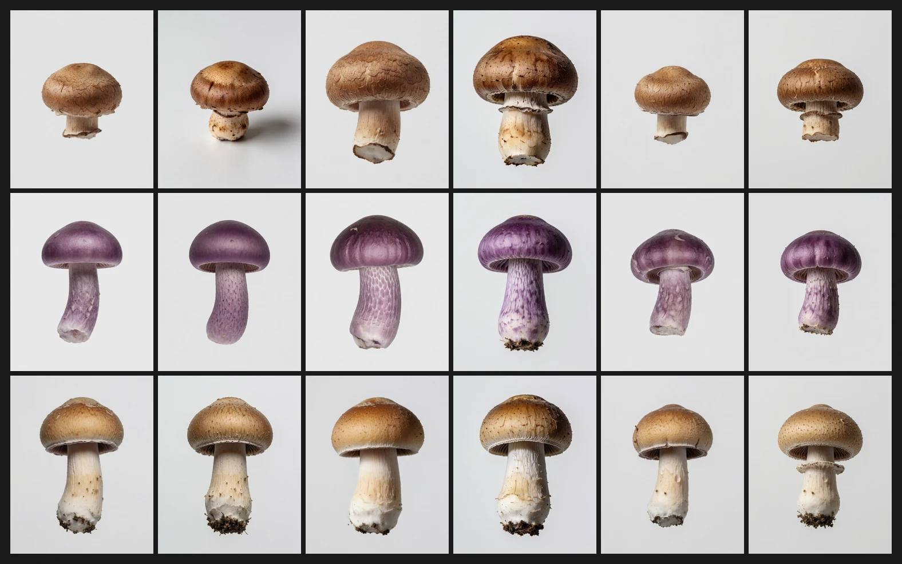
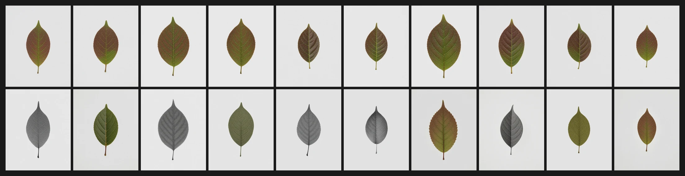

# Three times the pictures disagreed with the measurements

> **Open** · 214 renders · 11 prompts · exploratory
> [← all experiments](../README.md#what-holds-and-what-does-not)

> **The direction I'm chasing.** By this point the bench had a statistic for everything — contrast,
> grain, chroma, hue, displacement, composition — and I had started ranking edits with them and
> recommending the winners. If the numbers are good enough to rank by, looking at the renders is a
> courtesy, not a step.
>
> **What would kill it.** An observer, given no labels, separating the renders in a way the
> statistics cannot reproduce. Or a null result that turns out to come from a design the numbers
> called clean.
>
> **Where we are.** Both happened, on the same day, and one of the nulls was mine. The
> uncomfortable part is that none of the three was found by a measurement; each was found by
> somebody opening an image, and the measurement came second, to check.

## In two minutes

Three disagreements, in the order they happened.

**One.** I ranked 140 edits by how far they moved the picture against how much of its composition
they cost, published the top of that ranking as the best operating points, and said the images
agreed. Alessandro cut one of them out at 1:1 and it was full of defects. Re-measured with a
statistic that asks whether the drawing is still a drawing, the five conditions I had recommended
turned out to be the five worst in the corpus, and the one he had picked out by eye was the best of
eighty.

**Two.** An edit removes all the colour from a leaf while leaving the leaf perfectly drawn. It
happens in nine of twenty fresh seeds and in none of the twenty unedited controls. It never happens
when the prompt names a colour — not once in seventy-two cells, on an ordinary colour or an odd one.

**Three.** I tested whether that generalises on four other subjects, found nothing, and wrote
"leaf-specific". The contact sheet shows why: for all four, the render told "brown" and the render
told nothing are the same picture. I had chosen subjects for having a *strong* colour prior, to test
a mechanism that needs a weak one.



## The verdict

Displacement statistics rank edits by how much moved, and this notebook had no statistic that asks
whether what is left is still a drawing. Adding one reverses the ranking at both ends. Separately,
a colour that the prompt states survives every edit measured here, while a colour the model has to
infer can be removed outright — and the test of whether that generalises has not yet been run,
because it was run on subjects that leave nothing to infer.

Nothing on this page is pre-registered as a claim about the model. The first result is a repair to
this notebook's own instruments; the second is a reproducible phenomenon with a proposed reading
and no test of its scope; the third is a design error with its measurement attached.

## Why I might be wrong

**Structure coherence is one number on one drawing style.** It is the orientation agreement of the
luminance gradient over a 9 × 9 window, as a ratio to the untouched render. The bench's prompts are
comic-line illustration — strongly oriented ink strokes — which is exactly the case where such a
statistic should work best. On a photographic family it may say nothing, and until that is checked
every structural claim here inherits the caveat.

**The two-routes reading of the colour collapse is a reading, not a test.** It fits three facts —
declared colours never collapse, the collapse is the object's and not the frame's, and it produces
no colour rather than a wrong one — but all three come from one prompt and one edit. A reading that
explains one cell is worth what one cell is worth.

**The drift toward green is not significant.** Nine of the eleven seeds that keep their colour move
it toward green, mean +10.8°, exact sign test p = 0.065. It hints that the collapse is the far end
of one push rather than a separate event; it does not establish it, and two of the largest drifts
keep their chroma entirely.

**And the honest reservation about the method of this page:** finding three things by looking is
not evidence that looking finds things. It is one day. What it does establish is narrower and
enough — that the statistics in use were blind in a way that a glance was not.

## The data

### How it was measured

**Structure coherence.** For each render, the structure tensor of the luminance gradient smoothed
over 9 × 9, reduced to (λ₁−λ₂)/(λ₁+λ₂) and averaged over the frame, then divided by the same
quantity for the untouched render at that prompt and seed. Near 1 the gradients point every way —
speckle, or flat. Higher means they agree locally, which is what ink strokes and hatching do.

**Chroma and object.** The object is found without using colour: the value channel low-passed 8×,
thresholded against the background value taken from the border ring, reduced to its largest
connected component. A mask defined by saturation — which is what the first version of this
measurement used — cannot represent an object that has lost its colour, and filed the one render
that had as a destroyed image.

**Prior ambiguity.** For a subject, the circular hue distance between the render with no colour
declared and the render with the prototypical colour declared. Small means naming the colour
changes nothing, so there is no inference for an edit to break.

### The numbers

#### The best edits by displacement were the worst pictures

| condition | displacement | structure coherence | rank of 80 |
|---|--:|--:|--:|
| `B4_mask` positive | 0.261 | **1.017** | **12** |
| `blk16` positive | 0.447 | 1.015 | 15 |
| `Block_4` positive | 0.478 | 0.979 | 60 |
| `blk27` negative | 0.394 | 0.805 | 75 |
| `Block_6` negative | 0.340 | 0.794 | 76 |
| `B6_anti` negative | 0.464 | 0.790 | 77 |
| `B6_mask` negative | 0.846 | 0.747 | 79 |
| `B4B6_mask` negative | 0.914 | **0.735** | **80** |

The bottom four of that table are four of the five conditions this notebook recommended on
2026-09-27, ranked by displacement against composition cost. The top line is the pair an observer
picked out of the corpus without labels — 12th of eighty, above the median and far above anything
recommended here. The first version of this page said **1st**, on a coherence figure inflated by a
float32 defect in its own estimator, found the same day and corrected in
[`estimator_precision_defect.md`](../docs/estimator_precision_defect.md). The bottom of the
ranking, which is what the retraction rests on, did not move at all.


The failure mode has a shape, and it is not blur and not noise: the drawing is replaced by a field
of curled comma-like marks, dense enough at `B6_mask` that the face is barely recoverable. A
statistic that sums squared second differences reads that as texture; the ratio of grain to the
untouched render for `blk27` negative is **0.841**, which reads as *sixteen per cent less grain*
while the fine detail has been entirely rewritten — across 140 conditions the correlation between
that ratio and how much band-0 detail actually changed is **−0.054**.

#### A colour that was named survives, a colour that was inferred does not

| probe | cells | lowest chroma ratio | second lowest |
|---|--:|--:|--:|
| purple declared | 36 | 0.648 | 0.653 |
| green declared | 36 | 0.658 | 0.693 |
| **nothing declared** | 36 | **0.040** | 0.783 |

Under the same edit and the same seed that produced the achromatic leaf, the purple leaf comes back
at 1.063 and the green one at 0.871.

On twenty fresh seeds of the undeclared prompt the outcome is bimodal with an empty band:

```
0.034 0.037 0.037 0.038 0.043 0.044 0.049 0.082 0.085 | 0.518 0.602 0.948 0.965 1.005 1.016
1.115 1.117 1.164 1.230 1.311
```



The drawing survives equally in both groups — overlap with the untouched render 0.877 for the nine
that lose their colour against 0.895 for the eleven that keep it — and the loss is the object's, not
the frame's: chroma inside the object falls to 0.050 of baseline while the background keeps its tint
at 0.882, p = 0.131.

#### The subjects were chosen for the property that made the test impossible

| subject | undeclared vs prototypical-declared |
|---|--:|
| pinecone | 0.9° |
| banana | 1.4° |
| mushroom | 3.1° |
| tomato | 9.9° |
| **leaf** | **52.2°** |

### The controls

**Twenty untouched renders.** None of the twenty baselines of the undeclared prompt collapses on
its own. This was written into the design as the result that would end the experiment, and read
before anything else.

**Twelve predictors, and an exact permutation test.** Nothing in the untouched render says which
seeds will collapse: twelve features of the baseline, exact Mann-Whitney with Bonferroni over
twelve, zero survive; and a multivariate test over all 167 960 ways of splitting twenty seeds nine
against eleven gives p = 0.535. Baseline chroma — the obvious candidate — is 0.50326 against
0.50309.

**Five rewordings.** The same subject, still with no colour named, asked five other ways: no
collapse in fifteen cells. The scenes differ in framing, but neither baseline chroma (0.503 against
0.474) nor hue spread inside the object (14.5° against 16.8°) separates them, so the leaf's colour
was not what the rewording moved.

**A determinism check that crosses benches.** One cell of the `blk16` ladder already existed in
another bench, rendered weeks earlier from a different plan file and a different queueing script.
It returned displacement 0.4472 against 0.447 and coherence 1.0397 against 1.040.

### Reproducing this

```yaml
model:
  checkpoint: krea2_turbo_bf16.safetensors
  weight_dtype: default
  sha256: not recorded -- the file is outside the repository
  text_encoder: qwen3vl_4b_bf16.safetensors
  vae: qwen_image_vae.safetensors
sampling:
  sampler: euler_ancestral
  steps: 9
  cfg: 1.0
  scheduler: simple
  denoise: 1.0
  resolution: 1024x1280
tuner:
  node: ArthemyKrea2ModelTuner
  mode: Real Value
  drives:
    leaf_bench: named group input Block_4 = -0.2, vectors_override EMPTY, granular_json empty
    blk16_bench: 34-slot vectors_override, slot 16 only, every named group input 0.0
  warning: >
    the two drives are not interchangeable and a row from one must never be run with the other's
    mechanism -- the comparison with the existing corpus is what makes either bench worth rendering
prompts:
  LN: "a single leaf centred on a plain light grey background, macro photograph, sharp focus, even studio lighting, no other objects"
  LG: "a single green leaf centred on ... (as LN, colour named)"
  LP: "a single purple leaf centred on ... (as LN, colour named)"
  W1_W5: "five near-synonymous rewordings of LN; full text in data/leaf_collapse_plan.csv"
  MU_TO_PC_BA: "mushroom / tomato / pinecone / banana, same sentence frame, prototypical / purple / undeclared"
  P01: "Western comics style, bold ink outlines, hatched shadows, medium wide shot..."
  P02: "Western comics style, ... (full text carried in data/blk16_ladder_plan.csv)"
seeds: [42, 777, 1337, 2001-2020]
conditions:
  - name: leaf collapse
    plan: data/leaf_collapse_plan.csv
    renders: 142
    arms: [20 fresh seeds, 5 rewordings, 4 subjects x 3 colour conditions]
    baselines: one per perturbed cell, tuner node absent
    measured_D: >
      not measured in weight space on this bench -- the gain is nominal (Block_4 = -0.2) and no
      Frobenius displacement was computed, so nothing here compares this edit's size with any
      other. The pixel-side displacement that IS measured is the chroma ratio against each cell's
      own baseline, in data/leaf_collapse_cells.csv
  - name: blk16 ladder
    plan: data/blk16_ladder_plan.csv
    renders: 72
    doses: [0.020, 0.035, 0.050, 0.080, 0.120, 0.200]
    arms: [pos, neg]
    baselines: reused from benchmark_mappa, not re-rendered
    measured_D: >
      measured on the pixels, not assumed from the gain: style displacement runs
      0.045 / 0.066 / 0.095 / 0.138 / 0.194 / 0.447 across the six doses of the positive arm and
      reaches 0.201 at 0.200 on the negative one, in data/blk16_ladder_cells.csv. Weight-space
      displacement is not computed for this bench either
outputs:
  directories:
    - benchmark_leaf_collapse/renders -- 142, outside the repository
    - benchmark_blk16_ladder/renders -- 72, outside the repository
  contact_sheets: benchmark_leaf_collapse/_contact_sheets -- every render of both benches,
    laid out as sheets, kept so a later reader can look before measuring
  manifests:
    - data/leaf_collapse_plan.csv -- 142 rows, one per render
    - data/blk16_ladder_plan.csv -- 72 rows, one per render
  provenance:
    - data/provenance_leaf_collapse.csv -- 142 of 142 match the plan
    - data/provenance_blk16_ladder.csv -- 72 of 72 match the plan
analysis:
  feature_tables:
    - data/leaf_collapse_cells.csv
    - data/blk16_ladder_cells.csv
    - data/texture_anisotropy.csv
    - data/damage_bands_cells.csv
  summary_tables:
    - data/leaf_collapse_verdict.csv
    - data/blk16_ladder_verdict.csv
    - data/prior_ambiguity.csv
    - data/leaf_collapse_scope.csv
    - data/leaf_collapse_predictors.csv
    - data/composition_by_family.csv
```

Every number above comes from `data/texture_anisotropy.csv`, `data/leaf_collapse_cells.csv`,
`data/prior_ambiguity.csv`, `data/leaf_collapse_scope.csv`, `data/leaf_collapse_predictors.csv`,
`data/damage_bands.csv` and `data/blk16_ladder_cells.csv`, each written by the script named beside
it in Provenance. The renders of the two new benches live outside the repository, in ComfyUI's
output tree, so `experiments/build_figures_looking.py` takes `--roots` to rebuild F11.1 to F11.3.
Each of those three builders reads its own measurement file first and **refuses to compose** if the
data no longer says what the caption says.

## Provenance

**Pre-registration.** `docs/RENDERS_2026-09-28_leaf_collapse_and_blk16.md` — predictions L1 to L5
and K1 to K4, frozen before the 214 renders existed. L2 and L1 confirmed, L3 confirmed as far as it
goes, L4 withdrawn as untested, L5 falsified and reversed. K1, K2 and K3 confirmed, K4 grey.

**Measurement files.** `data/texture_anisotropy.csv`, `data/composition_by_family.csv`,
`data/damage_bands.csv`, `data/leaf_collapse_cells.csv`, `data/leaf_collapse_scope.csv`,
`data/leaf_collapse_predictors.csv`, `data/leaf_collapse_clustering.csv`,
`data/prior_ambiguity.csv`, `data/prior_colour_bleed.csv`, `data/blk16_ladder_cells.csv`,
`data/provenance_leaf_collapse.csv`, `data/provenance_blk16_ladder.csv`.

**Scripts.** `experiments/texture_anisotropy.py`, `experiments/damage_spatial_bands.py`,
`experiments/style_damage_frontier.py`, `experiments/measure_leaf_collapse.py`,
`experiments/leaf_collapse_scope.py`, `experiments/leaf_collapse_predictors.py`,
`experiments/prior_ambiguity.py`, `experiments/prior_colour_bleed.py`,
`experiments/measure_blk16_ladder.py`, `experiments/verify_leaf_and_blk16_provenance.py`,
`experiments/build_figures_looking.py` (F11.1 to F11.3).

**Renders.** `benchmark_leaf_collapse` (142), `benchmark_blk16_ladder` (72), and for the
coherence table `benchmark_rectified_masks`, `benchmark_profondita`, `benchmark_profondita_neg` and
`benchmark_mappa`. Provenance of the two new benches checked against the plans from each render's
own metadata: 142 of 142 and 72 of 72, including that every baseline row carries no tuner node at
all rather than a tuner set to zero.

**Documents.** `docs/style_damage_frontier.md` (§7 to §10 are the retraction),
`docs/leaf_collapse_and_blk16_result.md`, `docs/what_broke_in_the_leaf.md`,
`docs/looking_at_the_leaf_corpus.md`, `docs/block4_vs_block6_synthesis.md`,
`docs/leaf_collapse_predictors_result.md`.

**Pitfalls.** 17 — the prompt is the unit, which is why every test on this page counts conditions
or seeds and never renders. 63 — a statistic read near its own floor, the family the grain ratio
turned out to belong to. Five more are drafted and not yet numbered in `docs/errors_log.md`: judging
a pixel-level property from a downscaled frame; declaring two axes independent without measuring
their correlation; an isotropic texture summary that reports a decrease while the texture is
replaced; a base rate taken from the whole corpus for an event conditional on one cell; and choosing
a test population by the property that makes the effect impossible. They are listed with their
evidence in `docs/open_work_register.md` §E.
