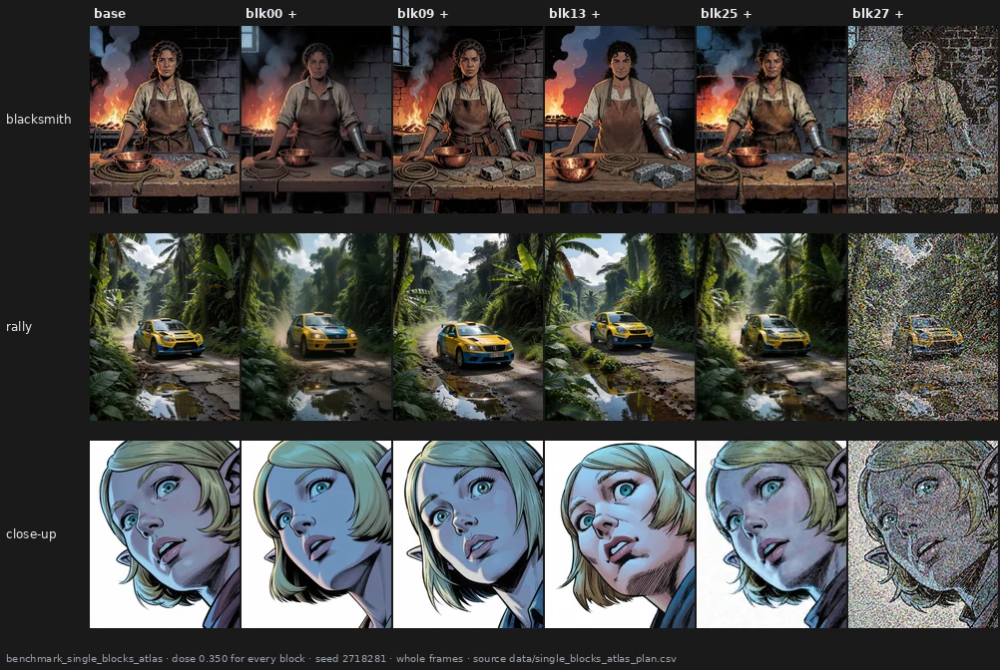

# One block at a time

> **Open** · 2153 renders · exploratory, two tests with criteria fixed before measuring
> [← all experiments](../README.md#what-holds-and-what-does-not)

> **The direction I'm chasing.** The six block groups of the tuner kept cutting through whatever
> structure the model had (pages 04, 08, 10). Alessandro's reading of the first single-block renders
> was that he could see "a lot of identifiable controls" in every zone. If single blocks are the
> natural unit, each should do something of its own, recognisably, on any picture.
>
> **What would kill it.** Blocks that are no more recognisable across pictures than chance, or whose
> two directions are mirror images of nothing in particular.
>
> **Where we are.** The two ends of the stack behave like controls; the middle does real but
> picture-dependent things. Most of what a single block does is a change shared by both directions.
> This page is the exploratory ground of the results notebook, where three of its leads were
> confirmed.

## In two minutes

Five benches pushed one block at a time: an atlas with every block at the same dose, 0.350, on three
prompts; a styles bench with doses calibrated per block on twelve prompts; two more benches (v3,
v4) on eleven prompts with comics, crowns and complex scenes; and one prompt in five word orders.



Read the columns. Block 0 softens all three pictures; block 25 lays the same hatching grain over all
three; block 27 at this dose dissolves all three into noise. Block 9 turns the rally car and polishes
the close-up; block 13 redraws the faces and changes the light. The ends do one thing; the middle does
a different thing to each picture.

## The verdict

Single blocks are a better unit than the tuner's groups, but only some of them are knobs. Recognisable
controls sit at the two ends of the stack — grain, softness, focus, saturation. The middle changes
content, reproducibly on one picture and differently on another. For most blocks, pushing either way
mostly adds the same thing, colour and grain. None of this was pre-registered as a hypothesis; three
of its leads — the saturation knob, presets per style, robustness to wording — were tested afterwards
in the results notebook.

## Why I might be wrong

* **The atlas has one seed and three prompts.** Recognisability across pictures is measured on three
  pairs of pictures per block.
* **The tests on the atlas and on the tail were fixed after the renders existed**, before anything
  was measured; that is weaker than a pre-registration, and the tail test was not blind for blocks 22
  and 23.
* **The doses differ between benches**, and the styles bench used doses chosen by eye.
* **64×80 and 23 rendering statistics see layout, colour and texture**, not content. The middle
  blocks' changes of content are seen mainly by eye.

## The data

### The ends are recognisable, the middle is not

For each pair of prompts, the change of block *i* on one is compared with the change of every block on
the other; block *i* is recognisable if its own change is the closest. Chance is about 1 in 28.

| sign | recognisable | permutation 95th percentile | p | which |
|---|--:|--:|--:|---|
| + | **5 / 28** | 3 | 0.0015 | **0, 1, 25, 26, 27** |
| − | **4 / 28** | 3 | 0.0085 | **0, 8, 20, 27** |

By its own rule the claim passes; by its size it is narrow: 23–24 blocks of 28 are not recognisable
across pictures. On the same picture at another seed and dose, 9 and 8 of 28 are, several of them in
the middle (14–22): middle blocks do something reproducible, but what they do depends on the picture
(`docs/single_blocks_atlas_result.md`, `data/single_blocks_tests.csv`).

### Two poles, or one direction?

The cosine between a block's change pushed up and pushed down is negative only for blocks 0, 1 and 24.
For the other 25 both directions move the picture the same way, and across the 56 block-sign cells
saturation rises in 47 and fine-grain energy in 40. It is the common mode found earlier on the groups
(`docs/sign_decomposition_result.md`), visible one block at a time.

### How far each block can be pushed


Alessandro labelled every atlas render by the artefacts he could see
(`data/single_blocks_eye_artifacts_alessandro.csv`). The output end breaks first; the middle shows
nothing at 0.350. His labels set the doses of the later benches: up to 0.45 on the styles bench, 0.55
in places on v4. The middle has its own, softer limit — a clean picture whose drawing stops making
sense — which no label or statistic here records ([results page 21](../results/21-block-map.md#how-far-each-block-can-be-pushed)).

### The tail as rendering controls

Alessandro named blocks 22–27 after what they seemed to control. The test, fixed before any statistic
was computed, asked of each name whether the block moves its own measure in two directions, more than
any other measure, and on a replication bench (`docs/late_blocks_render_controls_result.md`).

| block | name | verdict |
|---|---|---|
| 27 | focus | **holds** on every test: two poles 3 of 3, own measure the largest, rank 1 of 28, replication 4 of 4 |
| 26 | sharpness | partly: two poles 3 of 3, but contrast, focus and texture move more |
| 23 | saturation | not as a single lever here: colourfulness moves more than mean saturation |
| 22, 24, 25 | vividness, contrast, texture | not borne out |

What holds for the whole tail is that the subject barely changes: layout 0.834 for blocks 22–27
against 0.771 for the rest, exact p = 0.010; 23, 25 and 24 are the three most layout-preserving blocks
of all 28. Block 23 was later confirmed as a saturation knob with its own measure, chroma
([results page 22](../results/22-saturation-knob.md)).

### Groups and word order

After removing the change every edit shares, neighbouring blocks 08–10, 23–26 and 15–16 pushed up move
the picture the same way on the styles prompts and again on eleven prompts of v3 and v4; 02–05 does not
come back. The tuner's macro-block sliders cut through two of these groups. On one prompt in five word
orders, a block's change is as stable across orders as across seeds (r = 0.92 over 56 arms)
(`docs/block_groups_and_prompt_order.md`).

### Style or subject

On the styles bench, the change a block makes is more alike across five cartoon subjects than across
seven styles of one subject: on 41 of 56 arms, mean cosine 0.21 against 0.08, mostly in the late blocks
(0.38) and hardly in the middle (0.10) (`docs/style_vs_subject_exploration.md`). The confirmatory version
is [results page 23](../results/23-prompt-family-presets.md).

### Reproducing this

```yaml
model:
  checkpoint: krea2_turbo_bf16.safetensors
  weight_dtype: default
  sha256: not recorded -- the file is outside the repository
  text_encoder: qwen3vl_4b_bf16.safetensors
  vae: qwen_image_vae.safetensors
sampling:
  sampler: euler_ancestral
  steps: 9
  cfg: 1.0
  scheduler: simple
  denoise: 1.0
  resolution: 1024x1280
tuner:
  node: ArthemyKrea2ModelTuner, after ArthemyKrea2ResetPatcher
  mode: Real Value, 34-slot vectors_override, one slot at a time
prompts:
  files: [data/single_blocks_atlas_plan.csv, data/single_blocks_styles_plan.csv, data/single_blocks_v3_plan.csv, data/single_blocks_v4_plan.csv, data/prompt_order_experiment_plan_full.csv]
seeds: [2718281, 3141592, 1618033, 1234567]
conditions:
  - name: atlas, every block both signs
    dose: 0.350
    measured_D: not measured; the dose is a per-block gain, not a calibrated displacement
  - name: styles, v3, v4, prompt order
    dose: calibrated by eye per block and per bench, 0.05 to 0.55
    measured_D: not measured
outputs:
  directories:
    - benchmark_single_blocks_atlas/renders -- 171, outside the repository
    - benchmark_single_blocks_styles/renders -- 684
    - benchmark_single_blocks_v3/renders -- 396
    - benchmark_single_blocks_v4/renders -- 332
    - benchmark_prompt_order -- 570
  manifest: data/single_blocks_atlas_plan.csv
analysis:
  documents: [docs/single_blocks_atlas_result.md, docs/late_blocks_render_controls_result.md, docs/block_groups_and_prompt_order.md, docs/style_vs_subject_exploration.md, docs/single_blocks_exploration_synthesis.md]
  data: [data/single_blocks_tests.csv, data/single_blocks_map.csv, data/single_blocks_measures.csv, data/block_effect_overlap_mean.csv, data/prompt_order_feature_consistency.csv]
```

## Provenance

* **Renders.** benchmark_single_blocks_atlas (171), benchmark_single_blocks_styles (684), benchmark_single_blocks_v3 (396), benchmark_single_blocks_v4 (332), benchmark_prompt_order (570).
* **Criteria fixed before measuring:** `docs/prereg_single_blocks_identifiability.md`,
  `docs/prereg_late_blocks_render_controls.md`.
* **Observations by eye:** `data/single_blocks_eye_artifacts_alessandro.md`,
  `data/single_blocks_styles_notes_alessandro.md`, `data/single_blocks_v4_definitions_alessandro.md`.
* **Confirmed later:** [results page 21](../results/21-block-map.md),
  [22](../results/22-saturation-knob.md), [23](../results/23-prompt-family-presets.md),
  [24](../results/24-wording.md).
