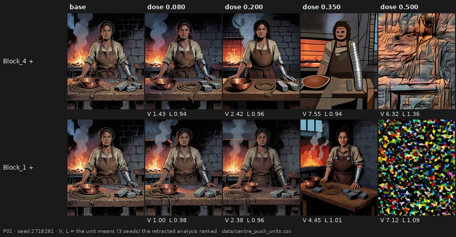

# Pushing harder, cutting finer, and four answers that said no

> **Overturned** · 747 renders · three pre-registered tests and one verification, 2026-09-28/29
> [← all experiments](../README.md#what-holds-and-what-does-not)

> **The direction I'm chasing.** Two intuitions of Alessandro's, after the broad presets of page 09
> had been refuted: targeted edits "carve a groove" that broad ones cannot, and the centre of the
> model can be pushed much further than the ends before the drawing breaks. Both are about finding
> the room an edit has before it turns into damage.
>
> **What would kill it.** No targeted edit moving visibly toward what the model already draws; the
> centre giving way no later than the ends; a statistic of "kept drawing" that disagrees with the eye.
>
> **Where we are.** All four answers came back no, one of them from a test that could not have said
> yes. The way they failed is the useful part: it is why the next week moved to single blocks and put
> the eye before every number.

## In two minutes

Four studies in two days. The tuner was asked which of its six kinds of parameter actually reach the
model: three do not. A study on renders already on disk asked whether any targeted edit carves a
groove: none does. A new bench pushed the six block groups to 0.500 to see whether the centre holds
longer: it does not, and the statistic used to judge "holding" turned out to have the sign wrong. A
last bench cut the output projection into six depth slices to see whether the parts add up: the
test could not tell.



The two renders on the right were recommended as the best operating points of the project for one
day, on two statistics, before anyone opened them. The one in the top row at 0.350 is the other
kind of failure: the picture is clean, and the face has become a mask.

## The verdict

Three of the tuner's parameter kinds are dead, and the tool did not say so. No targeted edit carves a
groove at these doses. The centre of the stack cannot be pushed further than the ends. The statistic
built to separate a kept drawing from a broken one fails the eye on exactly the units that matter,
with the sign wrong. The composition of depth slices is undecided, because its pre-registered
criterion was unpassable. Each of these is a no about groups and broad slices; the single-block work
of page 12 started from them.

## Why I might be wrong

* **The groove study is bounded by its visibility bar.** Most targeted edits never became visible at
  the doses on disk, so "no groove" means "none visible here".
* **The centre push is about six groups of consecutive blocks**, not single blocks; the grouping
  itself was the problem (`Block_5` sits in the centre and behaves like an end).
* **The eye veto failed its own gate by honest ties**: 7 of 9 is above chance, and three pairs were
  unjudgeable. The rout is in the two disagreements, not in the count.
* **The slices test was unpassable** at ±0.100 (pitfall 89). Its "not supported" carries no
  information about composition.

## The data

### Three kinds of parameter that do nothing

`benchmark_parameter_families` scaled one kind of parameter at a time. Norm scales (56 tensors),
query-key norms (56) and modulation layers (28) patch disjoint sets of tensors, so if any of them had
an effect the three could not coincide. At a multiplier of 2.0 they coincide on both prompts, 6 pairs
of 6, maximum difference 0; the modulation family is also identical between +0.200 and +1.000. The
three kinds that do move are far apart: at +1.000 the mean pixel change against the inert state is
120 / 255 for the input-output projections, 50 for the attention output projections and 32 for the
text projector on one prompt (`docs/parameter_families_first_result.md`). The cross between kinds and
depths turned out to exist already in the q/k/v/o atlas, which had been claimed missing
(pitfall 88).

### A groove or a hole

Alessandro's claim, after broad presets had been shown to move the picture away from what the model
draws: targeted presets can carve a groove, if pushed hard enough to be visible. The pre-registered
study measured 1,224 existing cells — groups, `blk16`, 56 single-block arms, 16 projections
(`docs/groove_or_hole_result.md`).

| | |
|---|--:|
| visible units | **84** |
| of which moving away from the repertoire | **53** |
| groove candidates | **0** |

Most targeted edits never became visible at all: all 16 projections stay below the bar. The nearest
miss was `Block_5` positive at 0.120: visible on one prompt and short by 0.0004 on the other. Of
Alessandro's descriptive claims, "the ends break the line" held (27% against 14% of units), "the
centre moves the picture more" did not — the ends moved it more at all six doses.

### Can the centre be pushed further?

`benchmark_centre_push` took the six groups to 0.080, 0.200, 0.350 and 0.500 on two prompts and three
new seeds. The primary — whether, at equal visibility, the central groups keep the drawing better —
returned T = +0.053, p = 0.19 over 495 relabellings, with the range guard passed: a null. Sorted by
how fast they give way, the groups do not split by position: `Block_5`, in the centre, gives way
hardest; `Block_1`, at an end, less than five of the eight central arms (`docs/centre_push_result.md`).

### The statistic with the sign wrong

The bench carried an eye veto, registered before rendering: twelve pairs, and for each Alessandro
said which render was more broken. He resolved 9 and agreed with structure coherence on 7, below the
registered 8 of 12. Both disagreements are `Block_6` positive at 0.080, which the statistic scores
above its own baseline and which he — and six blind model observers, in both orientations of the
sheets — called broken (`docs/centre_push_eye_veto_result.md`). The same day, the two doses the
statistic ranked best were opened and found destroyed: a regular texture is "line" everywhere, and a
destroyed picture is far from its baseline. The recommendation was retracted and the bench planned
to push them further was withdrawn (pitfall 90).

### Six slices and their union

`benchmark_wo_depth` cut the attention output projection into six depth slices and rendered each
alone and all six together. Pre-registered at ±0.100: the union should equal the sum of the slices
(cos ≥ 0.95, ratio 0.90–1.10). It fails in all four prompt-sign combinations (cos 0.57–0.66). But at
that dose a slice at one seed and the same slice at another point in nearly unrelated directions
(cos 0.06–0.39), and on one prompt the union barely agrees with itself (0.33 and 0.13): the criterion
was unpassable before a render existed (pitfall 89). Exploratory, at the doses added later: the union
is more reproducible and more of a single axis than any slice, and one scalar — fine-grain energy —
composes multiplicatively within 1–11% in 12 of 12 cells (`docs/wo_depth_result.md`).

### Reproducing this

```yaml
model:
  checkpoint: krea2_turbo_bf16.safetensors
  weight_dtype: default
  sha256: not recorded -- the file is outside the repository
  text_encoder: qwen3vl_4b_bf16.safetensors
  vae: qwen_image_vae.safetensors
sampling:
  sampler: euler_ancestral
  steps: 9
  cfg: 1.0
  scheduler: simple
  denoise: 1.0
  resolution: 1024x1280
tuner:
  node: ArthemyKrea2ModelTuner
  mode: named group inputs Block_1 ... Block_6 (centre push); preset JSON per parameter family or depth slice (families, wo depth)
prompts:
  P01: "Western comics style, bold ink outlines, hatched shadows, ... (full text in data/centre_push_plan.csv)"
  P02: "(full text in data/centre_push_plan.csv)"
seeds: [2718281, 3141592, 1618033, 42, 777, 1337]
conditions:
  - name: centre push, six groups, both signs
    doses: [0.080, 0.200, 0.350, 0.500]
    measured_D: not measured in weight space; V is the pixel distance in units of the seed noise of the same prompt, in data/centre_push_units.csv
  - name: parameter families
    doses: [0.200, 1.000, and others per family]
    measured_D: not measured; three families shown inert by pixel identity
  - name: wo depth slices and union
    doses: [0.100, 0.200, 0.350, both signs]
    measured_D: not measured in weight space; slices disjoint, union exact, checked by guard G_union
outputs:
  directories:
    - benchmark_centre_push/renders -- 295, outside the repository
    - benchmark_wo_depth -- 254
    - benchmark_parameter_families -- 144 graded + 54 probe
  manifest: data/centre_push_plan.csv
analysis:
  scripts: [experiments/analyze_centre_push.py, experiments/groove_or_hole.py]
  documents: [docs/parameter_families_first_result.md, docs/groove_or_hole_result.md, docs/centre_push_result.md, docs/centre_push_eye_veto_result.md, docs/wo_depth_result.md]
```

## Provenance

* **Renders.** benchmark_centre_push (295), benchmark_wo_depth (254), benchmark_parameter_families (198).
* **Pre-registrations:** `docs/prereg_centre_push.md`, `docs/prereg_centre_push_model_eye.md`,
  `docs/prereg_groove_or_hole.md` with amendments 01 and 02, `docs/prereg_wo_depth.md`.
* **Eye:** `data/centre_push_veto_answers.csv`, `docs/wo_depth_eye_mapping.md`.
* **Pitfalls:** 88, 89, 90 in `docs/_pitfalls_88_da_inserire.md` … `_90_da_inserire.md`.
* **In the results notebook:** [page 26](../results/26-what-did-not-work.md).
