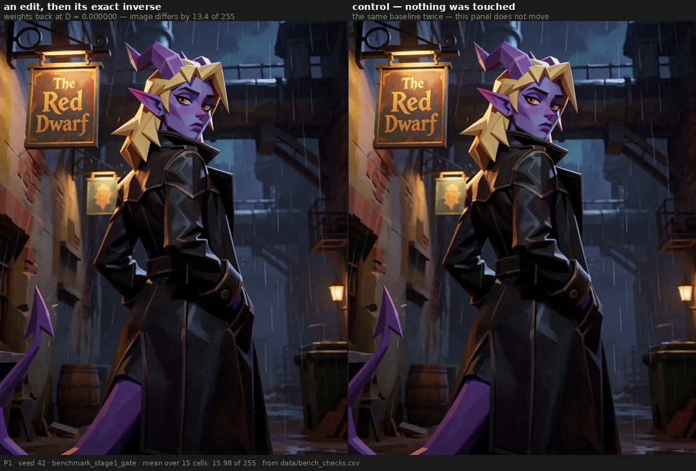
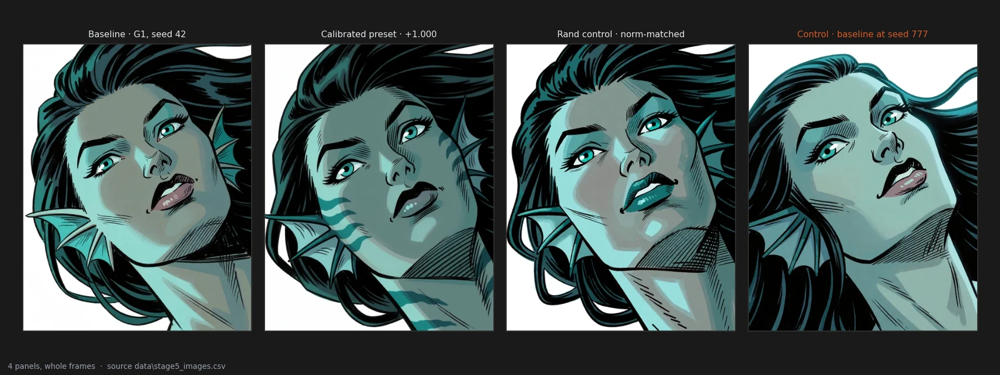
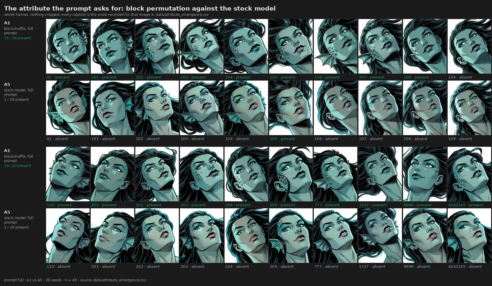
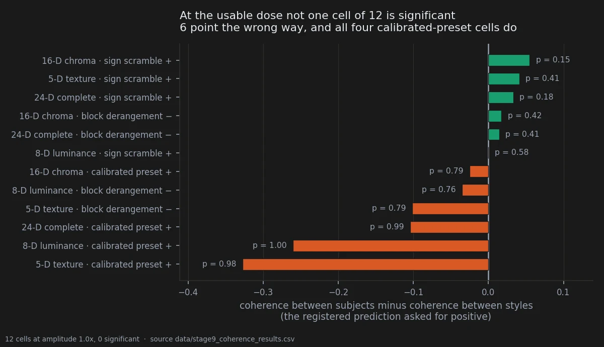
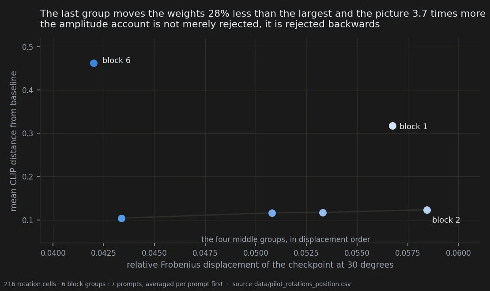
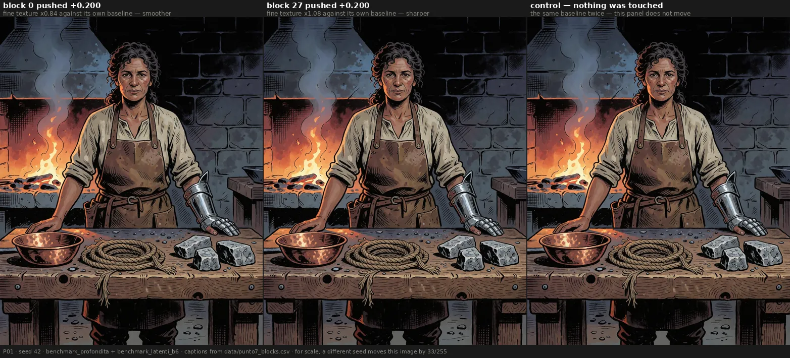
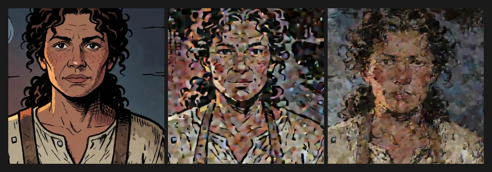
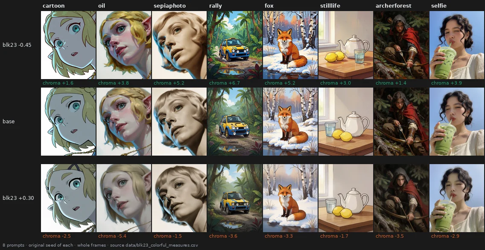
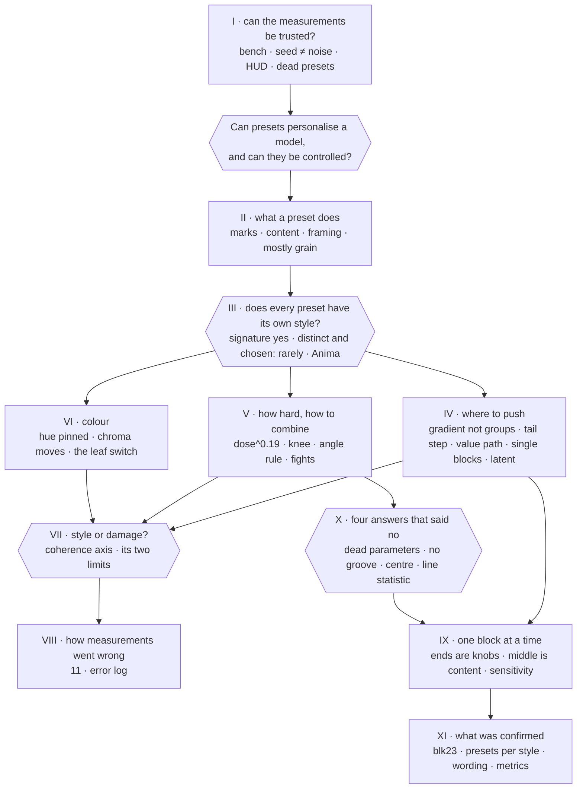

# The story so far

*Read this first. The goal behind this notebook is to let anyone **shape and personalise a model
with presets**. A preset is a list of numbers, one per weight tensor, that the tuner multiplies into
the model. If every preset carries its own recognisable style, presets are a cheap way to make a
model your own. **The hard problem is control**: choosing which style you get, how strongly, and
without breaking the picture. Static per-tensor edits like these have barely been studied. The
nearest prior work trains LoRAs or steers activations
([prior work](../docs/prior_work_layer_specialisation.md)). So the only way to learn how they behave
is to experiment, and this page follows those experiments. It is not an argument that any one
preset is the best.*

*This page holds no new measurements. Every number is copied from the page or document it links to,
and that is where you check it. Links into `docs/` are results that are not on a notebook page yet:
their verdict comes from their own pre-registration, or they are marked exploratory. An
[index](#index-where-every-experiment-sits) at the end assigns every experiment in the repository
to a section.*

*Last brought up to date: 2026-10-05. Sections IX to XI are new: single blocks, four answers that
said no, and what was then confirmed. The confirmed results have a notebook of their own,
[results](../results/README.md), with its own [story told in pictures](../results/STORY.md).*

---

## Three questions

1. **Does a preset give the model a style of its own?** (sections II and III)
2. **Can you control which style you get?** (sections IV, V and VI)
3. **Is what you get a style, or damage?** (section VII)
4. **Where in the model are the knobs, and how far can they be turned?** (sections IV, IX, X and XI)

Two further questions sit under all three: can the measurements be trusted (sections I and VIII),
and does any of it carry over to another model (end of section III)?

## The answer so far

1. **Presets leave a real, reproducible signature.** It transfers to other prompts and seeds,
   survives mirroring, hue rotation, noise and JPEG, and grows stronger with dose. The preset also
   separates from its random control on a second model, Anima, on stroke shape. This supports the
   idea that a preset can personalise a model.
2. **But not every preset has a distinct one, and most of any push is the same thing.** About four
   fifths of what any edit does, crafted or random, is grain injected along one shared axis. What
   separates presets is mostly how hard and where they push. A random preset gets a signature as
   readily as a designed one.
3. **Control comes from location, and the six block groups are too coarse to give it.** The blocks
   form a gradient, not six modules. The output end moves the picture most, with a step near block
   23. Inside a block, the value projections steer and the routing ones do not. A few single blocks
   are clean knobs, and the group sliders waste most of their budget. One block at a time, the ends of
   the stack act on properties of the picture the same way on every picture; the middle changes what
   is depicted, differently on each.
4. **Strength is not a dial.** Effect grows as dose^0.19. The dose used most sits past a knee where
   the drawing breaks. Pushes in different directions add up, pushes in the same direction waste
   each other. On Anima no dose was both visible and safe.
5. **Colour is the hardest to control.** Hue barely moves, saturation does, and colour carries no
   part of the signature that transfers. A colour the model infers can be switched off entirely.
6. **Style and damage can now be told apart, partly.** A new axis asks whether the picture is still
   a drawing. It works only on styles with a line, and it probably rewards some artefacts too. Put to
   a registered eye test, it scored broken renders above their baseline: the eye stays first.
7. **Many corrections came from the instruments, not the model.** Several were caught by somebody
   opening an image at full size.
8. **Some of it has now been confirmed.** Block 23 is a saturation knob; presets built from late blocks
   give a family of prompts in one style a common look; rewriting a prompt changes what a block does
   about as much as changing the seed. Middle blocks change content most, at no measured cost, and
   only the eye sees their common look.

---

## Who is who

**The model.** Krea-2 is a 12.8-billion-parameter diffusion transformer with 28 blocks. The tuner
splits them into six groups, `Block_1` at the input to `Block_6` at the output. It also exposes
single blocks (`blk00` … `blk27`) and the attention projections inside them (`wq`, `wk`, `wv`, `wo`)
as separate controls. A second model, **Anima** (Cosmos-Predict2, also 28 blocks), was used once to
test transfer.

**A preset** is a list of per-tensor gains that the tuner multiplies into the weights. Its size is
measured as a Frobenius displacement **D**, so two presets can be matched in size by construction.
In this notebook *preset* and *edit* mean the same thing.

**What a preset can and cannot reach.** One number per tensor scales the whole tensor. It cannot
pick a direction *inside* a tensor, and the literature on this family of models finds features
spread across many channels rather than one per channel
([prior work §3](../docs/prior_work_layer_specialisation.md)). So a preset chooses *where* to push
and *how hard*, but it cannot target an individual feature. That limits how fine the control can
get. Matching D also matches the push, not the effect: the same D moves the image 3.7 times more at
the tail than in the middle.

**The three presets of the first two weeks** all move the weights by the same D = 0.0538 and differ
only in how the gains are arranged. Comparing them asks whether the *pattern* of a preset matters,
or only its size:

| preset | its gains | structure it keeps |
|---|---|---|
| **calibrated preset** | hand-set plateaus; within one block the gains are equal or nearly so | all of it |
| **block derangement** | the preset's gains, each block's profile handed to another block | coherence inside each block, in the wrong block |
| **sign scramble** | the preset's gains, each tensor's sign redrawn at random | none: this is the control |

All fourteen presets of that period, the random controls included, also carry **the same four
seeded rotations on `Block_3`**. A comparison between two arms therefore isolates the gains. A
comparison against the untouched model measures rotation and gains together.
([amendment 03](../docs/prereg_perturbation_atlas_amendment_03.md))

**Later presets** are simpler: one group, one block or one projection at a time, set to a single
number, the **dose** (0.020 to 0.200), positive or negative. **Rotations** turn one block group by
an angle. The **atlas** generates random presets inside one region at a time, all at the same D.

**How to read a verdict.** *Holds*: passed a criterion written down before the data existed.
*Ambiguous*: tested, undecided. *Overturned*: tested, false. *Open*: not properly tested, however
many numbers sit beside it.

---

## What holds today

A reader's summary, not the ledger. The ledger of every claim is in the [README](../README.md).

| | finding | where |
|---|---|---|
| **holds** | The tuner at zero is bit-identical to no tuner; renders reproduce across restarts, days and benches | [00](00-the-bench.md) |
| **holds** | The subject grows under block derangement, replicated on ten new styles (×1.23) | [03](03-what-ends-up-in-the-picture.md) |
| **holds, weakened** | Two block groups pushed the same distance separate further than two random edits. But on clean re-renders the same statistic flips sign with dose, and the random baseline for `Block_6` cannot be rendered at a usable dose | [08](08-block1-vs-block6.md), [salvage map](../docs/salvage_map_clean_benches.md) |
| **holds** | The sign of a structured preset picks parallel or crossed hatching on Krea-2; the random control does not. It does not carry over to Anima | [06](06-the-hatching-axis.md), [Anima review](../docs/anima_stage1_revisione.md) |
| **holds** | Any push costs fine texture, more towards the output (4.8% → 2.8% after the contrast correction) | [05](05-knob-or-cost.md) |
| **holds, contested** | "The first block is an inverted knob". A decisive test on its own corpus says it is a contrast change; the status has not been changed | [05](05-knob-or-cost.md), [test](../docs/first_block_knob_decisive_test.md) |
| **pre-registered, confirmed** | A block preset is a transferable treatment (0.708 against 0.50 chance) and survives six image augmentations | [transfer](../docs/transfer_test_result.md), [augmentations](../docs/signature_robustness_result.md) |
| **pre-registered, confirmed** | Transposed to Anima, the preset separates from its random control on stroke shape (two features, Holm 0.018) | [Anima review](../docs/anima_stage1_revisione.md) |
| **pre-registered, provisional** | Structured presets keep their direction inside a style domain and lose it across; the random control does not | [domain](../docs/prereg_domain_specificity.md) |
| **overturned** | The declared style decides the direction of a preset | [09](09-style-direction.md) |
| **retracted** | The frontier of "best operating points" ranked by style against damage | [frontier](../docs/style_damage_frontier.md) |
| **retracted** | The split of an edit into a sign-blind and a signed part on pixels (twice) | [retraction](../docs/sign_decomposition_retraction.md) |
| **holds** | Three of the tuner's six kinds of parameter never reach the model | [13](13-pushing-harder.md) |
| **open** | At equal dose only the end blocks are recognisable on another picture; the middle changes content, picture by picture | [12](12-single-blocks.md) |
| **overturned** | Targeted edits carve a groove; the centre can be pushed further than the ends; structure coherence orders renders like the eye | [13](13-pushing-harder.md) |
| **holds** | Block 23 is a saturation knob, monotone on 15 of 16 cells, and disturbs the picture less than the words "colorful" | [results 22](../results/22-saturation-knob.md) |
| **holds** | Late-block presets are coherent inside a prompt family, strongest on cartoon | [results 23](../results/23-prompt-family-presets.md) |
| **ambiguous** | Rewriting a prompt changes a block's effect about as much as the seed; inconclusive by its own rule | [results 24](../results/24-wording.md) |

---

## I · Can the measurements be trusted?

Every result here is a difference between two pictures, so the machine has to stay still when
nothing is touched.

**The bench holds, bit for bit.** With every gain at zero the tuner changes no pixel, on Krea-2 and
on Anima. A render repeated after a restart is identical, and so is one repeated seven days later.
A cell rendered weeks earlier from a different plan and queue script came back at 0.4472 against
0.447, so determinism holds across benches. An edit followed by its exact inverse restores the
weights but not the picture (mean difference 16 of 255).
→ [00](00-the-bench.md) — **holds** · [Anima §0](../docs/anima_dosesweep_verifica.md)

**A change of seed is not noise.** The first spatial map was declared empty because it compared
edits against the difference between two seeds. At a fixed seed the null is exactly zero, and a
change of seed is a maximal perturbation. Redone per seed, each block has a reproducible spatial
signature (same block 0.40–0.47, different blocks 0.26–0.30, 6 cells of 6). Those signatures are
tied to the seed. The sampler re-injects the same noise at each step for a given seed, so the same
"dirt" pattern recurs in every render with that seed, whatever the weights.
→ [trajectory coherence](../docs/coerenza_traiettoria.md) · [retracted map](../docs/mappa_krea2_primo_esito.md)

**555 renders carried a panel nobody asked for.** A batch node appended a 480-pixel HUD under the
picture on every rotation bench. It was cut away, and the crop proved bit-identical to clean
re-renders. The panel had inflated a random control by a factor of two.
→ [HUD](../docs/hud_contamination_1024x1760.md) · [recovery](../docs/recovered_vs_contaminated.md)

**Presets that never reach the model.** A preset can be well formed and counted in the displacement
and still change nothing. It happened three times: one text-encoder arm, `modulation_norm` in the
atlas, and 48 renders of the q/k/v/o atlas whose norm scales never arrived. Pixel identity with the
baseline is now a provenance check.
→ [normscales](../docs/normscales_never_applied.md) · [atlas vs generator](../docs/atlas_vs_tuner_generator.md)

---

## II · What does a preset do to a picture?

**It changes the marks.** Under the calibrated preset the model draws darker, greyer and grainier,
with parallel strokes. On 24 prompts that separates from both size-matched controls. It was
exploratory, so it stays **open**. → [01](01-mark-style.md)

**The sign picks the hatching.** Pushed positive, the derangement crosses the strokes and the preset
runs them parallel, on 16 new prompts of 16. The random control does not. **Holds** for the
derangement; the preset half is **ambiguous**. → [06](06-the-hatching-axis.md)

**It reaches into content.** Barnacles the prompt asks for come back in 19 of 20 renders under the
derangement, against 1 of 20 for the stock model and for the random control. Headlights no prompt
mentions switch on in 31 of 38 under one preset and off in 39 of 39 under another. Neither was
predicted in advance: **ambiguous**. → [02](02-attribute-emergence.md)

**It reframes the subject.** The subject grows under the derangement: ×2.14 on the images that
suggested it, **holds** at ×1.23 on ten new styles. The same round showed the annotator was not
blind to the conditions. → [03](03-what-ends-up-in-the-picture.md)

**And most of any push is grain.** Across 180 displacements, one shared axis carries 78% of the
energy, and its dominant feature is the share of high frequency. Crafted and random edits both sit
on it. What differs is the rest. A `Block_6` rotation keeps a residual that reverses with the sign
(cos −0.70), which no scramble can do. `Block_1`'s residual does not reverse (+0.65): that is drift,
not steering. *This was measured on the HUD-carrying images and not re-measured. The panel adds a
shared component to every feature vector, so the 78% is an upper bound.* The pixel-level version
points the same way: the part of an edit that does not depend on the sign is high-frequency, and the
signed part is structural (weakened: 1.469 against 1.276).
→ [is it all scrambling?](../docs/e_tutto_scrambling.md) · [retraction §6](../docs/sign_decomposition_retraction.md)

> **Where II leaves us.** A preset changes strokes, content and framing, not just the finish. Most
> of what it does is shared grain, and the part that can be steered is the residual that reverses
> with the sign.

---

## III · Does every preset have a style of its own?

If presets are to personalise a model, each one has to leave a signature that is recognisable,
stable across prompts, and different from the others.

**Every preset is recognisable, the random ones included.** On a prompt it has never seen, a
classifier names which of six presets was applied 88.5% of the time (chance 16.7%). It recognises
the random control at 93.8%. Within one prompt, every preset moves all five seeds the same way, and so
does the random one. → [identifiability](../docs/prereg_arm_identifiability.md) ·
[02](02-attribute-emergence.md#why-all-five-seeds-move-together)

**The signature belongs to the preset, not to the picture.** Applied to a different prompt and seed,
a block preset lands closer to itself than to a different block of equal size: 0.708 against 0.50,
85% of its ceiling on the same prompt. It is **stronger** at high dose. It survives mirroring, 90°
rotation, hue rotation, halved saturation, noise and JPEG, and it lives in texture (0.778) and
stroke (0.750). It **never lived in colour** (0.514). **Pre-registered, confirmed.**
→ [transfer](../docs/transfer_test_result.md) · [augmentations](../docs/signature_robustness_result.md)

**But distinct styles are few, and magnitude does most of the separating.** In the atlas of 24
random regional presets, identification on unseen styles runs at 25.7% against 4.2% chance. It is
concentrated in a minority: 95.8% and 91.7% for two late regions, chance for the middle bands, 0% for
the text encoder alone. What separates presets is how far they push (ρ = 0.894 against magnitude).
The number of clearly distinct styles came out between 1 and 5, a floor set by a test with 3 seeds
and one subject. There is no shared axis to steer along: each preset's share of it sits inside what
random directions give. → [atlas](../docs/prereg_perturbation_atlas.md) ·
[capacity](../docs/prereg_style_capacity.md) · [shared axis](../docs/prereg_shared_axis.md)

**A region does not pick a style.** Two random presets drawn in the same region are nearly
orthogonal (cos +0.106), and region is not the unit of control (p = 0.278). A mosaic glitch seen in
one early-attention preset belongs to that *draw*, not to the region: its twin in the same region
at the same D sits below baseline. → [atlas](../docs/prereg_perturbation_atlas.md) ·
[looking at B1/B6](../docs/looking_at_block1_and_block6.md)

**Where the pattern does matter.** The preset and the derangement keep their direction *within* a
style domain and lose it *across*. The random control carries a generic component instead (Δ = 0.261
and 0.212, Holm 0.0015). So what matters is sign coherence *inside* each tensor. This is
**provisional**, because the pattern was seen before the test was written. The negative
derangement also adds seed-to-seed scatter beyond its control (Holm 0.034). Three other ways of
separating crafted from random came back empty:
- scattering a push is not finer than keeping it coherent (colour/texture ratio 0.710 against 0.710);
- the family-coherence verdict was withdrawn (it hung on a 0.000283 margin);
- style does not govern direction ([09](09-style-direction.md), overturned; the style-axis test,
  M = −0.028, p = 0.584).

→ [domain](../docs/prereg_domain_specificity.md) · [seed stability](../docs/prereg_seed_stability.md) ·
[scattered](../docs/structured_vs_scattered.md) ·
[family](../docs/prereg_family_coherence_amendment_02.md) · [style axis](../docs/prereg_style_axis_tradeoff.md)

**Every preset leaves the model's repertoire.** The belief was that a preset steers into a look the
model already produces for some other prompt. Refuted for all three arms (Holm ≤ 0.0025). Each
preset pushes outside everything the untouched model makes. The preset leaves the repertoire least,
the derangement more and the random one most, on both corpora. That order is frozen as a prediction,
untested. → [repertoire](../docs/prereg_mountain_reachability.md) · [ordering](../docs/prereg_r1_ordering.md)

**On a second model.** Transposed to Anima, with the dose scaled to its 30 steps, the preset
separates from its random control on stroke shape: crosshatch +0.216 and contour length −20 px,
both surviving Holm at 0.018. The cross-attention path is inert on strokes, as on Krea-2. What did
**not** transfer is the direction: on Anima the preset and the derangement move hatching the *same*
way (+0.292, +0.280). The random control is not inert there either. The native-corpus test that
would separate "Krea-2 only" from "badly written prompts" is registered and not run.
→ [Anima results](../docs/anima_stage1_results.md) · [review](../docs/anima_stage1_revisione.md) ·
[stage 2 prereg](../docs/prereg_stage2_corpus_nativo.md)

> **Where III leaves us.** Signatures are real and reproducible, and they survive a change of model
> on stroke shape. That supports personalising a model with presets. Getting a *chosen* style is the
> unsolved part. Magnitude and location do most of the separating, and a region decides how much a
> preset does, not which style it gives. So control has to be built from knowing where to push, at a
> finer grain than a region.

---

## IV · Where to push: a map of the model

**The blocks are a gradient, not six modules.** Measured one by one, neighbouring blocks do similar
things (cos +0.321 for adjacent blocks, falling to −0.058 for distant ones). But the six groups the
tuner uses are an indifferent choice: their boundaries rank at the 31st percentile of random
contiguous partitions. The best boundaries found (2, 7, 12, 17, 26) share the groups' period of five,
shifted by three, so the current boundaries cut through natural groups rather than between them. No
number of groups is "right": separation keeps growing as groups are added.
→ [do the blocks exist?](../docs/esistono_i_blocchi.md)

**The tail moves the picture most, and it is a step, not a ramp.** How much of the seed's own texture
survives an edit does not rise across blocks 0–19. It jumps near block 23 (0.091 against 0.139,
6 of 6). The last group moves the weights least and the picture most (3.7×). On clean rotations of all
six groups, `Block_6` moves the image most and `Block_1` second (**open**). Prior work places style
LoRAs in the late blocks of FLUX, so this is a replication in a different medium.
→ [a step](../docs/monotonia_profondita_esito.md) · [04](04-where-in-the-model.md) ·
[10](10-all-blocks-clean.md) · [prior work](../docs/prior_work_layer_specialisation.md)

**Two ends, two directions, with a weakened proof.** Pushed exactly the same distance, the first and
last groups imprint directions that can be told apart beyond two random edits of that size, in
10 prompts of 10 (**holds**, [08](08-block1-vs-block6.md)). The clean re-renders weaken it:
- at D = 0.030 the statistic is positive in 6 of 6 cells, at the registered D = 0.045 negative in
  6 of 6, both at the floor;
- the random baseline anchored on `Block_6` fails its quality gate in 69 of 72 renders;
- the dose that passes the gate is 6.3× lower than the one registered.

The page 08 result sits at one point of a curve that changes sign. Different is also not
specialised: nothing yet separates "`Block_6` does something specific" from "`Block_6` is next to
the output". → [salvage map](../docs/salvage_map_clean_benches.md) ·
[triangle](../docs/rotations_triangolo_block1_block3_block6_results.md) ·
[v2 audit](../docs/audit_rotations_clean_v2_2026-09-23.md)

**Inside a block, the value path steers and the routing path does not.** Push `wq` or `wk` either way
and the image moves the same way (cos(+,−) +0.37 to +0.54). Push `wv` or `wo` and it reverses, down to
−0.86 at the tail. Three statistics agree in 8 scenes of 8. `q` and `k` are close to unusable as
signed controls. It needs a replication on a band not used to find it.
→ [retraction §6](../docs/sign_decomposition_retraction.md)

**The text encoder moves pixels, not strokes.** A preset touching only the text encoder moves the
pixels as far as one touching only the diffusion model (RMS 51–53 against 48). But on all 23 traits it
moves less, and on stroke width it stays at the noise floor (0.89 against 2.65). The stroke shift
comes from the diffusion model. → [where the stroke shift lives](../docs/where_the_stroke_shift_lives.md)

**Some single blocks are clean knobs.**
- `blk00` is a **contrast** knob, and it does all of `Block_1`'s work: the other four blocks in that
  group are inert, so the slider spends four fifths of its budget on nothing.
- `Block_5` negative is the cleanest group arm on the map, with no knee.
- `blk16` adds style while strengthening the line.
- `blk27` has two faces: negative it destroys the line, positive it is the largest line-preserving
  move among 56 single-block arms.

→ [dissection](../docs/block1_dissection.md) · [decisive test](../docs/first_block_knob_decisive_test.md) ·
[the map re-read](../docs/retro_mappa_reading_result.md)

**`Block_4` and `Block_6` are two mechanisms.** `Block_6` changes how the picture is *rendered*
(tone, chroma and grain), powerfully and at the cost of the drawing, and its parts compose badly.
`Block_4` changes *what is drawn*: it tilts energy from fine detail to broad shapes, keeps the line,
and its parts add up. `Block_1` and `Block_6` act at the *same* scale (a peak at 4–8 px) with opposite
signs, so what separates them is not scale. **Exploratory.**
→ [synthesis](../docs/block4_vs_block6_synthesis.md) · [the map re-read](../docs/retro_mappa_reading_result.md)

**Half of `Block_6` is hidden by the VAE.** Measured in the latent, before decoding, `Block_6` is a
clean, symmetric detail knob: high frequency ×1.404 positive and ×0.695 negative. In pixels the
positive half vanishes (×0.99). The decoder passes the loss of detail and absorbs the addition. What
survives of the positive arm is a redistribution of detail across the frame.
→ [Block 6 in the latent](../docs/block6_nel_latente.md) · [Block 6 and the groups](../docs/block6_e_struttura_gruppi.md)

> **Where IV leaves us.** There is a map to steer by: the tail over the middle, the value path over
> the routing path, `Block_4` over `Block_6` for keeping the drawing, and a handful of single blocks
> that behave like knobs. The tool's own units work against it. Its six groups cut through the
> model's natural structure, and each group bundles active and inert blocks together.

---

## V · How hard to push, and how to combine

**Strength is not a dial.** Image movement grows as dose^0.19: six times the dose buys 1.39 times the
effect. At the smallest dose ever tested the image has already moved half as far as a change of seed
would move it. No small-edit regime responds linearly.
→ [dose calibration](../docs/assessment_per_block_dose_calibration.md)

**The working dose is past a knee.** For `Block_6` positive, `Block_5` positive and `Block_6` negative,
the drawing holds up to 0.120 and collapses on the step to 0.200, the dose almost every bench uses. The
calibrated preset has no knee between strengths 0.5 and 1.0, but at 2.0 it collapses in every style
(82.5% of cells below 0.90). The negative derangement at 2.0 keeps and intensifies the line. On
Anima, the smallest dose that moves the image three seed-noise units already breaks the drawing
inside the subject. **No dose was both visible and safe**, and the dose also has to be scaled with the
number of sampling steps. → [the map re-read](../docs/retro_mappa_reading_result.md) ·
[stage 5 re-read](../docs/retro_stage5_reading_result.md) · [stage 9 re-read](../docs/retro_stage9_reading_result.md) ·
[09](09-style-direction.md) · [Anima dose sweep](../docs/anima_dosesweep_verifica.md)

**Pushes that point different ways add up.** Across nine pairs of groups,
ρ = 0.939 − 0.278·cos(angle between them). Edits pointing different ways add, edits pointing the same
way saturate and waste up to a third. A prediction deposited before its renders confirmed it:
opposite-signed `B5 + B1` added on 4 quantities of 4, concordant `B5 + B4` on 0 of 4. The design rule
that follows is to pick units that push the target property the same way and are otherwise as
different as possible. **Confirmed on nine pairs, all at dose 0.200.** It needs a replication at a
lower dose. → [angle rule](../docs/regola_angolo_9_coppie.md) ·
[prediction 01](../docs/previsione_01_composizionalita.md) ·
[prediction 02](../docs/previsione_02_saturazione_direzionale.md) ·
[stacking](../docs/assessment_sign_aligned_stacking.md)

**Inside a group, parts can fight.** `Block_4` reverses on contrast what its parts predict. In
`Block_6`, `blk27` overturns the other three blocks on grain. Masks built to flip the fighting parts did not
answer their question, because the arithmetic they depended on failed on `Block_6`: **untested, not
refuted**. An earlier pre-check at the level of q/k/v/o had found no stable sign to flip.
→ [fights](../docs/internal_fights_by_group.md) · [masks](../docs/rectified_mask_result.md) ·
[sign mask pre-check](../docs/assessment_sign_correction_mask.md)

> **Where V leaves us.** Strength has to be set per block, below the knee, and scaled to the
> sampler. Combining presets follows a measurable rule, and that rule is what makes designing presets
> from single units feasible.

---

## VI · What presets can and cannot do to colour

Colour kept refusing to move, and for most of the project the reason was that "colour" was being read
as hue.

**Different presets push the palette differently** (**holds**, twice). Whether each leaves its own
colour fingerprint came back three of six against a bar of four (**ambiguous**). The instrument could
not resolve most palette shifts: its smallest detectable shift is a +30° hue rotation, and three of
four presets move the palette by less. Colour carries no part of the signature that transfers.
→ [07](07-chromatic-signatures.md) · [palette](../docs/prereg_palette_position.md) ·
[augmentations §4](../docs/signature_robustness_result.md)

**Hue is pinned; saturation moves.** Hue shifts 12.7° on average. `Block_3` and `Block_6` move the
object's saturation in opposite directions with their two arms, 18 cells of 18. **`Block_6` positive
does not desaturate. It moves colour off the object**: the object loses 27% and an empty grey
background gains ×12.5. On Anima, the negative derangement is the only condition that moves
colourfulness (+37.75, 9 prompts of 10), as on Krea-2. A table that labelled `Block_2` "chromatic"
turned out to classify a structureless scramble as the most chromatic thing in the corpus.
→ [chroma audit](../docs/colour_gate_and_chroma_audit.md) · [redistribution](../docs/chroma_redistribution.md) ·
[Anima review §4](../docs/anima_stage1_revisione.md) · [v2 audit](../docs/audit_rotations_clean_v2_2026-09-23.md)

**Naming a colour does not free it, and no preset cuts it loose.** With and without a colour clause,
nothing measurable changes (3 of 6 pairs each way). That kills both registered hypotheses, at low
power. On a leaf, the model's own unprompted colour is orange-brown, not green. No preset sends a
named colour back to that prior (6 cells of 36). → [declared colour](../docs/declared_colour_result.md) ·
[concept](../docs/colour_and_concept.md) · [pilot](../docs/colour_binding_pilot_gate.md) ·
[binding](../docs/colour_binding_stage2_reading.md)

**A leaf can lose all its colour and stay a leaf.** Under `Block_4` negative, the leaf with no colour
named goes grey in 9 fresh seeds of 20, against 0 of 20 unedited. The result is a switch, not a dimmer:
nothing lies between chroma 0.085 and 0.518. It never happens when the colour is named (72 cells, none
below 0.648), and nothing in the unedited render predicts which seeds fail (p = 0.535 over all 167,960
splits). The reading that fits: a stated colour is carried by the text, and an inferred one is
produced by a step that can fail. Its generality test used subjects with no inference to break, so
it is **withdrawn as untested**. → [11](11-what-the-numbers-could-not-see.md) ·
[what broke](../docs/what_broke_in_the_leaf.md) · [predictors](../docs/leaf_collapse_predictors_result.md) ·
[looking](../docs/looking_at_the_leaf_corpus.md)

---

## VII · Is it a style, or damage?

Every statistic the project had measured *how far the image moved*. None measured *whether what is
left is still a picture*.

**Asking a vision-language model failed twice.** First, on single images, the judge answered its two
absolute questions "yes" 96% and 100% of the time. Four of its seven "no" answers fell on the two
atlas presets an observer had called broken. Then, on pairs of images, it answered "A" to "which is
sharper?" 18 times out of 18, whichever one was blurred.
→ [judge amendment 02](../docs/prereg_capability_judge_amendment_02.md) ·
[damage or style](../docs/report_damage_or_style.md)

**A ranking by displacement picked the worst pictures.** A frontier of style against damage over 140
conditions put the most-damaged renders at the top. **Structure coherence**, which asks whether local
gradients still agree the way an ink line does, reverses it. The five conditions recommended rank 75th
to 80th of 80, and the one picked by eye ranks 12th. → [frontier](../docs/style_damage_frontier.md) ·
[11](11-what-the-numbers-could-not-see.md) · [estimator defect](../docs/estimator_precision_defect.md)

**Some presets buy style and line together.** `blk16` multiplies style by ten while coherence rises
(0.994 → 1.040). → [blk16](../docs/leaf_collapse_and_blk16_result.md)

**The new axis has two limits, and the second is not yet flagged in the repository.**
- **It only sees styles with a line.** Over all 3,735 renders it discriminates on photo, watercolour
  and charcoal, and is nearly flat on low-poly, claymation, ukiyo-e and pixel art.
  [atlas re-read §2](../docs/retro_axes_atlas_result.md)
- **It rewards some artefacts.** The re-read names `early_attn_draw2` and `late_mlp_draw2` as the atlas
  presets that "move most while keeping the line", and calls `late_mlp` the atlas's `blk16`. They are
  the two presets the observer called visibly broken before any number existed. The judge rejected
  them, and the mosaic glitch belongs to `early_attn_draw2`. An orientation statistic can read a
  regular artefact as "more line". The `late_mlp` result should not be pre-registered on that
  basis alone, and `blk16`'s rise has not yet been checked at full size either.
  [observer](../docs/observer_predictions_atlas_phase1.md) ·
  [looking at B1/B6](../docs/looking_at_block1_and_block6.md)

**An observer's words became a table.** Five short phrases for 36 unlabelled renders matched energy at
particular scales of detail, which no statistic here reported, because all of them sum over scale.
Both "grain" descriptions are energy added at 4–8 px. "Soft grain" and "loose blur" are energy removed,
told apart by the shape of the profile. In the atlas, 4 of the observer's 7 atomic statements
generalised to 7–8 unseen styles of 8. → [taxonomy](../docs/mask_damage_taxonomy_result.md) ·
[observer](../docs/observer_predictions_atlas_phase1.md)

> **Where VII leaves us.** For the first time there is a way to tell a restyled picture from a broken
> one. It works on drawings with a line, and it still needs an eye at full size beside it.

---

## VIII · How the measurements went wrong, and what caught them

**A statistic can be blind in a way a glance is not.** Three times on 28 September a picture
contradicted a published number, and each time somebody opened an image first.
→ [11](11-what-the-numbers-could-not-see.md)

**A glance can be wrong in a way a count is not.** In the same days an impression from one image failed
its count, and a "no artefacts" had been said looking at frames shrunk to fit the screen. One image is
one cell, whichever faculty reads it.

**The estimator defects form a pattern:**
- a grain statistic that did not divide by contrast;
- a colour gate that defined the object by its saturation;
- a float32 running sum that lost its precision;
- a stroke width taking five values in total;
- a threshold for "confirmed" set outside the estimator's range;
- a statistic evaluated at several doses that returns the floor at whichever dose its sign happens to
  be consistent;
- a search for prior work run in English on a repository documented in Italian.

**Three statistics agreeing is not corroboration when all three measure displacement.**

The error log holds 69 entries, each with a mechanism and a fix, and the drafts run to number 87. It
describes how measurement on generative models goes wrong, and that transfers beyond this model.
→ [what the instrument has shown](../docs/what_the_instrument_has_shown.md) · [errors](../docs/errors_log.md) ·
[texture audit](../docs/texture_estimator_audit_result.md) · [noise floor](../docs/noise_floor_provenance_2026-09-23.md) ·
[methodological audit](../docs/audit_metodologico_2026-09-20.md)

---

## IX · One block at a time

Single blocks had been measured before (sections IV and V); from 29 September they became the unit.
Five benches pushed one block at a time: an atlas at the same dose for every block, a styles bench with
doses calibrated by eye, two more benches on comics, crowns and complex scenes, and one prompt in five
word orders.

**The ends are knobs; the middle is content.** At the same dose, only blocks 0, 1, 25, 26 and 27 do
something recognisable as themselves on a different picture (p = 0.0015). Middle blocks do something
reproducible on one picture and something else on another: they change viewpoint, identity, realism.
→ [12](12-single-blocks.md) — **open**

**Most of a single push is the same thing either way.** For 25 of 28 blocks, pushing up and pushing
down move the picture the same way, mostly more colour and more grain — the common mode of section II,
one block at a time. → [12](12-single-blocks.md#two-poles-or-one-direction)

**The tail keeps the subject.** Blocks 22–27 change the layout least of all (0.834 against 0.771,
p = 0.010). Of the names Alessandro gave them, "focus" for block 27 holds on every test; the others
are not single levers by their own measure. → [12](12-single-blocks.md#the-tail-as-rendering-controls)

**The output end breaks first.** Labelled by eye at the same dose, the middle shows no artefact and
the tail pushed positive breaks. The middle has a softer limit of its own: a clean picture whose
drawing stops making sense. → [12](12-single-blocks.md#how-far-each-block-can-be-pushed)

> **Where IX leaves us.** The finer unit pays: the ends of the stack are controls, and the leads for
> the confirmations of section XI — block 23, presets per style, wording — all came from here.

---

## X · Four answers that said no

Between 28 and 29 September four studies asked how much room an edit has before it becomes damage.

**Three of the tool's six kinds of parameter do nothing.** Norm scales, query-key norms and
modulation layers give identical renders at a multiplier of 2.0. → [13](13-pushing-harder.md) — **holds**

**No targeted edit carves a groove.** Of 84 visible targeted units, 53 move away from what the model
draws and none moves toward it; most targeted edits never became visible. → [13](13-pushing-harder.md#a-groove-or-a-hole) — **overturned**

**The centre cannot be pushed further.** At equal visibility the central groups do not keep the drawing
better than the ends (p = 0.19), and `Block_5`, in the centre, gives way hardest.
→ [13](13-pushing-harder.md#can-the-centre-be-pushed-further) — **overturned**

**The line statistic has the sign wrong.** Structure coherence scored as improved the render that
Alessandro and six blind observers called broken, and ranked the two destroyed renders above as the
best of the bench. → [13](13-pushing-harder.md#the-statistic-with-the-sign-wrong) — **overturned**

> **Where X leaves us.** Groups and broad slices had given what they could. The next step was single
> blocks, judged by eye before any number.

---

## XI · What was confirmed

From 4 October the leads of section IX were frozen and tested, each pre-registered with its scoring
code, opened by a pixel-identical reproduction check and scored after the eye pass was deposited. They
live in the [results notebook](../results/README.md).

**One knob: saturation.** Block 23 moves colour monotonically with the dose on 15 of 16 cells, near
proportionally, and at the same colour gain disturbs the picture less than the words "colorful".
→ [results 22](../results/22-saturation-knob.md) — **holds**

**One preset per prompt style.** Late-block presets give six subjects written in one style a common
change, more than across styles (0.53 against 0.26), strongest on cartoon. Middle blocks give a common
change only the eye sees, and can change a subject's identity. → [results 23](../results/23-prompt-family-presets.md) — **holds** / **open**

**Wording.** Rewriting a prompt changes a block's effect about as much as the seed and far less than the
subject; inconclusive by its own rule. → [results 24](../results/24-wording.md) — **ambiguous**

**Standard metrics** confirm the colour knob, put a price on the late blocks, and do not see the middle
blocks' common look. → [results 25](../results/25-standard-metrics.md)

> **Where XI leaves us.** One confirmed knob, one confirmed kind of preset, and a map of where to look
> for more. The middle blocks — the deepest changes — are the least predictable and the least measured.

---

## What runs through all of it

**Signatures are easy; chosen styles are not.** Any preset leaves a signature, and that is good news
for personalisation. Getting the style you want is the unsolved part.

**Most of a push is grain.** About four fifths of any edit lies on one shared axis. What can be
steered is the residual that reverses with the sign.

**Location is the handle, and the tool's units are coarse.** The six groups cut through the model's
natural structure. Single blocks and the value projections are the finer handles. The ends of the
stack act on properties of the picture; the middle on what is depicted.

**The eye comes first.** Every claim withdrawn in this notebook was made from a statistic and undone by
opening an image. Since section X, every test puts a deposited eye pass before the numbers.

**Strength needs a ceiling per block.** The response is sublinear and has knees, and the dose used most
sits past one.

**Every confirmation shrank the number.** Read every exploratory number as a ceiling.

**"How far" is not "how good".** The first quality axis now exists, with two limits.

**Nearly everything is n = 1 of something**: two models, one family of presets, a handful of prompts
per test, and one comic-line register for most structural claims. ([scope](../docs/scope.md))

## What is not known yet

1. **How many distinct styles presets can produce.** The atlas count (1 to 5) is a floor; more seeds
   and more subjects would raise it.
2. **Whether a single block or a single projection gives a *chosen* style**, rather than just a
   recognisable one. Partly answered for single blocks: block 23 gives a chosen saturation, and
   late-block presets a chosen look per prompt style (section XI). The signed q/k/v/o atlas is
   planned, not run.
   → [plan](../docs/RUNBOOK_signed_atlas_plan.md)
3. **Where the tuner's group boundaries should be.** The data prefer 2, 7, 12, 17, 26, on one dose and
   two scenes.
4. **Whether the value/routing split replicates** on a band not used to find it.
5. **Whether the angle rule holds at low dose**, where presets are usable.
6. **Whether the coherence axis can be trusted** against a set of renders an observer has labelled at
   full size. Tested on the centre-push bench: it failed, with the sign wrong on named units
   (section X). Whether a smaller window repairs it is open.
7. **Whether the colour switch is a switch at every dose** (spec ready, not run), and whether any
   other colour can be switched off.
8. **Whether `Block_6` specialises or is simply next to the output.**
9. **Whether hatching direction is Krea-2-only** or was lost to prompts written for Krea-2. The Anima
   native test is registered, not run.
10. **Whether finer control needs a finer preset.** A number per tensor chooses where to push. Aiming at
    *what* is stored there probably needs directions inside a tensor, which the tuner does not offer.
11. **Whether any page status should change after this week**, starting with the first block's
    "inverted knob". That decision is Alessandro's.
12. **Whether middle blocks keep a character's identity** across a series of images in one style
    (test C51, proposed, not run).
13. **Whether a preset's noise can be cleaned afterwards** without losing its look.
14. **How much each block writes into the model's internal signal** (residual-stream probe,
    pre-registered, not run).

---

## Map

---

## Index: where every experiment sits

Runbooks, render specs, briefs, amendments and pre-registrations are listed only where they carry a result. Otherwise the result document stands for them.

| section | pages and documents |
|---|---|
| **I · measurements** | [00](00-the-bench.md) · [trajectory coherence](../docs/coerenza_traiettoria.md) · [first map (retracted §2)](../docs/mappa_krea2_primo_esito.md) · [HUD](../docs/hud_contamination_1024x1760.md) · [recovery](../docs/recovered_vs_contaminated.md) · [noise floor](../docs/noise_floor_provenance_2026-09-23.md) · [normscales](../docs/normscales_never_applied.md) · [atlas vs generator](../docs/atlas_vs_tuner_generator.md) |
| **II · what a preset does** | [01](01-mark-style.md) · [02](02-attribute-emergence.md) · [03](03-what-ends-up-in-the-picture.md) · [06](06-the-hatching-axis.md) · [headlights](../docs/stage10_headlights_results.md) · [bounding boxes](../docs/stage10_bbox_verification.md) · [stage 12 criterion](../docs/stage12_headlights_criterion.md) · [stage 12 check](../docs/stage12_verifica.md) · [is it all scrambling?](../docs/e_tutto_scrambling.md) · [sign decomposition](../docs/sign_decomposition_result.md) and [its retraction](../docs/sign_decomposition_retraction.md) · [full map (retracted)](../docs/mappa_completa_sterzo_e_deriva.md) |
| **III · signatures** | [identifiability](../docs/prereg_arm_identifiability.md) · [transfer](../docs/transfer_test_result.md) · [augmentations](../docs/signature_robustness_result.md) · [atlas](../docs/prereg_perturbation_atlas.md) · [capacity](../docs/prereg_style_capacity.md) · [shared axis](../docs/prereg_shared_axis.md) · [domain](../docs/prereg_domain_specificity.md) · [family](../docs/prereg_family_coherence_amendment_02.md) · [seed stability](../docs/prereg_seed_stability.md) · [scattered](../docs/structured_vs_scattered.md) · [repertoire](../docs/prereg_mountain_reachability.md) · [ordering](../docs/prereg_r1_ordering.md) · [style axis](../docs/prereg_style_axis_tradeoff.md) · [09](09-style-direction.md) · [stage 9 verdict](../docs/stage9_verdict.md) · [stage 9 observations](../docs/observations_stage9.md) · [Anima results](../docs/anima_stage1_results.md) · [Anima review](../docs/anima_stage1_revisione.md) · [Anima stage 2](../docs/prereg_stage2_corpus_nativo.md) |
| **IV · where to push** | [04](04-where-in-the-model.md) · [08](08-block1-vs-block6.md) · [10](10-all-blocks-clean.md) · [pilot rotations](../docs/pilot_rotations_verdict.md) · [B1 vs B6 results](../docs/rotations_block1_vs_block6_results.md) · [triangle](../docs/rotations_triangolo_block1_block3_block6_results.md) · [matched v3](../docs/rotations_matched_v3_results.md) · [clean v1](../docs/rotations_clean_v1_results.md), [multi-step](../docs/rotations_clean_v1_multi_step_results.md) · [clean v2](../docs/rotations_clean_v2_results.md) · [all-blocks profile (superseded by the audit)](../docs/all_blocks_specialization_report.md) · [v2 audit](../docs/audit_rotations_clean_v2_2026-09-23.md) · [salvage map](../docs/salvage_map_clean_benches.md) · [do the blocks exist?](../docs/esistono_i_blocchi.md) · [a step](../docs/monotonia_profondita_esito.md), [its report](../docs/report_monotonia_profondita.md) · [q/k/v/o re-read](../docs/retro_qkvo_atlas_reading_result.md) · [stroke shift](../docs/where_the_stroke_shift_lives.md) · [Block_1](../docs/block1_dissection.md) · [first block](../docs/first_block_knob_decisive_test.md) · [B4/B6](../docs/block4_vs_block6_synthesis.md) · [Block 6 in the latent](../docs/block6_nel_latente.md) · [Block 6 and the groups](../docs/block6_e_struttura_gruppi.md) · [latent re-read](../docs/retro_latenti_reading_result.md) · [prior work](../docs/prior_work_layer_specialisation.md) |
| **V · strength and combination** | [05](05-knob-or-cost.md) · [negative arm](../docs/punto7_attrito_e_rettificazione.md) · [dose calibration](../docs/assessment_per_block_dose_calibration.md) · [the map re-read](../docs/retro_mappa_reading_result.md) · [stage 4](../docs/retro_stage4_preset_reading_result.md), [5](../docs/retro_stage5_reading_result.md), [7](../docs/retro_stage7_reading_result.md), [9](../docs/retro_stage9_reading_result.md) re-reads · [Anima dose sweep](../docs/anima_dosesweep_verifica.md) · [angle rule](../docs/regola_angolo_9_coppie.md) · [prediction 01](../docs/previsione_01_composizionalita.md) · [prediction 02](../docs/previsione_02_saturazione_direzionale.md) · [stacking](../docs/assessment_sign_aligned_stacking.md) · [fights](../docs/internal_fights_by_group.md) · [masks](../docs/rectified_mask_result.md) · [sign mask pre-check](../docs/assessment_sign_correction_mask.md) |
| **VI · colour** | [07](07-chromatic-signatures.md) · [palette](../docs/prereg_palette_position.md) · [colour identifiability](../docs/prereg_colour_identifiability.md) · [chroma audit](../docs/colour_gate_and_chroma_audit.md) · [redistribution](../docs/chroma_redistribution.md) · [colour binding re-read](../docs/retro_colour_binding_reading_result.md) · [v2 colour and stroke](../docs/rotations_clean_v2_chromatic_and_stroke_analysis.md) · [declared colour](../docs/declared_colour_result.md) · [concept](../docs/colour_and_concept.md) · [dissociation assessment](../docs/assessment_colour_object_dissociation.md) · [pilot](../docs/colour_binding_pilot_gate.md) · [binding](../docs/colour_binding_stage2_reading.md) · [11](11-what-the-numbers-could-not-see.md) · [what broke](../docs/what_broke_in_the_leaf.md) · [predictors](../docs/leaf_collapse_predictors_result.md) · [looking](../docs/looking_at_the_leaf_corpus.md) |
| **VII · style or damage** | [capability judge](../docs/prereg_capability_judge_amendment_02.md) · [damage or style](../docs/report_damage_or_style.md) · [frontier](../docs/style_damage_frontier.md) · [blk16](../docs/leaf_collapse_and_blk16_result.md) · [atlas re-read](../docs/retro_axes_atlas_result.md) · [taxonomy](../docs/mask_damage_taxonomy_result.md) · [estimator defect](../docs/estimator_precision_defect.md) · [observer](../docs/observer_predictions_atlas_phase1.md) · [sign-opposition prediction](../docs/observer_prediction_sign_opposition.md) · [looking at B1/B6](../docs/looking_at_block1_and_block6.md) |
| **VIII · method** | [11](11-what-the-numbers-could-not-see.md) · [errors](../docs/errors_log.md) · [what the instrument has shown](../docs/what_the_instrument_has_shown.md) · [claim map](../docs/instrument_claim_map.md) · [texture audit](../docs/texture_estimator_audit_result.md) · [methodological audit](../docs/audit_metodologico_2026-09-20.md) · [open work](../docs/open_work_register.md) · [scope](../docs/scope.md) |
| **IX · one block at a time** | [12](12-single-blocks.md) · [atlas](../docs/single_blocks_atlas_result.md) · [tail as rendering controls](../docs/late_blocks_render_controls_result.md) · [groups and word order](../docs/block_groups_and_prompt_order.md) · [style or subject](../docs/style_vs_subject_exploration.md) · [synthesis](../docs/single_blocks_exploration_synthesis.md) · [weights](../docs/block_weight_structure_result.md) · [semantic routing audit](../docs/semantic_routing_audit.md) |
| **X · four answers that said no** | [13](13-pushing-harder.md) · [parameter families](../docs/parameter_families_first_result.md), [kinds](../docs/parameter_families.md) · [groove or hole](../docs/groove_or_hole_result.md) · [centre push](../docs/centre_push_result.md), [eye veto](../docs/centre_push_eye_veto_result.md) · [wo depth](../docs/wo_depth_result.md), [eye mapping](../docs/wo_depth_eye_mapping.md) |
| **XI · confirmed** | [results notebook](../results/README.md) · [blk23](../docs/blk23_vs_colorful_result.md) · [prompt family](../docs/prompt_family_result.md) · [prompt writing](../docs/prompt_writing_result.md) · [standard metrics](../docs/standard_metrics_result.md) · [report outline](../docs/report_outline.md) |
| **planned, not run** | [residual probe](../docs/prereg_residual_probe.md) · [signed atlas](../docs/RUNBOOK_signed_atlas_plan.md) · [hand-made presets](../docs/RUNBOOK_weekend_handmade_presets.md) · [hatching on objects](../docs/prereg_hatching_order_stage8.md) · [leaf dose ladder](../docs/RENDERS_2026-09-28_leaf_dose_ladder.md) · [Anima native corpus](../docs/prereg_stage2_corpus_nativo.md) |
