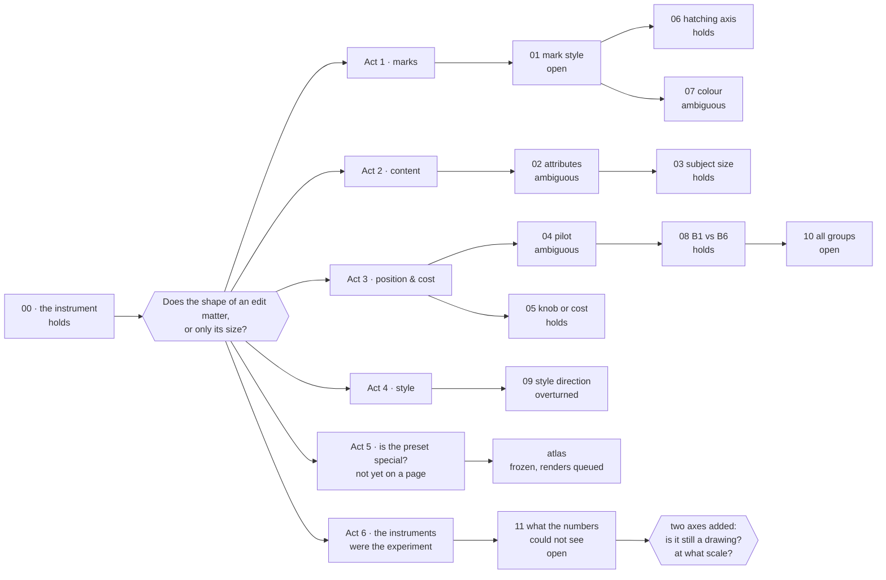

# The story so far

*Read this first. It holds no new measurements. It tells you which question each page answers,
why that page came next, and what the pages add up to once you put them side by side. Every
number here is copied from the page it links to, and that page is where you check it. Act 5 is
the exception: its results are not on a page yet, so each one links to its pre-registration and
its data file instead.*

*Last brought up to date: 2026-09-28, local commit `2f49c3e`.*

---

## One question

Can you change **how** an image model draws (its strokes, its shading, its palette) by editing
a tiny fraction of its weights directly, with no training and no prompt tricks?

And if you can, the question that matters more: **is it the shape of the edit that does the
work, or only how far the edit moves the weights?** If distance is all that counts, any edit of
that size would do the same thing, and there would be nothing to understand, only a dial.

The model is Krea-2, a 12.8-billion-parameter diffusion transformer with 28 blocks. The first
edit tried on it was a hand-calibrated file of 53 KB.

## The three edits every page compares

Almost every page on this notebook compares the same three edits. **They all move the weights
by exactly the same amount** (a relative Frobenius displacement of D = 0.0538, measured). They
differ in how the per-tensor gains are arranged:

| edit | its gains | structure it keeps |
|---|---|---|
| **calibrated preset** | hand-set plateaus: inside one block the gains are equal or nearly so, and their signs agree 96% of the time | all of it |
| **block derangement** | the preset's gains, with each block's profile handed to a different block | coherence *inside* each block, but the wrong block gets it |
| **sign scramble** | the preset's gains, with the sign of each tensor redrawn at random | none: coherence inside blocks is destroyed |

Read as a ladder, this design isolates the variable that matters. **Distance is held constant,
and the arrangement is what changes.** If the top rung does something and the bottom rung does
not, distance does not explain it. The sign scramble is the control. The other two edits are
hypotheses.

> **A floor under all three, found on 2026-09-25.** Every one of these presets, the random
> controls included, also carries the same four seeded rotations on one block group (Block_3,
> blocks 10–14, seeds 82, 60, 59 and 56). The script that builds the controls copies them from
> the preset and never touches them. So each arm is really *the same rotation plus different
> gains*. A comparison between two arms still isolates the gains, because the rotation is the
> same on both sides. A comparison against the untouched model does not: it measures rotation
> and gains together. ([amendment 03](../docs/prereg_perturbation_atlas_amendment_03.md))

A fourth family appears in the second half of the notebook: **rotations** of one block group at
a time (the 28 blocks are split into six groups, B1 at the input to B6 at the output). It
answers a different question: *where* in the model you push.

## How to read a verdict

Each claim carries one of four labels. **Holds**: it passed a criterion written down before the
data existed. **Ambiguous**: it was tested and the result does not decide either way.
**Overturned**: it was tested and came out false. **Open**: it has not been tested properly yet,
however many numbers sit beside it.

---

## Act 0 · Can the instrument be trusted?

Every result in this notebook is a difference between two pictures. So before any of them
counts, the machine has to stay still when nothing is touched.

It does, bit for bit. With every gain at zero the tuner changes no pixel at all, and a render
repeated after a restart is identical. The seed noise on fine texture is 1.65% and 1.83% on the
two reference prompts. There is one surprise: an edit followed by its exact inverse returns the
weights to where they were, but not the picture. Rounding leaves a mean difference of 16 out of
255, and that floor is enough to withdraw one earlier result.

→ [00 · Is the instrument lying to me?](00-the-bench.md) — **holds**

## Act 1 · The edit changes the marks, and the shape of the edit matters

**The first observation.** The preset visibly changes how the model draws: darker, greyer,
grainier, strokes running parallel. On 24 prompts it separates clearly from *both* controls on
the same stroke axis, even though both controls moved the weights exactly as far. This was the
first experiment and it ran before the project froze predictions in advance, so it stays
**open**. It is the observation everything else set out to check.
→ [01 · A tiny payload shifts mark style](01-mark-style.md)

**The sharpest test of the idea.** When hatching is measured by a script, with no human in the
loop, the sign of a structured edit picks the kind of hatching. Pushed positive, the
derangement crosses the strokes, while the preset runs them parallel. On 16 new prompts both land on the
predicted side in 16 of 16, and the sign scramble is *not there*, even though it had shown the
effect in the exploratory round. That failure is what makes the result mean something: the axis
belongs to structured edits, not to any displacement of that size. The derangement half
**holds**. The preset half stays **ambiguous**, because the visual check the pre-registration
asked for was never recorded.
→ [06 · The hatching axis, and the sign that decides it](06-the-hatching-axis.md)

**Colour behaves differently.** Different edits push the palette in directions that differ from
one another. That result **holds**, twice, on corpora that share no prompt. The stronger claim,
that each edit leaves its own recognisable colour fingerprint, came back three of six against a
bar of four set in advance, and it is filed **ambiguous**, not rounded up. The odd detail is the
one to keep: the sign scramble, silent on strokes, is among the *strongest* edits on colour.
Colour and texture do not respond to these edits in the same way.
→ [07 · What the edit does to colour](07-chromatic-signatures.md)

> **Where Act 1 leaves us.** On strokes, the ladder behaves as the idea requires: the structured
> rungs act and the scrambled rung does not. What is still unknown is *which* property of the
> structure does the work. The ladder says that coherence inside a block matters. It cannot say
> more.

## Act 2 · It reaches past the finish, into what is in the picture

A filter changes how a scene is drawn. It does not add objects to it. So the next question was
whether these edits change *what* is drawn.

**Two attributes, one that nobody asked for.** A prompt asks for barnacle-like clusters on an
earlobe. The stock model draws them in 1 render of 20, the block derangement in 19 of 20, and the
sign scramble, at the same displacement, in 1 of 20. On a separate corpus of rally cars, with no
lights mentioned anywhere, one edit switches the headlights on in 31 renders of 38 and another
switches them off in all 39. Both effects are large, and both have a control that does nothing.
Neither was predicted in advance, so the page is **ambiguous**.
**The whole batch moves together, and that is not about structure.** The animations on the same
page show all five seeds of a prompt moving the same way at once. Measured, every edit is a
direction across the seeds of one prompt (mean cosine 0.50 to 0.91, against 0.10 for a change
of seed). The sign scramble clears that bar on 8 styles of 8 too, and no structured edit
separates from it after correction. Hold the noise fixed and *any* push of that size moves the
batch together. **Open.**
→ [02 · What the edit puts in the picture, and what it takes out](02-attribute-emergence.md)

**The subject grows, less than it seemed.** Under the derangement the car seemed to fill more of
the frame. The first measurement gave a ratio of 2.14, drawn on the very images that suggested
the idea. Re-tested on ten new styles, with the prediction frozen first, it **holds** at 1.23:
real, and about a fifth of the size first claimed. The same round measured something more
important: the annotator. Shown four images, he picked out the conditions 17 times in 20 against
a 25% chance rate. **Hiding the filenames did not keep him blind to the condition**, and that
applies backwards to every round in this notebook scored by a person, the barnacles included.
→ [03 · How much room the subject takes, and how blind I actually was](03-what-ends-up-in-the-picture.md)

## Act 3 · Where in the model, and at what price

Once it was clear that structure matters, the next question was *where* the structure matters.

**A pilot that asked well and settled nothing.** Old sweeps sitting on disk, rotating each of
the six block groups, show the last group moving the weights the *least* and the picture the
*most* (3.7 times more). The simple explanation, that a group matters in proportion to how far it
moves the weights, fails there, and it fails at both ends of the model. But the sweeps had one
seed per cell and no matched control, and their images carried a panel (the HUD) appended to the
frame. **Ambiguous**, pending re-measurement.
→ [04 · Does it matter where you edit?](04-where-in-the-model.md)

**The version built to settle it.** The first group (B1) and the last (B6) were each rotated
until both moved the weights by exactly the same amount. The directions they push the image in
can be told apart in 10 prompts of 10, and they are further apart than two random edits of the
same size, which also separate, by a non-zero amount that had to be measured. This is the
strongest result in the notebook and it **holds**. It is also narrow: *different* is not the
same as *specialised*. B6 is the group next to the output, and nothing here rules out that being
next to the output is all it takes.
→ [08 · Two places in the model, pushed the same distance](08-block1-vs-block6.md)

**All six groups, on clean images.** The response grows with the rotation angle in every group.
B6 moves the image most, B1 second, and the four middle groups much less. On the same data, two
statistics then disagree about whether B1 resembles B6 or stands apart from everything.
**Open.**
→ [10 · All six block groups under matched rotation](10-all-blocks-clean.md)

**The price of touching anything.** Each block was pushed in both directions. The part of the
effect that reverses when the push reverses is a *knob*. The part that happens either way is a
*cost*. Most of it is cost: fine texture is lost whichever way you push, in 23 blocks of 28, and
the loss grows towards the output. Two real knobs exist, at opposite ends of the network, and
they run in opposite directions. The practical rule is that on the last blocks the negative side
is the safe side. **Holds.**
→ [05 · What an edit steers, and what it costs](05-knob-or-cost.md)

## Act 4 · A prediction that came back backwards

If an edit has a direction of its own, a watercolour and a photograph should be pushed the same
way. The belief written down was the opposite: that the declared style decides the direction.
Frozen in advance and tested, it came back **overturned**, and backwards: eight styles agree with
each other *more* than eighteen subjects do. The reverse cannot be claimed either, because the
eight style prompts share one scene and the eighteen subject prompts do not.
→ [09 · Eight styles, one direction, and a design that cannot say why](09-style-direction.md)

## Act 5 · Is the preset special?

*These results are not on a notebook page yet. Each was run against a pre-registration frozen
before the analysis, and the verdict is the one that document's rules return.*

Acts 1 to 4 kept comparing one preset with its controls. The tests of 24 and 25 September asked
the question underneath all of them directly: is there anything the preset does that a random
edit of the same size does not?

**Every edit is recognisable, the random ones included.** A classifier trained on some prompts
and tested on a prompt it has never seen names which of six edits was applied 88.5% of the time,
against a 16.7% chance rate. It tells the preset from its random control 99.4% of the time. But
it recognises the random control just as well (93.8%). An edit leaves a signature. That does not
make the edit special.
([pre-registration](../docs/prereg_arm_identifiability.md), `data/arm_identifiability_tests.csv`)

**No shared axis.** If all these edits pushed along one common direction, there would be an axis
to steer on. Measured against a thousand random directions, the share each edit puts on the
candidate axis falls inside the random range. The largest share of all belongs to a random arm,
and the two definitions of the axis agree at a cosine of 0.257. What does survive is weaker and
more general: each edit, random ones included, has an average direction that reproduces when the
scene changes. Filed as a **negative** result.
([pre-registration](../docs/prereg_shared_axis.md), `data/shared_axis_diagnostics.csv`)

**One arm-specific result.** Does an edit change how much the seeds scatter? The preset neither
adds scatter nor removes it: it moves the output without changing its spread. The negative block
derangement is the exception. It injects variability (13 prompts of 16, Holm 0.017), and it
injects more than its random control does (+1.002, 13 of 16, Holm 0.034). **That is the first
time one of the three edits beats its own random control in a direct contrast that survives
correction.**
([pre-registration](../docs/prereg_seed_stability.md), `data/seed_stability_tests.csv`)

**The instrument cannot see most of the colour.** A calibration curve puts the smallest palette
shift the colour measure can tell from seed noise at a rotation of +30° in hue. Three of the four
edits move the palette by less than that, so their comparisons are *uninterpretable*, not null.
Without that gate the notebook would have published "preset against scramble, 8 prompts of 8,
p = 0.0078" on quantities the instrument does not resolve. Adding colour to the stroke features
also does not help identify the edit (88.8% without it, 86.0% with it).
([pre-registration](../docs/prereg_palette_position.md), `data/palette_tests.csv`,
`data/colour_identifiability_tests.csv`)

**The edits leave the model's repertoire.** The belief written down in advance was that an edit
steers the output into a region the untouched model already reaches with some other prompt.
Refuted for all three arms on the 16-prompt corpus (Holm ≤ 0.0025). The edits push the output
outside everything the untouched model produces. One pattern repeats on both corpora: the preset
leaves the repertoire least, the derangement more, the random edit most. It has been seen on the
two corpora it could be tested on, so it is frozen as a prediction and not claimed.
([pre-registration](../docs/prereg_mountain_reachability.md),
`data/mountain_reachability_tests.csv`, [the ordering](../docs/prereg_r1_ordering.md))

> **Where Act 5 leaves us.** The corpus built around one preset has answered "is this preset
> special?" several times, and each time the answer was no, or not measurably. What it cannot
> answer is whether *every* perturbation carries its own signature, and which parts of the model
> move colour. That needs many perturbations of equal size landing in different places. **The
> atlas** is that design: 10 regions × 2 independent random draws, gains only, no inherited
> rotation. It was frozen on 2026-09-25 and its first renders are queued. There are no results
> yet. ([pre-registration](../docs/prereg_perturbation_atlas.md))

---

## Act 6 · The instruments were the experiment

Three days in which almost every question asked about the model came back as a question about the
bench. It is the least satisfying act and the one that changed the most.

**The pixel sign decomposition was retracted.** The split of an edit into a common part and a
signed part was re-derived on pixels, agreed with a table from a week earlier to within 0.02 — and
that table had already been withdrawn as a floor artefact. What survives is the q/k against v/o
split, on four statistics.
[retraction](../docs/sign_decomposition_retraction.md)

**The rectified masks did not answer their question.** `Block_4` fights itself on contrast and
`Block_6` on grain, so the design flipped the opposing sub-blocks and measured against an
anti-mask at identical displacement — the cleanest control in the project. The spec said in
advance that if the arithmetic failed the experiment meant nothing. M4 missed by 0.31 **and by
direction**, so it did. The idea is untested, not refuted.
[result](../docs/rectified_mask_result.md)

**The colour gate measured saturation.** An achromatic object has no foreground under a
saturation-defined mask, so the one render that kept its object and lost its colour was filed as a
destroyed image. Re-measured with a colour-blind foreground — and then again, because the first
replacement was defeated by grain in exactly the way it had been written to expose.
[audit](../docs/colour_gate_and_chroma_audit.md)

**Hue is pinned; chroma is not.** Nothing pre-registered had looked at saturation. `Block_3` and
`Block_6` turn out to be antisymmetric chroma knobs — ×1.563 / ×0.931 and ×0.726 / ×1.815, every
one of their 18 cells on the side its arm says, p = 1e-5 — while the mean hue shift over the same
corpus is 12.7°. The project had been asking why colour would not move, and had been reading
"colour" as hue.

**No block releases a declared colour toward its prior.** If an edit cut the binding holding
"purple" onto "leaf", the leaf should fall back to the colour it gets when nothing is said. Six
cells of thirty-six move that way; the mean distance from the prior grows. Whatever a whole-block
edit does, it is not cutting an attribute binding.

**A leaf loses all its colour, and keeps being a leaf.** Nine seeds in twenty, against zero in
twenty unedited, with nothing between chroma ratio 0.085 and 0.518 — a switch, not a dimmer. It
never happens when the prompt names a colour: 72 cells, none below 0.648. The reading that fits is
that a *stated* colour is carried by the text and survives, while a colour the model has to infer
from the object is produced by a step that can fail outright. Nothing in the unperturbed render
predicts which seeds fail: twelve features, none surviving correction, and an exact permutation
test over all 167 960 splits at p = 0.535.
[result](../docs/leaf_collapse_and_blk16_result.md) ·
[reading](../docs/what_broke_in_the_leaf.md) ·
[predictors](../docs/leaf_collapse_predictors_result.md)

**And the generality test was run on subjects that could not show it.** Mushroom, tomato, pinecone
and banana were chosen for having a *strong* colour prior. For all four, not naming the colour
gives the same picture as naming it — 0.9° to 9.9° apart, against 52.2° for the leaf — so there
was no inference in them to break. The null was published as "leaf-specific" and has been
withdrawn as untested.
[looking](../docs/looking_at_the_leaf_corpus.md)

**Every statistic for ranking an edit measured displacement.** A frontier of 140 conditions was
built, its top published as the best operating points, and the images said to agree. They did not:
at 1:1 the two best-ranked renders are covered in defects. Structure coherence — whether the
gradients still agree locally, which is what an ink line does — reverses the ranking at both ends.
The five conditions recommended rank **75th to 80th of 80**; the one an observer picked out by eye
ranks **1st**.
[frontier and retraction](../docs/style_damage_frontier.md)

**`blk16` is the first edit that buys style and line together.** Across its dose ladder style
multiplies by ten, 0.045 to 0.447, while coherence *rises* — 0.994 to 1.040, six cells of six at
the top two doses. Everywhere else style is paid for by losing the drawing. A cell of that ladder
already existed in another bench, rendered weeks earlier from a different plan and a different
queue script: it returned 0.4472 against 0.447 and 1.0397 against 1.040, which moves the project's
determinism claim from within-session to across-bench.

**Then the observer read a sheet of 36 unlabelled renders in five lines, and the five lines were
a table.** Energy at each scale of detail, which no statistic here reported because all of them sum
over scale first. "Strong grain" and "weaker grain" are both energy added with its peak at 4–8
pixels, the mask above its anti-mask in 12 cells of 12 (p = 0.0005). "Soft grain" and "loose blur"
are both energy removed, separated by the *shape* of the profile: monotone stripping against a
notch at 2–8 pixels. And the combined condition sits 3.8 to 11.5 times closer to `Block_6` than to
`Block_4` in that space — a claim a first, layout-based test had returned as nothing.
[taxonomy](../docs/mask_damage_taxonomy_result.md)

The act has its own page, and it is the page about the bench rather than the model.
[11](11-what-the-numbers-could-not-see.md)

## What runs through all of it

**Structure beats distance on some effects, not on the edit as a whole.** For strokes (Act 1),
the requested attribute (Act 2) and position (Act 3), an edit of the same size without the
structure does not reproduce the effect. But every whole-edit property tested in Act 5 (being
recognisable, having a direction, coherence across seeds) is shared by the random control. The
only direct win over the random control after correction is the derangement's added scatter. The honest version
of the notebook's central idea is now: *every edit does something recognisable, and on a few
specific effects the arrangement matters.* Nothing yet says which property of the arrangement
does the work.

**Every confirmation shrinks the exploratory number.** The subject went from 2.14 to 1.23, colour
halved, and across three rounds confirmation returned between a third and a half of the
exploratory estimate. Read any exploratory number in this notebook as a ceiling.

**Instruments had to be checked before their verdicts could be trusted.** The observer was not
blind (Act 2), the HUD panel inflated a control (Act 3), and the colour measure cannot resolve
most of the shifts it was asked about (Act 5). Each time the check came *before* the claim, and
each time it removed one.

**In Act 6 the check came after, three times, and an observer supplied it.** A ranking was
published, a null was published as a falsification, and a texture was described by a number that
had summed over the scale it lived at. None of the three was caught by a measurement; each was
caught by somebody opening an image, and the measurement came second. The symmetrical fact is that
looking is not privileged either: twice in the same days an impression from a single image failed
its count — the prototypical colour was not bleeding back (5 of 12 cells, p = 1.00) and the
rewordings had not changed the object (chroma 0.503 against 0.474). **A single cell is a single
cell, whichever faculty read it.** What survives is narrower: the statistics in use were blind in a
way that a glance was not, and the repair was to add an axis, not to trust an eye.

**All of the bench's statistics answered "how much moved".** None answered "is what is left still a
drawing", and none answered "at what scale". Both were added in Act 6, both immediately changed a
published conclusion, and both came from somebody describing a picture in words.

**Nearly everything is n = 1 of something.** There is one model and one calibrated preset. All
40 prompts are character portraits containing "bold ink outlines" and "hatched shadows". A person
scored the rounds in Act 2, and that person has been measured as not blind to the conditions.
([scope](../docs/scope.md))

## What is not known yet

1. **Which property of the structure does the work.** No layer ablation, spectral decomposition
   or rank sweep has been run. [01](01-mark-style.md#what-is-still-open)
2. **Whether B6 is specialised or just next to the output.** Neither 08 nor 10 separates the two.
   [08](08-block1-vs-block6.md), [10](10-all-blocks-clean.md)
3. **Whether attribute emergence generalises beyond one prompt template.** The design written to
   test it was never run. [02](02-attribute-emergence.md#one-attribute-one-prompt-family)
4. **Whether the enlargement comes from structure or from magnitude.** The scramble control was
   not rendered. [03](03-what-ends-up-in-the-picture.md#what-this-cannot-separate)
5. **Whether every perturbation carries its own signature, and where colour lives in the
   model.** This is what the atlas is built to answer.
   [atlas](../docs/prereg_perturbation_atlas.md)
6. **How much of each arm's effect against the untouched model is the shared Block_3 rotation**
   and how much is the gains. The atlas removes the rotation, while the old corpus cannot
   separate them. [amendment 03](../docs/prereg_perturbation_atlas_amendment_03.md)
7. **Whether any of this holds outside Krea-2**, or outside this one corner of image space.
8. **Whether the colour collapse generalises at all.** Its test has not been run: the subjects
   used had unambiguous colour priors. The screening criterion now exists and costs two baselines
   per candidate. [looking](../docs/looking_at_the_leaf_corpus.md)
9. **What sets which seeds collapse.** Not the picture the model was going to draw — that is ruled
   out. The dose ladder is the next handle, and it also decides whether the empty gap is a
   bifurcation or an artefact of one dose.
   [spec](../docs/RENDERS_2026-09-28_leaf_dose_ladder.md)
10. **Whether structure coherence means anything outside comic linework.** It is one number on one
    drawing style, and a strongly oriented one is the easy case.
11. **Whether sub-block masks work at all.** Their arithmetic prerequisite failed on `Block_6`;
    a mask built on directly measured joint effects has not been tried.

---

## Map

The full ledger of all 42 claims, sorted by verdict, is in the [README](../README.md).
